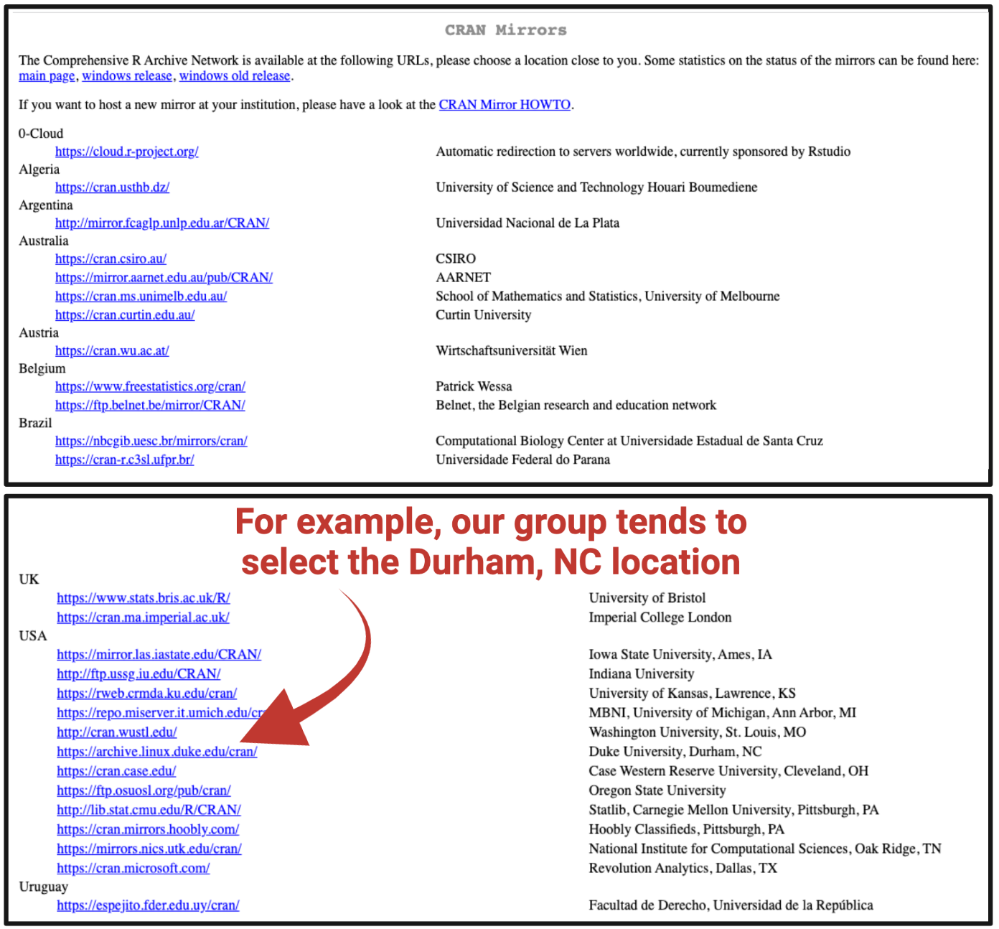
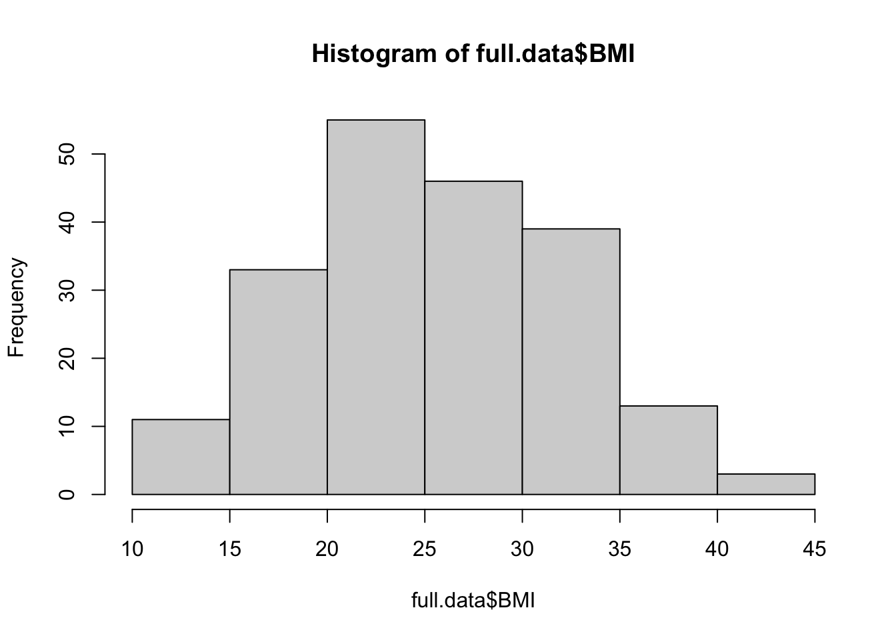
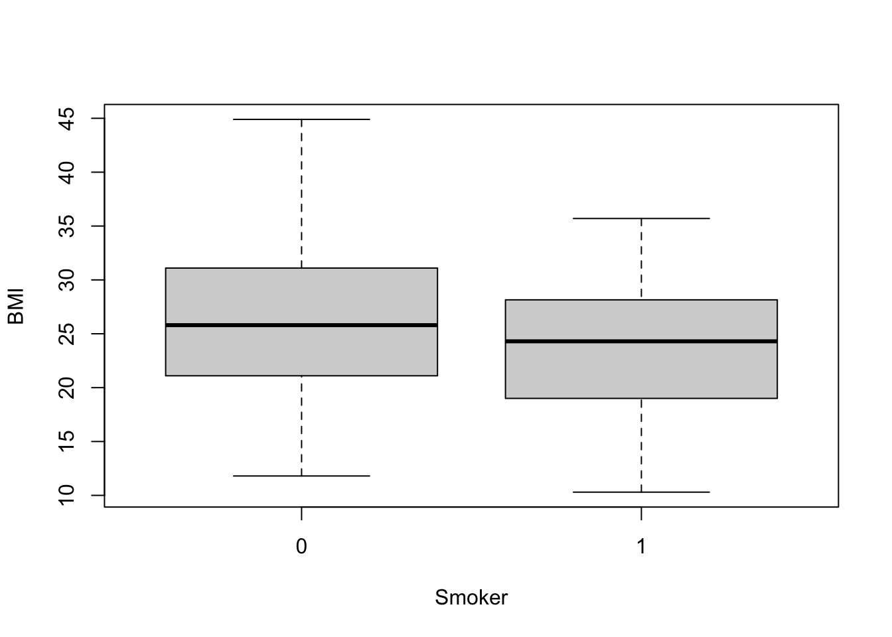
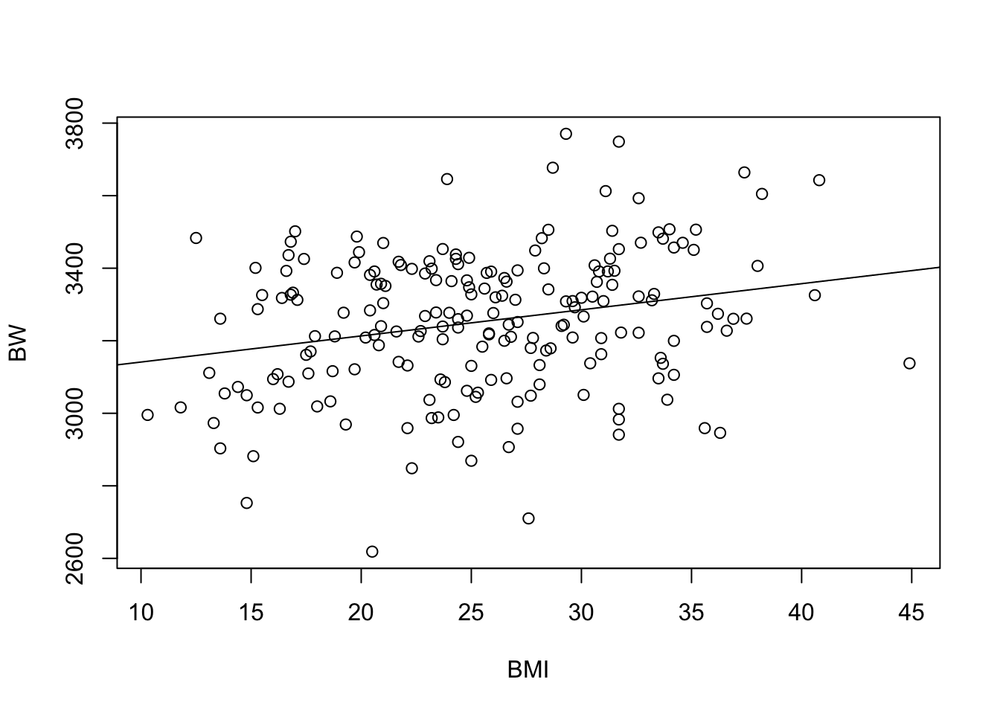
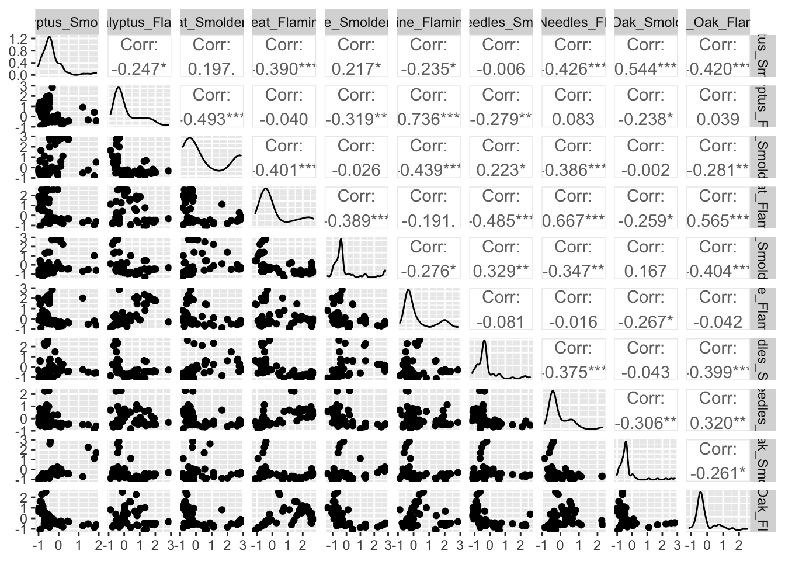
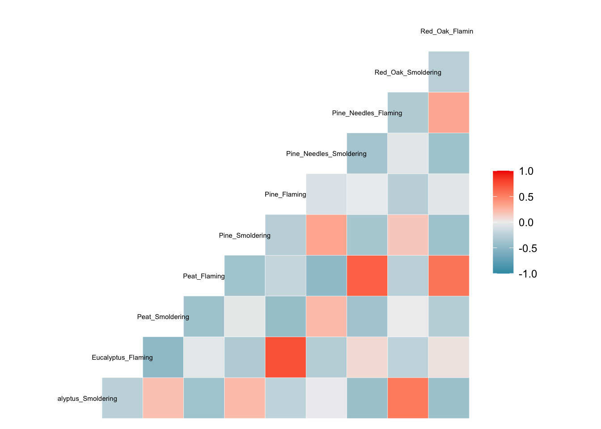
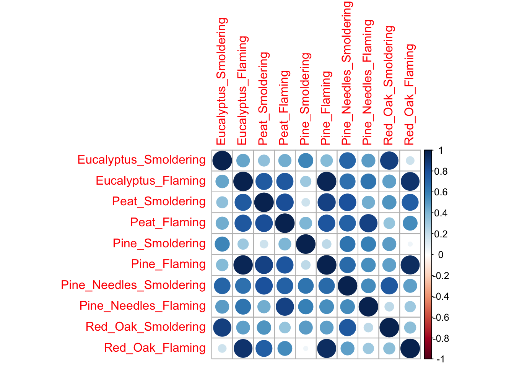
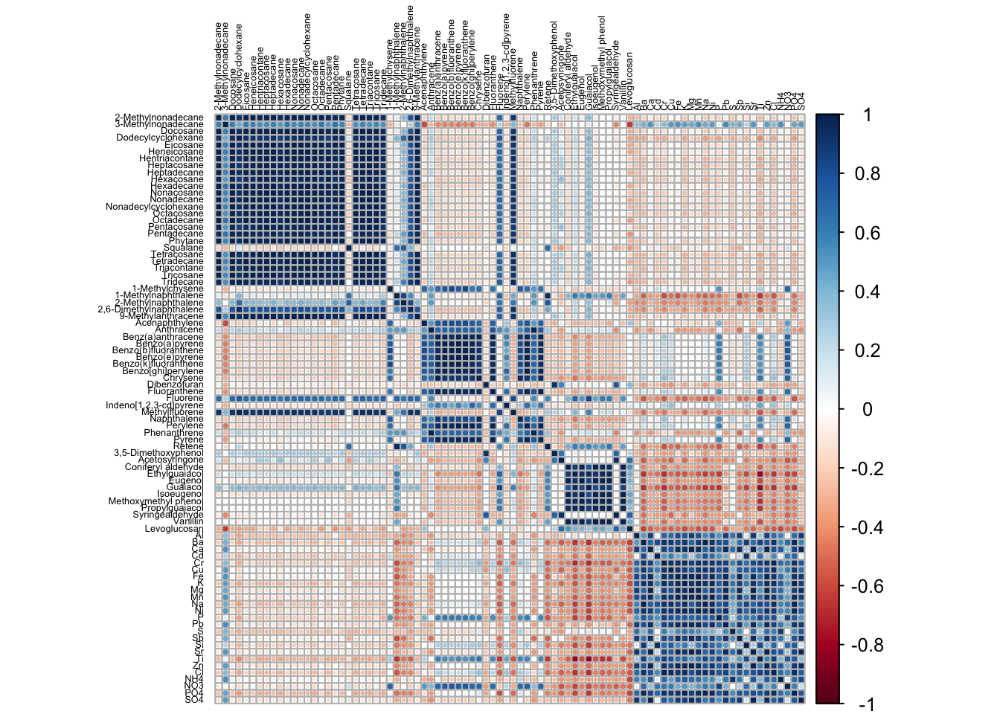
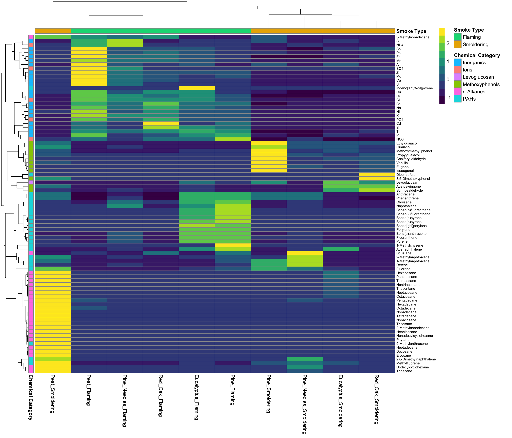
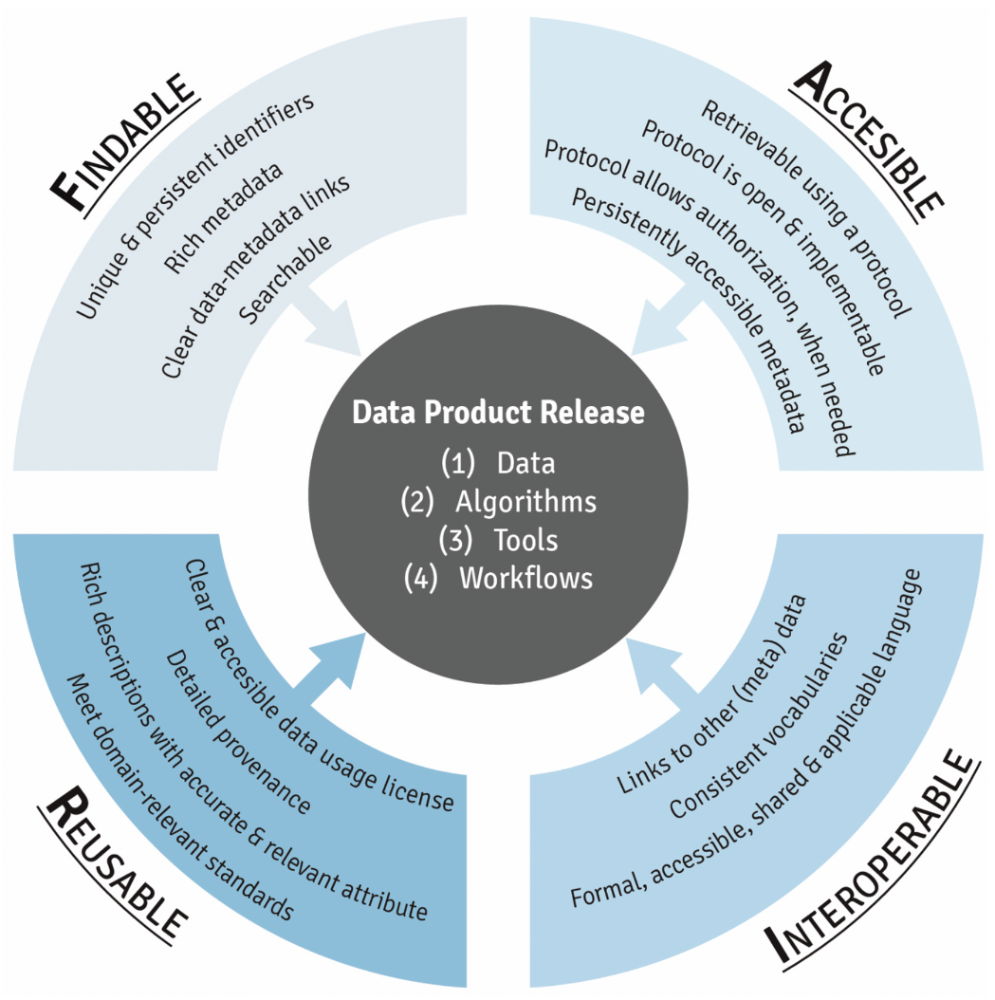

# (PART\*) Chapter 1 Introductory <br>Data Science {-}


# 1.1 Introduction to Coding in R

This training module was developed by Dr. Kyle R. Roell and Dr. Julia E. Rager

Fall 2021


## Introduction to Training Module

#### What is R? 

Computer script can be used to increase data analysis reproducibility, transparency, and methods sharing, and is becoming increasingly incorporated into exposure science, toxicology, and environmental health research. One of the most utilized coding language in this research field is the **R coding language**. Some advantages of using R include the following:

+ Free, open-source programming language that is licensed under the Free Software Foundation’s GNU General Public License
+ Can be run across all major platforms and operating systems, including Unix, Windows, and MacOS
+ Publicly available packages help you carry out analyses efficiently (without having to code for everything yourself)
+ Large, diverse collection of packages
+ Comprehensive documentation
+ When code is efficiently tracked during development/execution, it promotes reproducible analyses

Because of these advantages, R has emerged as an avenue for world-wide collaboration in data science.


#### Downloading and Installing R

First, users should download R by navigating to the following website: https://www.r-project.org/

And then clicking the 'download R' link:


This link will navigate you to the CRAN mirror website. Click on the CRAN mirror location that seems closest to your usual location:



This will lead you to the selected CRAN Network website (here, https://archive.linux.duke.edu/cran/), where you will again select a download option:
  

  

Then, select the top (representing the most recent) available .pkg file to download, and then install according to your computer's typical program installation steps.
  


#### Downloading and Installing R Studio
  
**What is R Studio?**
RStudio is an Integrated Development Environment (IDE) for R, which makes it more 'user friendly' when developing and using R script.

RStudio Desktop is a desktop application that can be downloaded for free, online. To download RStudio:

+ Navigate to: https://rstudio.com/products/rstudio/download/
+ Select the free RStudio Desktop option, and click "DOWNLOAD"
+ Then download the top (most recent) RStudio Desktop option for your operating system


Here is a screenshot of what R script looks like within RStudio:


<!-- ## Introduction to R Packages -->
## R Packages

One of the major benefits to coding in the R language is access to the continually expanding resource of thousands of user-developed packages that aid in improved data analyses and methods sharing. Packages have varying utilities, spanning basic organization and manipulation of data, visualizing data, and more advanced approaches to parse and analyze data, with examples included in all of the proceeding training modules.

In brief, packages represent compilations of code fitted for a specialized focus or purpose. These are
often written by R users and submitted to the [CRAN](https://cran.r-project.org/web/packages/), or another host such as [BioConductor](https://www.bioconductor.org/) or [Github](https://github.com/).

Examples of some common packages that we'll be using throughout these training modules include the following:

+ tidyverse: A collection of open source R packages that share an underlying design philosophy, grammar, and data structures of tidy data. For more information on the tidyverse package, see its associated [CRAN webpage](https://cran.r-project.org/web/packages/tidyverse/index.html), primary [webpage](https://www.tidyverse.org/packages/), and peer-reviewed [article released in 2018](https://onlinelibrary.wiley.com/doi/10.1002/sdr.1600).
+ ggplot2: A system, within the tidyverse collection, for declaratively creating graphics. Users provide data they would like to plot, and then control how ggplot2 should map variables to aesthetics and define which graphical primitives to use; ggplot2 then drafts the corresponding visualizations. For more information on the ggplot2 package, see its associated [CRAN webpage](https://cran.r-project.org/web/packages/ggplot2/index.html) and [R Documentation](https://www.rdocumentation.org/packages/ggplot2/versions/3.3.5).

More information on these packages, as well as many others, is included throughout the training modules.


#### Downloading/Installing R Packages

R packages often do not need to be downloaded from a website. Instead, you can just load packages through running script in R, like:


```r
install.packages(“tidyverse”)
library(tidyverse)
```


It is worth noting that a function can be queried in RStudio by typing a question mark before the name of the function. For example:

```r
?install.packages
```

This will bring up documentation in the viewer window. 


## Scripting Basics 


#### Comments 

R allows for scripts to contain non-code elements, called comments, that will not be run or interpreted. Comments are commonly included when annotating code, or describing what your code does, where your data came from, and just general textual reminders throughout the script.

To make a comment, simply use a # followed by the comment. 
A # only comments out a single line of code. In other words, only that line will be commented and therefore not be run, but lines directly above/below it still will be


```r
# This is an R comment!
```

Comments are useful to help make code more interpretable for others or to add reminders of what and why parts of code may have been written.


#### Starting Code

RStudio will autofill function names, variable names, etc. by pressing tab while typing. If multiple matches are found, RStudio will provide you with a drop down list to select from, which may be useful when searching through newly installed packages or trying to quickly type variable names in an R script.

One of the first lines of code in any script will likely include the loading of packages needed to run the script. Here is an example line of code to load a package:

```r
# Loading ggplot2 package (should already be installed as a base package)
library(ggplot2)
```

Many packages also exist as part of the baseline configuration of an R working environment, and do not require manual loading each time you launch R. These include the following packages:

+ datasets
+ graphics
+ methods
+ stats
+ utils


#### Setting Your Working Directory 

Another step that is commonly done at the very beginning of your code is setting your working direction. This points to where you have files that you want to upload / where the default is to deposit output files produced during your scripted activities.

You must set the working directory to a local directory where data are located or output files will be saved.

To view where your current working directory is (by default), run the following:

#### Show your working directory

```r
getwd()
```

To set the location of your working directory, run the following:

#### Set your working directory

```r
setwd("/filepath to where your input files are")
```
Note that in macOS, filepaths use "/" as folder separaters; whereas in PCs, filepaths use "\\".

#### Importing Files 

After setting the working directory, importing and exporting files can be done using various functions based on the type of file being read or written. Often, it is easiest to import data into R that are in a comma separated values /  comma delimited file (.csv) or tab / text delimited file (.txt).

Other data types such as SAS data files, large .csv files, etc. may require different functions to be more efficiently read in and some of these file formats will be discussed in future modules.


```r
# Read in the .csv data that's located in our working directory
csv.dataset <- read.csv("Module1_1/Module1_1_ExampleData.csv")

# Read in the .txt data
txt.dataset <- read.table("Module1_1/Module1_1_ExampleData.txt")
```
These datasets now appear as saved dataframes ("csv.dataset" and "txt.dataset") in our working environment in R.


#### Viewing Data 

After data have been loaded into R, or created within R, you will likely want to view what these datasets look like. 
Datasets can be viewed in their entirety, or datasets can be subsetted to quickly look at part of the data.

Here's some example script to view just the beginnings of a dataframe, using the "head" function in R (a part of the baseline packages)

```r
head(csv.dataset)
```

```
##    Sample Var1 Var2 Var3
## 1 sample1    1    2    1
## 2 sample2    2    4    4
## 3 sample3    3    6    9
## 4 sample4    4    8   16
## 5 sample5    5   10   25
```
Here, you can see that this automatically brings up a view of the first five rows of the dataframe.

Another way to view the first five rows of a dataframe is to run the following:

```r
csv.dataset[1:5,]
```

```
##    Sample Var1 Var2 Var3
## 1 sample1    1    2    1
## 2 sample2    2    4    4
## 3 sample3    3    6    9
## 4 sample4    4    8   16
## 5 sample5    5   10   25
```

Expanding on this, to view the first 5 rows x 2 columns, run the following:

```r
csv.dataset[1:5,1:2]
```

```
##    Sample Var1
## 1 sample1    1
## 2 sample2    2
## 3 sample3    3
## 4 sample4    4
## 5 sample5    5
```

To view the entire dataset in RStudio, use the "View" function:

```r
View(csv.dataset)
```


#### Exporting Data
Now that we have these datasets saved as dataframes, we can use these as examples to export data files from the R environment back into our local directory.

There are many ways to export data in R. Data can be written out into a .csv file, tab delimited .txt file, RData file, etc. There are also many functions within packages that write out specific datasets generated by that package. 
To write out to a .csv file:

```r
write.csv(csv.dataset, "Module1_1_SameCSVFileNowOut.csv")
```

To write out a .txt tab delimited file:

```r
write.table(txt.dataset, "Module1_1_SameTXTFileNowOut.txt")
```


R also allows objects to be saved in RData files. These files can be read into R, as well, and will load the object into the current workspace. Entire workspaces are also able to be saved.


```r
# Read in saved single R data object (note that this file is not provided, just example code is for future reference)
r.obj = readRDS("data.rds")

# Write single R object to file (note that this file is not provided, just example code is for future reference)
saveRDS(object, "single_object.rds")

# Read in multiple saved R objects (note that this file is not provided, just example code is for future reference)
load("multiple_data.RData")

# Save multiple R objects (note that this file is not provided, just example code is for future reference)
save(object1, object2, "multiple_objects.RData")

# Save entire workspace
save.image("entire_workspace.RData")

# Load entire workspace
load("entire_workspace.RData")
```


## Concluding Remarks
Together, this training module provides introductory level information on installing and loading packages in R. Scripting basics are also included, such as setting a working directory, importing and exporting files, and viewing data within the R console / RStudio environment. Additional resources that provide introductory-level information on coding in R include the following:

+ Coursera provides a lot of materials on learning how to program in R: https://www.coursera.org/learn/r-programming & https://www.coursera.org/courses?query=r
+ Stack overflow is a discussion forum for an online community of coders to discuss coding problems/challenges and ways to overcome these problems/challenges: https://stackoverflow.com/questions/1744861/how-to-learn-r-as-a-programming-language
+ Wonderful tutorials are available online, like this one on ‘R for Data Science’: https://r4ds.had.co.nz/
+ BioConductor provides package-specific help: https://www.bioconductor.org/
+ An abundance of other resources are available online just by googling!
 


# 1.2 Data Organization Basics


This training module was developed by Dr. Kyle R. Roell and Dr. Julia E. Rager

Fall 2021


## Introduction to Training Module

Data within the fields of exposure science, toxicology, and public health are very rarely prepared and ready for all statistical analyses/visualization code. The beginning of almost any scripted analysis includes important formatting steps. These steps largely encompass data organization, manipulation, and other steps in preparation for actual statistical analyses/visualizations. Data organization and manipulation generally refers to organizing and formatting data in a way that makes it easier to read and work with. This can be done through several approaches, including:

+ Base R operations and functions, or
+ A collection of packages (and philosophy) known as [Tidyverse](https://www.tidyverse.org).

In this training tutorial we will go over some of the most common ways you can organize and manipulate data, including:

+ Merging data
+ Filtering and subsetting data
+ Melting and casting data

These approaches will first be taught using the basic operations and functions in R. Then, the exact same approaches will be taught using the Tidyverse package and associated functions and syntax.

These data manipulation and organization methods are demonstrated using an example environmentally relevant human cohort dataset. This cohort was generated by creating data distributions randomly pulled from our previously published cohorts, resulting in a bespoke dataset for these training purposes with associated demographic data and variable environmental exposure metrics from metal levels obtained using sources of drinking water and human urine samples.


#### Set your working directory
In preparation, first let's set our working directory to the folderpath that contains our input files

```r
setwd("/filepath to where your input files are")
```
Note that in macOS, filepaths use "/" as folder separaters; whereas in PCs, filepaths use "\".


#### Importing example datasets

Then let's read in our example datasets

```r
demo.data <- read.csv("Module1_2/Module1_2_DemographicData.csv")
chem.data <- read.csv("Module1_2/Module1_2_ChemicalData.csv")
```


#### Viewing example datasets
Let's see what these datasets look like, starting with the chemical measures:

```r
dim(chem.data)
```

```
## [1] 200   7
```
The chemical measurement dataset includes 200 rows x 7 columns


```r
chem.data[1:10,1:7]
```

```
##    ID     DWAs     DWCd     DWCr       UAs       UCd      UCr
## 1   1 6.426464 1.292941 51.67987 10.192695 0.7537104 42.60187
## 2   2 7.832384 1.798535 50.10409 11.815088 0.9789506 41.30757
## 3   3 7.516569 1.288461 48.74001 10.079057 0.1903262 36.47716
## 4   4 5.906656 2.075259 50.92745  8.719123 0.9364825 42.47987
## 5   5 7.181873 2.762643 55.16882  9.436559 1.4977829 47.78528
## 6   6 9.723429 3.054057 51.14812 11.589403 1.6645837 38.26386
## 7   7 6.268547 1.218410 52.08578  8.887948 0.6347667 39.45535
## 8   8 6.718448 1.414975 54.96740  9.304968 0.6658849 45.09987
## 9   9 9.074928 2.727755 55.72826 10.818153 1.6585757 42.58577
## 10 10 5.771691 2.410993 47.06552  8.747217 1.7354305 34.80661
```
These data are organized according to subject ID (first column), followed by measures of:

+ DWAs (drinking water arsenic levels in µg/L)
+ DWCd (drinking water cadmium levels in µg/L)
+ DWCr (drinking water chromium levels in µg/L)
+ UAs (urinary arsenic levels in µg/L)
+ UCd (urinary cadmium levels in µg/L)
+ UCr (urinary chromium levels in µg/L)


Now let's view the demographic data:

```r
dim(demo.data)
```

```
## [1] 200   6
```
The subject demographic dataset includes 200 rows x 6 columns


```r
demo.data[1:10,1:6]
```

```
##    ID  BMI     MAge MEdu       BW GA
## 1   1 27.7 22.99928    3 3180.058 34
## 2   2 26.8 30.05142    3 3210.823 43
## 3   3 33.2 28.04660    3 3311.551 40
## 4   4 30.1 34.81796    3 3266.844 32
## 5   5 37.4 42.68440    3 3664.088 35
## 6   6 33.3 24.94960    3 3328.988 40
## 7   7 24.8 29.54798    3 3061.949 30
## 8   8 16.9 24.94954    3 3332.539 38
## 9   9 36.9 33.58589    3 3260.482 39
## 10 10 21.7 39.29018    3 3141.723 35
```
These data are organized according to subject ID (first column) followed by the following subject information:

+ BMI (body mass index)
+ MAge (maternal age, years)
+ MEdu (maternal education, 1= "less than high school"; 2= "high school or some college"; 3= "college or greater")
+ BW (body weight, grams)
+ GA (gestational age, week)


## Data Manipulation using Base R

#### Merging Data using Base R Syntax
Merging datasets represents the joining together of two or more datasets, while connecting the datasets using a common identifier (generally some sort of ID). This is useful if you have multiple datasets describing different aspects of the study, different variables, or different measures across the same samples. Samples could correspond to the same study participants, animals, cell culture samples, environmental media samples, etc, depending on the study design. In the current example, we will be joining human demographic data and environmental metals exposure data collected from drinking water and human urine samples.

Let's start by merging the example demographic data with the chemical measurement data using the base R function of "merge". To learn more about this function, you can type the following:

```r
?merge
```
which brings up helpful information in the R console


To merge these datasets using the merge function, use the following code:

```r
# Note that we specify to merge these datasets by their shared ID column
full.data <- merge(demo.data, chem.data, by="ID") 
dim(full.data) 
```

```
## [1] 200  12
```
This merged dataframe contains 200 rows x 12 columns

Viewing this merged dataframe

```r
full.data[1:10, 1:12]
```

```
##    ID  BMI     MAge MEdu       BW GA     DWAs     DWCd     DWCr       UAs
## 1   1 27.7 22.99928    3 3180.058 34 6.426464 1.292941 51.67987 10.192695
## 2   2 26.8 30.05142    3 3210.823 43 7.832384 1.798535 50.10409 11.815088
## 3   3 33.2 28.04660    3 3311.551 40 7.516569 1.288461 48.74001 10.079057
## 4   4 30.1 34.81796    3 3266.844 32 5.906656 2.075259 50.92745  8.719123
## 5   5 37.4 42.68440    3 3664.088 35 7.181873 2.762643 55.16882  9.436559
## 6   6 33.3 24.94960    3 3328.988 40 9.723429 3.054057 51.14812 11.589403
## 7   7 24.8 29.54798    3 3061.949 30 6.268547 1.218410 52.08578  8.887948
## 8   8 16.9 24.94954    3 3332.539 38 6.718448 1.414975 54.96740  9.304968
## 9   9 36.9 33.58589    3 3260.482 39 9.074928 2.727755 55.72826 10.818153
## 10 10 21.7 39.29018    3 3141.723 35 5.771691 2.410993 47.06552  8.747217
##          UCd      UCr
## 1  0.7537104 42.60187
## 2  0.9789506 41.30757
## 3  0.1903262 36.47716
## 4  0.9364825 42.47987
## 5  1.4977829 47.78528
## 6  1.6645837 38.26386
## 7  0.6347667 39.45535
## 8  0.6658849 45.09987
## 9  1.6585757 42.58577
## 10 1.7354305 34.80661
```
We can see that the merge function retained the first column in each original dataframe (ID), though did not replicate it since it was used as the identifier to merge off of. All other columns include their original data, just merged together by the IDs in the first column.


These datasets were actually quite easy to merge, since they had the same exact column identifier and number of rows. You can edit your script to include more specifics in instances when these may differ across datasets that you would like to merge. For example:

```r
full.data <- merge(demo.data, chem.data, by.x="ID", by.y="ID") 
# This option allows you to edit the column header text that is used in each 
# dataframe. Here, these are still the same "ID", but you can see that adding 
# this script allows you to specify instances when differ header text is used.
```


#### Filtering and Subsetting Data using Base R Syntax

Filtering and subsetting data are useful tools when you need to focus your dataset to highlight data you are interested in analyzing downstream. These could represent, for example, specific samples or participants that meet certain criteria that you are interested in evaluating. It is also useful for simply removing particular variables or samples from dataframes as you are working through your script. These methods are illustrated here.

For this example, let's first define a vector of columns that we want to keep in our analysis

```r
subset.columns <- c("BMI", "MAge", "MEdu")
subset.columns
```

```
## [1] "BMI"  "MAge" "MEdu"
```


Now we can simply subset our data using those columns

```r
# Subsetting the data by selecting the columns represented in the defined 
# 'subset.columns' vector
subset.data1 <- full.data[,subset.columns] 

# Viewing the top of this subsetted dataframe
head(subset.data1) 
```

```
##    BMI     MAge MEdu
## 1 27.7 22.99928    3
## 2 26.8 30.05142    3
## 3 33.2 28.04660    3
## 4 30.1 34.81796    3
## 5 37.4 42.68440    3
## 6 33.3 24.94960    3
```

Conversely, if we want to remove all columns except those that we are interested in within the 'subset.columns' vector, we can write the code as follows (to achieve the same results).

Note that we have to first create a vector of TRUE/FALSE's here to execute the removal script written below:

```r
# First specify which columns we would like to remove
remove.columns <- colnames(full.data) %in% subset.columns 

# Viewing this new vector
remove.columns 
```

```
##  [1] FALSE  TRUE  TRUE  TRUE FALSE FALSE FALSE FALSE FALSE FALSE FALSE FALSE
```
This creates a vector of TRUE/FALSE's denoting whether or not each column is included in the 'subset.columns' vector


Now we can subset our dataset. Here, we decide to keep those that are labeled 'FALSE' in the remove.columns vector. This will remove the columns that are NOT contained in the subset.columns vector

```r
subset.data2 <- full.data[,!remove.columns]

# Viewing the top of this dataframe
head(subset.data2)
```

```
##   ID       BW GA     DWAs     DWCd     DWCr       UAs       UCd      UCr
## 1  1 3180.058 34 6.426464 1.292941 51.67987 10.192695 0.7537104 42.60187
## 2  2 3210.823 43 7.832384 1.798535 50.10409 11.815088 0.9789506 41.30757
## 3  3 3311.551 40 7.516569 1.288461 48.74001 10.079057 0.1903262 36.47716
## 4  4 3266.844 32 5.906656 2.075259 50.92745  8.719123 0.9364825 42.47987
## 5  5 3664.088 35 7.181873 2.762643 55.16882  9.436559 1.4977829 47.78528
## 6  6 3328.988 40 9.723429 3.054057 51.14812 11.589403 1.6645837 38.26386
```


We can also easily subset data based on row numbers. For example, to keep only the first 100 rows:

```r
subset.data3 <- full.data[1:100,]

# Viewing the dimensions of this new dataframe
dim(subset.data3)
```

```
## [1] 100  12
```

To remove the first 100 rows:

```r
subset.data4 <- full.data[-c(1:100),]

# Viewing the dimensions of this new dataframe
dim(subset.data4)
```

```
## [1] 100  12
```


To filter data using **conditional statements**:

```r
subset.data5 <- full.data[which(full.data$BMI > 25 & full.data$MAge > 31),]

# Viewing the top of this new dataframe
head(subset.data5)
```

```
##    ID  BMI     MAge MEdu       BW GA     DWAs      DWCd     DWCr       UAs
## 4   4 30.1 34.81796    3 3266.844 32 5.906656 2.0752589 50.92745  8.719123
## 5   5 37.4 42.68440    3 3664.088 35 7.181873 2.7626433 55.16882  9.436559
## 9   9 36.9 33.58589    3 3260.482 39 9.074928 2.7277549 55.72826 10.818153
## 13 13 33.7 33.82961    3 3481.293 36 7.101634 0.8443918 47.11677  9.967185
## 22 22 25.7 37.08028    3 3387.046 43 7.207447 2.8088453 48.08648  9.446643
## 31 31 28.4 47.85761    3 3173.033 30 6.032807 2.1929549 45.71856  9.917588
##           UCd      UCr
## 4   0.9364825 42.47987
## 5   1.4977829 47.78528
## 9   1.6585757 42.58577
## 13 -0.3466431 36.74220
## 22  1.9891049 34.16921
## 31  1.1194851 37.82297
```


Filtering data based on conditions can also be done using the subset function:

```r
subset.data6 <- subset(full.data, BMI > 25 & MAge > 31)
```


Additionally, we can subset and select specific columns we would like to keep, using 'select' within the subset function:

```r
subset.data7 <- subset(full.data, BMI < 22 | BMI > 27, 
                       select=c("BMI", "MAge", "MEdu"))
```

For more information on the subset function, see its associated [RDocumentation website](https://www.rdocumentation.org/packages/base/versions/3.6.2/topics/subset).


#### Melting and Casting Data using Base R Syntax
Melting and casting refers to the conversion of data to "long" or "wide" form. You will often see data within the environmental health field in wide format; though long format is necessary for some procedures, such as plotting with [ggplot2](https://ggplot2.tidyverse.org).

Here, we'll illustrate some example script to melt and cast data using the [reshape2 package](https://www.rdocumentation.org/packages/reshape2/versions/1.4.4).
Let's first load the reshape2 library:

```r
library(reshape2)
```

Using the fully merged dataframe, let's remind ourselves what these data look like in the current dataframe format:

```r
head(full.data)
```

```
##   ID  BMI     MAge MEdu       BW GA     DWAs     DWCd     DWCr       UAs
## 1  1 27.7 22.99928    3 3180.058 34 6.426464 1.292941 51.67987 10.192695
## 2  2 26.8 30.05142    3 3210.823 43 7.832384 1.798535 50.10409 11.815088
## 3  3 33.2 28.04660    3 3311.551 40 7.516569 1.288461 48.74001 10.079057
## 4  4 30.1 34.81796    3 3266.844 32 5.906656 2.075259 50.92745  8.719123
## 5  5 37.4 42.68440    3 3664.088 35 7.181873 2.762643 55.16882  9.436559
## 6  6 33.3 24.94960    3 3328.988 40 9.723429 3.054057 51.14812 11.589403
##         UCd      UCr
## 1 0.7537104 42.60187
## 2 0.9789506 41.30757
## 3 0.1903262 36.47716
## 4 0.9364825 42.47987
## 5 1.4977829 47.78528
## 6 1.6645837 38.26386
```
These data are represented by single subject identifiers listed as unique IDs per row, with associated environmental measures and demographic data organized across the columns. Thus, this dataframe is currently in **wide (also known as casted)** format.

Let's convert this dataframe to **long (also known as melted)** format:

```r
# Here, we are saying that we want a row for each unique 
# sample ID - variable measure pair
full.melted <- melt(full.data, id="ID") 

# Viewing this new dataframe
head(full.melted) 
```

```
##   ID variable value
## 1  1      BMI  27.7
## 2  2      BMI  26.8
## 3  3      BMI  33.2
## 4  4      BMI  30.1
## 5  5      BMI  37.4
## 6  6      BMI  33.3
```
You can see here that each measure that was originally contained as a unique column has been reoriented, such that the original column header is now listed throughout the second column labeled "variable". Then, the third column contains the value of this variable.

Let's see an example view of the middle of this new dataframe

```r
full.melted[1100:1110,1:3]
```

```
##       ID variable    value
## 1100 100     DWAs 7.928885
## 1101 101     DWAs 8.677403
## 1102 102     DWAs 8.115183
## 1103 103     DWAs 7.134189
## 1104 104     DWAs 8.816142
## 1105 105     DWAs 7.487227
## 1106 106     DWAs 7.541973
## 1107 107     DWAs 6.313516
## 1108 108     DWAs 6.654474
## 1109 109     DWAs 7.564429
## 1110 110     DWAs 7.357122
```
Here, we can see a different variable (DWAs) now being listed. This continues throughout the entire dataframe, which has the following dimensions:

```r
dim(full.melted)
```

```
## [1] 2200    3
```
Thus, this dataframe is clearly melted, in long format.


Let's now re-cast this dataframe back into wide format using the 'dcast' function


```r
# Here, we are telling the dcast 
# function to give us a sample (ID) for every variable in the column labeled 'variable'. 
# Then it automatically fills the dataframe with values from the 'value' column
full.cast <- dcast(full.melted, ID ~ variable) 
head(full.cast)
```

```
##   ID  BMI     MAge MEdu       BW GA     DWAs     DWCd     DWCr       UAs
## 1  1 27.7 22.99928    3 3180.058 34 6.426464 1.292941 51.67987 10.192695
## 2  2 26.8 30.05142    3 3210.823 43 7.832384 1.798535 50.10409 11.815088
## 3  3 33.2 28.04660    3 3311.551 40 7.516569 1.288461 48.74001 10.079057
## 4  4 30.1 34.81796    3 3266.844 32 5.906656 2.075259 50.92745  8.719123
## 5  5 37.4 42.68440    3 3664.088 35 7.181873 2.762643 55.16882  9.436559
## 6  6 33.3 24.94960    3 3328.988 40 9.723429 3.054057 51.14812 11.589403
##         UCd      UCr
## 1 0.7537104 42.60187
## 2 0.9789506 41.30757
## 3 0.1903262 36.47716
## 4 0.9364825 42.47987
## 5 1.4977829 47.78528
## 6 1.6645837 38.26386
```
Here, we can see that this dataframe is back in its original casted (or wide) format.


## Introduction to Tidyverse

[Tidyverse](https://www.tidyverse.org) is a collection of packages that are commonly used to more efficiently organize and manipulate datasets in R. This collection of packages has its own specific type of syntax, dataset and formatting protocols that slightly differ from the Base R functions. Here, we will carry out all the of the same data organization exercises described above using Tidyverse.


#### Downloading and Loading the Tidyverse Package

If you don't have tidyverse already installed, you will need to install it using:

```r
if(!require(tidyverse)) install.packages("tidyverse")
```

And then load the tidyverse package using:

```r
library(tidyverse)
```


#### Merging Data using Tidyverse Syntax

To merge the same example dataframes using tidyverse, you can run the following script:

```r
full.data.tidy <- inner_join(demo.data, chem.data, by="ID")
# Note, for future scripting purposes, we can still merge with different IDs 
# using: by = c("ID.Demo"="ID.Chem")

head(full.data.tidy)
```

```
##   ID  BMI     MAge MEdu       BW GA     DWAs     DWCd     DWCr       UAs
## 1  1 27.7 22.99928    3 3180.058 34 6.426464 1.292941 51.67987 10.192695
## 2  2 26.8 30.05142    3 3210.823 43 7.832384 1.798535 50.10409 11.815088
## 3  3 33.2 28.04660    3 3311.551 40 7.516569 1.288461 48.74001 10.079057
## 4  4 30.1 34.81796    3 3266.844 32 5.906656 2.075259 50.92745  8.719123
## 5  5 37.4 42.68440    3 3664.088 35 7.181873 2.762643 55.16882  9.436559
## 6  6 33.3 24.94960    3 3328.988 40 9.723429 3.054057 51.14812 11.589403
##         UCd      UCr
## 1 0.7537104 42.60187
## 2 0.9789506 41.30757
## 3 0.1903262 36.47716
## 4 0.9364825 42.47987
## 5 1.4977829 47.78528
## 6 1.6645837 38.26386
```


#### Filtering and Subsetting Data using Tidyverse Syntax

To subset columns in tidyverse, run the following:

```r
subset.tidy1 = full.data.tidy %>% select(all_of(subset.columns))
head(subset.tidy1)
```

```
##    BMI     MAge MEdu
## 1 27.7 22.99928    3
## 2 26.8 30.05142    3
## 3 33.2 28.04660    3
## 4 30.1 34.81796    3
## 5 37.4 42.68440    3
## 6 33.3 24.94960    3
```


Note that you can also include column identifiers that may get dropped in the subsetting vector here:

```r
# Note that we're including a 'fake' column here 'NotAColName' to illustrate 
# how to incorporate additional columns; though this column gets dropped in 
# the next line of code
subset.columns2 <- c(subset.columns, "NotAColName")

# Viewing this new vector
subset.columns2
```

```
## [1] "BMI"         "MAge"        "MEdu"        "NotAColName"
```


```r
subset.tidy2 <- full.data.tidy %>% select(any_of(subset.columns2))

# Viewing the top of this new dataframe
head(subset.tidy2) 
```

```
##    BMI     MAge MEdu
## 1 27.7 22.99928    3
## 2 26.8 30.05142    3
## 3 33.2 28.04660    3
## 4 30.1 34.81796    3
## 5 37.4 42.68440    3
## 6 33.3 24.94960    3
```
Note that the 'fake' column 'NotAColName' gets automatically dropped here


To remove columns using tidyverse, you can run the following:

```r
# Removing columns
subset.tidy3 <- full.data.tidy %>% select(-subset.columns)

# Viewing this new dataframe
head(subset.tidy3) 
```

```
##   ID       BW GA     DWAs     DWCd     DWCr       UAs       UCd      UCr
## 1  1 3180.058 34 6.426464 1.292941 51.67987 10.192695 0.7537104 42.60187
## 2  2 3210.823 43 7.832384 1.798535 50.10409 11.815088 0.9789506 41.30757
## 3  3 3311.551 40 7.516569 1.288461 48.74001 10.079057 0.1903262 36.47716
## 4  4 3266.844 32 5.906656 2.075259 50.92745  8.719123 0.9364825 42.47987
## 5  5 3664.088 35 7.181873 2.762643 55.16882  9.436559 1.4977829 47.78528
## 6  6 3328.988 40 9.723429 3.054057 51.14812 11.589403 1.6645837 38.26386
```

Subsetting rows using tidyverse:

```r
# Selecting to retain the first 100 rows
subset.tidy4 <- full.data.tidy %>% slice(1:100) 
dim(subset.tidy4)
```

```
## [1] 100  12
```


```r
# Selecting to remove the first 100 rows
subset.tidy5 <- full.data.tidy %>% slice(-c(1:100))
dim(subset.tidy5)
```

```
## [1] 100  12
```


Filtering data based on conditional statements using tidyverse:

```r
subset.tidy6 <- full.data.tidy %>% filter(BMI > 25 & MAge > 31)
dim(subset.tidy6)
```

```
## [1] 49 12
```


Another example of a conditional statement that can be used to filter data:

```r
subset.tidy7 <- full.data.tidy %>% filter(BMI > 25 & MAge > 31) %>% select(BMI, MAge, MEdu)
```


#### Melting and Casting Data using Tidyverse Syntax
To melt and cast data in tidyverse, you can use the 'pivot' functions (i.e., 'pivot_longer' or 'pivot_wider'). These are exemplified below.

Melting to long format using tidyverse:

```r
full.pivotlong <- full.data.tidy %>% pivot_longer(-ID, names_to = "var", values_to = "value")
head(full.pivotlong, 15)
```

```
## # A tibble: 15 × 3
##       ID var      value
##    <int> <chr>    <dbl>
##  1     1 BMI     27.7  
##  2     1 MAge    23.0  
##  3     1 MEdu     3    
##  4     1 BW    3180.   
##  5     1 GA      34    
##  6     1 DWAs     6.43 
##  7     1 DWCd     1.29 
##  8     1 DWCr    51.7  
##  9     1 UAs     10.2  
## 10     1 UCd      0.754
## 11     1 UCr     42.6  
## 12     2 BMI     26.8  
## 13     2 MAge    30.1  
## 14     2 MEdu     3    
## 15     2 BW    3211.
```

Casting to wide format using tidyverse:

```r
full.pivotwide <- full.pivotlong %>% pivot_wider(names_from = "var", values_from="value")
head(full.pivotwide)
```

```
## # A tibble: 6 × 12
##      ID   BMI  MAge  MEdu    BW    GA  DWAs  DWCd  DWCr   UAs   UCd   UCr
##   <int> <dbl> <dbl> <dbl> <dbl> <dbl> <dbl> <dbl> <dbl> <dbl> <dbl> <dbl>
## 1     1  27.7  23.0     3 3180.    34  6.43  1.29  51.7 10.2  0.754  42.6
## 2     2  26.8  30.1     3 3211.    43  7.83  1.80  50.1 11.8  0.979  41.3
## 3     3  33.2  28.0     3 3312.    40  7.52  1.29  48.7 10.1  0.190  36.5
## 4     4  30.1  34.8     3 3267.    32  5.91  2.08  50.9  8.72 0.936  42.5
## 5     5  37.4  42.7     3 3664.    35  7.18  2.76  55.2  9.44 1.50   47.8
## 6     6  33.3  24.9     3 3329.    40  9.72  3.05  51.1 11.6  1.66   38.3
```


## Concluding Remarks
Together, this training module provides introductory level information on the basics of data organization in R. The important data organization / manipulation methods of merging, filtering, subsetting, melting, and casted are presented on an environmentally relevant dataset.
 


# 1.3 Finding and Visualizing Data Trends


This training module was developed by Dr. Kyle R. Roell and Dr. Julia E. Rager

Fall 2021


## Introduction to Training Module
This training module provides a brief introduction to some of the most commonly implemented statistics and associated visualizations used in exposure science, epidemiological, toxicology, and environmental health studies. This module first uploads an example dataset that is similar to the data used in the previous data organization training module, though includes some expanded subject information data to allow for more example statistical tests. Then, methods to evaluate data normality are presented, including visualization-based approaches using histograms and Q-Q plots as well as statistical-based approaches. Basic statistical tests are then presented, including the t-test, analysis of variance, regression modeling, chi-squared test, and Fischer’s exact test. These statistical tests are very simple, with more extensive examples and associated descriptions of statistical models in the proceeding applications-based training modules.


#### Script Preparations

##### Cleaning the global environment

```r
rm(list=ls())
```


##### Installing required R packages
If you already have these packages installed, you can skip this step, or you can run the below code which checks installation status for you

```r
if (!requireNamespace("tidyverse"))
  install.packages("tidyverse");
```


##### Loading R packages required for this session

```r
# All tidyverse packages, including dplyr and ggplot2
library(tidyverse) 
```


##### Set your working directory

```r
setwd("/filepath to where your input files are")
```


#### Importing example datasets

Then let's read in our example dataset. Note that these data are similar to those used in the previous training module on data organization, except that demographic and chemical measurement data were previously merged, and a few additional columns of subject information/demographics were added to serve as more thorough examples of data for use in this training module.

```r
full.data <- read.csv("Module1_3/Module1_3_FullDemoChemData.csv")
```


#### Viewing example datasets
Let's see what this dataset looks like:

```r
dim(full.data)
```

```
## [1] 200  15
```
This dataset includes 200 rows x 15 columns


Let's view the top of the first 9 columns of data in this dataframe:

```r
full.data[1:10,1:9]
```

```
##    ID  BMI      BMIcat     MAge MEdu       BW GA Smoker Smoker3
## 1   1 27.7  Overweight 22.99928    3 3180.058 34      0   Never
## 2   2 26.8  Overweight 30.05142    3 3210.823 43      1   Never
## 3   3 33.2  Overweight 28.04660    3 3311.551 40      0   Never
## 4   4 30.1  Overweight 34.81796    3 3266.844 32      1   Never
## 5   5 37.4  Overweight 42.68440    3 3664.088 35      0   Never
## 6   6 33.3  Overweight 24.94960    3 3328.988 40      0   Never
## 7   7 24.8  Overweight 29.54798    3 3061.949 30      0   Never
## 8   8 16.9 Underweight 24.94954    3 3332.539 38      0 Current
## 9   9 36.9  Overweight 33.58589    3 3260.482 39      0   Never
## 10 10 21.7      Normal 39.29018    3 3141.723 35      0 Current
```
These represent the subject information/demographic data, which include the following columns:
  
+ ID (subject number)
+ BMI (body mass index)
+ BMIcat (BMI <= 18.5 binned as "Underweight"; 18.5 < BMI <= 24.5 binned as "Normal"; BMI > 24.5 binned as "Overweight")
+ MAge (maternal age, years)
+ MEdu (maternal education, 1= "less than high school"; 2= "high school or some college"; 3= "college or greater")
+ BW (body weight, grams)
+ GA (gestational age, week)
+ Smoker (0= non-smoker; 1=smoker)
+ Smoker3 ("Never", "Former", or "Current" smoking status)


Let's now view the remaining columns (columns 10-15) in this dataframe:

```r
full.data[1:10,10:15]
```

```
##        DWAs     DWCd     DWCr       UAs       UCd      UCr
## 1  6.426464 1.292941 51.67987 10.192695 0.7537104 42.60187
## 2  7.832384 1.798535 50.10409 11.815088 0.9789506 41.30757
## 3  7.516569 1.288461 48.74001 10.079057 0.1903262 36.47716
## 4  5.906656 2.075259 50.92745  8.719123 0.9364825 42.47987
## 5  7.181873 2.762643 55.16882  9.436559 1.4977829 47.78528
## 6  9.723429 3.054057 51.14812 11.589403 1.6645837 38.26386
## 7  6.268547 1.218410 52.08578  8.887948 0.6347667 39.45535
## 8  6.718448 1.414975 54.96740  9.304968 0.6658849 45.09987
## 9  9.074928 2.727755 55.72826 10.818153 1.6585757 42.58577
## 10 5.771691 2.410993 47.06552  8.747217 1.7354305 34.80661
```

These columns represent the environmental exposure measures, including:
  
+ DWAs (drinking water arsenic levels in µg/L)
+ DWCd (drinking water cadmium levels in µg/L)
+ DWCr (drinking water chromium levels in µg/L)
+ UAs (urinary arsenic levels in µg/L)
+ UCd (urinary cadmium levels in µg/L)
+ UCr (urinary chromium levels in µg/L)


Now that the script is prepared and the data are uploaded, we can start running some basic statistical tests and visualizations of data trends.
 

<!-- ## Basic Statistical Tests and Visualizations of Data Trends -->
## Basic Data Analysis


#### Visualize and Test Data for Normality 

When selecting the appropriate statistical tests to evaluate potential trends in your data, statistical test selection often relies upon whether or not the underlying data are normally distributed. Many statistical tests and methods that are commonly implemented in exposure science, toxicology, and environmental health research rely on assumptions of normality. Thus, one of the most common statistic tests to perform at the beginning of an analysis is a **test for normality**.

There are a few ways to evaluate the normality of a dataset:

*First*, you can visually gage whether a dataset appears to be normally distributed through plots. For example, plotting data using histograms, densities, or Q-Q plots can graphically help inform if a variable's values appear to be normally distributed or not.

*Second*, you can evaluate normality using statistical tests, such as the **Kolmogorov-Smirnov (K-S) test** and **Shapiro-Wilk test**. When using these tests and interpreting their results, it is important to remember that the null hypothesis is that the sample distribution is normal, and a significant p-value means the distribution is non-normal.


Let's start with the first approach, based on data visualizations. Here, let's begin with a [histogram](https://en.wikipedia.org/wiki/Histogram) to view the distribution of BMI data, as an example.


```r
hist(full.data$BMI)
```



We can edit some of the parameters to improve this basic histogram visualization. For example, we can decrease the size of each bin using breaks parameter:

```r
hist(full.data$BMI, breaks=20)
```


Let's also view the [Q–Q (quantile-quantile) plot](https://en.wikipedia.org/wiki/Q%E2%80%93Q_plot) using the qqnorm function 

```r
qqnorm(full.data$BMI)

# Adding a reference line for theoretically normally distributed data
qqline(full.data$BMI) 
```


From these visualizations, the BMI variable appears to be normally distributed, with data centered in the middle and spreading with a distribution on both the lower and upper sides that follow typical normal data distributions.


Let's now implement the second approach, based on statistical tests for normality. Here, let's use the [Shapiro-Wilk test](https://en.wikipedia.org/wiki/Shapiro%E2%80%93Wilk_test) as an example, again looking at the BMI data. This test can be carried out simply using the shapiro.test function from the base R stats package.

```r
shapiro.test(full.data$BMI)
```

```
## 
## 	Shapiro-Wilk normality test
## 
## data:  full.data$BMI
## W = 0.99232, p-value = 0.3773
```
This test resulted in a p-value of 0.9014, so we cannot reject the null hypothesis (that data are normally distributed). This means that we can assume that these data are normally distributed.


#### Two-Group Visualizations and Statistical Comparisons using	the T-Test
T-tests are commonly used to test for a significant difference between the means of two groups. In this example, we will be comparing BMI measures between two groups: smokers vs. non-smokers. We will specifically be implementing a two sample t-test (or independent samples t-test).

Let's first visualize the BMI data across these two groups using boxplots, for this example:

```r
boxplot(data=full.data, BMI ~ Smoker)
```



From this plot, it looks like non-smokers (labeled 0) *may* have significantly higher BMI than smokers (labeled 1), though we need statistical evaluation of these data to more thoroughly evaluate this potential data trend.

It is easy to peform a t-test on these data using the t.test function from the base R stats package:

```r
t.test(data=full.data, BMI ~ Smoker)
```

```
## 
## 	Welch Two Sample t-test
## 
## data:  BMI by Smoker
## t = 2.5372, df = 80.362, p-value = 0.01311
## alternative hypothesis: true difference in means between group 0 and group 1 is not equal to 0
## 95 percent confidence interval:
##  0.583061 4.823447
## sample estimates:
## mean in group 0 mean in group 1 
##        26.11176        23.40851
```
From this statistical output, we can see that the overall mean BMI in group 0 (non-smokers) is 26, and the overall mean BMI in group 1 (smokers) is 23. We can also see that the resulting p-value comparison between the means of these two groups is, indeed, significant (p=0.0125), meaning that the means across these groups are significantly different (i.e., are not equal).


It's also helpful to save these results into a variable within the R global environment, which then allows us to access specific output values and extract them more easily for our records. For example, we can run the following to specifically extract the resulting p-value from this test:


```r
# Making a list in the R global environment with the statistical results
ttest.res <- t.test(data=full.data, BMI ~ Smoker) 

# Pulling the p-value
ttest.res$p.value 
```

```
## [1] 0.01310998
```


#### Two-Group Visualizations and Statistical Comparisons using	an ANOVA
Analysis of Variance (ANOVA) is a statistical method that can be used to compare means across more than two groups. 
To demonstrate an ANOVA test on this dataset, let's evaluate BMI distributions across current vs. former vs. never smokers (using the 'Smoker3' variable from our dataset).

Let's again, start by viewing these data distributions using a boxplot:

```r
boxplot(data=full.data, BMI ~ Smoker3)
```


Let's also calculate the group means using tidyverse syntax and the summarise function, as helpful example script:

```r
# Can also get group means
full.data %>% group_by(Smoker3) %>% summarise(mean(BMI))
```

```
## # A tibble: 3 × 2
##   Smoker3 `mean(BMI)`
##   <chr>         <dbl>
## 1 Current        19.1
## 2 Former         26.5
## 3 Never          27.2
```
From this cursory review of the data, it looks like the current smokers likely demonstrate significantly different BMI measures than the former and never smokers, though we need statistical tests to verify this potential trend. We also require statistical tests to evaluate potential differences (or lack of differences) between former and never smokers.

Let's now run the ANOVA to compare BMI between smoking groups, using the aov function to fit an ANOVA model:

```r
aov(data=full.data, BMI ~ Smoker3)
```

```
## Call:
##    aov(formula = BMI ~ Smoker3, data = full.data)
## 
## Terms:
##                  Smoker3 Residuals
## Sum of Squares  2046.713  6817.786
## Deg. of Freedom        2       197
## 
## Residual standard error: 5.882861
## Estimated effects may be unbalanced
```

We can extract the typical ANOVA results table using either summary or anova on the resulting fitted object

```r
anova(aov(data=full.data, BMI ~ Smoker3))
```

```
## Analysis of Variance Table
## 
## Response: BMI
##            Df Sum Sq Mean Sq F value    Pr(>F)    
## Smoker3     2 2046.7 1023.36   29.57 5.888e-12 ***
## Residuals 197 6817.8   34.61                      
## ---
## Signif. codes:  0 '***' 0.001 '**' 0.01 '*' 0.05 '.' 0.1 ' ' 1
```
From this ANOVA output table, we can conclude that the group means across all three groups are not equal.

 

## Regression Modeling

#### Regression Modeling and Visualization: Linear and Logistic Regressions
Regression modeling aims to find a relationship between a dependent variable (or outcome, response, y) and an independent variable (or predictor, explanatory variable, x). There are many forms of regression analysis, but here we will focus on two: linear regression and logistic regression.

In brief, linear regression is generally used when you have a continuous dependent variable and there is assumed to be some sort of linear relationship between the dependent and independent variables. Conversely, logistic regression is often used when the dependent variable is dichotomous (0 or 1).

Let's first run through an example linear regression model.


#### Linear Regression
For this example, let's evaluate the potential relationship between the subjects' birthweight (BW) and BMI. Here, we will first visualize the data and a run simple correlation analysis to evaluate whether these data are generally correlated. Then, we will run a linear regression to evaluate the relationship between these variables in more detail.

Plotting the variables against one another using the basic 'plot' function to produce a scatterplot:

```r
plot(data=full.data, BW ~ BMI)
```


Running a basic correlation analyses between these two variables using the 'cor' function:

```r
cor(full.data$BW, full.data$BMI)
```

```
## [1] 0.2485164
```

The provides a correlation coefficient (R) value of 0.25.


Let's now use the 'cor.test' function to extract the correlation p-value:

```r
cor.res <- cor.test(full.data$BW, full.data$BMI)
cor.res$p.value
```

```
## [1] 0.0003876464
```

Checking to see that we get the same correlation coefficient (R) using this function:

```r
cor.res$estimate
```

```
##       cor 
## 0.2485164
```
Together, it looks like there may be a relationship between BW and BMI, based on these correlation results, demonstrating a significant p-value of 0.0004.


To test this further, let's run a linear regression analysis using the 'lm' function, using BMI as the independent variable (X) and BW as the dependent variable (Y):

```r
lm.res <- lm(data=full.data, BW ~ BMI)

# Viewing the results summary
summary(lm.res) 
```

```
## 
## Call:
## lm(formula = BW ~ BMI, data = full.data)
## 
## Residuals:
##     Min      1Q  Median      3Q     Max 
## -598.39 -116.72    8.11  136.54  490.11 
## 
## Coefficients:
##             Estimate Std. Error t value Pr(>|t|)    
## (Intercept) 3069.201     52.576   58.38  < 2e-16 ***
## BMI            7.208      1.997    3.61 0.000388 ***
## ---
## Signif. codes:  0 '***' 0.001 '**' 0.01 '*' 0.05 '.' 0.1 ' ' 1
## 
## Residual standard error: 188 on 198 degrees of freedom
## Multiple R-squared:  0.06176,	Adjusted R-squared:  0.05702 
## F-statistic: 13.03 on 1 and 198 DF,  p-value: 0.0003876
```
We can see here that the relationship between BMI and BW is shown to be significant, with a p-value of 0.000411


We can also derive confidence intervals for the BMI estimate using:

```r
confint(lm.res)["BMI",]
```

```
##     2.5 %    97.5 % 
##  3.270873 11.145740
```

Notice that the r-squared (R^2) value in regression output is the squared value of the previously calculated correlation coefficient (R)

```r
sqrt(summary(lm.res)$r.squared)
```

```
## [1] 0.2485164
```

In epidemiological studies, the potential influence of confounders is considered by including important covariates within the final regression model. Here, let's include the covariates of maternal age (MAge) and gestational age (GA) as an example for running a linear regression model with covariates:

```r
summary(lm(data=full.data, BW ~ BMI + MAge + GA))
```

```
## 
## Call:
## lm(formula = BW ~ BMI + MAge + GA, data = full.data)
## 
## Residuals:
##     Min      1Q  Median      3Q     Max 
## -454.04 -111.24    5.79  116.46  488.41 
## 
## Coefficients:
##             Estimate Std. Error t value Pr(>|t|)    
## (Intercept) 2247.995    117.946  19.060  < 2e-16 ***
## BMI            6.237      1.774   3.515 0.000547 ***
## MAge           4.269      1.887   2.263 0.024752 *  
## GA            19.612      2.656   7.385 4.28e-12 ***
## ---
## Signif. codes:  0 '***' 0.001 '**' 0.01 '*' 0.05 '.' 0.1 ' ' 1
## 
## Residual standard error: 165.5 on 196 degrees of freedom
## Multiple R-squared:  0.2805,	Adjusted R-squared:  0.2695 
## F-statistic: 25.47 on 3 and 196 DF,  p-value: 5.884e-14
```
Here, we can see that BMI is still significantly associated with BW, and the included covariates are also shown to be related to BW in this model.

Let's further visualize these regression modeling results by adding a regression line to the original scatterplot:


```r
plot(data=full.data, BW ~ BMI)

# Add a regression line to plot
abline(lm(data=full.data, BW ~ BMI)) 
```



Collectively, these results demonstrate a significant relationship between BMI and BW, both when modeling with and without covariates.


#### Logistic Regression
To carry out a logistic regression, we need to evaluate one continuous variable (here, we select maternal education, using MEdu variable) and one dichotomous variable (here, we select smoking status, using the Smoker variable).

When considering these data, we may hypothesize that higher levels of education are negatively associated with smoking status. In other words,
those with higher education are less likely to smoke. Because smoking status is a dichotomous variable, we will use logistic regression to look at this relationship.

Let's first visualize these data using a boxplot for the dichotomous smoker dataset:

```r
boxplot(MEdu ~ Smoker, data=full.data)
```


With this visualization, it's difficult to tell whether or not there are significant differences in maternal education based on smoking status.


Let's now run the statistical analysis, using logistic regression modeling:

```r
# Use GLM (generalized linear model) and specify the family as binomial
# this tells GLM to run a logistic regression
log.res = glm(Smoker ~ MEdu, family = "binomial", data=full.data)

# Viewing the results
summary(log.res) 
```

```
## 
## Call:
## glm(formula = Smoker ~ MEdu, family = "binomial", data = full.data)
## 
## Deviance Residuals: 
##     Min       1Q   Median       3Q      Max  
## -0.8261  -0.7052  -0.7052  -0.7052   1.7398  
## 
## Coefficients:
##             Estimate Std. Error z value Pr(>|z|)
## (Intercept)  -0.7172     0.6031  -1.189    0.234
## MEdu         -0.1826     0.2305  -0.792    0.428
## 
## (Dispersion parameter for binomial family taken to be 1)
## 
##     Null deviance: 218.10  on 199  degrees of freedom
## Residual deviance: 217.49  on 198  degrees of freedom
## AIC: 221.49
## 
## Number of Fisher Scoring iterations: 4
```


Similar to the regression modeling analysis, we can also derive confidence intervals:

```r
confint(log.res)["MEdu",]
```

```
## Waiting for profiling to be done...
```

```
##      2.5 %     97.5 % 
## -0.6262616  0.2839524
```

Collectively, these results show a non-significant p-value relating maternal education to smoking status. The confidence intervals also overlap across zero. Therefore, these data do not demonstrate a significant association between maternal education and smoking status.

 

<!-- ##	Statistical Evaluations of Categorical Data  -->
## Categorical Data Analysis

#### Chi-Squared Test and Fisher's Exact Test

Chi-squared test and Fisher's exact tests are used primarily when evaluating data distributions between two categorical variables. 
The difference between a Chi-squared test and the Fisher's exact test surrounds the specific procedure being run. Basically, the [Chi-squared test](https://en.wikipedia.org/wiki/Chi-squared_test) is an approximation and is run with larger sample sizes to determine whether there is a statistically significant difference between the expected vs. observed frequencies in one or more categories of a contingency table. The [Fisher's exact test](https://en.wikipedia.org/wiki/Fisher%27s_exact_test) is similar, though is an exact measure that can be run on any sample size, including smaller sample sizes. 

For this example, we are interested in evaluating the potential relationship between two categorical variables: smoking status (using the 'Smoker' variable) and categorical BMI group (using the 'BMIcat' variable).

To run these categorical statistical tests, let's first create and view a 2-way contingency table, describing the frequencies of observations across the categorical BMI and smoking groups:

```r
ContingencyTable <- with(full.data, table(BMIcat, Smoker))
ContingencyTable
```

```
##              Smoker
## BMIcat         0  1
##   Normal      43 14
##   Overweight  87 22
##   Underweight 23 11
```

Now let's run the Chi-squared test on this table:

```r
chisq.test(ContingencyTable)
```

```
## 
## 	Pearson's Chi-squared test
## 
## data:  ContingencyTable
## X-squared = 2.1849, df = 2, p-value = 0.3354
```
This results in a p-value = 0.34, demonstrating that there is no significant relationship between BMI categories and smoking status based off this test.

Note that we can also run the Chi-squared test using the following code, without having to generate the contingency table:

```r
chisq.test(full.data$BMI, full.data$Smoker)
```

```
## 
## 	Pearson's Chi-squared test
## 
## data:  full.data$BMI and full.data$Smoker
## X-squared = 143.17, df = 144, p-value = 0.5039
```

Or:

```r
with(full.data, chisq.test(BMI, Smoker))
```

```
## 
## 	Pearson's Chi-squared test
## 
## data:  BMI and Smoker
## X-squared = 143.17, df = 144, p-value = 0.5039
```
Note that these all produce the same results.  


We can also run a Fisher's Exact Test when considering smaller cell sizes.  
We won't run this here due to computing time, but here is some example code for your records:

```r
# With small cell sizes, can use Fisher's Exact Test
# fisher.test(full.data$BMI, full.data$Smoker)
```


## Concluding Remarks
In conclusion, this training module serves as a high-level introduction to basic statistics and visualization methods. Statistical approaches described in this traiing module include tests for normality, t-test, analysis of variance, regression modeling, chi-squared test, and Fischer’s exact test. Visualization approaches include boxplots, histograms, scatterplots, and regression lines. These methods serve as an important foundation for nearly all studies carried out in environmental health research.


# 1.4 High-Dimensional Data Visualizations


This training module was developed by Dr. Kyle R. Roell, Lauren E. Koval, and Dr. Julia E. Rager

Fall 2021


## Introduction to Training Module
Visualizing data is an important step in any data analysis within environmental health research. Often, visualizations allow scientists to better understand trends and patterns within a particular dataset under evaluation. Even after statistical analysis of a dataset, it is important to then communicate these findings to a wide variety of target audiences. Visualizations are a vital part of communicating complex data and results to target audiences.

There are many ways to visualize data, from simple scatter plots to more complicated heat maps. The previous training module included some example visualization methods while evaluating basic trends in environmental health datasets. Here, we expand upon these methods by highlighting some that can be used to visualize larger, more high-dimensional datasets. This training module specifically reviews the formatting of data in preparation of generating visualizations, scaling datasets, and then guides users through the generation of the following example data visualizations:

+ Density plots
+ GGally plots
+ Boxplots
+ Correlation plots
+ Hierarchical clustering
+ Heat maps

These visualization approaches are demonstrated using a large environmental chemistry dataset. This example dataset was generated through chemical speciation analysis of smoke samples collected during lab-based simulations of wildfire events. Specifically, different biomass materials (eucalyptus, peat, pine, pine needles, and red oak) were burned under two combustion conditions of flaming and smoldering, resulting in the generation of 12 different smoke samples. These data have been previously published in the following example environmental health research studies, with data made publicly available:

+ Rager JE, Clark J, Eaves LA, Avula V, Niehoff NM, Kim YH, Jaspers I, Gilmour MI. Mixtures modeling identifies chemical inducers versus repressors of toxicity associated with wildfire smoke. Sci Total Environ. 2021 Jun 25;775:145759. doi: 10.1016/j.scitotenv.2021.145759. Epub 2021 Feb 10. PMID: [33611182](https://pubmed.ncbi.nlm.nih.gov/33611182/).

+ Kim YH, Warren SH, Krantz QT, King C, Jaskot R, Preston WT, George BJ, Hays MD, Landis MS, Higuchi M, DeMarini DM, Gilmour MI. Mutagenicity and Lung Toxicity of Smoldering vs. Flaming Emissions from Various Biomass Fuels: Implications for Health Effects from Wildland Fires. Environ Health Perspect. 2018 Jan 24;126(1):017011. doi: 10.1289/EHP2200. PMID: [29373863](https://pubmed.ncbi.nlm.nih.gov/29373863/).


#### Script Preparations

##### Cleaning the global environment

```r
rm(list=ls())
```


##### Installing required R packages
If you already have these packages installed, you can skip this step, or you can run the below code which checks installation status for you

```r
if (!requireNamespace("GGally"))
  install.packages("GGally");
if (!requireNamespace("superheat"))
  install.packages("superheat");
if (!requireNamespace("pheatmap"))
  install.packages("pheatmap");
if (!requireNamespace("viridis"))
  install.packages("viridis");
```


##### Loading R packages required for this session

```r
library(ggplot2);
library(GGally);
library(superheat);
library(pheatmap);
library(corrplot);
library(reshape2);
library(viridis);
```


##### Set your working directory

```r
setwd("/filepath to where your input files are")
```


##### Importing example dataset
Then let's read in our example dataset. As mentioned in the introduction, this example dataset represents chemical measurements across 12 different biomass burn scenarios, representing potential wildfire events. Let's upload and view these data:


```r
# Load the data
SmokeData1 <- read.csv("Module1_4/Module1_4_DataforVisualizations.csv")

# View the top of the dataset
head(SmokeData1) 
```

```
##   Chemical.Category           Chemical     CASRN Eucalyptus_Smoldering
## 1         n-Alkanes 2-Methylnonadecane 1560-86-7                  0.06
## 2         n-Alkanes 3-Methylnonadecane 6418-45-7                  0.04
## 3         n-Alkanes           Docosane  629-97-0                  0.21
## 4         n-Alkanes Dodecylcyclohexane 1795-17-1                  0.04
## 5         n-Alkanes           Eicosane  112-95-8                  0.11
## 6         n-Alkanes        Heneicosane  629-94-7                  0.13
##   Eucalyptus_Flaming Peat_Smoldering Peat_Flaming Pine_Smoldering Pine_Flaming
## 1               0.06            1.36         0.06            0.06         0.06
## 2               0.04            1.13         0.90            0.47         0.04
## 3               0.25            9.46         0.57            0.16         0.48
## 4               0.04            0.25         0.04            0.04         0.04
## 5               0.25            7.55         0.54            0.17         0.29
## 6               0.28            6.77         0.34            0.13         0.42
##   Pine_Needles_Smoldering Pine_Needles_Flaming Red_Oak_Smoldering
## 1                    0.06                 0.06               0.06
## 2                    0.04                 0.72               0.04
## 3                    0.32                 0.18               0.16
## 4                    0.12                 0.04               0.04
## 5                    0.28                 0.16               0.15
## 6                    0.30                 0.13               0.13
##   Red_Oak_Flaming     Units
## 1            0.13 ng_per_uL
## 2            0.77 ng_per_uL
## 3            0.36 ng_per_uL
## 4            0.04 ng_per_uL
## 5            0.38 ng_per_uL
## 6            0.69 ng_per_uL
```


#### Formatting dataframes for downstream visualization code

For some of the visualizations below (e.g., heat maps) we'll use data from the original full dataframe. The only formatting that needs to be done to this dataframe is to move the chemical names to the row names position of the dataframe:

```r
rownames(SmokeData1) <- SmokeData1$Chemical

# View the top of the reorganized dataset
head(SmokeData1) 
```

```
##                    Chemical.Category           Chemical     CASRN
## 2-Methylnonadecane         n-Alkanes 2-Methylnonadecane 1560-86-7
## 3-Methylnonadecane         n-Alkanes 3-Methylnonadecane 6418-45-7
## Docosane                   n-Alkanes           Docosane  629-97-0
## Dodecylcyclohexane         n-Alkanes Dodecylcyclohexane 1795-17-1
## Eicosane                   n-Alkanes           Eicosane  112-95-8
## Heneicosane                n-Alkanes        Heneicosane  629-94-7
##                    Eucalyptus_Smoldering Eucalyptus_Flaming Peat_Smoldering
## 2-Methylnonadecane                  0.06               0.06            1.36
## 3-Methylnonadecane                  0.04               0.04            1.13
## Docosane                            0.21               0.25            9.46
## Dodecylcyclohexane                  0.04               0.04            0.25
## Eicosane                            0.11               0.25            7.55
## Heneicosane                         0.13               0.28            6.77
##                    Peat_Flaming Pine_Smoldering Pine_Flaming
## 2-Methylnonadecane         0.06            0.06         0.06
## 3-Methylnonadecane         0.90            0.47         0.04
## Docosane                   0.57            0.16         0.48
## Dodecylcyclohexane         0.04            0.04         0.04
## Eicosane                   0.54            0.17         0.29
## Heneicosane                0.34            0.13         0.42
##                    Pine_Needles_Smoldering Pine_Needles_Flaming
## 2-Methylnonadecane                    0.06                 0.06
## 3-Methylnonadecane                    0.04                 0.72
## Docosane                              0.32                 0.18
## Dodecylcyclohexane                    0.12                 0.04
## Eicosane                              0.28                 0.16
## Heneicosane                           0.30                 0.13
##                    Red_Oak_Smoldering Red_Oak_Flaming     Units
## 2-Methylnonadecane               0.06            0.13 ng_per_uL
## 3-Methylnonadecane               0.04            0.77 ng_per_uL
## Docosane                         0.16            0.36 ng_per_uL
## Dodecylcyclohexane               0.04            0.04 ng_per_uL
## Eicosane                         0.15            0.38 ng_per_uL
## Heneicosane                      0.13            0.69 ng_per_uL
```


For most other visualizations below, we'll need a separate dataframe that just contains the chemical concentration columns (specifically columns 4 through 13 from the above view). Let's create this **separate dataframe** and call it **SmokeData2**.  

First, we'll pull the chemical concentration values from columns 4 through 13. While we pull these values, let's also check that they are recognized as numeric values using the 'apply' function. Here, we run the apply function across columns 4 through 13 (SmokeData[,4:13]) by columns (indicated by the number 2; if we wanted this by rows we would use the number 1), and coerce all values to numeric using the 'as.numeric' function.

```
##      Eucalyptus_Smoldering Eucalyptus_Flaming Peat_Smoldering Peat_Flaming
## [1,]                  0.06               0.06            1.36         0.06
## [2,]                  0.04               0.04            1.13         0.90
## [3,]                  0.21               0.25            9.46         0.57
## [4,]                  0.04               0.04            0.25         0.04
## [5,]                  0.11               0.25            7.55         0.54
## [6,]                  0.13               0.28            6.77         0.34
##      Pine_Smoldering Pine_Flaming Pine_Needles_Smoldering Pine_Needles_Flaming
## [1,]            0.06         0.06                    0.06                 0.06
## [2,]            0.47         0.04                    0.04                 0.72
## [3,]            0.16         0.48                    0.32                 0.18
## [4,]            0.04         0.04                    0.12                 0.04
## [5,]            0.17         0.29                    0.28                 0.16
## [6,]            0.13         0.42                    0.30                 0.13
##      Red_Oak_Smoldering Red_Oak_Flaming
## [1,]               0.06            0.13
## [2,]               0.04            0.77
## [3,]               0.16            0.36
## [4,]               0.04            0.04
## [5,]               0.15            0.38
## [6,]               0.13            0.69
```
For more information on the apply function, see its [RDocumentation](https://www.rdocumentation.org/packages/base/versions/3.6.2/topics/apply) and a helpful [tutorial on the R apply family of functions](https://www.datacamp.com/community/tutorials/r-tutorial-apply-family).

Let's now add back in the chemical identifiers, by grabbing the row names from the original dataframe, SmokeData1.

```
##                    Eucalyptus_Smoldering Eucalyptus_Flaming Peat_Smoldering
## 2-Methylnonadecane                  0.06               0.06            1.36
## 3-Methylnonadecane                  0.04               0.04            1.13
## Docosane                            0.21               0.25            9.46
## Dodecylcyclohexane                  0.04               0.04            0.25
## Eicosane                            0.11               0.25            7.55
## Heneicosane                         0.13               0.28            6.77
##                    Peat_Flaming Pine_Smoldering Pine_Flaming
## 2-Methylnonadecane         0.06            0.06         0.06
## 3-Methylnonadecane         0.90            0.47         0.04
## Docosane                   0.57            0.16         0.48
## Dodecylcyclohexane         0.04            0.04         0.04
## Eicosane                   0.54            0.17         0.29
## Heneicosane                0.34            0.13         0.42
##                    Pine_Needles_Smoldering Pine_Needles_Flaming
## 2-Methylnonadecane                    0.06                 0.06
## 3-Methylnonadecane                    0.04                 0.72
## Docosane                              0.32                 0.18
## Dodecylcyclohexane                    0.12                 0.04
## Eicosane                              0.28                 0.16
## Heneicosane                           0.30                 0.13
##                    Red_Oak_Smoldering Red_Oak_Flaming
## 2-Methylnonadecane               0.06            0.13
## 3-Methylnonadecane               0.04            0.77
## Docosane                         0.16            0.36
## Dodecylcyclohexane               0.04            0.04
## Eicosane                         0.15            0.38
## Heneicosane                      0.13            0.69
```

#### Scaling dataframes for downstream data visualizations

A data preparation method that is commonly used to convert values into those that can be used to better illustrate overall data trends is **data scaling**. Scaling can be achieved through data transformations or normalization procedures, depending on the specific dataset and goal of analysis/visualization. Scaling is often carried out using data vectors or columns of a dataframe.

For this example, we will normalize the chemical concentration dataset using a basic scaling and centering procedure using the base R function 'scale'. This algorithm results in the normalization of a dataset using the mean value and standard deviation. This scaling step will convert chemical concentration values in our dataset into normalized values across samples, such that each chemical's concentration distributions are more easily comparable between the different biomass burn conditions.

For more information on the 'scale' function, see its associated [RDocumentation](https://www.rdocumentation.org/packages/base/versions/3.6.2/topics/scale) and helpful tutorial on [Implementing the scale() function in R](https://www.journaldev.com/47818/r-scale-function).
  
Let's make a new dataframe (**ScaledData**) based off scaled values of the data within the SmokeData2 dataframe:

```
##                    Eucalyptus_Smoldering Eucalyptus_Flaming Peat_Smoldering
## 2-Methylnonadecane            -0.3347765         -0.3347765        2.841935
## 3-Methylnonadecane            -0.8794448         -0.8794448        1.649829
##                    Peat_Flaming Pine_Smoldering Pine_Flaming
## 2-Methylnonadecane   -0.3347765      -0.3347765   -0.3347765
## 3-Methylnonadecane    1.1161291       0.1183422   -0.8794448
##                    Pine_Needles_Smoldering Pine_Needles_Flaming
## 2-Methylnonadecane              -0.3347765           -0.3347765
## 3-Methylnonadecane              -0.8794448            0.6984509
##                    Red_Oak_Smoldering Red_Oak_Flaming
## 2-Methylnonadecane         -0.3347765      -0.1637228
## 3-Methylnonadecane         -0.8794448       0.8144726
```
We can see that each chemical is now scaled, centered around 0, with values distributed that are less than zero, and others that are greater than zero, based off a normal distribution.


Let's also create a melted (or long) dataframe and save it as **ScaledData.melt**:

```r
ScaledData.melt <- melt(ScaledData)
colnames(ScaledData.melt) <- c("Chemical", "Biomass_Burn_Condition", 
                               "Scaled_Chemical_Concentration") #updating the column names
ScaledData.melt[1:10,]
```

```
##              Chemical Biomass_Burn_Condition Scaled_Chemical_Concentration
## 1  2-Methylnonadecane  Eucalyptus_Smoldering                    -0.3347765
## 2  3-Methylnonadecane  Eucalyptus_Smoldering                    -0.8794448
## 3            Docosane  Eucalyptus_Smoldering                    -0.3465132
## 4  Dodecylcyclohexane  Eucalyptus_Smoldering                    -0.4240624
## 5            Eicosane  Eucalyptus_Smoldering                    -0.3802202
## 6         Heneicosane  Eucalyptus_Smoldering                    -0.3895328
## 7      Hentriacontane  Eucalyptus_Smoldering                     0.1304235
## 8         Heptacosane  Eucalyptus_Smoldering                     0.1291155
## 9         Heptadecane  Eucalyptus_Smoldering                    -0.3759424
## 10         Hexacosane  Eucalyptus_Smoldering                     0.5060578
```

Now we have all the dataframes we need, formatted and ready to go for visualizations!

## High-Dimensional Data Visualizations
Here, we provide some example data visualization approaches that can be used to visualize high-dimensional datasets of relevance to environmental health.


## Density Plot Visualizations

Density plots are an effective way to show overall distributions of data and can be useful to compare across various test conditions or other stratifications of the data under evaluation.

Here, we use ggplot to create density plots, displaying trends in chemical concentrations across the tested biomass burn conditions. We run the ggplot function over the scaled chemistry data to yield the following plot:

```r
ggplot(ScaledData.melt, aes(x=Scaled_Chemical_Concentration, 
                            color=Biomass_Burn_Condition)) + geom_density()
```


  
Here are some interesting take-aways from viewing this density plot:
+ In general, there are a high number of chemicals that were measured at relatively lower abundances (hence, the peak in occurrence density occurring towards the left, before 0)
+ The three conditions of smoldering peat, flaming peat, and flaming pine contained the most chemicals at the highest relative concentrations (hence, these lines are the top three lines towards the right)


## GGally Visualizations

GGally is a package that serves as an extension of ggplot2, the baseline R plotting system based on the grammer of graphics. GGally is very useful for creating plots that compare groups or features within a dataset, among many other utilities. Here we will demonstrate the 'ggpairs' function within GGally using the scaled chemistry datasets. This function will produce an image that shows correlation values between biomass burn sample pairs, and also illustrates the overall distributions of values in samples.


```r
# Using ggpairs to visualize data; note that we need to supply the data 
# specifically as a dataframe (hence the 'data.frame' function)
ggpairs(data.frame(ScaledData))
```



For more information on GGally see its associated [RDocumentation](https://www.rdocumentation.org/packages/GGally/versions/1.5.0) and [example helpful tutorial](http://www.sthda.com/english/wiki/ggally-r-package-extension-to-ggplot2-for-correlation-matrix-and-survival-plots-r-software-and-data-visualization).


## Boxplot Visualizations

As demonstrated in the previous module on identifying and visualizing data trends, boxplots have utility towards visualizing potential differences between data categories or groupings. Boxplots are very easy to make and still provide informative visualizations for between group comparisons.

Here, we will generate an example boxplot visualization using ggplot


```r
ggplot(ScaledData.melt, aes(x=Scaled_Chemical_Concentration, color=Biomass_Burn_Condition)) + geom_boxplot()
```


## Correlation Plot Visualizations

Correlation plots are used to display correlations among variables in a dataset. There are many approaches that can be used to generate correlation plot visualizations. Here, we demonstrate two different approaches:

First, we demonstrate further utility of the GGally package towards the generation of correlation plots through the 'ggcorr' function:


```r
# Note that we need to supply the data specifically as a dataframe (hence the 'data.frame' function)
ggcorr(data.frame(ScaledData), size = 2)
```




Second, we demonstrate a different function to produce correlation plot visualizations; namely, the 'corrplot' function. For the function 'corrplot' to work, it needs to be supplied a correlation matrix as the input data, which is demonstrated below.

Example using the 'corrplot' function to visualize statistical correlations between biomass burn conditions:

```r
# Need to supply corrplot with a correlation matrix, here, using the 'cor' function
corrplot(cor(SmokeData2))
```



Example using the 'corrplot' function to visualize statistical correlations between measured chemicals:

```r
corrplot(cor(t(SmokeData2)),
         tl.cex = .4, # Change size of text
         tl.col = 'black'); # Change font color to black
```




## Hierarchical Clustering Visualizations

Hierarchical clustering is a common method used to cluster high dimensional data. In this clustering approach, data are typically grouped using a dendrogram which shows how similar groups of variables are to one another. There are various methods for hierarchical clustering of data. Here, we use the 'hclust' function from the base R programming. For this function to work, it requires a distance matrix as input, which summarizes how similar variables are in a dataset based on distance calculation methods.

Here, we demonstrate these steps by first calculating a distance matrix from the scaled chemistry dataset using the 'dist' function, and then using this as input towards the hierarchical clustering function, 'hclust'. Finally, the resulting clustering dendograms are visualized using a basic 'plot' function.

```r
# First calculate our distance matrix using a simple euclidance distance measure
d <- dist(ScaledData, method = "euclidean")

# Hierarchical clustering using average linkage method
hc1 <- hclust(d, method = "average" )

# Plot the obtained dendrogram
plot(hc1, 
     cex = 0.5); # cex sets text size
```


  
Here, this dendogram shows how chemicals cluster together based on relative concentrations. We can see, for example, that inorganic and ionic constituents tend to group together based on relative concentrations on the left of this dendogram. Other interesting patterns are notable, including the group of polycyclic aromatic hydrocarbons (PAHs) in the middle (e.g., benzo(a)pyrene, benzo(e)pyrene, etc).


### Heat Map Visualizations

Heat maps are a highly effective method of viewing an entire dataset (or large subset) at once. Heat maps can appear similar to correlation plots, but typically illustrate other values (e.g., concentrations, expression levels, presence/absence, etc) besides correlation R values.

When generating heat maps, scaled values can be used to better distinguish patterns between groups/samples. You can additionally add dendrograms to the outsides of the heat map plot, similar to what we produced in the previous example.

Here, we will be demonstrating the use of multiple heat map functions:

1. First, the classic 'heatmap' function in base R can be used to create a simple heat map with dendrogram. This is useful for just a quick look at the data.
  
2. Second, we will use 'pheatmap' from the pheatmap package. One advantage to using this package is that you can easily add colored labels to both the rows and columns of the heat map if you have numerous groups. This can help to additionally visualize differences across various groups.

3. Third, we will use the 'superheat' package. This package is useful if you want to generate additional plots and figures on the side or top of the heat map, such as boxplots of groups, distributions, etc.


Let's start with the first method, using the class 'heatmap' function:

```r
heatmap(ScaledData)
```


For more information on the 'heatmap' package, see its associated [RDocumentation](https://www.rdocumentation.org/packages/stats/versions/3.6.2/topics/heatmap) and [helpful example tutorial website](https://www.r-graph-gallery.com/heatmap).


Here is an example using the 'pheatmap' function from the pheatmap package:

```r
# Using pheatmap
# First let's create the row side and top side color matrices
# These are used to label variable categories on the heat map

# Colors to be used for the row side (chemical categories)
side.colors <- data.frame(SmokeData1$Chemical.Category);
rownames(side.colors) <- SmokeData1$Chemical;
colnames(side.colors) <- "Chemical Category";

# Categories to be used for the top side (bio-conditions)
top.colors <- data.frame(rep(c("Smoldering", "Flaming"),5));
rownames(top.colors) <- colnames(SmokeData2);
colnames(top.colors) <- "Smoke Type";
  
# Finally plot the dataset
pheatmap(ScaledData, 
         scale = "none", # We already scaled our data, can use "row" or "column" also
         show_rownames = T, show_colnames = T, # To display rownames and column names 
         annotation_row = side.colors, annotation_col = top.colors, # Data that contains the groupings we created
         color = viridis(10), # Set the color, using viridis package for color pallete
         cluster_rows = T, cluster_cols = T, # Cluster both rows and columns
         fontsize_row = 7); # Set fontsize for the rows
```



For more information on the 'pheatmap' package, see its associated [RDocumentation](https://www.rdocumentation.org/packages/pheatmap/versions/1.0.12/topics/pheatmap) and [helpful example tutorial](https://towardsdatascience.com/pheatmap-draws-pretty-heatmaps-483dab9a3cc).


Lastly, here is an example using the 'superheat' package:

```r
# Using superheat
superheat(data.frame(ScaledData), 
          scale = F, # Set to false, if set to true, will center and scale columns
          pretty.order.rows  = T, # Use hierarchical clustering on rows
          pretty.order.cols = T, # Use hierarchical clustering on columns
         
          yr = rowMeans(ScaledData), # Create row side plot of means
          yr.axis.name = "Average Concentration\nby Chemical", # Name of plot
          yr.plot.type = "bar", # Type of plot
          
          yt = colMeans(ScaledData),# Create top side plot of means
          yt.axis.name = "Average Concentration\nby Sample", # Name of plot
          yt.plot.type = "scatter", # Type of plot
          
          left.label.text.size = 3, # Set label size on rows
          left.label.col = "white", # Set color of row label

          bottom.label.text.size = 3, # Set label size on columns
          bottom.label.text.angle = 90, # Set angle of bottom labels to be vertical
          bottom.label.size = 0, # Get rid of extra space between legend and bottom labels
          bottom.label.col = "white" # Set color of bottom label
)
```


For more information on the 'superheat' package, see its associated [RDocumentation](https://www.rdocumentation.org/packages/superheat/versions/0.1.0/topics/superheat) and [helpful example tutorial](https://rlbarter.github.io/superheat/).
  
Additional examples, packages, and approaches that can be used to generate heat maps are available in abundance through online resources, including this [helpful example heat map tutorial website](https://www.r-graph-gallery.com/heatmap).


## Concluding Remarks
In conclusion, this training module serves as a high-level introduction to high-dimensional data visualizations. Approaches described in this training module include data formatting, data scaling, and the visualization of prepared datasets through the following methods: density plots, GGally plots, boxplots, correlation plots, hierarchical clustering, and heat maps. Visualizations are generated using a dataset containing chemical concentrations measured in different biomass burn scenarios, representing different wildfire events, serving as an example dataset relevant to environmental health research. These visualization methods serve as an important foundation for many environmental health research studies.
 


# 1.5 FAIR Data Management Practices


This training module was developed by Ms. Rebecca Boyles, MSPH, with contributions from Dr. Julia E. Rager

Fall 2021


<!-- ## Background on Training Module -->
## Introduction to Training Module

This training module provides a description of FAIR data management practices, and points participants to important resources to help ensure generated data meet current FAIR guidelines. This training module is descriptive-based (as opposed to coding-based), in order to present information clearly and serve as an important resource alongside the other scripted training activities.


#### Training Module's **Questions**
This training module was specifically developed to answer the following questions:

(1) What is FAIR?
(2) When was FAIR first developed?
(3) When making data ‘Findable’, who and what should be able to find your data?
(4) When saving/formatting your data, which of the following formats is preferred to meet FAIR principles: .pdf, .csv, or a proprietary output file from your lab instrument?
(5) How can I find a suitable data repository for my data?


## Introduction to FAIR
Proper data management is of utmost importance while leading data analyses within the field of environmental health science. A method to ensure proper data management is the implementation of Findability, Accessibility, Interoperability, and Reusability (FAIR) practices. A landmark paper that describes FAIR practices in environmental health research is the following:

+ Wilkinson MD, Dumontier M, Aalbersberg IJ, et al. The FAIR Guiding Principles for scientific data management and stewardship. Sci Data. 2016 Mar 15. PMID: [26978244](https://pubmed.ncbi.nlm.nih.gov/26978244/).

The FAIR principles describe a framework for data management and stewardship aimed at increasing the value of data by enabling sharing and reuse. These principles were originally developed from discussions during the [Jointly Designing a Data FAIRport](https://www.lorentzcenter.nl/jointly-designing-a-data-fairport.html) meeting at the Lorentz Center in Leiden, The Netherlands in 2014, which brought together stakeholders to discuss the creation of an environment for virtual computational science. The resulting principles are technology agnostic, discipline independent, community driven, and internationally adopted. 

Below is a schematic providing an overview of this guiding principle:



 

:::question
<i>With this background, we can now answer **Question 1**:</i>

What is FAIR?
:::
<!-- #### With this background, we can now answer **Question 1**: -->
<!-- ##### (1) What is FAIR? -->
<!-- ##### *Answer: A guiding framework that was recently established to promote best data management practices, to ensure that data are Findable, Accessibility, Interoperable, and Reusable.* -->

:::answer
**Answer**: A guiding framework that was recently established to promote best data management practices, to ensure that data are Findable, Accessibility, Interoperable, and Reusable.
:::

<br>


<!-- #### We can also answer **Question 2**: -->
<!-- ##### (2) When was FAIR first developed? -->
<!-- ##### *Answer: 2014- which means that these principles are very new and continuing to evolve!* -->

:::question
<i>We can also answer **Question 2**:</i>

When was FAIR first developed?
:::
:::answer
**Answer**: 2014- which means that these principles are very new and continuing to evolve!
:::

<br>


 

## Breaking Down FAIR, Letter-by-Letter

The aspects of the FAIR principles apply to data and metadata with the aim of making the information available to people and computers as described in the seminal paper by [Wilkinson et al., 2016](https://pubmed.ncbi.nlm.nih.gov/26978244/). 


#### F (Findable) in FAIR
The F in FAIR identifies components of the principles needed to make the meta(data) findable through the application of unique persistent identifiers, thoroughly described, reference the unique identifiers, and that the descriptive information (i.e., metadata) could be searched by both *humans and computer systems*.

**F1. (Meta)data are assigned a globally unique and persistent identifier**  

+ Each data set is assigned a globally unique and persistent identifier (PID), for example a DOI. These identifiers allow to find, cite and track (meta)data.  
+ A DOI looks like: https://doi.org/10.1109/5.771073  
+ Action: Ensure that each data set is assigned a globally unique and persistent identifier. Certain repositories automatically assign identifiers to data sets as a service. If not, obtain a PID via a [PID registration service](https://pidservices.org/).

**F2. Data are described with rich metadata**  

+ Each data set is thoroughly (see R1) described: these metadata document how the data was generated, under what term (license) and how it can be (re)used and provide the necessary context for proper interpretation. This information needs to be machine-readable.  
+ Action: Fully document each data set in the metadata, which may include descriptive information about the context, quality and condition, or characteristics of the data. Another researcher in any field, or their computer, should be able to properly understand the nature of your dataset. Be as generous as possible with your metadata (see R1).

**F3. Metadata clearly and explicitly include the identifier of the data it describes**  

+ Explanation: The metadata and the data set they describe are separate files. The association between a metadata file and the data set is obvious thanks to the mention of the data set’s PID in the metadata.  
+ Action: Make sure that the metadata contains the data set’s PID.

**F4. (Meta)data are registered or indexed in a searchable resource**  

+ Explanation: Metadata are used to build easily searchable indexes of data sets. These resources will allow to search for existing data sets similarly to searching for a book in a library.  
+ Action: Provide detailed and complete metadata for each data set (see F2).


<!-- #### With this information, can can now answer **Question 3**: -->
<!-- ##### (3) When making data ‘Findable’, who and what should be able to find your data? -->
<!-- ##### *Answer: Both humans and computer systems should be able to find your data.* -->
<br>

:::question
<i>With this information, can can now answer **Question 3**:</i>

When making data ‘Findable’, who and what should be able to find your data?
:::
:::answer
**Answer**: Both humans and computer systems should be able to find your data.
:::

<br>

#### A (Accessible) in FAIR
The A components are designed to enable meta(data) be available long-term, accessed by humans and machines using standard communication protocols with clearly described limitations on reuse.

**A1. (Meta)data are retrievable by their identifier using a standardized communications protocol**

+ Explanation: If one knows a data set’s identifier and the location where it is archived, one can access at least the metadata. Furthermore, the user knows how to proceed to get access to the data.  
+ Action: Clearly define who can access the actual data and specify how. It is possible that data will not be downloaded, but rather reused *in situ*. If so, the metadata must specify the conditions under which this is allowed (sometimes versus the conditions needed to fulfill for external usage/“download”).

**A1.1 The protocol is open, free, and universally implementable**

+ Explanation: Anyone with a computer and an internet connection can access at least the metadata.

**A1.2 The protocol allows for an authentication and authorization procedure, where necessary**

+ Explanation: It often makes sense to request users to create a user account on a repository. This allows to authenticate the owner (or contributor) of each data set, and to potentially set user specific rights.

**A2. Metadata are accessible, even when the data are no longer available**
  
+ Explanation: Maintaining all data sets in a readily usable state eternally would require an enormous amount of curation work (adapting to new standards for formats, converting to different format if specifically needed software is discontinued, etc). Keeping the metadata describing each data set accessible, however, can be done with much less resources. This allows to build comprehensive data indexes including all current, past, and potentially arising data sets.
+ Action: Provide detailed and complete metadata for each data set (see R1).


#### I (Interoperable) in FAIR
The I components of the principles address needs for data exchange and interpretation by humans and machines which includes the use of controlled vocabularies or ontologies to describe meta(data) and to describe provenance relationships through appropriate data citation.

**I1. (Meta)data use a formal, accessible, shared, and broadly applicable language**
  
+ Explanation: Interoperability typically means that each computer system has at least knowledge of the other system’s formats in which data is exchanged. If (meta)data are to be searchable and if compatible data sources should be combinable in a (semi)automatic way, computer systems need to be able to decide if the content of data sets are comparable. 
+ Action: Provide machine readable data and metadata in an accessible language, using a well-established formalism. Data and metadata are annotated with resolvable vocabularies/ontologies/thesauri that are commonly used in the field (see I2). 

**I2. (Meta)data use vocabularies that follow FAIR principles**
  
+ Explanation: The controlled vocabulary (e.g., [MESH](https://www.ncbi.nlm.nih.gov/mesh/)) used to describe data sets needs to be documented. This documentation needs to be easily findable and accessible by anyone who uses the data set.
+ Action: The vocabularies/ontologies/thesauri are themselves findable, accessible, interoperable and thoroughly documented, hence FAIR. Lists of these standards can be found at: [NCBO BioPortal](https://bioportal.bioontology.org/), [FAIRSharing](https://fairsharing.org/), [OBO Foundry](http://www.obofoundry.org/).

**I3. (Meta)data include qualified references to other (meta)data**
  
+ Explanation: If the data set builds on another data set, if additional data sets are needed to complete the data, or if complementary information is stored in a different data set, this needs to be specified. In particular, the scientific link between the data sets needs to be described. Furthermore, all data sets need to be properly cited (i.e. including their persistent identifiers).
+ Action: Properly cite relevant/associated data sets, by providing their persistent identifiers, in the metadata, and describe the scientific link/relation to your data set.

 

#### R (Reusable) in FAIR
The R components highlight needs for the meta(data) to be reused and support integration such as sufficient description of the data and data use limitations. 

**R1. Meta(data) are richly described with a plurality of accurate and relevant attributes**

Explanation: Description of a data set is required at two different levels:  

+ Metadata describing the data set: what does the data set contain, how was the data generated, how has it been processed, how can it be reused.  
+ Metadata describing the data: any needed information to properly use the data, such as definitions of the variable names

Action: Provide complete metadata for each data file. 

+ Scope of your data: for what purpose was it generated/collected?  
+ Particularities or limitations about the data that other users should be aware of.  
+ Date of the data set generation, lab conditions, who prepared the data, parameter settings, name and version of the software used.  
+ Variable names are explained or self-explanatory.
+ Version of the archived and/or reused data is clearly specified and documented.

 

#### What does this mean to you?
We advise the following as 'starting-points' for participants to start meeting FAIR guidances:

+ Learn how to create a [Data Management Plan](https://dmptool.org) 
+ Keep good documentation (project & data-level) while working
+ Do not use proprietary file formats (.csv is a great go-to formats for your data!)
+ When able, use a domain appropriate metadata standard or ontology
+ Ruthlessly document any steps in a project
+ Most of FAIR can be handled by selecting a good data or software repository
+ Don’t forget to include a [license](https://resources.data.gov/open-licenses/)! 

 

<!-- #### With this information, can can now answer **Question 4**: -->
<!-- ##### (4) When saving/formatting your data, which of the following formats is preferred to meet FAIR principles: .pdf, .csv, or a proprietary output file from your lab instrument? -->
<!-- ##### *Answer: A .csv file is preferred to enhance data sharing.* -->

<br>

:::question
<i>With this information, can can now answer **Question 4**:</i>

When saving/formatting your data, which of the following formats is preferred to meet FAIR principles: .pdf, .csv, or a proprietary output file from your lab instrument?
:::
:::answer
**Answer**: Answer: A .csv file is preferred to enhance data sharing.
:::
 <br>


## Data Repositories for Sharing of Data
When you are organizing your data to deposit online, it is important to identify an appropriate repository to publish your dataset it. A good starting place is a repository registry such as re3data.org or the NIH list of repositories. Many funding agencies have a list of recommended data repositories.

Below are some examples of two main categories of data repositories:

**1. Domain Agnostic Data Repositories**
Domain agnostic repositories allow the deposition of any data type. Some examples include the following:

+ Data in Brief Articles (e.g., [Elsevier's Data in Brief Journal](https://www.journals.elsevier.com/data-in-brief))
+ [Dryad](https://www.datadryad.org)
+ [Figshare](https://figshare.com/)
+ [The Dataverse Project](https://dataverse.org/)
+ [Zenodo](https://zenodo.org/)


**2. Domain Specific Data Repositories**
Domain specific repositories allow the deposition of specific types of data, produced from specific types of technologies or within specific domains. Some examples include the following:

+ [Gene Expression Omnibus](https://www.ncbi.nlm.nih.gov/geo/)
+ [The Immunology Database and Analysis Portal](https://www.immport.org/home)
+ [Microphysiology Systems Database](https://upddi.pitt.edu/microphysiology-systems-database/)
+ [Mouse Genome Informatics](http://www.informatics.jax.org/)
+ [Mouse Phenome Database](https://phenome.jax.org/)
+ [OpenNeuro](https://openneuro.org/)
+ [Protein Data Bank](https://www.rcsb.org/)
+ [ProteomeXchange](http://www.proteomexchange.org/)
+ [Rat Genome Database](https://rgd.mcw.edu/)
+ [The Database of Genotypes and Phenotypes](https://www.ncbi.nlm.nih.gov/gap/)
+ [Zebrafish Model Organism Database](http://zfin.org/)
+ and many, many others...

 

<!-- #### With this information, can can now answer **Question 5**: -->
<!-- ##### (5) How can I find a suitable data repository for my data? -->
<!-- ##### *Answer: I can search through a data repository registry service or look for recommendations from NIH or other funding agencies.* -->

<br>

:::question
<i>With this information, can can now answer **Question 5**: </i>

How can I find a suitable data repository for my data?
:::
:::answer
**Answer**: I can search through a data repository registry service or look for recommendations from NIH or other funding agencies.
:::
 <br>


## Helpful Resources on FAIR


  
#### Additional Training Resources on FAIR
 Many organizations, from specific programs to broad organizations, provide training and resources for scientists in FAIR principles. Some of the notable global organizations organizing and providing training that offer opportunities for community involvement are:
 
+ [Committee on Data for Science and Technology (CODATA)](https://www.codata.org/uploads/CODATA@45years.pdf)
+ [Global Alliance for Genomics & Health](https://pubmed.ncbi.nlm.nih.gov/27149219/)
+ [GoFAIR](https://www.go-fair.org/)
+ [Force11](https://www.force11.org/)
+ [Research Data Alliance](http://www.dlib.org/dlib/january14/01guest_editorial.html)


#### Additional Examples and Documents on FAIR
This topic is receiving much attention in recent years, including the following workshops, government reports, and publications.


**Example Workshops discussing FAIR**:

+ NAS Implementing FAIR Data for People and Machines: Impacts and Implications (2019). Available at: https://www.nationalacademies.org/our-work/implementing-fair-data-for-people-and-machines-impacts-and-implications

+ NIH Catalyzing Knowledge-driven Discovery in Environmental Health Sciences Through a Harmonized Language, Virtual Workshop (2021). Available at: https://www.niehs.nih.gov/news/events/pastmtg/2021/ehslanguage/index.cfm

+ NIH Trustworthy Data Repositories Workshop (2019). Available at: https://datascience.nih.gov/data-ecosystem/trustworthy-data-repositories-workshop

+ NIH Virtual Workshop on Data Metrics (2020). Available at: https://datascience.nih.gov/data-ecosystem/nih-virtual-workshop-on-data-metrics

+ NIH Workshop on the Role of Generalist Repositories to Enhance Data Discoverability and Reuse: Workshop Summary (2020). Available at: https://datascience.nih.gov/data-ecosystem/nih-data-repository-workshop-summary


**Example Government Report Documents on FAIR:**
  
+ Collins S, Genova F, Harrower N, Hodson S, Jones S, Laaksonen L, Mietchen D, Petrauskaite R, Wittenburg P. Turning FAIR into reality: Final report and action plan from the European Commission expert group on FAIR data: European Union; 2018. Available at: https://www.vdu.lt/cris/handle/20.500.12259/103794.

+ EU. FAIR Data Advanced Use Cases: From Principles to Practice in the Netherlands. 2018. European Union. Available at: doi:10.5281/zenodo.1250535.

+ NIH. Final NIH Policy for Data Management and Sharing and Supplemental Information. National Institutes of Health. Federal Register, vol. 85, 2020-23674, 30 Oct. 2020, pp. 68890–900. Available at: https://www.federalregister.gov/d/2020-23674.

+ NIH. NIH Strategic Plan for Data Science 2018. National Institutes of Health. Available at: https://datascience.nih.gov/strategicplan.

+ NLM. NLM Strategic Plan 2017 to 2027. U.S. National Library of Medicine, Feb. 2018. Available at: https://www.nlm.nih.gov/about/strategic-plan.html.


**Example Related Publications on FAIR:**

+ Comess S, Akbay A, Vasiliou M, Hines RN, Joppa L, Vasiliou V, Kleinstreuer N. Bringing Big Data to Bear in Environmental Public Health: Challenges and Recommendations. Front Artif Intell. 2020 May;3:31. doi: 10.3389/frai.2020.00031. Epub 2020 May 15. PMID: 33184612; PMCID: [PMC7654840](https://pubmed.ncbi.nlm.nih.gov/33184612/).

+ Koers H, Bangert D, Hermans E, van Horik R, de Jong M, Mokrane M. Recommendations for Services in a FAIR Data Ecosystem. Patterns (N Y). 2020 Jul 7;1(5):100058. doi: 10.1016/j.patter.2020.100058. Erratum in: Patterns (N Y). 2020 Sep 11;1(6):100104. PMID: [33205119](https://pubmed.ncbi.nlm.nih.gov/33205119/).

+ Kush RD, Warzel D, Kush MA, Sherman A, Navarro EA, Fitzmartin R, Pétavy F, Galvez J, Becnel LB, Zhou FL, Harmon N, Jauregui B, Jackson T, Hudson L. FAIR data sharing: The roles of common data elements and harmonization. J Biomed Inform. 2020 Jul;107:103421. doi: 10.1016/j.jbi.2020.103421. Epub 2020 May 12. PMID: [32407878](https://pubmed.ncbi.nlm.nih.gov/32407878/).

+ Lin D, Crabtree J, Dillo I, Downs RR, Edmunds R, Giaretta D, De Giusti M, L'Hours H, Hugo W, Jenkyns R, Khodiyar V, Martone ME, Mokrane M, Navale V, Petters J, Sierman B, Sokolova DV, Stockhause M, Westbrook J. The TRUST Principles for digital repositories. Sci Data. 2020 May 14;7(1):144. PMID: [32409645](https://pubmed.ncbi.nlm.nih.gov/32409645/).

+ Thessen AE, Grondin CJ, Kulkarni RD, Brander S, Truong L, Vasilevsky NA, Callahan TJ, Chan LE, Westra B, Willis M, Rothenberg SE, Jarabek AM, Burgoon L, Korrick SA, Haendel MA. Community Approaches for Integrating Environmental Exposures into Human Models of Disease. Environ Health Perspect. 2020 Dec;128(12):125002. PMID: [33369481](https://pubmed.ncbi.nlm.nih.gov/33369481/).

+ Roundtable on Environmental Health Sciences, Research, and Medicine; Board on Population Health and Public Health Practice; Health and Medicine Division; National Academies of Sciences, Engineering, and Medicine. Principles and Obstacles for Sharing Data from Environmental Health Research: Workshop Summary. Washington (DC): National Academies Press (US); 2016 Apr 29. PMID: [27227195](https://pubmed.ncbi.nlm.nih.gov/27227195/).


## Concluding Remarks

In conclusion, this training module introduces participants to best data management practices in the field of exposure science, toxicology, and environmental health research through the implementation of FAIR practices. This module first provides an introduction to FAIR, including a history of how this term was first developed and implemented. Participants are then guided through each component of FAIR, organized by letter (i.e., Findable, Accessible, Interoperable, and Reusable). The training module then reviews different types of data repositories that can be used to publish datasets in exposure science, toxicology, and environmental health research. Lastly, this module summarizes additional training resources, workshops, government reports, and example publications surrounding the use of FAIR data management practices.
