# (PART\*) Chapter 2 <br>Chemical-Biological Analyses and Predictive Modeling {-}


# Dose-Response Modeling

This training module was developed by Dr. Kyle Roell and Dr. Julia E. Rager

Fall 2021


## Background on Training Module

#### Introduction to Dose-Response Modeling

#### "The Dose Makes the Poison"

One of the most well-established principles in the field of toxicology is the concept, 
**The Dose Makes the Poison**.  
Record of this founding principle dates back to the 16th century, when the Swiss physician, Paracelsus, concluded that in sufficient quantities, everything had the potential to cause harm, and the only thing that differentiated something from being harmful or not was the dose. Findings have continued to support this principle, substatiating that irrespective of the source of an exposure/insult, all have the potential to cause harm should the dose be sufficient. This overall concept supports the critical need to evaluate and quantify dose-response relationships.

#### Dose-response modeling
Dose-response modeling is a method used to quantitatively assess the relationship between an exposure to a chemical (or other stressor) and its related effects. The overall goal of these modeling efforts is to identify which exposure doses are harmful, and which aren't, to human health.

The following summarize the main steps in dose-response modeling:  

**1. Plot data**. Data from relevant epidemiological, clinical, and/or toxicological evaluations are first plotted. Data are plotted in an X-Y plot, where along the x-axis are the doses (or concentration) of a chemical (or stressor), and along the y-axis are the responses of interest.

**2. Test various curve fits**. There are many different models that can be used to mathematically describe the relationships between doses and associated responses. Typically, several curve fit models are tested in a dose-response analysis to see which fit the data the best.

**3. Identify the best fitting model curve**. Results from the tested model curve fits are evaluated, and the model(s) which fit the data the best are identified.

**4. Derive values to carry forward in your analyses, based on the best fitting curve model**. Using the best fitting curve model(s), final  benchmark doses (BMDs), benchmark dose lower bounds (BMDLs), and other types of points of departure (PODs) are derived, which then get carried forward in the analysis (e.g., chemical risk assessment).


## Introduction to Training Module
This training module provides an overview on analyzing exposure-associated response/outcome data in relation to exposure concentration (or dose), resulting in the derivation of benchmark doses (BMDs). This topic is of high relevance to the field of environmental health, as BMDs represent values that are used as the basis for evaluating risk in chemical safety evaluations, ultimately dictating the levels at which chemicals are regulated. This module specifically analyzes animal tumor incidence rates in response to exposure to a fictitious chemical (referred to a Chemical Z) tested across 12 different concentrations in drinking water. This dataset was generated for the specific purposes of this exercise, to allow for some interesting curve fits and a comparison between tissue site sensitivity to an example chemical insult.


#### Training Module's **Environmental Health Questions**
This training module was specifically developed to answer the following environmental health questions:

(1) Which target tissue demonstrated the overall highest incidence of tumor formation from any single dose of Chemical Z?
(2) Which target tissue's tumor incidence seems to not be related to dose?
(3) When we generate scatter plots illustrating exposure concentration vs disease outcome, without curves fitted to the data, are we able to derive benchmark doses?
(4) Upon visual inspection of example log-logistic vs. Weibull model curve fits on the intestinal tumor response data, can we confidently determine which of these two models best fits these data?
(5) For the liver tumor response data, which model fits the resulting dose-response curve the best?
(6) For the liver tumor response data, what are the final resulting BMD and BMDL estimates from the best fitting curve model?
(7) In comparing between the intestinal vs liver datasets, which tissue is estimated to show tumor responses at a lower exposure dose?

#### Script Preparations

#### Cleaning the global environment

```r
rm(list=ls())
```


#### Installing required R packages
If you already have these packages installed, you can skip this step, or you can run the below code which checks installation status for you.
To install "bmd" package, you need to first install package "remotes" which allows users to install packages from remote repositories, including GitHub, to then be able to install "bmd" package from Github.

```r
if (!require("Hmisc")) install.packages("Hmisc");
if (!require("drc")) install.packages("drc");
if (!require("remotes")) install.packages("remotes");
if (!require("drc")) remotes::install_github("DoseResponse/bmd")
```


#### Loading R packages required for this session

```r
library(Hmisc) #the describe function in the Hmisc package will be used to summarize a description of the dataset
library(drc) #drc package will be used create and plot dose response models
library(bmd) #bmd pacakge will be used to caculate the benchmark dose
```
For more information on the **drc package**, see its associated [CRAN webpage](https://cran.r-project.org/web/packages/drc/drc.pdf) and primary [publication](https://journals.plos.org/plosone/article?id=10.1371/journal.pone.0146021).

For more information on the **bmd package**, see its associated [R Documentation file](https://www.rdocumentation.org/packages/bmd/versions/0.5/topics/bmd) and primary [publication](https://www.ncbi.nlm.nih.gov/pmc/articles/PMC7750002/)


#### Set your working directory

```r
setwd("/filepath to where your input files are")
```


#### Loading the Example Dataset
Let's start by loading the dataset needed for this training module. This dataset is a mock example that was generated for the purposes of this training module, in order to best capture variable types of dose-response relationships and resulting curve fits.

This specific dataset analyzes the relationship between exposure to a fictional chemical, **chemical Z**, in drinking water and tumor incidence in the stomach, intestine (small and/or large), kidney, and liver in mice. These mice were evaluated in a traditional two-year animal bioassay setting. 

*Note that animals are assumed to drink equivalent amounts of water each day for simplicity.*

Loading the data

```r
dose_response.data <- read.csv("Module2_1/Module2_1_DoseResponseData.csv")
```


#### Data Viewing

Start with viewing the overall dimensions

```r
dim(dose_response.data)
```

```
## [1] 13 10
```

Then viewing a list of the column headers

```r
colnames(dose_response.data)
```

```
##  [1] "ChemicalZ_ugperL"          "TotalNoAnimals_Tested"    
##  [3] "NoAnimals_StomachTumor"    "Incidence_StomachTumor"   
##  [5] "NoAnimals_IntestinalTumor" "Incidence_IntestinalTumor"
##  [7] "NoAnimals_KidneyTumor"     "Incidence_KidneyTumor"    
##  [9] "NoAnimals_LiverTumor"      "Incidence_LiverTumor"
```
With this, we can see that data are included for various chemical Z doses (noted in the first column), followed by a column noting the total number of animals tested per dose (in the second column). Then, columns are included describing the number of animals, followed by incidence, of tumor formation across each tissue target of interest (i.e., stomach, intestine, kidney, and liver).


Viewing a quick summary of the values contained within this dataset

```r
summary(dose_response.data)
```

```
##  ChemicalZ_ugperL TotalNoAnimals_Tested NoAnimals_StomachTumor
##  Min.   :   0     Min.   :10            Min.   :2.000         
##  1st Qu.: 100     1st Qu.:10            1st Qu.:2.000         
##  Median : 300     Median :10            Median :2.000         
##  Mean   : 370     Mean   :10            Mean   :2.462         
##  3rd Qu.: 600     3rd Qu.:10            3rd Qu.:3.000         
##  Max.   :1000     Max.   :10            Max.   :3.000         
##  Incidence_StomachTumor NoAnimals_IntestinalTumor Incidence_IntestinalTumor
##  Min.   :0.2000         Min.   :0.000             Min.   :0.0000           
##  1st Qu.:0.2000         1st Qu.:0.000             1st Qu.:0.0000           
##  Median :0.2000         Median :0.000             Median :0.0000           
##  Mean   :0.2462         Mean   :2.308             Mean   :0.2308           
##  3rd Qu.:0.3000         3rd Qu.:5.000             3rd Qu.:0.5000           
##  Max.   :0.3000         Max.   :7.000             Max.   :0.7000           
##  NoAnimals_KidneyTumor Incidence_KidneyTumor NoAnimals_LiverTumor
##  Min.   :0.000         Min.   :0.0000        Min.   :0.000       
##  1st Qu.:1.000         1st Qu.:0.1000        1st Qu.:0.000       
##  Median :3.000         Median :0.3000        Median :2.000       
##  Mean   :3.692         Mean   :0.3692        Mean   :1.385       
##  3rd Qu.:6.000         3rd Qu.:0.6000        3rd Qu.:3.000       
##  Max.   :9.000         Max.   :0.9000        Max.   :3.000       
##  Incidence_LiverTumor
##  Min.   :0.0000      
##  1st Qu.:0.0000      
##  Median :0.2000      
##  Mean   :0.1385      
##  3rd Qu.:0.3000      
##  Max.   :0.3000
```


#### With this data summary, we can answer **Environmental Health Question #1**:
#### (1) Which target tissue demonstrated the overall highest incidence of tumor formation from any single dose of Chemical Z?
#### *Answer: The kidney indicates a maximum of 9 animals with tumors developing from a single dose, representing an alarming incidence rate of 90%.*


Alternatively, you can obtain a larger view of dataset using the descibe from Hmisc package

```r
Hmisc::describe(dose_response.data)
```

```
## dose_response.data 
## 
##  10  Variables      13  Observations
## --------------------------------------------------------------------------------
## ChemicalZ_ugperL 
##        n  missing distinct     Info     Mean      Gmd      .05      .10 
##       13        0       13        1      370    383.3        6       18 
##      .25      .50      .75      .90      .95 
##      100      300      600      780      880 
## 
## lowest :    0   10   50  100  150, highest:  500  600  700  800 1000
##                                                                             
## Value          0    10    50   100   150   200   300   400   500   600   700
## Frequency      1     1     1     1     1     1     1     1     1     1     1
## Proportion 0.077 0.077 0.077 0.077 0.077 0.077 0.077 0.077 0.077 0.077 0.077
##                       
## Value        800  1000
## Frequency      1     1
## Proportion 0.077 0.077
## --------------------------------------------------------------------------------
## TotalNoAnimals_Tested 
##        n  missing distinct     Info     Mean      Gmd 
##       13        0        1        0       10        0 
##              
## Value      10
## Frequency  13
## Proportion  1
## --------------------------------------------------------------------------------
## NoAnimals_StomachTumor 
##        n  missing distinct     Info     Mean      Gmd 
##       13        0        2     0.75    2.462   0.5385 
##                       
## Value          2     3
## Frequency      7     6
## Proportion 0.538 0.462
## --------------------------------------------------------------------------------
## Incidence_StomachTumor 
##        n  missing distinct     Info     Mean      Gmd 
##       13        0        2     0.75   0.2462  0.05385 
##                       
## Value        0.2   0.3
## Frequency      7     6
## Proportion 0.538 0.462
## --------------------------------------------------------------------------------
## NoAnimals_IntestinalTumor 
##        n  missing distinct     Info     Mean      Gmd 
##       13        0        6    0.843    2.308    3.205 
## 
## lowest : 0 1 4 5 6, highest: 1 4 5 6 7
##                                               
## Value          0     1     4     5     6     7
## Frequency      7     1     1     1     1     2
## Proportion 0.538 0.077 0.077 0.077 0.077 0.154
## --------------------------------------------------------------------------------
## Incidence_IntestinalTumor 
##        n  missing distinct     Info     Mean      Gmd 
##       13        0        6    0.843   0.2308   0.3205 
## 
## lowest : 0.0 0.1 0.4 0.5 0.6, highest: 0.1 0.4 0.5 0.6 0.7
##                                               
## Value        0.0   0.1   0.4   0.5   0.6   0.7
## Frequency      7     1     1     1     1     2
## Proportion 0.538 0.077 0.077 0.077 0.077 0.154
## --------------------------------------------------------------------------------
## NoAnimals_KidneyTumor 
##        n  missing distinct     Info     Mean      Gmd      .05      .10 
##       13        0       10    0.992    3.692    3.615      0.0      0.2 
##      .25      .50      .75      .90      .95 
##      1.0      3.0      6.0      7.8      8.4 
## 
## lowest : 0 1 2 3 4, highest: 5 6 7 8 9
##                                                                       
## Value          0     1     2     3     4     5     6     7     8     9
## Frequency      2     2     2     1     1     1     1     1     1     1
## Proportion 0.154 0.154 0.154 0.077 0.077 0.077 0.077 0.077 0.077 0.077
## --------------------------------------------------------------------------------
## Incidence_KidneyTumor 
##        n  missing distinct     Info     Mean      Gmd      .05      .10 
##       13        0       10    0.992   0.3692   0.3615     0.00     0.02 
##      .25      .50      .75      .90      .95 
##     0.10     0.30     0.60     0.78     0.84 
## 
## lowest : 0.0 0.1 0.2 0.3 0.4, highest: 0.5 0.6 0.7 0.8 0.9
##                                                                       
## Value        0.0   0.1   0.2   0.3   0.4   0.5   0.6   0.7   0.8   0.9
## Frequency      2     2     2     1     1     1     1     1     1     1
## Proportion 0.154 0.154 0.154 0.077 0.077 0.077 0.077 0.077 0.077 0.077
## --------------------------------------------------------------------------------
## NoAnimals_LiverTumor 
##        n  missing distinct     Info     Mean      Gmd 
##       13        0        3    0.865    1.385    1.538 
##                             
## Value          0     2     3
## Frequency      6     3     4
## Proportion 0.462 0.231 0.308
## --------------------------------------------------------------------------------
## Incidence_LiverTumor 
##        n  missing distinct     Info     Mean      Gmd 
##       13        0        3    0.865   0.1385   0.1538 
##                             
## Value        0.0   0.2   0.3
## Frequency      6     3     4
## Proportion 0.462 0.231 0.308
## --------------------------------------------------------------------------------
```


**Overall**, we can see that there are 4 disease outcomes included in this dataset:

+ stomach tumors
+ intestinal tumors
+ kidney tumors
+ liver tumors

All with observed incidences that depend upon the exposure concentration of *Chemical Z*


## Plotting Data in Dose-Response

#### Basic Plotting of Data in Dose-Response
Let's plot each tumor incidence against exposure concentration together in a 2x2 plot.  
Here, the y-axis will range from 0 to 1, with 0 indicating no incidence of tumors and 1 indicating all animals that were tested acquired tumors.

Here, we will use the 'with()' function, which allows us to create a mini-environment using the specified data.

```r
par(mfrow=c(2,2));
with(dose_response.data, plot(Incidence_StomachTumor~ChemicalZ_ugperL, ylim=c(0,1)));
with(dose_response.data, plot(Incidence_IntestinalTumor~ChemicalZ_ugperL, ylim=c(0,1)));
with(dose_response.data, plot(Incidence_KidneyTumor~ChemicalZ_ugperL, ylim=c(0,1)));
with(dose_response.data, plot(Incidence_LiverTumor~ChemicalZ_ugperL, ylim=c(0,1)));
```


```r
par(mfrow=c(1,1))
```


#### With these plots, we can answer **Environmental Health Question #2**:
#### (2) Which target tissue's tumor incidence seems to not be related to dose?
#### *Answer: Stomach.*


#### We can also answer **Environmental Health Question #3**:
#### (3) When we generate scatter plots illustrating exposure concentration vs disease outcome, without curves fitted to the data, are we able to derive benchmark doses?
#### *Answer: No, a curve fit is still needed to describe the overall trend in the dataset, which can then be used in the final calculation of a benchmark dose.*


## Fitting Curves to Dose-Response Plots

It is notable that there are many different packages that can be used to fit curves to data. Here, we incorporate the *drc* package to fit several types of potential curve fit models to this example dataset. 

The *drm* function is specifically used from the *drc* package. Common parameters to consider when constructing the curve fit models in *drm* include the following:

**1. Formula**
  
This parameters describes the formula used to fit the data, formatted similar to a standard regression formula line of code. For the purposes of the current training module, this formula will be to fit to describe tumor incidence on chemical exposure concentration, which looks like this in the final code: *Incidence_StomachTumor ~ ChemicalZ_ugperL*

**2. Data**
  
This parameter specifies the dataset you are evaluating. For the current training module, we will be referring to the full dataframe, *dose_response.data*

**3. Weights**
  
This parameter contributes to determining how many observations are used at each dose/concentration, which can inform the model type. For the current training module, the weights in the dataset reflect the total number of animals tested at each exposure concentration.

**4. Function (fct)**
  
This parameter specifies which type of curve fit function you want to implement. Example functions include various types of log-logistic, genaralized log-logistic, weibull, asymptotic regression, and Michaelis-Menten models. Note that *getMeanFunctions()* can be called for the full list of available functions:

```r
getMeanFunctions()
```

```
## Log-logistic (ED50 as parameter) with lower limit at 0 and upper limit at 1 
## (2 parameters) 
## In 'drc':  LL.2 
## 
## Log-logistic (ED50 as parameter) with lower limit at 0 
## (3 parameters) 
## In 'drc':  LL.3 
## 
## Log-logistic (ED50 as parameter) with upper limit at 1 
## (3 parameters) 
## In 'drc':  LL.3u 
## 
## Log-logistic (ED50 as parameter) 
## (4 parameters) 
## In 'drc':  LL.4 
## 
## Generalized log-logistic (ED50 as parameter) 
## (5 parameters) 
## In 'drc':  LL.5 
## 
## Weibull (type 1) with lower limit at 0 and upper limit at 1 
## (2 parameters) 
## In 'drc':  W1.2 
## 
## Weibull (type 1) with lower limit at 0 
## (3 parameters) 
## In 'drc':  W1.3 
## 
## Weibull (type 1) 
## (4 parameters) 
## In 'drc':  W1.4 
## 
## Weibull (type 2) with lower limit at 0 and upper limit at 1 
## (2 parameters) 
## In 'drc':  W2.2 
## 
## Weibull (type 2) with lower limit at 0 
## (3 parameters) 
## In 'drc':  W2.3 
## 
## Weibull (type 2) 
## (4 parameters) 
## In 'drc':  W2.4 
## 
## Brain-Cousens (hormesis) with lower limit fixed at 0 
## (4 parameters) 
## In 'drc':  BC.4 
## 
## Brain-Cousens (hormesis) 
## (5 parameters) 
## In 'drc':  BC.5 
## 
## Log-logistic (log(ED50) as parameter) with lower limit at 0 and upper limit at 1 
## (2 parameters) 
## In 'drc':  LL2.2 
## 
## Log-logistic (log(ED50) as parameter) with lower limit at 0 
## (3 parameters) 
## In 'drc':  LL2.3 
## 
## Log-logistic (log(ED50) as parameter) with upper limit at 1 
## (3 parameters) 
## In 'drc':  LL2.3u 
## 
## Log-logistic (log(ED50) as parameter) 
## (4 parameters) 
## In 'drc':  LL2.4 
## 
## Generalised log-logistic (log(ED50) as parameter) 
## (5 parameters) 
## In 'drc':  LL2.5 
## 
## Asymptotic regression with lower limit at 0 
## (2 parameters) 
## In 'drc':  AR.2 
## 
## Shifted asymptotic regression 
## (3 parameters) 
## In 'drc':  AR.3 
## 
## Michaelis-Menten 
## (2 parameters) 
## In 'drc':  MM.2 
## 
## Shifted Michaelis-Menten 
## (3 parameters) 
## In 'drc':  MM.3
```


**5. Type**
  
This parameter specifies the data type of the response (e.g., binomial, continuous, etc). For the current training module, we will select the binomial type of response, which in this package refers to the modeling of data types that are not fully continuous, including this quantile-based incidence rate outcome.


#### First try fitting a log-logistic (LL) model
Because log-logistic (LL) models are commonly used to evaluate dose-response relationships, let's first start by trying to fit a 2 parameter LL function.

Running the model, on the intestinal tumor incidence outcome as an example

```r
LL2.model.int <- with(dose_response.data,
                  drm(Incidence_IntestinalTumor~ChemicalZ_ugperL,
                  weights=TotalNoAnimals_Tested, 
                  fct=LL.2(), type="binomial"))
```


It's easy to plot these results using the plot function

```r
plot(LL2.model.int, type="all", ylim=c(0,1));
```


#### Let's next try fitting a Weibull model

Running the Weibull curve model, on the intestinal tumor incidence outcome as an example

```r
W23.model.int <- with(dose_response.data,
                  drm(Incidence_IntestinalTumor~ChemicalZ_ugperL,
                  weights=TotalNoAnimals_Tested,
                  fct=W2.3(), type="binomial"))
```


Let's plot the results of this function

```r
plot(W23.model.int, type="all", ylim=c(0,1));
```


#### With this, we can now answer **Environmental Health Question #4**:
#### (4) Upon visual inspection of example log-logistic vs. Weibull model curve fits on the intestinal tumor response data, can we confidently determine which of these two models best fits these data?
#### *Answer: No, both of these models appear to fit this dataset to a large extent. A more quantitative approach based on AIC is required to identify the best fitting model (see below).*


#### Let's try fitting another model fit based on asymptotic regression modeling

Running the asymptotic regression model, on the intestinal tumor incidence outcome as an example

```r
AR2.model.int <- with(dose_response.data,
                  drm(Incidence_IntestinalTumor~ChemicalZ_ugperL,
                  weights=TotalNoAnimals_Tested, 
                  fct=AR.2(), type="binomial"))
```


Let's plot the results of this function

```r
plot(AR2.model.int, type="all", ylim=c(0,1));
```


#### Important note on the variety of curve fit models to consider
There are many different types of curve fit models to consider when running your analyses. For example, additional functions are available from other packages, such as the **aomisc package**, which has an associated [Github page](https://github.com/OnofriAndreaPG/aomisc) and [R-bloggers article](https://www.r-bloggers.com/2020/02/a-collection-of-self-starters-for-nonlinear-regression-in-r/). This package contains a collection of functions that are not included in the current drc pacakage. There are many other options available as well, if you search CRAN, Bioconductor, Github, and general search engines.


## Comparing Curve Fits
Given the variety of models that can be used to fit dose-response data, it is important to consider the results of each model curve fit and identify which model best fits the data.

There are many ways to identify best fitting curves. The most commonly implemented strategies include the following:

**1. Visual Inspection.** Model curve fits can be evaluated visually, to gage whether or not resulting curves fit the data.

**2. Akaike Information Criterion (AIC).** AIC values are commonly used for model selection, and represents an estimator of prediction error and relative quality of statistical models for a given set of data. AIC incorporates the trade-off between a model's goodness of fit and the simplicity, such that it weighs the risk of overfitting vs underfitting. In applications, it is common to choose models with the lowest AIC, pending they describe the data sufficiently.


The AIC function can simply be used here to calculate each resulting model's AIC. Remember, the lower AIC represents the better model curve fit.

```r
AIC(LL2.model.int)   # results from the log-logistic model
```

```
## [1] 30.85574
```

```r
AIC(W23.model.int)   # results from the Weibull model
```

```
## [1] 22.87452
```

```r
AIC(AR2.model.int)   # results from the asymptotic regression model
```

```
## [1] 40.37098
```
These results demonstrate, quantitatively, that the Weibull model likely describes this dataset the best (out of the evaluated models), since it has the lowest AIC value


Let's finally produce a summary visualization that display the results of these three model curve fits across this intestinal dataset, with all the curve fits in one plot.

```r
# First defining a vector of text to use in the legend, summary the three curve fits and their AICs
IntestinalCurveFitAICs <- c("Log-Logistic, AIC=30.9", "Weibull, AIC=22.9", "Asymptotic Regression, AIC=40.4")

# Generating the plot
plot(LL2.model.int, type="all", ylim=c(0,1))
#Can add the next models on top of current plot with different line types and weights
plot(W23.model.int, add=TRUE,col="red",lty=4, lwd=1.5)
plot(AR2.model.int, add=TRUE,col="blue",lty=2, lwd=1.5)

# A way to coerce the dots back to black for final view:
plot(LL2.model.int, add=TRUE,col="black")

#Can add a legend as well, specifying the same paramters for linetype (lty) and color (col)
legend(x=1, y=.8, legend=IntestinalCurveFitAICs,
       col=c("black", "red", "blue"), lty=c(1,4,2))
```


## Curve Fitting for Liver Outcomes
For this exercise now focusing on liver tumors, let's quickly fit the same three models and plot the results.

Example log-logistic (LL) model function:

```r
LL2.model.liver <- with(dose_response.data,
                        drm(Incidence_LiverTumor~ChemicalZ_ugperL,
                        weights=TotalNoAnimals_Tested,
                        fct=LL.2(), type="binomial"))
```

Example Weibull model function:

```r
W23.model.liver <- with(dose_response.data,
                        drm(Incidence_LiverTumor~ChemicalZ_ugperL,
                        weights=TotalNoAnimals_Tested,
                        fct=W2.3(), type="binomial"))
```


Example asymptotic regression model function:

```r
AR2.model.liver <- with(dose_response.data,
                  drm(Incidence_LiverTumor~ChemicalZ_ugperL,
                  weights=TotalNoAnimals_Tested, 
                  fct=AR.2(), type="binomial"))
```


Calculating AICs:

```r
AIC(LL2.model.liver)
```

```
## [1] 28.1143
```

```r
AIC(W23.model.liver)
```

```
## [1] 24.46089
```

```r
AIC(AR2.model.liver)
```

```
## [1] 28.80896
```


Plotting the resulting curve fits:

```r
# First defining a vector of text to use in the legend, summary the two curve fits and their AICs
LiverCurveFitAICs <- c("Log-Logistic, AIC=28.1", "Weibull, AIC=24.4", "Asymptotic Regression, AIC=28.8")

# Generating the plot
plot(LL2.model.liver, type="all", ylim=c(0,1))
plot(W23.model.liver, add=TRUE,col="red",lty=3, lwd=1.5)
plot(AR2.model.liver, add=TRUE,col="blue",lty=2, lwd=1.5)

# A way to coerce the dots back to black for final view:
plot(LL2.model.liver, add=TRUE,col="black")

#Can add a legend as well, specifying the same paramters for linetype (lty) and color (col)
legend(x=1, y=.8, legend=LiverCurveFitAICs,
       col=c("black", "red", "blue"), lty=c(1,4,2))
```


#### With this, we can now answer **Environmental Health Question #5**:
#### (5) For the liver tumor response data, which model fits the resulting dose-response curve the best?
#### *Answer: It is clear from visual inspection of the resulting curve fits and the calculated AIC values that the Weibull model fits the liver tumor response data the best.*


## Deriving the Final Benchmark Dose (BMD) Estimates
Using the results from our best fitting models, we can now estimate the resulting benchmark doses (BMDs) to serve as the 'tipping points' of where exposure concentrations are demonstrated to elicit outcomes. A **BMD** is technically defined as a dose or concentration that produces a predetermined change in the response rate of an adverse effect. This predetermined change in response rate is termed the **benchmark response (BMR)**.

In this training module, we implement the *bmd* package to calculate a BMD from the resulting models derived through the drc package (as detailed in the code above).

A typical BMR used in chemical risk assessments for incidence data is 10%, to let's use that here as our example BMR to base the derivation of BMDs off of.

Running the BMD estimate off the Weibull model fit to the liver tumor response data:

```r
bmd::bmd(W23.model.liver, bmr = .1, backg = 0)
```

```
##              BMD     BMDL
## e:1:0.1 283.7063 191.9821
```
These results indicate that, in order to achieve a change in response rate of 10% (from a background of 0 ug/L), and exposure concentration of 283.7 ug/L is required. Note that a **benchmark dose lower bound (BMDL)** is also provided, indicating the lower bound of the confidence interval surrounding the BMD. BMDL values are also commonly carried forward in risk assessment, since these values are more conservative and thus protective of public health.


#### With this, we can now answer **Environmental Health Question #6**:
#### (6) For the liver tumor response data, what are the final resulting BMD and BMDL estimates from the best fitting curve model?
#### *Answer: BMD=283.7 and BMDL=192.0 ug/L.*


Let's compare these BMD/BMDL estimates to those generated from the best fitting curve fit on the intestinal tumor response data:

```r
bmd::bmd(W23.model.int, bmr = .1, backg = 0)
```

```
##              BMD     BMDL
## e:1:0.1 409.2645 345.9804
```


#### With this, we can now answer **Environmental Health Question #7**:
#### (7) In comparing between the intestinal vs liver datasets, which tissue is estimated to show tumor responses at a lower exposure dose?
#### *Answer: The liver demonstrates tumor responses at a lower exposure dose, since the intestinal BMD is 409.3 which is much higher than the liver BMD of 283.7 ug/L.*


## Concluding Remarks
In conclusion, this training module provides several examples of methods to fit model curves to dose-response data that are typically evaluated in environmental health assessments. These examples highlight the importance of evaluating model fit to ultimately determine which model should be used to derive final BMD and BMDL estimates. Through this training module, example methods and associated script are designed with flexibility to aid in future analyses in which researchers may aim to analyze in vitro bioactivity, in vivo apical outcomes, and human health outcomes in the context of dose-response.


For additional case studies that leverage dose-response modeling techniques, see the following publications that also address environmental health questions:

+ Auerbach SS, Paules RS. Genomic dose response: Successes, challenges, and next steps. Current Opinion in Toxicology. [2018 Oct; 11-12:84-92](https://www.sciencedirect.com/science/article/abs/pii/S2468202018301025). 

+ Johnson KJ, Auerbach SS, Costa E. A Rat Liver Transcriptomic Point of Departure Predicts a Prospective Liver or Non-liver Apical Point of Departure. Toxicol Sci. 2020 Jul 1;176(1):86-102. PMID: [32384157](https://pubmed.ncbi.nlm.nih.gov/32384157/).

+ Rager JE, Auerbach SS, Chappell GA, Martin E, Thompson CM, Fry RC. Benchmark Dose Modeling Estimates of the Concentrations of Inorganic Arsenic That Induce Changes to the Neonatal Transcriptome, Proteome, and Epigenome in a Pregnancy Cohort. Chem Res Toxicol. 2017 Oct 16;30(10):1911-1920. PMID: [28927277](https://pubmed.ncbi.nlm.nih.gov/28927277/).

+ Ramaiahgari SC, Auerbach SS, Saddler TO, Rice JR, Dunlap PE, Sipes NS, DeVito MJ, Shah RR, Bushel PR, Merrick BA, Paules RS, Ferguson SS. The Power of Resolution: Contextualized Understanding of Biological Responses to Liver Injury Chemicals Using High-throughput Transcriptomics and Benchmark Concentration Modeling. Toxicol Sci. 2019 Jun 1;169(2):553-566. PMID: [30850835](https://pubmed.ncbi.nlm.nih.gov/30850835/).

+ Thompson CM, Kirman CR, Hays SM, Suh M, Harvey SE, Proctor DM, Rager JE, Haws LC, Harris MA. Integration of mechanistic and pharmacokinetic information to derive oral reference dose and margin-of-exposure values for hexavalent chromium. J Appl Toxicol. 2018 Mar;38(3):351-365. PMID: [29064106](https://pubmed.ncbi.nlm.nih.gov/29064106/).


For additional modeling tools and guidance documents, see the below:
+ U.S. EPA’s [BMD software (BMDS)](https://www.epa.gov/bmds).

+ [U.S. EPA’s guidance document](https://www.epa.gov/sites/production/files/2015-01/documents/benchmark_dose_guidance.pdf): U.S. EPA (2012). Benchmark Dose Technical Guidance. Risk Assessment Forum. Document ID EPA/100/R-12/001. Washington, DC. 
+ Netherlands' National Institute for Public Health and the Environment (RIVM) software, [PROAST](http://www.rivm.nl/en/Documents_and_publications/Scientific/Models/PROAST).

+ U.S. NTP’s Bayesian BMD Estimation tool that’s available as an [online tool](https://benchmarkdose.org/)  with the accompanying [publication](https://www.ncbi.nlm.nih.gov/pmc/articles/PMC6014690/).

+ U.S. NTP's BMDExpress tool for performing high-throughput dose-response assessments on gene expression datasets, which is available as a [tool](https://github.com/auerbachs/BMDExpress-2/releases) with the accompanying [publication](https://www.ncbi.nlm.nih.gov/pmc/articles/PMC6513160/).

<br> <br>


# Machine Learning and Predictive Modeling for Environmental Health


The development of this training module was led by [**Dr. David M. Reif**](http://reif-lab.org/) {width=35px}

Fall 2021


## Background on Training Module

#### Introduction to Machine Learning (ML) and Predictive Modeling

#### The need for predictive modeling

- We can screen for biological responses to a variety of chemical exposures/treatment conditions very efficiently, leveraging technologies like cell-based high-throughput screening

<left>      
{width=650px}  
</left>

- These screening efforts result in increasing amounts of data, which can be gathered to start building big databases 

<left>      
{width=650px}  
</left>   
  
   - Alongside these big databases, the associated dimensionality of these data gets "Big" 

<left>      
{width=650px}  
</left>   

   - And diversity across types of screening platforms, technologies, cell types, species, etc, leading to compounding dimensionality

<left>      
{width=650px}  
</left>   

##### How do we even begin to analyze such data?  

For diverse, high-dimensional data, new approaches are needed. Traditional statistics may be able to handle 1:1 or 1:many comparisons of singular quantities (e.g. activity concentrations (e.g., AC50s for two chemicals). However, once the modeling needs become overly complex (or exploratory), assumptions of most traditional methods will be violated.   

#### Defining predictive modeling in the context of toxicology and environmental health

We often think of predictions as having a forward-time component (*i.e. What will happen next?*) ... what about "prediction" in a different sense as applied to toxicology? 

**Working definition**: **Predictive toxicology** describes a multidisciplinary approach to chemical toxicity evaluation that more efficiently uses animal test results, when needed, and leverages expanding non-animal test methods to forecast the effects of a chemical on biological systems
  
  - eg 1. Can I more efficiently design animal studies and analyze data from shorter assays using less animals to predict long-term health outcomes?
  
  - eg 2. Can this suite of in vitro assays <b>predict</b> what would happen in an organism?
  
  - eg 3. Can I use diverse, high-dimensional data to cluster chemicals into **predicted** activity classes?
  
<left>      
{width=450px}  
</left>   
  
Similar logic applies to the field of exposure science... what about "prediction" applied to exposure science?

**Working definition**: **Predictive exposure science** describes a multidisciplinary approach to chemical exposure evaluations that more efficiently uses biomonitoring, chemical inventory, and other exposure science-relevant databases to forecast exposure rates in target populations.

  - eg 1. Can I use existing biomonitoring data from NHANES to predict exposure rates for chemicals that have yet to be measured in target populations? (see ExpoCast program, eg. Wambaugh et al. https://pubmed.ncbi.nlm.nih.gov/25343693/)

  - eg 2. Can I use chemical product use inventory data to predict the likelihood of a chemical being present in a certain consumer product (eg. Phillips et al. https://pubmed.ncbi.nlm.nih.gov/29405058/)


#### Distinguish between machine learning (ML) and traditional statistical methods

There is *plenty* of debate as to where the line(s) between ML and traditional statistics should be drawn. *IMHO*, a perfect delineation is not necessary for our purposes. Rather, we will focus on the usual goals/intent of each to help us understand the distinction for Environmental Health Research.

**Working distinction**: Statistics draws population inferences from a sample, and machine learning finds generalizable predictive patterns. [https://www.nature.com/articles/nmeth.4642]

Thus, by our working definition of predictive toxicology, we are interested in predictive aspects of ML that can give us generalizable forecasts as to effects of chemicals on biological systems.

The image below shows graphical abstractions of how a "problem" is solved using either traditional statistics in the top row of (A) logistic and (B) linear regression or ML in the bottom row of (C) support vector machines,  (D) artificial neural networks, and (E) decision trees. [https://www.sciencedirect.com/science/article/pii/S2590139719300432?via%3Dihub]
  
<left>      
{width=650px}  
</left>   

  
The list of ML methods is continually expanding and subject to new taxonomic [description](https://en.wikipedia.org/wiki/Machine_learning#Dimensionality_reduction). 

There are many different types of ML methods that we can employ, depending on the data type / purpose of data analysis. Generally speaking, ML is considered to encompass the study of computer algorithms that can improve automatically through experience and by the use of data. It is seen as a part of artificial intelligence (AI). A recent [review](https://pubmed.ncbi.nlm.nih.gov/34029068/) written together with [Erin Baker's lab](https://bakerlab.wordpress.ncsu.edu/) provides a high-level overview on some of the types of ML methods and challenges to address when analyzing multi-omic data (including chemical signature data).


**K-Means Clustering**

A common type of ML method that will be included in the scripted activity is called **k-means clustering**. 
K-means is a common clustering algorithm used to partition quantitative data. This algorithm works by first, randomly selecting a pre-specified number of clusters, k, across the data space, with each cluster having a data centroid. When using a standard Euclidean distance metric, the distance is calculated from an observation to each centroid, then the observation is assigned to the cluster of the closest centroid. After all observations have been assigned to one of the k clusters, the average of all observations in a cluster is calculated, and the centroid for the cluster is moved to the location of the mean. The process then repeats, with the distance computed between the observations and the updated centroids. Observations may be reassigned to the same cluster, or moved to a different cluster if it is closer to another centroid. These iterations continue until there are no longer changes between cluster assignments for observations, resulting in the final cluster assignments that are then carried forward for analysis/interpretation.

Helpful resources on k-means clustering include the following: [The Elements of Statistical Learning](https://web.stanford.edu/~hastie/ElemStatLearn/printings/ESLII_print12_toc.pdf) &
[Towards Data Science](https://towardsdatascience.com/k-means-clustering-algorithm-applications-evaluation-methods-and-drawbacks-aa03e644b48a)


**Principal Component Analysis (PCA)**

Another very common ML method you can use to look at big data is a method to reduce high-dimensional data called **Principal Component Analysis (PCA)**. This can be defined in many ways, though here are some of the important elements that underly a PCA: 

1. PCA partitions variance in a dataset into linearly uncorrelated principal components (PCs), which are weighted combinations of the original features. 

2. Each PC (starting from PC1) summarizes a decreasing % of variance.

3. Every instance (e.g. chemical) in the original dataset has a "score" on each PC.

4. Any combination of PCs can be compared to summarize relationships amongst the instances (e.g. chemicals).


## Introduction to Training Module
In this activity we are going to analyze an example dataset of physicochemical property information for chemicals spanning **per- and polyfluoroalkyl substances (PFAS) and statins**. PFAS represent a ubiquitous and pervasive class of man-made industrial chemicals that are commonly used in food packaging, commercial household products such as Teflon, cleaning products, and flame retardants. PFAS are recognized as highly stable compounds that, upon entering the environment, can persist for many years and act as harmful sources of exposure. Statins represent a class of lipid-lowering compounds that are commonly used as pharmaceutical treatments for patients at risk of cardiovascular disease. Because of their common use amongst patients, statins can also end up in water and wastewater effluent, making them of environmental relevance as well.

This training module was designed to evaluate the chemical space of these diverse compounds, and to illustrate the utility of machine learning methods to differentiate chemical class and predict chemical groupings that can inform a variety of environmental and toxicological applications. The two types of machine learning methods that will be employed are k-means and PCA (as described in the introduction).


#### Training Module's **Environmental Health Questions**
This training module was specifically developed to answer the following environmental health questions:

(1) Can we differentiate between PFAS and statin chemical classes, when considering just the raw physicochemical property variables without applying machine learning techniques?
(2) What are some of the physicochemical properties that seem to be driving chemical clustering patterns derived through k-means?
(3) Upon reducing the data through PCA, which physicochemical property contributes the most towards informing data variance captured in the primary principal component (Comp.1)?
(4) How do the data compare when physicochemical properties are reduced using PCA?
(5) If we did not have information telling us which chemical belonged to which class, could we use PCA and k-means to accurately predict whether a chemical is a PFAS vs statin?
(6) What kinds of applications/endpoints can be better understood and/or predicted, because of these derived chemical groupings?


#### Script Preparations

#### Cleaning the global environment

```r
rm(list=ls())
```

#### Installing required R packages
If you already have these packages installed, you can skip this step, or you can run the below code which checks installation status for you

```r
if (!requireNamespace("ggplot2"))
  install.packages("ggplot2", repos = "https://cloud.r-project.org");
if (!requireNamespace("pheatmap"))
  install.packages("pheatmap", repos = "https://cloud.r-project.org");
```


#### Loading R packages required for this session

```r
library(ggplot2)
library(pheatmap) #used to make heatmaps. This can be done in ggplot2 but pheatmap is easier and nicer
```


#### Getting help with packages and functions

```r
?ggplot2 # Package documentation for ggplot2
?kmeans # Package documentation for kmeans (a part of the standard stats R package, automatically uploaded)
?princomp # Package documentation for deriving principal components within a PCA (a part of the standard stats R package, automatically uploaded)
?pheatmap # Package documentation for pheatmap
```


#### Set your working directory

```r
setwd("/filepath to where your input files are") # e.g. setwd("/Downloads")
```


#### Loading the Example Dataset
Let's start by loading the datasets needed for this training module. We are going to use a dataset of substances that have a diverse chemical space of PFAS and statin compounds. This list of chemicals will be uploaded alongside physicochemical property data. The chemical lists for 'PFAS' and 'Statins' were obtained from the EPA's Computational Toxicology Dashboard [Chemical Lists](https://comptox.epa.gov/dashboard/chemical-lists). The physicochemical properties were obtained by uploading these lists into the National Toxoicology Program’s [Integrated Chemical Environment (ICE)](https://ice.ntp.niehs.nih.gov/). 

```r
dat <- read.csv("Module2_2/Module2_2_Chemical_Lists_PFAS-Statins.csv", fileEncoding="UTF-8-BOM")
```


#### Data Viewing

#### Let's first view the substances dataset
Starting with the overall dimensions:

```r
dim(dat)
```

```
## [1] 144  14
```

Then looking at the first four rows and five columns of data:

```r
  dat[1:4,1:5]
```

```
##   List                                        Substance.Name      CASRN
## 1 PFAS    Perfluoro-2-(trifluoromethyl)propanesulphonic acid 93762-09-5
## 2 PFAS                   Potassium perfluoroheptanesulfonate 60270-55-5
## 3 PFAS Bis(2-hydroxyethyl)ammonium perfluoroheptanesulfonate 70225-15-9
## 4 PFAS       Potassium perfluoro-p-ethylcyclohexanesulfonate   335-24-0
##           DTXSID Molecular.Weight
## 1 DTXSID90239569          300.100
## 2  DTXSID9069392          488.212
## 3 DTXSID60880946          555.258
## 4 DTXSID50880117          500.223
```

Note that the first column, 'List', designates the following two larger chemical classes:

```r
unique(dat$List)
```

```
## [1] "PFAS"    "Statins"
```


Let's lastly view all of the column headers:

```r
colnames(dat)
```

```
##  [1] "List"                                             
##  [2] "Substance.Name"                                   
##  [3] "CASRN"                                            
##  [4] "DTXSID"                                           
##  [5] "Molecular.Weight"                                 
##  [6] "OPERA..Boiling.Point"                             
##  [7] "OPERA..Henry.s.Law.Constant"                      
##  [8] "OPERA..Melting.Point"                             
##  [9] "OPERA..Negative.Log.of.Acid.Dissociation.Constant"
## [10] "OPERA..Octanol.Air.Partition.Coefficient"         
## [11] "OPERA..Octanol.Water.Distribution.Coefficient"    
## [12] "OPERA..Octanol.Water.Partition.Coefficient"       
## [13] "OPERA..Vapor.Pressure"                            
## [14] "OPERA..Water.Solubility"
```

In the data file, the first four columns represent chemical identifier information. All remaining columns represent different physicochemical properties derived from OPERA via [Integrated Chemical Environment (ICE)](https://ice.ntp.niehs.nih.gov/). Because the original titles of these physicochemical properties contained commas and spaces, R automatically coverted these into periods. Hence, titles like "OPERA..Boiling.Point"


#### Subset to only one chemical identifier (rownames) + data columns (x)

For ease of downstream data analyses, let's create a more focused dataframe option containing only one chemical identifier (CASRN) as row names, and then just the physicochemical property columns

```r
dat.x <- dat[,5:ncol(dat)]
rownames(dat.x) <- dat$CASRN
```


#### Now explore this data subset

```r
  dim(dat.x) # overall dimensions
```

```
## [1] 144  10
```

```r
  dat.x[1:4,1:5] # viewing the first four rows and five columns
```

```
##            Molecular.Weight OPERA..Boiling.Point OPERA..Henry.s.Law.Constant
## 93762-09-5          300.100              213.095                       -3.60
## 60270-55-5          488.212              223.097                       -9.75
## 70225-15-9          555.258              223.097                       -9.75
## 335-24-0            500.223              220.578                       -7.56
##            OPERA..Melting.Point
## 93762-09-5               96.455
## 60270-55-5              273.228
## 70225-15-9              182.152
## 335-24-0                231.827
##            OPERA..Negative.Log.of.Acid.Dissociation.Constant
## 93762-09-5                                             0.175
## 60270-55-5                                            -1.810
## 70225-15-9                                             1.000
## 335-24-0                                               1.000
```

```r
  colnames(dat.x)
```

```
##  [1] "Molecular.Weight"                                 
##  [2] "OPERA..Boiling.Point"                             
##  [3] "OPERA..Henry.s.Law.Constant"                      
##  [4] "OPERA..Melting.Point"                             
##  [5] "OPERA..Negative.Log.of.Acid.Dissociation.Constant"
##  [6] "OPERA..Octanol.Air.Partition.Coefficient"         
##  [7] "OPERA..Octanol.Water.Distribution.Coefficient"    
##  [8] "OPERA..Octanol.Water.Partition.Coefficient"       
##  [9] "OPERA..Vapor.Pressure"                            
## [10] "OPERA..Water.Solubility"
```


## Evaluating the Original Physicochemical Property Data across Substances
Let's first see how these chemicals group when using the 'real' physicochemical property data, without any fancy data reduction or other machine learning techniques.

#### Plot chemicals along the first two 'real' properties, with molecular weight as one axis and boiling point as the other

Here we can create a plot using basic ggplot functions, coloring by the chemical classes from the 'List' column of the original dataframe

```r
ggplot(as.data.frame(dat.x[,1:2]), aes(x=Molecular.Weight, y=OPERA..Boiling.Point, color=as.factor(dat$List))) + 
  geom_point(size=4) + theme_bw() + 
  ggtitle('Version A: Bivariate Plot of Two Original Physchem Variables') + 
  xlab("Molecular Weight") + ylab("Boiling Point")
```


#### Plot chemicals along the next two sets of 'real' property data, with Henry's Law constant as one axis and melting point as the other

Here we can create a plot using basic ggplot functions, coloring by the chemical classes from the 'List' column of the original dataframe

```r
ggplot(as.data.frame(dat.x[,3:4]), aes(x=OPERA..Henry.s.Law.Constant, y=OPERA..Melting.Point, color=as.factor(dat$List))) + 
  geom_point(size=4) + theme_bw() + 
  ggtitle('Version B: Bivariate Plot of Two Other Original Physchem Variables') + 
  xlab("OPERA..Henry.s.Law.Constant") + ylab("OPERA..Melting.Point")
```


These plots provide two examples illustrating part of the distribution of physicochemical property data across the two classes of chemicals, spanning PFAS and statins.


#### With these, we can answer **Environmental Health Question #1**:
#### (1) Can we differentiate between PFAS and statin chemical classes, when considering just the raw physicochemical property variables without applying machine learning techniques?
#### *Answer: Only in part. From the first plot, we can see that PFAS tend to have lower molecular weight ranges in comparison to the statins, though other property variables clearly overlap in ranges of values, making the groupings not entirely clear.*

<br>

## Identifying Clusters of Chemicals through k-means

Let's derive clusters of chemicals, based on ALL underlying physicochemical property data, using k-means clustering.
For this example, let's coerce the k-means algorithms to calculate n=2 distinct clusters (based on their corresponding mean centered values). Here we choose to derive two distinct clusters, because we are ultimately going to see if we can use this information to predict each chemical's classification into two distinct chemical classes (i.e., PFAS vs statins). Note that we can derive more clusters using similar code, depending on the question being addressed.

We can give a name to this variable, to easily provide the number of clusters in the next lines of code, 'num.centers':

```r
num.centers <- 2
```


#### Estimate k-means clusters
Here we derive chemical clusters using k-means

```r
clusters <- kmeans(dat.x,                  # input dataframe
                   centers = num.centers,  # number of cluster centers to calculate
                   iter.max = 1000,        # the maximum number of iterations allowed
                   nstart = 50)            # the number of rows used as the random set for the initial centers (during the first iteration)
```

The resulting property values that were derived as the final cluster centers can be pulled using:

```r
clusters$centers
```

```
##   Molecular.Weight OPERA..Boiling.Point OPERA..Henry.s.Law.Constant
## 1         690.1443             233.0402                   -9.589444
## 2         395.0716             281.4445                   -8.655185
##   OPERA..Melting.Point OPERA..Negative.Log.of.Acid.Dissociation.Constant
## 1             183.7980                                        0.01658333
## 2             157.5036                                        1.33226852
##   OPERA..Octanol.Air.Partition.Coefficient
## 1                                 5.940861
## 2                                 6.629556
##   OPERA..Octanol.Water.Distribution.Coefficient
## 1                                     -2.541750
## 2                                     -1.271315
##   OPERA..Octanol.Water.Partition.Coefficient OPERA..Vapor.Pressure
## 1                                   4.000639             -5.538889
## 2                                   3.010302             -6.762009
##   OPERA..Water.Solubility
## 1               -3.760222
## 2               -3.450750
```
<br>

#### Visualize k-means clusters
Let's add the cluster assignments to the physicochemical data and create a new dataframe, which can then be used in a heat map visualization to see how these physicochemical data distributions clustered according to k-means

These cluster assignments can be pulled from the 'cluster' list output, selecting the 'cluster' list, where chemicals are designated to each cluster with either a 1 or 2. You can view these using:

```r
clusters$cluster
```

```
##   93762-09-5   60270-55-5   70225-15-9     335-24-0     647-29-0   68259-12-1 
##            2            2            1            2            2            1 
##   68259-09-6   68259-07-4   60453-92-1     357-31-3  441296-91-9  749786-16-1 
##            2            2            2            2            1            1 
##   93762-10-8  135524-36-6   93894-55-4   34642-43-8    2706-91-4  791563-89-8 
##            2            2            1            2            2            1 
##     742-73-4   29420-49-3    3871-99-6   29359-39-5    3872-25-1  126105-34-8 
##            2            2            2            1            2            1 
##  630402-22-1 2274731-07-4   98789-57-2   85963-79-7     375-73-5  108427-53-8 
##            2            1            1            2            2            2 
##    4021-47-0  117806-54-9   67906-42-7   68555-66-8   92982-03-1     375-92-8 
##            2            2            1            2            1            2 
##  175905-36-9  102061-82-5  134615-58-0  174675-49-1   79780-39-5   91036-71-4 
##            2            2            1            1            1            1 
##   70225-17-1    6401-03-2     374-58-3     646-83-3   86525-30-6    3916-24-3 
##            2            2            2            2            1            2 
##   42409-05-2  474511-07-4    2795-39-3   45187-15-3   82382-12-5   79963-95-4 
##            2            1            1            2            2            2 
##   45298-90-6  134615-57-9  927670-12-0    2806-15-7   70225-14-8  131651-65-5 
##            2            2            2            1            1            2 
##  343629-46-9  144797-51-3   29081-56-9   80988-54-1 1379460-39-5  343629-43-6 
##            1            2            2            2            1            1 
##  146689-46-5   29457-72-5     355-46-4    3107-18-4   70259-86-8 1036375-28-6 
##            2            2            2            2            2            2 
##   70225-18-2   70225-16-0   84224-48-6  507453-86-3   40365-28-4  110676-15-8 
##            2            2            2            1            1            2 
##   70259-85-7    2106-55-0 1997344-07-6     423-41-6  115416-68-7   17202-41-4 
##            2            2            2            2            2            1 
##   93894-73-6  134615-56-8  134615-59-1   68259-08-5   68259-10-9     374-62-9 
##            1            2            1            2            2            2 
##   68555-67-9    2806-16-8   36913-91-4   85187-17-3  803688-15-5   55120-77-9 
##            2            1            1            1            2            2 
##     335-77-3  141263-54-9   95465-60-4  130200-44-1  144535-22-8  130468-11-0 
##            1            2            2            2            2            2 
##   93957-54-1  126059-69-6  153463-20-8  154417-69-3  147511-69-1  141263-69-6 
##            2            2            2            2            2            2 
##   77517-29-4   80799-31-1   73390-02-0     503-49-1  117678-63-4  145599-86-6 
##            2            2            2            2            2            2 
##  147098-20-2   85798-96-5  120551-59-9   13552-81-3   90761-31-2   79691-18-2 
##            1            2            2            1            2            2 
##   73573-88-3  114801-27-3  151106-12-6  129443-92-1  134523-03-8  122254-45-9 
##            2            2            2            2            1            2 
##   75330-75-5  137023-81-5  136320-61-1   87770-13-6   85551-06-0  144501-27-9 
##            2            2            2            2            2            2 
##  159014-70-7  153321-50-7  133983-25-2   78366-44-6  148750-02-1   79902-63-9 
##            2            2            2            2            2            2 
##  120185-34-4  120171-12-2  141267-47-2   94061-80-0  141240-46-2   81093-37-0 
##            2            2            2            2            2            2
```


Because these results are listed in the exact same order as the inputted dataframe, we can simply bind these assignments to the dat.x dataframe using cbind

```r
dat_wclusters <- as.data.frame(cbind(dat.x,clusters$cluster))
colnames(dat_wclusters)[11] <- "kmeans_cluster"  # renaming this new column "kmeans_cluster"
dat_wclusters <- dat_wclusters[order(dat_wclusters$kmeans_cluster),]  # sorting data by cluster assignments
```
<br>

#### Heat map visualization of the resulting k-means clusters
To generate a heat map, we need to first create a separate dataframe for the cluster assignments, ordered in the same way as the physicochemical data:

```r
hm_cluster <- data.frame(dat_wclusters$kmeans_cluster, row.names=row.names(dat_wclusters))  # creating the dataframe
colnames(hm_cluster) <- "kmeans_cluster"   # reassigning the column name
hm_cluster$kmeans_cluster <- as.factor(hm_cluster$kmeans_cluster)   # coercing the cluster numbers into factor variables, to make the heat map prettier
head(hm_cluster)  # viewing this new cluster assignment dataframe
```

```
##             kmeans_cluster
## 70225-15-9               1
## 68259-12-1               1
## 441296-91-9              1
## 749786-16-1              1
## 93894-55-4               1
## 791563-89-8              1
```

Then we can call this dataframe, as well as the main physicochemical property dataframe (both sorted by clusters) into the following heatmap visualization code, leveraging the pheatmap function.

```r
chem_hm <- pheatmap(dat_wclusters[,1:10], main="Heatmap of Physicochemical Properties with k-means Cluster Assignments",
                    cluster_rows=FALSE, cluster_cols = FALSE, # no further clustering, for simplicity
                    scale="column",              # scaling the data to make differences across chemicals more apparent
                    annotation_row = hm_cluster, # calling the cluster assignment dataframe as a separate color bar
                    angle_col = 45, fontsize_col = 7, fontsize_row = 3, # adjusting size and orientation of labels on axes
                    cellheight = 3, cellwidth = 25, # setting height and width for cells
                    border_color = FALSE # specify no border surrounding the cells
)
```


Shown here is a heat map displaying the relative values for each physicochemical property, with all 10 properties listed along the bottom. Individual chemicals are listed along the right hand side. The k-means cluster assignment is provided as a separate color bar on the left.


#### With this, we can answer **Environmental Health Question #2**:
#### (2) What are some of the physicochemical properties that seem to be driving chemical clustering patterns derived through k-means?
#### *Answer: Properties with values that show obvious differences between resulting clusters including molecular weight, boiling point, negative log of acid dissociation constant, octanol air partition coefficient, and octanol water distribution coefficient.*

<br>

## Principal Component Analysis (PCA)
Next, we will run through some example analyses applying the common data reduction technique of PCA.

We can calculate the principal components across ALL physicochemical data across all chemicals using the princomp function

```r
my.pca <- princomp(dat.x,   # input dataframe of physchem data
                   cor = T) # calculations will be based on the correlation matrix (as opposed to covariance) since we have all numeric values here (default PCA option)
```


Here are the resulting scores for each chemical's contribution towards each principal component (shown here as components 1-10)

```r
head(my.pca$scores)
```

```
##                Comp.1     Comp.2      Comp.3      Comp.4      Comp.5     Comp.6
## 93762-09-5 -2.0425355 -1.4875982 -1.29779776 -0.04882877  0.25393797 -0.6799177
## 60270-55-5 -1.2291769  2.2936873  0.24345932  0.40280922  0.63000240 -1.0186985
## 70225-15-9 -1.0982561  1.3963638  0.03352018  0.90707254  0.05756006  0.1438501
## 335-24-0   -1.1374460  1.0712815 -0.14349891  1.09092722  0.21246867 -0.9427527
## 647-29-0   -0.4847481  0.1264224  1.16553341 -1.11771990 -0.29674860  0.1924128
## 68259-12-1 -0.3276157  0.2377300  1.32445577 -0.47677888 -1.17966092  0.0593078
##                 Comp.7      Comp.8       Comp.9     Comp.10
## 93762-09-5  0.14597268  1.25959099  0.231742917 -0.14124625
## 60270-55-5  0.11356003 -0.34454904 -0.385021331 -0.09883538
## 70225-15-9 -0.38489641  0.01723486 -0.006725509  0.02725202
## 335-24-0    0.22957369  0.11497271 -0.108096107 -0.17762819
## 647-29-0    0.18292023 -0.48181130  0.075229509 -0.22829905
## 68259-12-1 -0.01404007  0.03803686  0.043460416  0.18095023
```

And the resulting loading factors of each property's contribution towards each principal component

```r
head(my.pca$loadings)
```

```
##                                                        Comp.1       Comp.2
## Molecular.Weight                                   0.09825313  0.108454961
## OPERA..Boiling.Point                               0.46350428  0.029650863
## OPERA..Henry.s.Law.Constant                       -0.17856542 -0.502116638
## OPERA..Melting.Point                               0.20645719  0.474473487
## OPERA..Negative.Log.of.Acid.Dissociation.Constant  0.32172963 -0.119465105
## OPERA..Octanol.Air.Partition.Coefficient           0.45329804 -0.008918089
##                                                       Comp.3      Comp.4
## Molecular.Weight                                   0.6797404  0.48432419
## OPERA..Boiling.Point                              -0.1993659 -0.03108544
## OPERA..Henry.s.Law.Constant                       -0.1798767  0.27695374
## OPERA..Melting.Point                               0.2148579  0.09449999
## OPERA..Negative.Log.of.Acid.Dissociation.Constant -0.2862395  0.58268278
## OPERA..Octanol.Air.Partition.Coefficient          -0.1321577 -0.04820475
##                                                        Comp.5      Comp.6
## Molecular.Weight                                   0.17351578  0.35736795
## OPERA..Boiling.Point                               0.22224554 -0.01850753
## OPERA..Henry.s.Law.Constant                        0.30566003 -0.47066669
## OPERA..Melting.Point                              -0.08063905 -0.68672356
## OPERA..Negative.Log.of.Acid.Dissociation.Constant -0.66998767  0.02924804
## OPERA..Octanol.Air.Partition.Coefficient           0.20778895  0.20575789
##                                                        Comp.7      Comp.8
## Molecular.Weight                                   0.11763362  0.32938640
## OPERA..Boiling.Point                               0.12503355  0.09718690
## OPERA..Henry.s.Law.Constant                        0.21138163  0.44526650
## OPERA..Melting.Point                               0.34342931 -0.10233816
## OPERA..Negative.Log.of.Acid.Dissociation.Constant -0.09083446  0.03113686
## OPERA..Octanol.Air.Partition.Coefficient           0.44434707 -0.29734602
##                                                        Comp.9     Comp.10
## Molecular.Weight                                   0.03295675  0.02698233
## OPERA..Boiling.Point                               0.03336277  0.81709497
## OPERA..Henry.s.Law.Constant                        0.19706729 -0.10099077
## OPERA..Melting.Point                              -0.24532148 -0.10229774
## OPERA..Negative.Log.of.Acid.Dissociation.Constant  0.02576652 -0.03380215
## OPERA..Octanol.Air.Partition.Coefficient           0.49672303 -0.39565984
```

```r
my.pca$loadings
```

```
## 
## Loadings:
##                                                   Comp.1 Comp.2 Comp.3 Comp.4
## Molecular.Weight                                          0.108  0.680  0.484
## OPERA..Boiling.Point                               0.464        -0.199       
## OPERA..Henry.s.Law.Constant                       -0.179 -0.502 -0.180  0.277
## OPERA..Melting.Point                               0.206  0.474  0.215       
## OPERA..Negative.Log.of.Acid.Dissociation.Constant  0.322 -0.119 -0.286  0.583
## OPERA..Octanol.Air.Partition.Coefficient           0.453        -0.132       
## OPERA..Octanol.Water.Distribution.Coefficient      0.330 -0.437        -0.151
## OPERA..Octanol.Water.Partition.Coefficient         0.162 -0.343  0.467 -0.485
## OPERA..Vapor.Pressure                             -0.352 -0.350  0.195  0.250
## OPERA..Water.Solubility                           -0.365  0.255 -0.254 -0.130
##                                                   Comp.5 Comp.6 Comp.7 Comp.8
## Molecular.Weight                                   0.174  0.357  0.118  0.329
## OPERA..Boiling.Point                               0.222         0.125       
## OPERA..Henry.s.Law.Constant                        0.306 -0.471  0.211  0.445
## OPERA..Melting.Point                                     -0.687  0.343 -0.102
## OPERA..Negative.Log.of.Acid.Dissociation.Constant -0.670                     
## OPERA..Octanol.Air.Partition.Coefficient           0.208  0.206  0.444 -0.297
## OPERA..Octanol.Water.Distribution.Coefficient             0.169  0.220       
## OPERA..Octanol.Water.Partition.Coefficient        -0.485 -0.162         0.178
## OPERA..Vapor.Pressure                                            0.350 -0.654
## OPERA..Water.Solubility                           -0.291  0.284  0.652  0.350
##                                                   Comp.9 Comp.10
## Molecular.Weight                                                
## OPERA..Boiling.Point                                      0.817 
## OPERA..Henry.s.Law.Constant                        0.197 -0.101 
## OPERA..Melting.Point                              -0.245 -0.102 
## OPERA..Negative.Log.of.Acid.Dissociation.Constant               
## OPERA..Octanol.Air.Partition.Coefficient           0.497 -0.396 
## OPERA..Octanol.Water.Distribution.Coefficient     -0.744 -0.199 
## OPERA..Octanol.Water.Partition.Coefficient         0.306        
## OPERA..Vapor.Pressure                                     0.313 
## OPERA..Water.Solubility                                         
## 
##                Comp.1 Comp.2 Comp.3 Comp.4 Comp.5 Comp.6 Comp.7 Comp.8 Comp.9
## SS loadings       1.0    1.0    1.0    1.0    1.0    1.0    1.0    1.0    1.0
## Proportion Var    0.1    0.1    0.1    0.1    0.1    0.1    0.1    0.1    0.1
## Cumulative Var    0.1    0.2    0.3    0.4    0.5    0.6    0.7    0.8    0.9
##                Comp.10
## SS loadings        1.0
## Proportion Var     0.1
## Cumulative Var     1.0
```


#### With these results, we can answer **Environmental Health Question #3**:
#### (3) Upon reducing the data through PCA, which physicochemical property contributes the most towards informing data variance captured in the primary principal component (Comp.1)?
#### *Answer: Boiling point contributes the most towards principal component #1.*

<br>

#### Calculating % of Variance Captured by each Principal Component

We can view summary statistics describing how much of the variance from the original dataset was captured by each component, using the summary function.

```r
summary(my.pca)
```

```
## Importance of components:
##                           Comp.1    Comp.2    Comp.3     Comp.4    Comp.5
## Standard deviation     2.0230157 1.5440214 1.2415840 0.76635873 0.6905932
## Proportion of Variance 0.4092593 0.2384002 0.1541531 0.05873057 0.0476919
## Cumulative Proportion  0.4092593 0.6476595 0.8018125 0.86054312 0.9082350
##                            Comp.6     Comp.7     Comp.8     Comp.9     Comp.10
## Standard deviation     0.60491164 0.48939394 0.40589919 0.32548349 0.203793303
## Proportion of Variance 0.03659181 0.02395064 0.01647542 0.01059395 0.004153171
## Cumulative Proportion  0.94482682 0.96877746 0.98525288 0.99584683 1.000000000
```

We can also calculate these values, and pull them into a dataframe for future use.

For example, to pull the percentage of variance explained by each principal component, we can run the following calculations, where first eigenvalues (eigs) are calculated and then used to calculate percent of variance, per principal component:

```r
eigs <- my.pca$sdev^2
Comp.stats <- data.frame(eigs, eigs/sum(eigs), row.names=names(eigs))
colnames(Comp.stats) <- c("Eigen_Values", "Percent_of_Variance")
head(Comp.stats)
```

```
##        Eigen_Values Percent_of_Variance
## Comp.1    4.0925925          0.40925925
## Comp.2    2.3840022          0.23840022
## Comp.3    1.5415308          0.15415308
## Comp.4    0.5873057          0.05873057
## Comp.5    0.4769190          0.04769190
## Comp.6    0.3659181          0.03659181
```
Here, we can see that Principal Component #1 (Comp.1) captures ~41% of the variance across all physicochemical property values, across all chemicals. Principal Component #2 captures ~24%, etc.

<br>

#### Visualizing PCA Results

Let's now view the results of this PCA, focusing on the first two principal components, and coloring each chemical according to class (i.e. PFAS vs statins).

```r
ggplot(as.data.frame(my.pca$scores), aes(x=Comp.1, y=Comp.2, color=as.factor(dat$List))) + 
  geom_point(size=4) + theme_bw() + 
  ggtitle('Version C: PCA Plot of the First 2 PCs, colored by Chemical Class') + 
  xlab("Principal Component 1") + ylab("Principal Component 2")
```


### With this, we can answer **Environmental Health Question #4**:
#### (4) How do the data compare when physicochemical properties are reduced using PCA?
#### *Answer: Data become more compressed, and variables reduce across principal components capturing the majority of variance. This results in improved data visualizations, where all dimensions of the physiochemical dataset are compressed and captured across the displayed components.*


<br>

#### Incorporating K-Means into PCA for Predictive Modeling
We can also identify cluster-based trends within data that are reduced, after running PCA. This example analysis does so, expanding upon the previously generated PCA results.


#### Estimate k-means clusters from PCA results

Let's first run script, similar to the previous k-means analysis and associated parameters, though instead here we will use data reduced values from the PCA analysis. Specifically, clusters across PCA "scores" values will be derived, where scores represent the relative amount each chemical contributed to each principal component.


```r
clusters_PCA <- kmeans(my.pca$scores, centers = num.centers, iter.max = 1000, nstart = 50)
```


The resulting PCA score values that were derived as the final cluster centers can be pulled using:

```r
clusters_PCA$centers
```

```
##      Comp.1     Comp.2     Comp.3       Comp.4      Comp.5      Comp.6
## 1  2.621672 -0.3065303 -0.6241284  0.008849520  0.18554906  0.05058781
## 2 -1.191669  0.1393319  0.2836947 -0.004022509 -0.08434048 -0.02299446
##        Comp.7      Comp.8       Comp.9      Comp.10
## 1  0.03429111 -0.05288759 -0.018394982  0.011945853
## 2 -0.01558687  0.02403981  0.008361355 -0.005429933
```


Viewing the final cluster assignment, per chemical:

```r
head(cbind(rownames(dat.x),clusters_PCA$cluster))
```

```
##            [,1]         [,2]
## 93762-09-5 "93762-09-5" "2" 
## 60270-55-5 "60270-55-5" "2" 
## 70225-15-9 "70225-15-9" "2" 
## 335-24-0   "335-24-0"   "2" 
## 647-29-0   "647-29-0"   "2" 
## 68259-12-1 "68259-12-1" "2"
```


#### Visualizing k-means clusters from PCA results

Let's now view, again, the results of the main PCA, focusing on the first two principal components; though this time let's color each chemical according to k-means cluster.

```r
ggplot(as.data.frame(my.pca$scores), aes(x=Comp.1, y=Comp.2, color=as.factor(clusters_PCA$cluster))) + 
  geom_point(size=4) + theme_bw() + 
  ggtitle('Version D: PCA Plot of the First 2 PCs, colored by k-means Clustering') + 
  xlab("Principal Component 1") + ylab("Principal Component 2")
```


#### With this, we can answer **Environmental Health Question #5**:
#### (5) If we did not have information telling us which chemical belonged to which class, could we use PCA and k-means to accurately predict whether a chemical is a PFAS vs statin?
#### *Answer: Yes!! Groupings derived from k-means, displayed in this PCA plot, line up almost exactly with the grouping of chemical classes (see Version C of this plot as the direct comparison).*


#### We can also answer **Environmental Health Question #6**:
#### (6) What kinds of applications/endpoints can be better understood and/or predicted, because of these derived chemical groupings?
#### *Answers*:  
- *With these well-informed chemical groupings, we can now better understand the variables that attribute to the chemical classifications.*  
- *We can also use this information to better understand data trends, and predict environmental fate and transport for these chemicals.*  
- *The reduced variables derived through PCA, and/or k-means clustering patterns can also be used as input variables to predict toxicological outcomes.*

<br>

## Concluding Remarks
In conclusion, this training module provide an example excercise on organizing physicochemical data, and analyzing trends within these data to determine chemical groupings. Results are compared from those produced using just the original data vs. clustered data from k-means vs. reduced data from PCA. K-means is then used in combination with PCA approaches to showcase the power of these machine learning methods, where the classes of each chemical were able to be predicted with high levels of accuracy. These methods represent common tools that are used in high dimensional data analyses within the field of environmental health sciences.

For additional case studies that leverage more advanced machine learning techniques, see the following recent publications that also address environmental health questions from our research groups:

Clark J, Avula V, Ring C, Eaves LA, Howard T, Santos HP, Smeester L, Bangma JT, O'Shea TM, Fry RC, Rager JE. Comparing the Predictivity of Human Placental Gene, microRNA, and CpG Methylation Signatures in Relation to Perinatal Outcomes. Toxicol Sci. 2021 Sep 28;183(2):269-284. PMID: [34255065](https://pubmed.ncbi.nlm.nih.gov/34255065/)

Green AJ, Mohlenkamp MJ, Das J, Chaudhari M, Truong L, Tanguay RL, Reif DM. Leveraging high-throughput screening data, deep neural networks, and conditional generative adversarial networks to advance predictive toxicology. PLoS Comput Biol. 2021 Jul 2;17(7):e1009135. PMID: [3421407](https://pubmed.ncbi.nlm.nih.gov/34214078/)

Odenkirk MT, Reif DM, Baker ES. Multiomic Big Data Analysis Challenges: Increasing Confidence in the Interpretation of Artificial Intelligence Assessments. Anal Chem. 2021 Jun 8;93(22):7763-7773. PMID: [34029068](https://pubmed.ncbi.nlm.nih.gov/34029068/)

To KT, Truong L, Edwards S, Tanguay RL, Reif DM. Multivariate modeling of engineered nanomaterial features associated with developmental toxicity. NanoImpact. 2019 Apr;16:10.1016. PMID: [32133425](https://pubmed.ncbi.nlm.nih.gov/32133425/)

Ring C, Sipes NS, Hsieh JH, Carberry C, Koval LE, Klaren WD, Harris MA, Auerbach SS, Rager JE. Predictive modeling of biological responses in the rat liver using in vitro Tox21 bioactivity: Benefits from high-throughput toxicokinetics. Comput Toxicol. 2021 May;18:100166. PMID: [34013136](https://pubmed.ncbi.nlm.nih.gov/34013136/)

<br><br>


# Mixtures Analysis


This training module was developed by Dr. Cynthia Rider, with contributions from Lauren Koval and Dr. Julia E. Rager.

Fall 2021


## Background on Training Module

#### Introduction to Mixtures Toxicology and *In Silico* Modeling to Address Mixtures
Humans are rarely, if ever, exposed to single chemicals at a time. Instead, humans are often exposed to multiple stressors in their everyday environments in the form of mixtures. These stressors can include environmental chemicals and pharmaceuticals, and they can also include other types of stressors such as socioeconomic factors and other attributes that can place individuals at increased risk of acquiring disease. Because it is not possible to test every possible combination of exposure that an individual might experience in their lifetime, approaches that take into account variable and complex exposure conditions through mixtures modeling are needed.

Some helpful resources that provide further background on the topic of mixtures toxicology and mixtures modeling include the following:

+ Carlin DJ, Rider CV, Woychik R, Birnbaum LS. Unraveling the health effects of environmental mixtures: an NIEHS priority. Environ Health Perspect. 2013 Jan;121(1):A6-8. PMID: [23409283](https://pubmed.ncbi.nlm.nih.gov/23409283/).

+ Drakvik E, Altenburger R, Aoki Y, Backhaus T, Bahadori T, Barouki R, Brack W, Cronin MTD, Demeneix B, Hougaard Bennekou S, van Klaveren J, Kneuer C, Kolossa-Gehring M, Lebret E, Posthuma L, Reiber L, Rider C, Rüegg J, Testa G, van der Burg B, van der Voet H, Warhurst AM, van de Water B, Yamazaki K, Öberg M, Bergman Å. Statement on advancing the assessment of chemical mixtures and their risks for human health and the environment. Environ Int. 2020 Jan;134:105267. PMID: [31704565](https://pubmed.ncbi.nlm.nih.gov/31704565/).

+ Rider CV, McHale CM, Webster TF, Lowe L, Goodson WH 3rd, La Merrill MA, Rice G, Zeise L, Zhang L, Smith MT. Using the Key Characteristics of Carcinogens to Develop Research on Chemical Mixtures and Cancer. Environ Health Perspect. 2021 Mar;129(3):35003. PMID: [33784186](https://pubmed.ncbi.nlm.nih.gov/33784186/).


+ Taylor KW, Joubert BR, Braun JM, Dilworth C, Gennings C, Hauser R, Heindel JJ, Rider CV, Webster TF, Carlin DJ. Statistical Approaches for Assessing Health Effects of Environmental Chemical Mixtures in Epidemiology: Lessons from an Innovative Workshop. Environ Health Perspect. 2016 Dec 1;124(12):A227-A229. PMID: [27905274](https://pubmed.ncbi.nlm.nih.gov/27905274/).


**Computational Approaches to Address Mixtures**  
There are different computational approaches that can be implemented to address this research topic. This training module focuses on a method called **Sufficient Similarity** to determine which groups of exposure conditions are chemically/biologically similar enough to be regulated for safety together, based on the same set of regulatory criteria. Computational approaches that can be used for exposure groupings include principal component analysis and clustering, to elucidate patterns among high-dimensional data. More example publications that have used this approach to address environmental health questions are detailed at the bottom of this training module.

Another approach that is commonly used when evaluating mixtures is called **Relative Potency Factors**. This is also known as a component-based approach. Component-based approaches use data from individual chemicals (components of the mixture) and additivity models to estimate the effects of the mixture.  

There are many methods that can be leveraged to also elucidate relationships between individual chemicals/chemical groups in complex mixtures and their resulting toxicity/health effects. As an example, we recently published an environmentally relevant example that implemented **quantile g-computation** statistics to identify chemicals present in wildfire smoke emissions that impact toxicity. This example study was published in the following:

+ Rager JE, Clark J, Eaves LA, Avula V, Niehoff NM, Kim YH, Jaspers I, Gilmour MI. Mixtures modeling identifies chemical inducers versus repressors of toxicity associated with wildfire smoke. Sci Total Environ. 2021 Jun 25;775:145759. PMID: [33611182](https://pubmed.ncbi.nlm.nih.gov/33611182/).


## Introduction to Training Module
This module serves as an example mixtures analysis characterizing the nutritional supplement, *Ginkgo biloba*.

*Ginkgo biloba* represents a popular type of botanical supplement currently on the market. People take *Ginkgo biloba* to improve brain function, but there is conflicting data on its efficacy. Like other botanicals, *Ginkgo biloba* is a complex mixture with 100s-1000s of constituents. Here, the variability in chemical and toxicological profiles across samples of *Ginkgo biloba* purchased from different commercial sources is evaluated. We can use data from a well-characterized sample (reference sample) to evaluate the safety of other samples that are ‘sufficiently similar’ to the reference sample. Samples that are different (i.e., do not meet the standards of sufficient similarity) from the reference sample would require additional safety data.

A total of 29 *Ginkgo biloba* extract samples were analyzed. These samples are abbreviated as “GbE_” followed by a unique sample identifier (GbE = *Ginkgo biloba* Extract). These data have been previously published:

+ Catlin NR, Collins BJ, Auerbach SS, Ferguson SS, Harnly JM, Gennings C, Waidyanatha S, Rice GE, Smith-Roe SL, Witt KL, Rider CV. How similar is similar enough? A sufficient similarity case study with Ginkgo biloba extract. Food Chem Toxicol. 2018 Aug;118:328-339. PMID: [29752982](https://pubmed.ncbi.nlm.nih.gov/29752982/).

+ Collins BJ, Kerns SP, Aillon K, Mueller G, Rider CV, DeRose EF, London RE, Harnly JM, Waidyanatha S. Comparison of phytochemical composition of Ginkgo biloba extracts using a combination of non-targeted and targeted analytical approaches. Anal Bioanal Chem. 2020 Oct;412(25):6789-6809. PMID: [32865633](https://pubmed.ncbi.nlm.nih.gov/32865633/).


#### *Ginkgo biloba* chemistry dataset background
The chemical profiles of these sample extracts were first analyzed using targeted mass spectrometry-based approaches. The concentrations of 12 *Ginkgo biloba* marker compounds were measured in units of mean weight as a ratio [g chemical / g sample]. Note that in this dataset, non-detects have been replaced with values of zero for simplicity; though there are more advanced methods to impute values for non-detects. Script is provided to evaluate how *Ginkgo biloba* extracts group together, based on chemical profiles.

#### *Ginkgo biloba* toxicity dataset background
The toxicological profiles of these samples were also analyzed using *in vitro* test methods. These data represent area under the curve (AUC) values indicating changes in gene expression across various concentrations of the *Ginkgo biloba* extract samples. Positive AUC values indicate a gene that was collectively increased in expression as concentration increased, and a negative AUC value indicates a gene that was collectively decreased in expression as exposure concentration increased. Script is provided to evaluate how *Ginkgo biloba* extracts group together, based on toxicity profiles.


## Training Module's **Environmental Health Questions**
This training module was specifically developed to answer the following environmental health questions:

(1) Based on the chemical analysis, which *Ginkgo biloba* extract looks the most different?
(2) When viewing the variability between chemical profiles, how many groupings of potentially ‘sufficiently similar’ *Ginkgo biloba* samples do you see?
(3) Based on the chemical analysis, which chemicals do you think are important in differentiating between the different *Ginkgo biloba* samples?
(4) After removing two samples that have the most different chemical profiles (and are thus, potential outliers), do we obtain similar chemical groupings?
(5) When viewing the variability between toxicity profiles, how many groupings of potentially ‘sufficiently similar’ *Ginkgo biloba* samples do you see?
(6) Based on the toxicity analysis, which genes do you think are important in differentiating between the different *Ginkgo biloba* samples?
(7) Were similar chemical groups identified when looking at just the chemistry vs. just the toxicity? How could this impact regulatory decisions, if we only had one of these datasets?


#### Script Preparations

#### Cleaning the global environment

```r
rm(list=ls())
```

#### Installing required R packages
If you already have these packages installed, you can skip this step, or you can run the below code which checks installation status for you

```r
if (!requireNamespace("tidyverse"))
  install.packages("tidyverse");

if (!requireNamespace("readxl"))
  install.packages("readxl");

if (!requireNamespace("factoextra"))
  install.packages("factoextra");

if (!requireNamespace("pheatmap"))
  install.packages("pheatmap");

if (!requireNamespace("gridExtra"))
  install.packages("gridExtra");

if (!requireNamespace("ggplotify"))
  install.packages("ggplotify")
```


#### Loading R packages required for this session

```r
library(readxl) #used to read in and work with excel files
library(factoextra) #used to run and visualize multivariate analyses, here PCA
library(pheatmap) #used to make heatmaps. This can be done in ggplot2 but pheatmap is easier and nicer
library(gridExtra) #used to arrange and visualize multiple figures at once
library(ggplotify) #used to make non ggplot figures (like a pheatmap) gg compatible
library(tidyverse) #all tidyverse packages, including dplyr and ggplot2
```


#### Set your working directory

```r
setwd("/filepath to where your input files are")
```


#### Loading the Example *Ginkgo biloba* Datasets

We need to first read in the chemistry and toxicity data from the provided excel file. Here, data were originally organized such that the actual observations start on row 2 (dataset descriptions were in the first row). So let's implement skip=1, which skips reading in the first row.

```r
chem <- read_xlsx("Module2_3/Module2_3_SufficientSimilarity_Data.xlsx" , sheet = "chemistry data", skip=1) # loads the chemistry data tab
tox  <- read_xlsx("Module2_3/Module2_3_SufficientSimilarity_Data.xlsx" , sheet = "in vitro data", skip=1) # loads the toxicity data tab
```


#### Data Viewing

#### Let's first see how many rows and columns of data are present in both datasets

```r
dim(chem)
```

```
## [1] 29 13
```
The chemistry dataset contains information on 29 samples (rows); and 1 sample identifier + 12 chemicals (total of 13 columns)


```r
dim(tox)
```

```
## [1] 29  6
```
The tox dataset contains information on 29 samples (rows); and 1 sample identifier + 5 genes (total of 6 columns)


#### Let's also see what kind of data are organized within the datasets

```r
colnames(chem)
```

```
##  [1] "Sample"             "Bilobalide"         "Ginkgolide_A"      
##  [4] "Ginkgolide_B"       "Ginkgolide_C"       "Ginkgolide_J"      
##  [7] "Rutin"              "Quercetin"          "Kaempferol"        
## [10] "Isorhamnetin"       "Ginkgolic_Acid_C15" "Ginkgolic_Acid_C17"
## [13] "Ginkgotoxin"
```


```r
head(chem)
```

```
## # A tibble: 6 x 13
##   Sample Bilobalide Ginkgolide_A Ginkgolide_B Ginkgolide_C Ginkgolide_J Rutin
##   <chr>       <dbl>        <dbl>        <dbl>        <dbl>        <dbl> <dbl>
## 1 GbE_A        1.28         0            0            0            1.77  0   
## 2 GbE_B        0            0            0            0            0     0.05
## 3 GbE_C        0            0            0            0            0     0.01
## 4 GbE_D        1.28         2.6          1.6          2.79         1.18  1.11
## 5 GbE_E        1.5          2.13         1.46         2.6          1.21  1.21
## 6 GbE_F        0            0            0            0            0     0.04
## # … with 6 more variables: Quercetin <dbl>, Kaempferol <dbl>,
## #   Isorhamnetin <dbl>, Ginkgolic_Acid_C15 <dbl>, Ginkgolic_Acid_C17 <dbl>,
## #   Ginkgotoxin <dbl>
```


```r
colnames(tox)
```

```
## [1] "Sample" "ABCB11" "CYP1A2" "CYP2B6" "CYP3A4" "HMGCS2"
```


```r
head(tox)
```

```
## # A tibble: 6 x 6
##   Sample  ABCB11 CYP1A2 CYP2B6 CYP3A4  HMGCS2
##   <chr>    <dbl>  <dbl>  <dbl>  <dbl>   <dbl>
## 1 GbE_A  -0.450   0.778  0.124 -1.39  -0.0208
## 2 GbE_B  -0.210   0.902  0.456 -1.22  -0.149 
## 3 GbE_C  -1.10    1.32   1.58  -1.62   0.195 
## 4 GbE_D  -0.818   1.61   2.46   0.935 -1.62  
## 5 GbE_E  -0.963   2.27   2.44   1.33  -1.54  
## 6 GbE_F  -0.0828  1.2    0.587 -1.29  -0.147
```


## Chemistry-based Sufficient Similarity Analysis
The first method employed in this Sufficient Similarity analysis is Principal Component Analysis (PCA). PCA is a very common dimensionality reduction technique, as detailed in the 'Machine Learning and Predictive Modeling' training module.

In summary, PCA finds dimensions (eigenvectors) in the higher dimensional original data that capture as much of the variation as possible, which you can then plot. This allows you to project higher dimensional data, in this case 12 dimensions (representing 12 measured chemicals), in fewer dimensions (we'll use 2). These dimensions, or components, capture the "essence" of the original dataset.

Before we can run PCA on this chemistry dataset, we first need to scale the data across samples.
We do this here for the chemistry dataset, because we specifically want to evaluate and potentially highlight/emphasize chemicals that may be at relatively low abundance. These low-abundance chemicals may actually be contaminants that drive toxicological effects.

#### Let's first re-save the original chemistry dataset to compare off of

```r
chem_original <- chem
```

#### And make a scaled version to carry forward in this analysis
#### Here, we move the sample column the row names then scale and center data

```r
chem <- chem %>% column_to_rownames("Sample")
chem <- as.data.frame(scale(as.matrix(chem)))
```

#### Let's now compare one of the rows of data (here, sample GbE_E) to see what scaling did:

```r
chem_original[5,]
```

```
## # A tibble: 1 x 13
##   Sample Bilobalide Ginkgolide_A Ginkgolide_B Ginkgolide_C Ginkgolide_J Rutin
##   <chr>       <dbl>        <dbl>        <dbl>        <dbl>        <dbl> <dbl>
## 1 GbE_E         1.5         2.13         1.46          2.6         1.21  1.21
## # … with 6 more variables: Quercetin <dbl>, Kaempferol <dbl>,
## #   Isorhamnetin <dbl>, Ginkgolic_Acid_C15 <dbl>, Ginkgolic_Acid_C17 <dbl>,
## #   Ginkgotoxin <dbl>
```

```r
chem[5,]
```

```
##       Bilobalide Ginkgolide_A Ginkgolide_B Ginkgolide_C Ginkgolide_J     Rutin
## GbE_E -0.4996768   0.02749315    0.2559249      1.36305    0.3842836 0.5758008
##       Quercetin Kaempferol Isorhamnetin Ginkgolic_Acid_C15 Ginkgolic_Acid_C17
## GbE_E 0.2059607 -0.2420023     -0.61695         -0.2737699         -0.2317415
##       Ginkgotoxin
## GbE_E  -0.8114437
```


You can see that scaling made the concentrations distributed across each chemical center around 0.


#### Now, we can run PCA on the scaled data

```r
chem_pca <- princomp(chem)
```

#### Looking at the scree plot, we see the first two principal components capture most of the variance in the data (~64%)

```r
fviz_eig(chem_pca)
```


Here are the resulting PCA scores for each sample, for each principal component (shown here as components 1-12)

```r
head(chem_pca$scores)
```

```
##           Comp.1      Comp.2     Comp.3     Comp.4      Comp.5      Comp.6
## GbE_A -2.6256689 -0.53470486 0.38196672  1.5147505  1.34638144 -0.24020735
## GbE_B -3.7343187 -1.07490206 0.07766108  0.2529618 -0.01731847 -0.02446797
## GbE_C -3.8019563 -1.06232680 0.08335445  0.2588084 -0.01912736 -0.03423438
## GbE_D  0.7175782 -0.09566345 0.90082998 -0.7762090 -0.40507924 -0.78361086
## GbE_E  0.4157644 -0.14794948 1.16402759 -0.4856176 -0.15497152 -0.64206760
## GbE_F -3.7621819 -1.04784203 0.08687721  0.2503188 -0.02195005 -0.04030373
##           Comp.7     Comp.8      Comp.9     Comp.10     Comp.11      Comp.12
## GbE_A -0.8890488  0.8145597  0.15021776 -0.54318277 -0.32353295  0.049538024
## GbE_B  0.3988596 -0.3227102 -0.10344907 -0.12911495  0.11127631  0.008306532
## GbE_C  0.3817061 -0.2788579 -0.13057528 -0.02613584  0.08148776  0.011485316
## GbE_D -1.1916851 -0.4306198  0.08460588  0.26115540  0.01065657 -0.053819603
## GbE_E -1.1412900 -0.5632547  0.12309347 -0.02872126  0.24882196  0.047691048
## GbE_F  0.3948245 -0.3105324 -0.10539998 -0.11015645  0.10607314  0.012066512
```

And the resulting loading factors of each chemical's contribution towards each principal component. Results are arranged by a chemical's contribution to PC1, the component accounting for most of the variation in the data.

```r
head(chem_pca$loadings)
```

```
##                 Comp.1      Comp.2     Comp.3      Comp.4      Comp.5
## Bilobalide   0.3260729 0.085117226 0.24541927  0.36968834  0.03575030
## Ginkgolide_A 0.3732546 0.184101347 0.08586157  0.02446723 -0.03299212
## Ginkgolide_B 0.3611463 0.201280307 0.05996588 -0.19928568 -0.05965128
## Ginkgolide_C 0.3616497 0.001365838 0.12157943 -0.24092774 -0.10470516
## Ginkgolide_J 0.2995761 0.178689209 0.09144978  0.35348565  0.47372240
## Rutin        0.1763429 0.012553984 0.59496115 -0.47712128  0.08063637
##                    Comp.6      Comp.7      Comp.8      Comp.9     Comp.10
## Bilobalide    0.004975969  0.55079870  0.35062913  0.23584371  0.25226337
## Ginkgolide_A -0.247529927  0.30284388 -0.30206946 -0.01601813  0.20620248
## Ginkgolide_B -0.068401213 -0.00687696  0.09497565 -0.83752355  0.02062813
## Ginkgolide_C -0.185456111 -0.45474675 -0.34421625  0.32067335  0.45797955
## Ginkgolide_J -0.062170758 -0.55785820  0.36066655  0.03820900 -0.14858754
## Rutin         0.517141873  0.05060803  0.03111005  0.15083257 -0.27469825
##                  Comp.11     Comp.12
## Bilobalide    0.29295985  0.23837797
## Ginkgolide_A -0.60099943 -0.41172878
## Ginkgolide_B  0.24851189  0.06938891
## Ginkgolide_C  0.28752202  0.17463609
## Ginkgolide_J -0.22581449 -0.03024110
## Rutin        -0.09884752 -0.04092322
```

```r
loadings <- as.data.frame.matrix(chem_pca$loadings)  # pulling the chemical-specific loadings into a separate matrix
loadings %>% arrange(desc(Comp.1))  # sorting the loadings from highest to lowest for component #1
```

```
##                        Comp.1       Comp.2      Comp.3      Comp.4       Comp.5
## Quercetin           0.3801459 -0.001945021 -0.19193647  0.04697879  0.007656212
## Ginkgolide_A        0.3732546  0.184101347  0.08586157  0.02446723 -0.032992122
## Ginkgolide_C        0.3616497  0.001365838  0.12157943 -0.24092774 -0.104705164
## Ginkgolide_B        0.3611463  0.201280307  0.05996588 -0.19928568 -0.059651275
## Bilobalide          0.3260729  0.085117226  0.24541927  0.36968834  0.035750299
## Kaempferol          0.3001354 -0.085004317 -0.29667523 -0.15611039 -0.655825688
## Ginkgolide_J        0.2995761  0.178689209  0.09144978  0.35348565  0.473722400
## Isorhamnetin        0.2740348 -0.075119327 -0.29665890  0.39008587 -0.060880190
## Rutin               0.1763429  0.012553984  0.59496115 -0.47712128  0.080636368
## Ginkgotoxin         0.1675373 -0.034318656 -0.56232119 -0.47935782  0.551341021
## Ginkgolic_Acid_C15 -0.1201265  0.667543042 -0.11607308 -0.05802100 -0.085384063
## Ginkgolic_Acid_C17 -0.1418140  0.653142232 -0.09559022 -0.02189315 -0.084006824
##                          Comp.6      Comp.7      Comp.8      Comp.9     Comp.10
## Quercetin          -0.249799236  0.13263831 -0.30855302  0.18612332 -0.72929122
## Ginkgolide_A       -0.247529927  0.30284388 -0.30206946 -0.01601813  0.20620248
## Ginkgolide_C       -0.185456111 -0.45474675 -0.34421625  0.32067335  0.45797955
## Ginkgolide_B       -0.068401213 -0.00687696  0.09497565 -0.83752355  0.02062813
## Bilobalide          0.004975969  0.55079870  0.35062913  0.23584371  0.25226337
## Kaempferol          0.050018874 -0.12464461  0.51491286  0.16055155 -0.07828551
## Ginkgolide_J       -0.062170758 -0.55785820  0.36066655  0.03820900 -0.14858754
## Isorhamnetin        0.730543567 -0.06658953 -0.34052044 -0.10456587  0.10158173
## Rutin               0.517141873  0.05060803  0.03111005  0.15083257 -0.27469825
## Ginkgotoxin         0.092918281  0.20744490  0.16087302  0.11145659  0.17463719
## Ginkgolic_Acid_C15  0.057775937  0.03440329 -0.13417826  0.06575084 -0.07780733
## Ginkgolic_Acid_C17  0.133278823 -0.05017155  0.08415192  0.16593739  0.03564092
##                         Comp.11      Comp.12
## Quercetin           0.273123642  0.008854815
## Ginkgolide_A       -0.600999427 -0.411728782
## Ginkgolide_C        0.287522018  0.174636086
## Ginkgolide_B        0.248511890  0.069388910
## Bilobalide          0.292959851  0.238377968
## Kaempferol         -0.211380567 -0.020939233
## Ginkgolide_J       -0.225814490 -0.030241100
## Isorhamnetin        0.002690835 -0.006305513
## Rutin              -0.098847524 -0.040923217
## Ginkgotoxin        -0.005807642  0.016904160
## Ginkgolic_Acid_C15 -0.285797465  0.633437667
## Ginkgolic_Acid_C17  0.383124914 -0.577639931
```
These resulting loading factors allow us to identify which constituents (of the 12 total) contribute to the principal components explaining data variabilities. For instance, we can see here that:  
**Quercetin** is listed at the top, with the largest loading value for principal component 1. Thus, Quercetin represents the constituents that contributes to the overall variability in the dataset to the greatest extent.  
The next three chemicals are all **Ginkgolide** constituents, followed by **Bilobalide** and **Kaempferol**, and so forth.


If we look at principal component 2, we can now see a different set of chemicals contributing to the variability captured in this component:

```r
loadings %>% arrange(desc(Comp.2))  # sorting the loadings from highest to lowest for component #2
```

```
##                        Comp.1       Comp.2      Comp.3      Comp.4       Comp.5
## Ginkgolic_Acid_C15 -0.1201265  0.667543042 -0.11607308 -0.05802100 -0.085384063
## Ginkgolic_Acid_C17 -0.1418140  0.653142232 -0.09559022 -0.02189315 -0.084006824
## Ginkgolide_B        0.3611463  0.201280307  0.05996588 -0.19928568 -0.059651275
## Ginkgolide_A        0.3732546  0.184101347  0.08586157  0.02446723 -0.032992122
## Ginkgolide_J        0.2995761  0.178689209  0.09144978  0.35348565  0.473722400
## Bilobalide          0.3260729  0.085117226  0.24541927  0.36968834  0.035750299
## Rutin               0.1763429  0.012553984  0.59496115 -0.47712128  0.080636368
## Ginkgolide_C        0.3616497  0.001365838  0.12157943 -0.24092774 -0.104705164
## Quercetin           0.3801459 -0.001945021 -0.19193647  0.04697879  0.007656212
## Ginkgotoxin         0.1675373 -0.034318656 -0.56232119 -0.47935782  0.551341021
## Isorhamnetin        0.2740348 -0.075119327 -0.29665890  0.39008587 -0.060880190
## Kaempferol          0.3001354 -0.085004317 -0.29667523 -0.15611039 -0.655825688
##                          Comp.6      Comp.7      Comp.8      Comp.9     Comp.10
## Ginkgolic_Acid_C15  0.057775937  0.03440329 -0.13417826  0.06575084 -0.07780733
## Ginkgolic_Acid_C17  0.133278823 -0.05017155  0.08415192  0.16593739  0.03564092
## Ginkgolide_B       -0.068401213 -0.00687696  0.09497565 -0.83752355  0.02062813
## Ginkgolide_A       -0.247529927  0.30284388 -0.30206946 -0.01601813  0.20620248
## Ginkgolide_J       -0.062170758 -0.55785820  0.36066655  0.03820900 -0.14858754
## Bilobalide          0.004975969  0.55079870  0.35062913  0.23584371  0.25226337
## Rutin               0.517141873  0.05060803  0.03111005  0.15083257 -0.27469825
## Ginkgolide_C       -0.185456111 -0.45474675 -0.34421625  0.32067335  0.45797955
## Quercetin          -0.249799236  0.13263831 -0.30855302  0.18612332 -0.72929122
## Ginkgotoxin         0.092918281  0.20744490  0.16087302  0.11145659  0.17463719
## Isorhamnetin        0.730543567 -0.06658953 -0.34052044 -0.10456587  0.10158173
## Kaempferol          0.050018874 -0.12464461  0.51491286  0.16055155 -0.07828551
##                         Comp.11      Comp.12
## Ginkgolic_Acid_C15 -0.285797465  0.633437667
## Ginkgolic_Acid_C17  0.383124914 -0.577639931
## Ginkgolide_B        0.248511890  0.069388910
## Ginkgolide_A       -0.600999427 -0.411728782
## Ginkgolide_J       -0.225814490 -0.030241100
## Bilobalide          0.292959851  0.238377968
## Rutin              -0.098847524 -0.040923217
## Ginkgolide_C        0.287522018  0.174636086
## Quercetin           0.273123642  0.008854815
## Ginkgotoxin        -0.005807642  0.016904160
## Isorhamnetin        0.002690835 -0.006305513
## Kaempferol         -0.211380567 -0.020939233
```
With **Ginkgolic Acids** listed first here.


#### We can also visualize sample groupings based on these principal components 1 & 2

#### To view the PCA plot:

```r
# First pull the percent variation captured by each component
pca_percent <- round(100*chem_pca$sdev^2/sum(chem_pca$sdev^2),1)

# Then make a dataframe for the PCA plot generation script using first three components
pca_df <- data.frame(PC1 = chem_pca$scores[,1], PC2 = chem_pca$scores[,2])

# Plot this dataframe
chem_pca_plt <- ggplot(pca_df, aes(PC1,PC2))+
  geom_hline(yintercept = 0, size=0.3)+
  geom_vline(xintercept = 0, size=0.3)+
  geom_point(size=3, color="deepskyblue3") +
  geom_text(aes(label=rownames(pca_df)), fontface="bold", position=position_jitter(width=0.4,height=0.4))+
  labs(x=paste0("PC1 (",pca_percent[1],"%)"), y=paste0("PC2 (",pca_percent[2],"%)"))+
  ggtitle("GbE Sample PCA by Chemistry Profiles")


# Changing the colors of the titles and axis text
chem_pca_plt <- chem_pca_plt + theme(plot.title=element_text(color="deepskyblue3", face="bold"),
                    axis.title.x=element_text(color="deepskyblue3", face="bold"),
                    axis.title.y=element_text(color="deepskyblue3", face="bold"))

# Viewing this resulting plot
chem_pca_plt
```

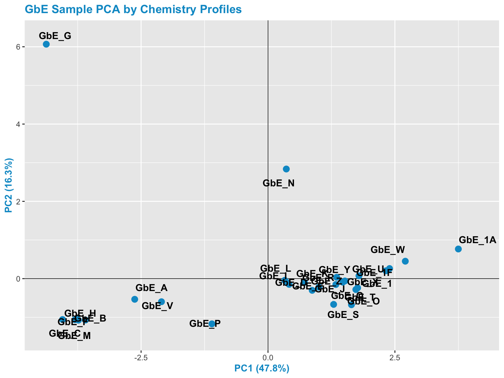

#### This plot tells us a lot about sample groupings based on chemical profiles!


#### With this, we can answer **Environmental Health Questions 1-2**:
#### (1) Based on the chemical analysis, which *Ginkgo biloba* extract looks the most different?
#### *Answer: GbE_G*

#### (2) When viewing the variability between chemical profiles, how many groupings of potentially ‘sufficiently similar’ *Ginkgo biloba* samples do you see?
#### *Answer: Approximately 4 (though could argue +1/-1): bottom left group; bottom right group; and two completely separate samples of GbE_G and GbE_N*


## Creating a Heat Map of the Mixtures Chemistry Data
As an alternative way of viewing the chemical profile data, we can make a heat map of the scaled chemistry data.

We concurrently run hierarchical clustering that shows us how closely samples are related to each other, based on different algorithms than data reduction-based PCA. Samples that fall on nearby branches are more similar. Samples that don't share branches with many/any others are often considered outliers.

#### By default, pheatmap uses a Euclidean distance to cluster the observations, which is a very common clustering algorithm.
For more details, see the following description of [Euclidean distance](https://en.wikipedia.org/wiki/Euclidean_distance).

```r
chem_hm <- pheatmap(chem, main="GbE Sample Heatmap by Chemistry Profiles",
                    cluster_rows=TRUE, cluster_cols = FALSE,
                    angle_col = 45, fontsize_col = 7, treeheight_row = 60)
```

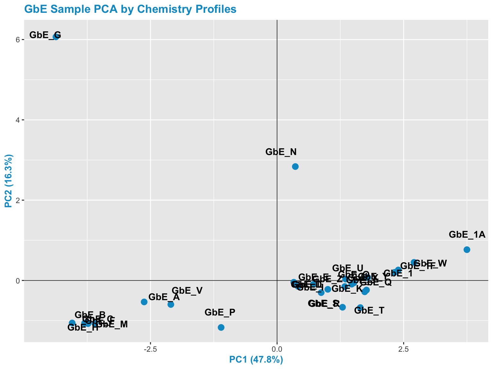

#### This plot tells us a lot about the individual chemicals that differentiate the sample groupings


#### With this, we can answer **Environmental Health Question 3**:
#### (3) Based on the chemical analysis, which chemicals do you think are important in differentiating between the different *Ginkgo biloba* samples?
#### *Answer: All of the chemicals technically contribute to these sample patterns, but here are some that stand out: (i) Ginkgolic_Acid_C15 and Ginkgolic_Acid_C17 appear to drive the clustering of one particular GbE sample, GbE_G, as well as potentially GbE_N; (ii) Isorhamnetin influences the clustering of GbE_T; (iii) Bilobalide, Ginkgolides A & B, and Quercetin are also important because they show a general cluster of abundance at decreased levels at the bottom and increased levels at the top*


#### Let's now revisit the PCA plot

```r
chem_pca_plt
```

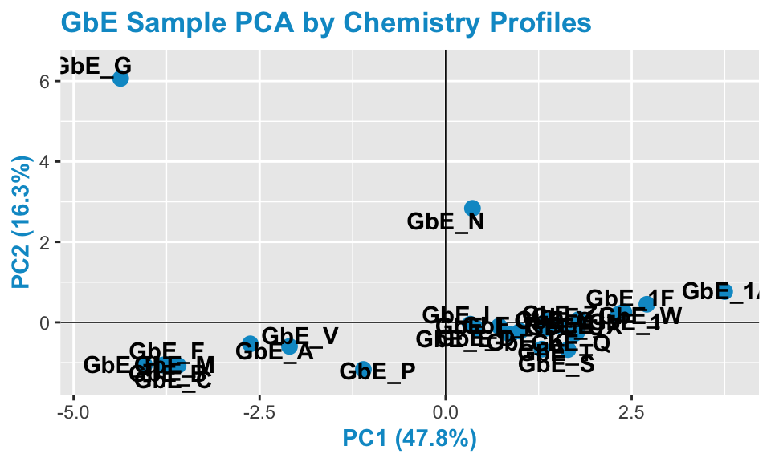

#### GbE_G and GbE_N look so different from the rest of the samples, they could be outliers and potentially influencing overall data trends

#### Let's make sure that, if we remove these two samples, our sample groupings still look the same

```r
chem_filt <- chem %>%
  rownames_to_column("Sample") %>%
  filter(!Sample %in% c("GbE_G","GbE_N")) %>%
  column_to_rownames("Sample")
```

#### Now lets re-run PCA and generate a heatmap on the chemical data with these outlier samples removed

```r
chem_filt_pca <- princomp(chem_filt)

# Get the percent variation captured by each component
pca_percent_filt <- round(100*chem_filt_pca$sdev^2/sum(chem_filt_pca$sdev^2),1)

# Make dataframe for PCA plot generation using first three components
pca_df_filt <- data.frame(PC1 = chem_filt_pca$scores[,1], PC2 = chem_filt_pca$scores[,2])

# Plot this dataframe
chem_filt_pca_plt <- ggplot(pca_df_filt, aes(PC1,PC2))+
  geom_hline(yintercept = 0, size=0.3)+
  geom_vline(xintercept = 0, size=0.3)+
  geom_point(size=3, color="aquamarine2") +
  geom_text(aes(label=rownames(pca_df_filt)), fontface="bold", position=position_jitter(width=0.5,height=0.5))+
  labs(x=paste0("PC1 (",pca_percent[1],"%)"), y=paste0("PC2 (",pca_percent[2],"%)"))+
  ggtitle("GbE Sample PCA by Chemistry Profiles excluding Potential Outliers")

# Changing the colors of the titles and axis text
chem_filt_pca_plt <- chem_filt_pca_plt + theme(plot.title=element_text(color="aquamarine2", face="bold"),
                    axis.title.x=element_text(color="aquamarine2", face="bold"),
                    axis.title.y=element_text(color="aquamarine2", face="bold"))

# Viewing this resulting plot
chem_filt_pca_plt
```

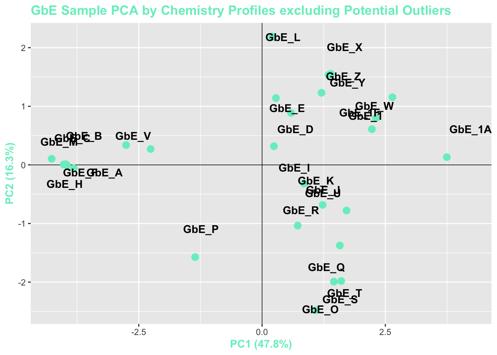


#### View the full samples vs filtered samples chemistry PCA plots together

```r
grid.arrange(chem_pca_plt, chem_filt_pca_plt)
```

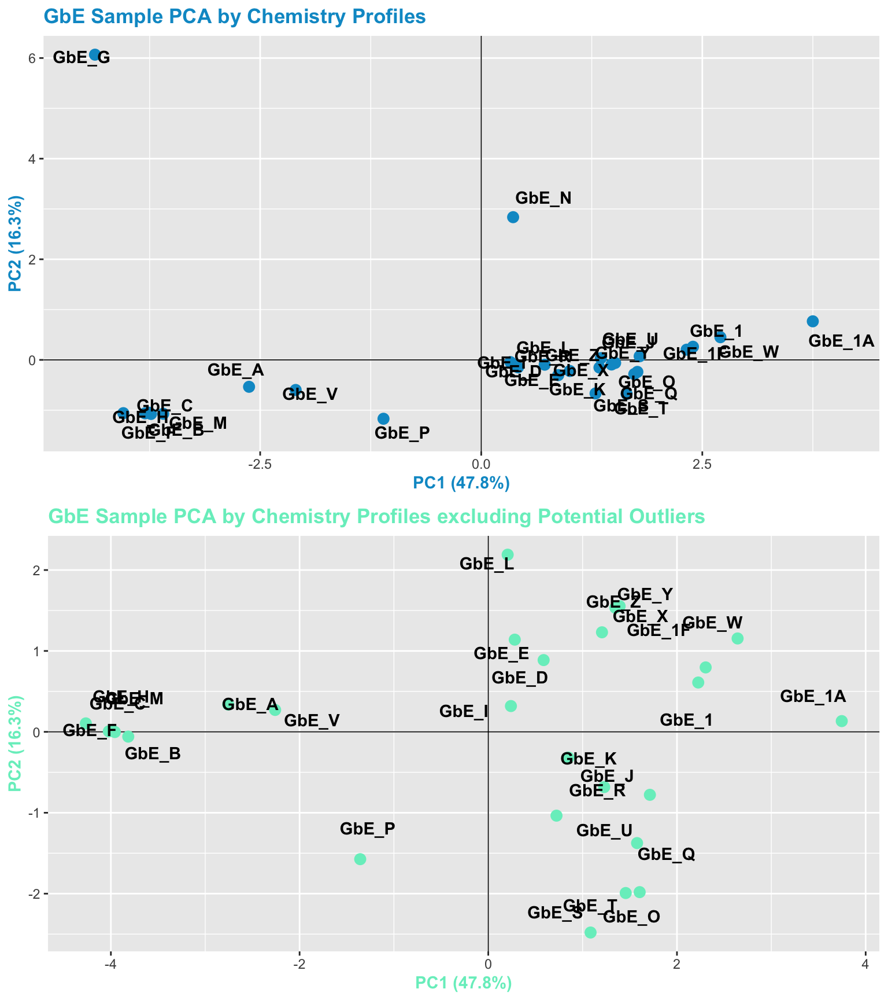

#### With these plots, side-by-side, we can now answer **Environmental Health Question 4**:
#### (4) After removing two samples that have the most different chemical profiles (and are thus, potential outliers), do we obtain similar chemical groupings?
#### *Answer: Yes! Removal of the potential outliers basically spreads the rest of the remaining data points out, since there is less variance in the overall dataset, and thus, more room to show variance amongst the remaining samples. The general locations of the samples on the PCA plot, however, remain consistent. We now feel confident that our similarity analysis is producing consistent grouping results*


## Toxicity-based Sufficient Similarity Analysis

The first method employed in this Sufficient Similarity analysis is, again, Principal Component Analysis (PCA). Unlike the chemistry dataset, we can use the toxicity dataset as is without scaling. The reason we want to analyze the raw data is because we want to emphasize genes that are showing a large response. Similarly, we want to demphasize genes that are not doing much in response to the exposure condition. If we scale these data, we will reduce this needed variability.

#### So here, we first move the sample column to row names

```r
tox <- tox %>% column_to_rownames("Sample")
```

#### Then, we can run PCA on this tox dataframe

```r
tox_pca <- princomp(tox)
```

#### Looking at the scree plot, we see the first two principal components capture most of the variation (~93%)

```r
fviz_eig(tox_pca)
```

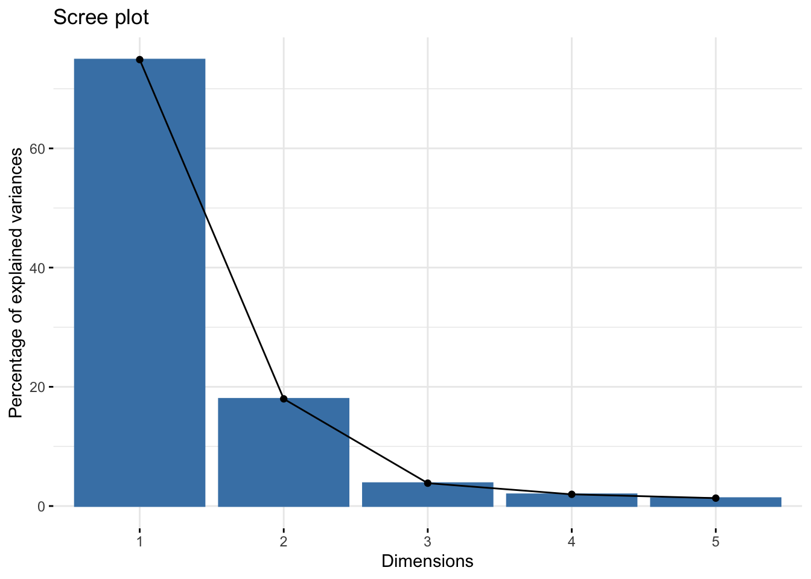

#### Plot the samples by principal components

```r
# Get the percent variation captured by each component
pca_percent <- round(100*tox_pca$sdev^2/sum(tox_pca$sdev^2),1)

# Make dataframe for PCA plot generation using first three components
tox_pca_df <- data.frame(PC1 = tox_pca$scores[,1], PC2 = tox_pca$scores[,2])

# Plot the first two components
tox_pca_plt <- ggplot(tox_pca_df, aes(PC1,PC2))+
  geom_hline(yintercept = 0, size=0.3)+
  geom_vline(xintercept = 0, size=0.3)+
  geom_point(size=3, color="deeppink3") +
  geom_text(aes(label=rownames(pca_df)), fontface="bold", position=position_jitter(width=0.25,height=0.25))+
  labs(x=paste0("PC1 (",pca_percent[1],"%)"), y=paste0("PC2 (",pca_percent[2],"%)"))+
  ggtitle("GbE Sample PCA by Toxicity Profiles")

# Changing the colors of the titles and axis text
tox_pca_plt <- tox_pca_plt + theme(plot.title=element_text(color="deeppink3", face="bold"),
                    axis.title.x=element_text(color="deeppink3", face="bold"),
                    axis.title.y=element_text(color="deeppink3", face="bold"))

tox_pca_plt
```

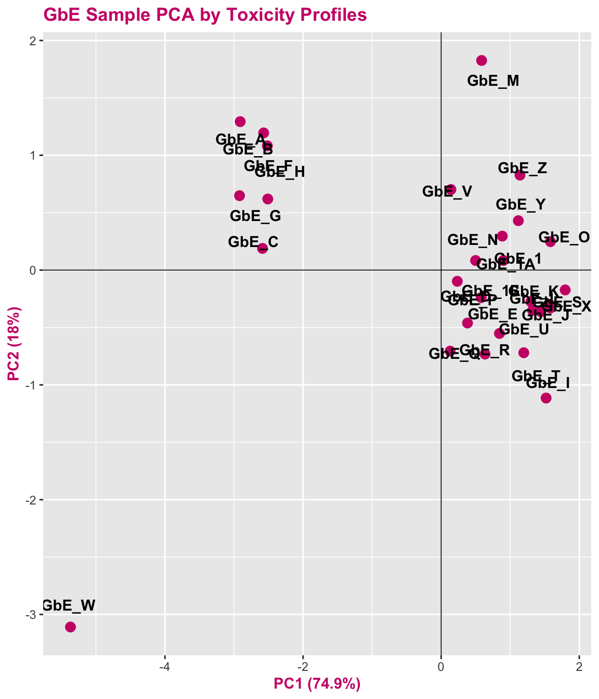
  
  
#### This plot tells us a lot about sample groupings based on toxicity profiles!  

#### With this, we can answer *Environmental Health Question 5*:
#### (5) When viewing the variability between toxicity profiles, how many groupings of potentially ‘sufficiently similar’ *Ginkgo biloba* samples do you see?
#### *Answer: Approximately 3 (though could argue +1/-1): top left group; top right group; GbE_M and GbE_W*


## Creating a Heat Map of the Mixtures Toxicity Data
#### As an alternative way of viewing the toxicity profile data, we can make a heat map of the tox data

```r
tox_hm <- pheatmap(tox, main="GbE Sample Heatmap by Toxicity Profiles",
               cluster_rows=TRUE, cluster_cols = FALSE,
               angle_col = 45, fontsize_col = 7, treeheight_row = 60)
```

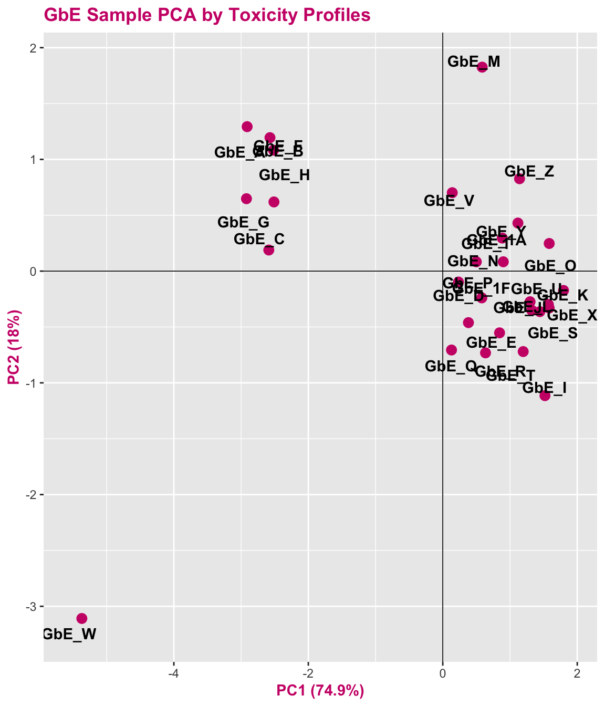

#### This plot tells us a lot about the individual genes that differentiate the sample groupings  

#### With this, we can answer **Environmental Health Question 6**:
#### (6) Based on the toxicity analysis, which genes do you think are important in differentiating between the different *Ginkgo biloba* samples?
#### *Answer: It looks like the CYP enzyme genes, particularly CYP2B6, are highly up-regulated in response to several of these sample exposures, and thus dictate a lot of these groupings.*


## Comparing Results from the Chemistry vs. <br>Toxicity Sufficient Similarity Analyses

#### Let's view the PCA plots for both datasets together, side-by-side

```r
pca_compare <- grid.arrange(chem_pca_plt,tox_pca_plt, nrow=1)
```

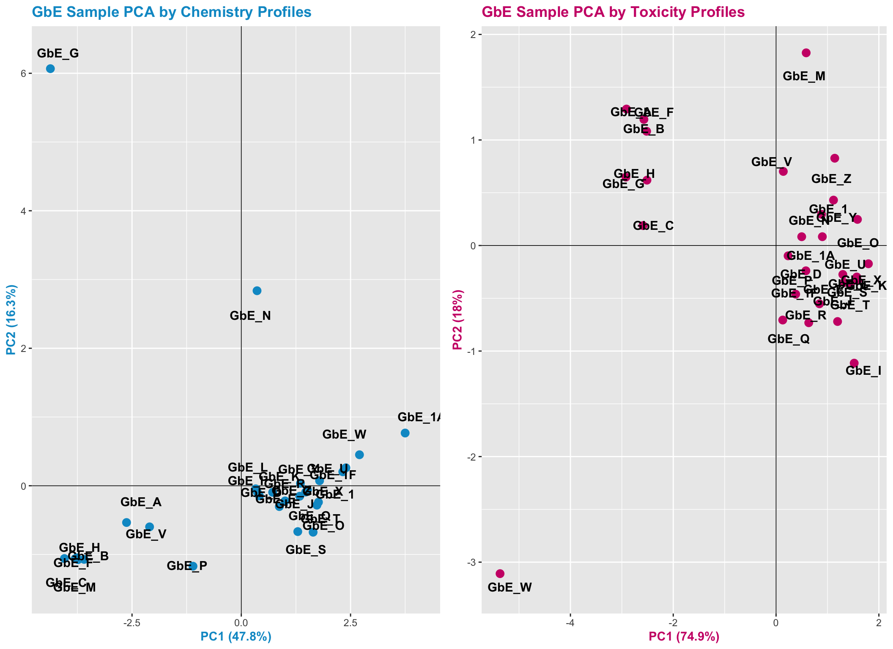

#### Let's also view the PCA plots for both datasets together, top-to-bottom, to visualize the trends along both axes better between these two views

```r
pca_compare <- grid.arrange(chem_pca_plt,tox_pca_plt)
```

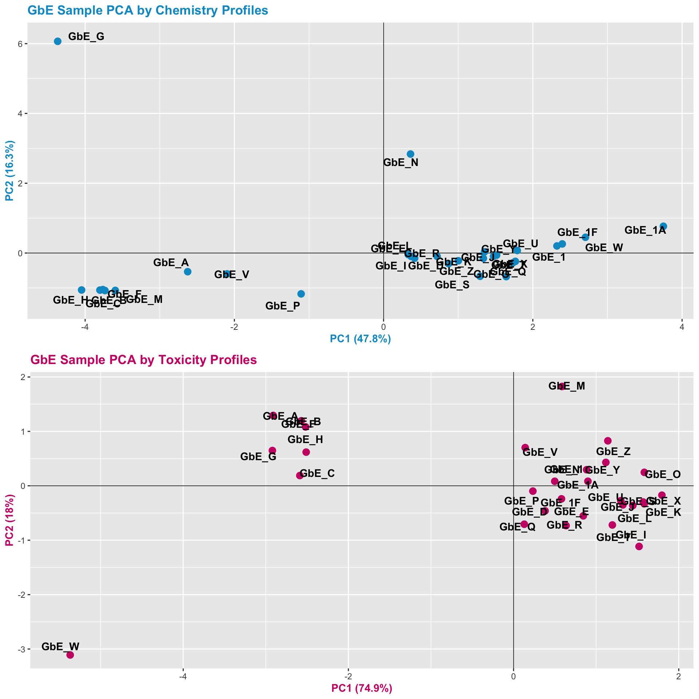


### Visual representation of some of the major grouping similarities vs differences
Here is an edited version of the above figures, highlighting with colored circles some chemical groups of interest identified through chemistry vs toxicity-based sufficient similarity analyses:

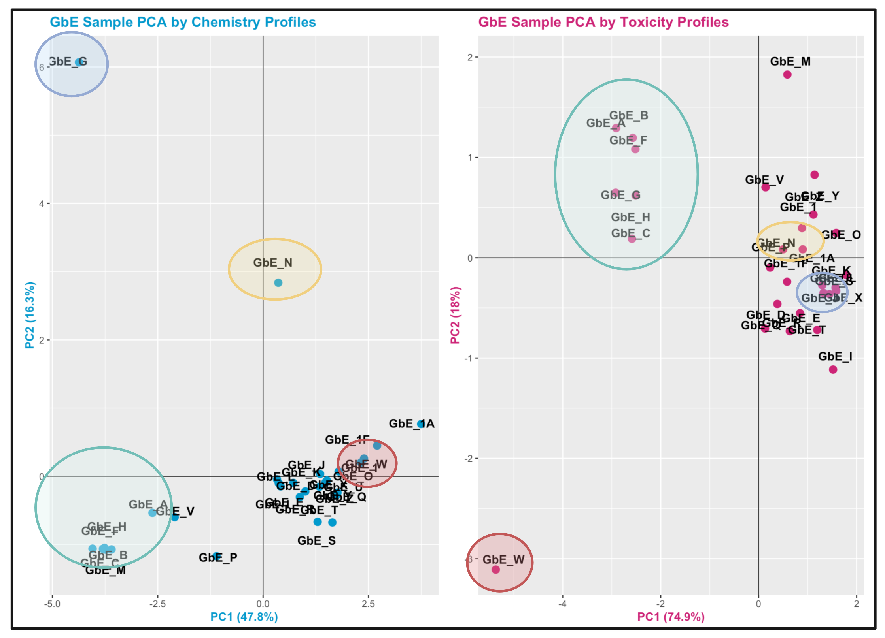


#### These plots can help us answer **Environmental Health Question 7**:
#### (7) Were similar chemical groups identified when looking at just the chemistry vs. just the toxicity? How could this impact regulatory action, if we only had one of these datasets?
#### *Answer: There are some similarities between groupings, though there are also notable differences. For example, samples GbE_A, GbE_B, GbE_C, GbE_F, and GbE_H group together from the chemistry and toxicity similarity analyses. Though samples GbE_G, GbE_W, GbE_N, and others clearly demonstrate differences in grouping assignments. These differences could impact the accuracy of how regulatory decisions are made, where if regulation was dictated solely on the chemistry (without toxicity data) and/or vice versa, we may miss important information that could aid in accurate health risk evaluations.*


## Concluding Remarks
In conclusion, we evaluate the similarity between variable lots of *Ginkgo biloba*, and identified sample groupings that could be used for chemical risk assessment purposes. Together, this example highlights the utility of sufficient similarity analyses to address environmental health research questions.

For more information and additional examples in environmental health research, see the following relevant publications implementing sufficient similarity methods to address complex mixtures:

+ Catlin NR, Collins BJ, Auerbach SS, Ferguson SS, Harnly JM, Gennings C, Waidyanatha S, Rice GE, Smith-Roe SL, Witt KL, Rider CV. How similar is similar enough? A sufficient similarity case study with Ginkgo biloba extract. Food Chem Toxicol. 2018 Aug;118:328-339. PMID: [29752982](https://pubmed.ncbi.nlm.nih.gov/29752982/).

+ Collins BJ, Kerns SP, Aillon K, Mueller G, Rider CV, DeRose EF, London RE, Harnly JM, Waidyanatha S. Comparison of phytochemical composition of Ginkgo biloba extracts using a combination of non-targeted and targeted analytical approaches. Anal Bioanal Chem. 2020 Oct;412(25):6789-6809. PMID: [32865633](https://pubmed.ncbi.nlm.nih.gov/32865633/).

+ Ryan KR, Huang MC, Ferguson SS, Waidyanatha S, Ramaiahgari S, Rice JR, Dunlap PE, Auerbach SS, Mutlu E, Cristy T, Peirfelice J, DeVito MJ, Smith-Roe SL, Rider CV. Evaluating Sufficient Similarity of Botanical Dietary Supplements: Combining Chemical and In Vitro Biological Data. Toxicol Sci. 2019 Dec 1;172(2):316-329. PMID: [31504990](https://pubmed.ncbi.nlm.nih.gov/31504990/).

+ Rice GE, Teuschler LK, Bull RJ, Simmons JE, Feder PI. Evaluating the similarity of complex drinking-water disinfection by-product mixtures: overview of the issues. J Toxicol Environ Health A. 2009;72(7):429-36. PMID: [19267305](https://pubmed.ncbi.nlm.nih.gov/19267305/).


# -Omics Analyses and Systems Biology


This training module was developed by Lauren Koval, Dr. Kyle Roell, and Dr. Julia E. Rager

Fall 2021


# Toxicokinetic Modeling


This training module was developed by Dr. Caroline Ring

The script for this training module requires EPA clearance prior to posting online.


# Read-Across Toxicity Predictions

This training module was developed by Dr. Grace Patlewicz and Dr. Julia E. Rager

The script for this training module requires EPA clearance prior to posting online.


