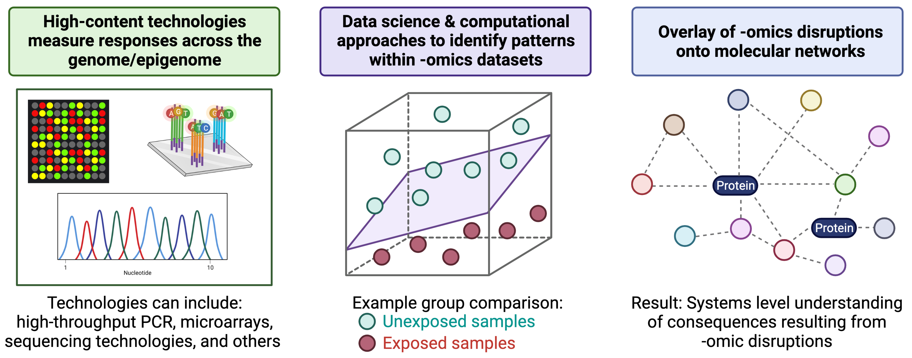
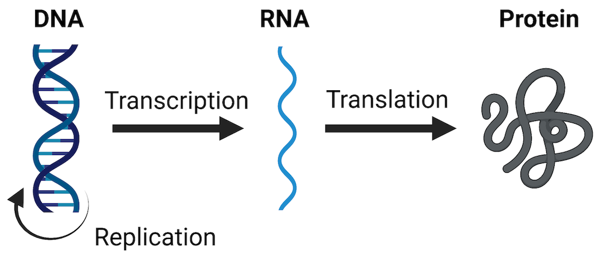
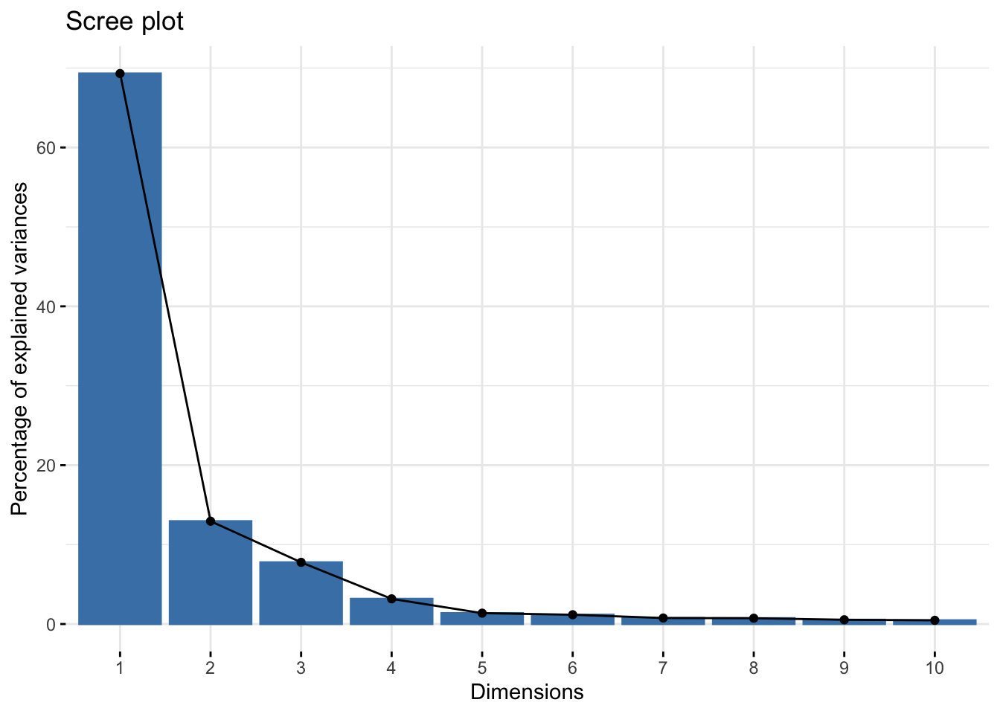
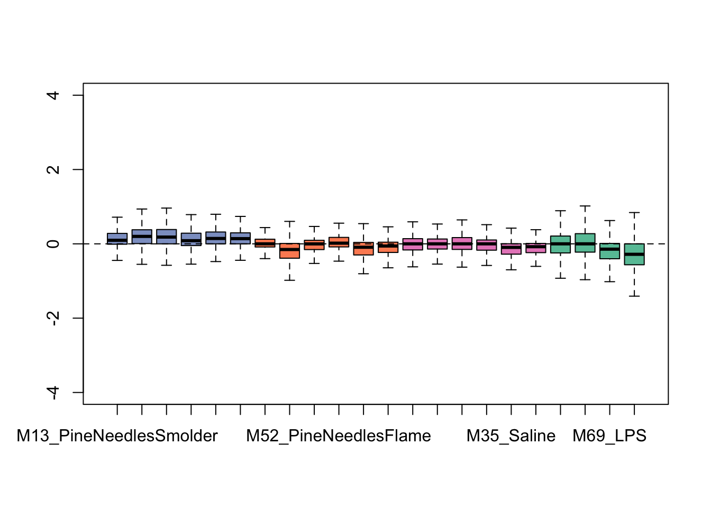

# (PART\*) Chapter 2 Chemical-<br>Biological Analyses <br>and Predictive Modeling {-}


# 2.1 Dose-Response Modeling

This training module was developed by Dr. Kyle Roell and Dr. Julia E. Rager

Fall 2021


#### Introduction to Dose-Response Modeling

#### "The Dose Makes the Poison"

One of the most well-established principles in the field of toxicology is the concept, 
**The Dose Makes the Poison**.  
Record of this founding principle dates back to the 16th century, when the Swiss physician, Paracelsus, concluded that in sufficient quantities, everything had the potential to cause harm, and the only thing that differentiated something from being harmful or not was the dose. Findings have continued to support this principle, substatiating that irrespective of the source of an exposure/insult, all have the potential to cause harm should the dose be sufficient. This overall concept supports the critical need to evaluate and quantify dose-response relationships.

#### Dose-response modeling
Dose-response modeling is a method used to quantitatively assess the relationship between an exposure to a chemical (or other stressor) and its related effects. The overall goal of these modeling efforts is to identify which exposure doses are harmful, and which aren't, to human health.

The following summarize the main steps in dose-response modeling:  

**1. Plot data**. Data from relevant epidemiological, clinical, and/or toxicological evaluations are first plotted. Data are plotted in an X-Y plot, where along the x-axis are the doses (or concentration) of a chemical (or stressor), and along the y-axis are the responses of interest.

**2. Test various curve fits**. There are many different models that can be used to mathematically describe the relationships between doses and associated responses. Typically, several curve fit models are tested in a dose-response analysis to see which fit the data the best.

**3. Identify the best fitting model curve**. Results from the tested model curve fits are evaluated, and the model(s) which fit the data the best are identified.

**4. Derive values to carry forward in your analyses, based on the best fitting curve model**. Using the best fitting curve model(s), final  benchmark doses (BMDs), benchmark dose lower bounds (BMDLs), and other types of points of departure (PODs) are derived, which then get carried forward in the analysis (e.g., chemical risk assessment).


## Introduction to Training Module
This training module provides an overview on analyzing exposure-associated response/outcome data in relation to exposure concentration (or dose), resulting in the derivation of benchmark doses (BMDs). This topic is of high relevance to the field of environmental health, as BMDs represent values that are used as the basis for evaluating risk in chemical safety evaluations, ultimately dictating the levels at which chemicals are regulated. This module specifically analyzes animal tumor incidence rates in response to exposure to a fictitious chemical (referred to a Chemical Z) tested across 12 different concentrations in drinking water. This dataset was generated for the specific purposes of this exercise, to allow for some interesting curve fits and a comparison between tissue site sensitivity to an example chemical insult.


#### Training Module's **Environmental Health Questions**
This training module was specifically developed to answer the following environmental health questions:

(1) Which target tissue demonstrated the overall highest incidence of tumor formation from any single dose of Chemical Z?
(2) Which target tissue's tumor incidence seems to not be related to dose?
(3) When we generate scatter plots illustrating exposure concentration vs disease outcome, without curves fitted to the data, are we able to derive benchmark doses?
(4) Upon visual inspection of example log-logistic vs. Weibull model curve fits on the intestinal tumor response data, can we confidently determine which of these two models best fits these data?
(5) For the liver tumor response data, which model fits the resulting dose-response curve the best?
(6) For the liver tumor response data, what are the final resulting BMD and BMDL estimates from the best fitting curve model?
(7) In comparing between the intestinal vs liver datasets, which tissue is estimated to show tumor responses at a lower exposure dose?

#### Script Preparations

#### Cleaning the global environment

```r
rm(list=ls())
```


#### Installing required R packages
If you already have these packages installed, you can skip this step, or you can run the below code which checks installation status for you.
To install "bmd" package, you need to first install package "remotes" which allows users to install packages from remote repositories, including GitHub, to then be able to install "bmd" package from Github.

```r
if (!require("Hmisc")) install.packages("Hmisc");
if (!require("drc")) install.packages("drc");
if (!require("remotes")) install.packages("remotes");
if (!require("drc")) remotes::install_github("DoseResponse/bmd")
```


#### Loading R packages required for this session

```r
# The describe function in the Hmisc package will be used to summarize a 
# description of the dataset
library(Hmisc)

# drc package will be used create and plot dose response models
library(drc) 

#bmd pacakge will be used to caculate the benchmark dose
library(bmd) 
```
For more information on the **drc package**, see its associated [CRAN webpage](https://cran.r-project.org/web/packages/drc/drc.pdf) and primary [publication](https://journals.plos.org/plosone/article?id=10.1371/journal.pone.0146021).

For more information on the **bmd package**, see its associated [R Documentation file](https://www.rdocumentation.org/packages/bmd/versions/0.5/topics/bmd) and primary [publication](https://www.ncbi.nlm.nih.gov/pmc/articles/PMC7750002/)


#### Set your working directory

```r
setwd("/filepath to where your input files are")
```


#### Loading the Example Dataset
Let's start by loading the dataset needed for this training module. This dataset is a mock example that was generated for the purposes of this training module, in order to best capture variable types of dose-response relationships and resulting curve fits.

This specific dataset analyzes the relationship between exposure to a fictional chemical, **chemical Z**, in drinking water and tumor incidence in the stomach, intestine (small and/or large), kidney, and liver in mice. These mice were evaluated in a traditional two-year animal bioassay setting. 

*Note that animals are assumed to drink equivalent amounts of water each day for simplicity.*

Loading the data

```r
dose_response.data <- read.csv("Module2_1/Module2_1_DoseResponseData.csv")
```


#### Data Viewing

Start with viewing the overall dimensions

```r
dim(dose_response.data)
```

```
## [1] 13 10
```

Then viewing a list of the column headers

```r
colnames(dose_response.data)
```

```
##  [1] "ChemicalZ_ugperL"          "TotalNoAnimals_Tested"    
##  [3] "NoAnimals_StomachTumor"    "Incidence_StomachTumor"   
##  [5] "NoAnimals_IntestinalTumor" "Incidence_IntestinalTumor"
##  [7] "NoAnimals_KidneyTumor"     "Incidence_KidneyTumor"    
##  [9] "NoAnimals_LiverTumor"      "Incidence_LiverTumor"
```
With this, we can see that data are included for various chemical Z doses (noted in the first column), followed by a column noting the total number of animals tested per dose (in the second column). Then, columns are included describing the number of animals, followed by incidence, of tumor formation across each tissue target of interest (i.e., stomach, intestine, kidney, and liver).


Viewing a quick summary of the values contained within this dataset

```r
summary(dose_response.data)
```

```
##  ChemicalZ_ugperL TotalNoAnimals_Tested NoAnimals_StomachTumor
##  Min.   :   0     Min.   :10            Min.   :2.000         
##  1st Qu.: 100     1st Qu.:10            1st Qu.:2.000         
##  Median : 300     Median :10            Median :2.000         
##  Mean   : 370     Mean   :10            Mean   :2.462         
##  3rd Qu.: 600     3rd Qu.:10            3rd Qu.:3.000         
##  Max.   :1000     Max.   :10            Max.   :3.000         
##  Incidence_StomachTumor NoAnimals_IntestinalTumor Incidence_IntestinalTumor
##  Min.   :0.2000         Min.   :0.000             Min.   :0.0000           
##  1st Qu.:0.2000         1st Qu.:0.000             1st Qu.:0.0000           
##  Median :0.2000         Median :0.000             Median :0.0000           
##  Mean   :0.2462         Mean   :2.308             Mean   :0.2308           
##  3rd Qu.:0.3000         3rd Qu.:5.000             3rd Qu.:0.5000           
##  Max.   :0.3000         Max.   :7.000             Max.   :0.7000           
##  NoAnimals_KidneyTumor Incidence_KidneyTumor NoAnimals_LiverTumor
##  Min.   :0.000         Min.   :0.0000        Min.   :0.000       
##  1st Qu.:1.000         1st Qu.:0.1000        1st Qu.:0.000       
##  Median :3.000         Median :0.3000        Median :2.000       
##  Mean   :3.692         Mean   :0.3692        Mean   :1.385       
##  3rd Qu.:6.000         3rd Qu.:0.6000        3rd Qu.:3.000       
##  Max.   :9.000         Max.   :0.9000        Max.   :3.000       
##  Incidence_LiverTumor
##  Min.   :0.0000      
##  1st Qu.:0.0000      
##  Median :0.2000      
##  Mean   :0.1385      
##  3rd Qu.:0.3000      
##  Max.   :0.3000
```


<!-- #### With this data summary, we can answer **Environmental Health Question #1**: -->
<!-- #### (1) Which target tissue demonstrated the overall highest incidence of tumor formation from any single dose of Chemical Z? -->
<!-- #### *Answer: The kidney indicates a maximum of 9 animals with tumors developing from a single dose, representing an alarming incidence rate of 90%.* -->


:::question
<i>With this data summary, we can answer **Environmental Health Question 1**: </i>
Which target tissue demonstrated the overall highest incidence of tumor formation from any single dose of Chemical Z?
:::
:::answer
**Answer**: The kidney indicates a maximum of 9 animals with tumors developing from a single dose, representing an alarming incidence rate of 90%.
:::

Alternatively, you can obtain a larger view of dataset using the descibe from Hmisc package

```r
Hmisc::describe(dose_response.data)
```

```
## dose_response.data 
## 
##  10  Variables      13  Observations
## --------------------------------------------------------------------------------
## ChemicalZ_ugperL 
##        n  missing distinct     Info     Mean      Gmd      .05      .10 
##       13        0       13        1      370    383.3        6       18 
##      .25      .50      .75      .90      .95 
##      100      300      600      780      880 
## 
## lowest :    0   10   50  100  150, highest:  500  600  700  800 1000
##                                                                             
## Value          0    10    50   100   150   200   300   400   500   600   700
## Frequency      1     1     1     1     1     1     1     1     1     1     1
## Proportion 0.077 0.077 0.077 0.077 0.077 0.077 0.077 0.077 0.077 0.077 0.077
##                       
## Value        800  1000
## Frequency      1     1
## Proportion 0.077 0.077
## --------------------------------------------------------------------------------
## TotalNoAnimals_Tested 
##        n  missing distinct     Info     Mean      Gmd 
##       13        0        1        0       10        0 
##              
## Value      10
## Frequency  13
## Proportion  1
## --------------------------------------------------------------------------------
## NoAnimals_StomachTumor 
##        n  missing distinct     Info     Mean      Gmd 
##       13        0        2     0.75    2.462   0.5385 
##                       
## Value          2     3
## Frequency      7     6
## Proportion 0.538 0.462
## --------------------------------------------------------------------------------
## Incidence_StomachTumor 
##        n  missing distinct     Info     Mean      Gmd 
##       13        0        2     0.75   0.2462  0.05385 
##                       
## Value        0.2   0.3
## Frequency      7     6
## Proportion 0.538 0.462
## --------------------------------------------------------------------------------
## NoAnimals_IntestinalTumor 
##        n  missing distinct     Info     Mean      Gmd 
##       13        0        6    0.843    2.308    3.205 
## 
## lowest : 0 1 4 5 6, highest: 1 4 5 6 7
##                                               
## Value          0     1     4     5     6     7
## Frequency      7     1     1     1     1     2
## Proportion 0.538 0.077 0.077 0.077 0.077 0.154
## --------------------------------------------------------------------------------
## Incidence_IntestinalTumor 
##        n  missing distinct     Info     Mean      Gmd 
##       13        0        6    0.843   0.2308   0.3205 
## 
## lowest : 0.0 0.1 0.4 0.5 0.6, highest: 0.1 0.4 0.5 0.6 0.7
##                                               
## Value        0.0   0.1   0.4   0.5   0.6   0.7
## Frequency      7     1     1     1     1     2
## Proportion 0.538 0.077 0.077 0.077 0.077 0.154
## --------------------------------------------------------------------------------
## NoAnimals_KidneyTumor 
##        n  missing distinct     Info     Mean      Gmd      .05      .10 
##       13        0       10    0.992    3.692    3.615      0.0      0.2 
##      .25      .50      .75      .90      .95 
##      1.0      3.0      6.0      7.8      8.4 
## 
## lowest : 0 1 2 3 4, highest: 5 6 7 8 9
##                                                                       
## Value          0     1     2     3     4     5     6     7     8     9
## Frequency      2     2     2     1     1     1     1     1     1     1
## Proportion 0.154 0.154 0.154 0.077 0.077 0.077 0.077 0.077 0.077 0.077
## --------------------------------------------------------------------------------
## Incidence_KidneyTumor 
##        n  missing distinct     Info     Mean      Gmd      .05      .10 
##       13        0       10    0.992   0.3692   0.3615     0.00     0.02 
##      .25      .50      .75      .90      .95 
##     0.10     0.30     0.60     0.78     0.84 
## 
## lowest : 0.0 0.1 0.2 0.3 0.4, highest: 0.5 0.6 0.7 0.8 0.9
##                                                                       
## Value        0.0   0.1   0.2   0.3   0.4   0.5   0.6   0.7   0.8   0.9
## Frequency      2     2     2     1     1     1     1     1     1     1
## Proportion 0.154 0.154 0.154 0.077 0.077 0.077 0.077 0.077 0.077 0.077
## --------------------------------------------------------------------------------
## NoAnimals_LiverTumor 
##        n  missing distinct     Info     Mean      Gmd 
##       13        0        3    0.865    1.385    1.538 
##                             
## Value          0     2     3
## Frequency      6     3     4
## Proportion 0.462 0.231 0.308
## --------------------------------------------------------------------------------
## Incidence_LiverTumor 
##        n  missing distinct     Info     Mean      Gmd 
##       13        0        3    0.865   0.1385   0.1538 
##                             
## Value        0.0   0.2   0.3
## Frequency      6     3     4
## Proportion 0.462 0.231 0.308
## --------------------------------------------------------------------------------
```


**Overall**, we can see that there are 4 disease outcomes included in this dataset:

+ stomach tumors
+ intestinal tumors
+ kidney tumors
+ liver tumors

All with observed incidences that depend upon the exposure concentration of *Chemical Z*


## Plotting Data in Dose-Response

#### Basic Plotting of Data in Dose-Response
Let's plot each tumor incidence against exposure concentration together in a 2x2 plot.  
Here, the y-axis will range from 0 to 1, with 0 indicating no incidence of tumors and 1 indicating all animals that were tested acquired tumors.

Here, we will use the 'with()' function, which allows us to create a mini-environment using the specified data.

```r
par(mfrow=c(2,2));
with(dose_response.data, plot(Incidence_StomachTumor~ChemicalZ_ugperL, ylim=c(0,1)));
with(dose_response.data, plot(Incidence_IntestinalTumor~ChemicalZ_ugperL, ylim=c(0,1)));
with(dose_response.data, plot(Incidence_KidneyTumor~ChemicalZ_ugperL, ylim=c(0,1)));
with(dose_response.data, plot(Incidence_LiverTumor~ChemicalZ_ugperL, ylim=c(0,1)));
```


```r
par(mfrow=c(1,1))
```


<!-- #### With these plots, we can answer **Environmental Health Question #2**: -->
<!-- #### (2) Which target tissue's tumor incidence seems to not be related to dose? -->
<!-- #### *Answer: Stomach.* -->


:::question
<i>With these plots, we can answer **Environmental Health Question 2**: </i>
Which target tissue's tumor incidence seems to not be related to dose?
:::
:::answer
**Answer**: Stomach.
:::

<!-- #### We can also answer **Environmental Health Question #3**: -->
<!-- #### (3) When we generate scatter plots illustrating exposure concentration vs disease outcome, without curves fitted to the data, are we able to derive benchmark doses? -->
<!-- #### *Answer: No, a curve fit is still needed to describe the overall trend in the dataset, which can then be used in the final calculation of a benchmark dose.* -->

<br>

:::question
<i>We can also answer **Environmental Health Question 3**: </i>
When we generate scatter plots illustrating exposure concentration vs disease outcome, without curves fitted to the data, are we able to derive benchmark doses?
:::
:::answer
**Answer**: No, a curve fit is still needed to describe the overall trend in the dataset, which can then be used in the final calculation of a benchmark dose.
:::


## Dose-Response Curve Fitting

It is notable that there are many different packages that can be used to fit curves to data. Here, we incorporate the *drc* package to fit several types of potential curve fit models to this example dataset. 

The *drm* function is specifically used from the *drc* package. Common parameters to consider when constructing the curve fit models in *drm* include the following:

**1. Formula**
  
This parameters describes the formula used to fit the data, formatted similar to a standard regression formula line of code. For the purposes of the current training module, this formula will be to fit to describe tumor incidence on chemical exposure concentration, which looks like this in the final code: *Incidence_StomachTumor ~ ChemicalZ_ugperL*

**2. Data**
  
This parameter specifies the dataset you are evaluating. For the current training module, we will be referring to the full dataframe, *dose_response.data*

**3. Weights**
  
This parameter contributes to determining how many observations are used at each dose/concentration, which can inform the model type. For the current training module, the weights in the dataset reflect the total number of animals tested at each exposure concentration.

**4. Function (fct)**
  
This parameter specifies which type of curve fit function you want to implement. Example functions include various types of log-logistic, genaralized log-logistic, weibull, asymptotic regression, and Michaelis-Menten models. Note that *getMeanFunctions()* can be called for the full list of available functions:

```r
getMeanFunctions()
```

```
## Log-logistic (ED50 as parameter) with lower limit at 0 and upper limit at 1 
## (2 parameters) 
## In 'drc':  LL.2 
## 
## Log-logistic (ED50 as parameter) with lower limit at 0 
## (3 parameters) 
## In 'drc':  LL.3 
## 
## Log-logistic (ED50 as parameter) with upper limit at 1 
## (3 parameters) 
## In 'drc':  LL.3u 
## 
## Log-logistic (ED50 as parameter) 
## (4 parameters) 
## In 'drc':  LL.4 
## 
## Generalized log-logistic (ED50 as parameter) 
## (5 parameters) 
## In 'drc':  LL.5 
## 
## Weibull (type 1) with lower limit at 0 and upper limit at 1 
## (2 parameters) 
## In 'drc':  W1.2 
## 
## Weibull (type 1) with lower limit at 0 
## (3 parameters) 
## In 'drc':  W1.3 
## 
## Weibull (type 1) 
## (4 parameters) 
## In 'drc':  W1.4 
## 
## Weibull (type 2) with lower limit at 0 and upper limit at 1 
## (2 parameters) 
## In 'drc':  W2.2 
## 
## Weibull (type 2) with lower limit at 0 
## (3 parameters) 
## In 'drc':  W2.3 
## 
## Weibull (type 2) 
## (4 parameters) 
## In 'drc':  W2.4 
## 
## Brain-Cousens (hormesis) with lower limit fixed at 0 
## (4 parameters) 
## In 'drc':  BC.4 
## 
## Brain-Cousens (hormesis) 
## (5 parameters) 
## In 'drc':  BC.5 
## 
## Log-logistic (log(ED50) as parameter) with lower limit at 0 and upper limit at 1 
## (2 parameters) 
## In 'drc':  LL2.2 
## 
## Log-logistic (log(ED50) as parameter) with lower limit at 0 
## (3 parameters) 
## In 'drc':  LL2.3 
## 
## Log-logistic (log(ED50) as parameter) with upper limit at 1 
## (3 parameters) 
## In 'drc':  LL2.3u 
## 
## Log-logistic (log(ED50) as parameter) 
## (4 parameters) 
## In 'drc':  LL2.4 
## 
## Generalised log-logistic (log(ED50) as parameter) 
## (5 parameters) 
## In 'drc':  LL2.5 
## 
## Asymptotic regression with lower limit at 0 
## (2 parameters) 
## In 'drc':  AR.2 
## 
## Shifted asymptotic regression 
## (3 parameters) 
## In 'drc':  AR.3 
## 
## Michaelis-Menten 
## (2 parameters) 
## In 'drc':  MM.2 
## 
## Shifted Michaelis-Menten 
## (3 parameters) 
## In 'drc':  MM.3
```


**5. Type**
  
This parameter specifies the data type of the response (e.g., binomial, continuous, etc). For the current training module, we will select the binomial type of response, which in this package refers to the modeling of data types that are not fully continuous, including this quantile-based incidence rate outcome.


#### First try fitting a log-logistic (LL) model
Because log-logistic (LL) models are commonly used to evaluate dose-response relationships, let's first start by trying to fit a 2 parameter LL function.

Running the model, on the intestinal tumor incidence outcome as an example

```r
LL2.model.int <- with(dose_response.data,
                  drm(Incidence_IntestinalTumor~ChemicalZ_ugperL,
                  weights=TotalNoAnimals_Tested, 
                  fct=LL.2(), type="binomial"))
```


It's easy to plot these results using the plot function

```r
plot(LL2.model.int, type="all", ylim=c(0,1));
```


#### Let's next try fitting a Weibull model

Running the Weibull curve model, on the intestinal tumor incidence outcome as an example

```r
W23.model.int <- with(dose_response.data,
                  drm(Incidence_IntestinalTumor~ChemicalZ_ugperL,
                  weights=TotalNoAnimals_Tested,
                  fct=W2.3(), type="binomial"))
```


Let's plot the results of this function

```r
plot(W23.model.int, type="all", ylim=c(0,1));
```


<!-- #### With this, we can now answer **Environmental Health Question #4**: -->
<!-- #### (4) Upon visual inspection of example log-logistic vs. Weibull model curve fits on the intestinal tumor response data, can we confidently determine which of these two models best fits these data? -->
<!-- #### *Answer: No, both of these models appear to fit this dataset to a large extent. A more quantitative approach based on AIC is required to identify the best fitting model (see below).* -->

:::question
<i>With this, we can now answer **Environmental Health Question 4**: </i>
Upon visual inspection of example log-logistic vs. Weibull model curve fits on the intestinal tumor response data, can we confidently determine which of these two models best fits these data?
:::
:::answer
**Answer**: No, both of these models appear to fit this dataset to a large extent. A more quantitative approach based on AIC is required to identify the best fitting model (see below).
:::

#### Let's try fitting another model fit based on asymptotic regression modeling

Running the asymptotic regression model, on the intestinal tumor incidence outcome as an example

```r
AR2.model.int <- with(dose_response.data,
                  drm(Incidence_IntestinalTumor~ChemicalZ_ugperL,
                  weights=TotalNoAnimals_Tested, 
                  fct=AR.2(), type="binomial"))
```


Let's plot the results of this function

```r
plot(AR2.model.int, type="all", ylim=c(0,1));
```


#### Important note on the variety of curve fit models to consider
There are many different types of curve fit models to consider when running your analyses. For example, additional functions are available from other packages, such as the **aomisc package**, which has an associated [Github page](https://github.com/OnofriAndreaPG/aomisc) and [R-bloggers article](https://www.r-bloggers.com/2020/02/a-collection-of-self-starters-for-nonlinear-regression-in-r/). This package contains a collection of functions that are not included in the current drc pacakage. There are many other options available as well, if you search CRAN, Bioconductor, Github, and general search engines.


## Comparing Curve Fits
Given the variety of models that can be used to fit dose-response data, it is important to consider the results of each model curve fit and identify which model best fits the data.

There are many ways to identify best fitting curves. The most commonly implemented strategies include the following:

**1. Visual Inspection.** Model curve fits can be evaluated visually, to gage whether or not resulting curves fit the data.

**2. Akaike Information Criterion (AIC).** AIC values are commonly used for model selection, and represents an estimator of prediction error and relative quality of statistical models for a given set of data. AIC incorporates the trade-off between a model's goodness of fit and the simplicity, such that it weighs the risk of overfitting vs underfitting. In applications, it is common to choose models with the lowest AIC, pending they describe the data sufficiently.


The AIC function can simply be used here to calculate each resulting model's AIC. Remember, the lower AIC represents the better model curve fit.

```r
# Results from the log-logistic model
AIC(LL2.model.int)   
```

```
## [1] 30.85574
```

```r
# Results from the Weibull model
AIC(W23.model.int) 
```

```
## [1] 22.87452
```

```r
# Results from the asymptotic regression model
AIC(AR2.model.int)   
```

```
## [1] 40.37098
```
These results demonstrate, quantitatively, that the Weibull model likely describes this dataset the best (out of the evaluated models), since it has the lowest AIC value


Let's finally produce a summary visualization that display the results of these three model curve fits across this intestinal dataset, with all the curve fits in one plot.

```r
# First defining a vector of text to use in the legend, summary the three curve fits and their AICs
IntestinalCurveFitAICs <- c("Log-Logistic, AIC=30.9", "Weibull, AIC=22.9", "Asymptotic Regression, AIC=40.4")

# Generating the plot
plot(LL2.model.int, type="all", ylim=c(0,1))
#Can add the next models on top of current plot with different line types and weights
plot(W23.model.int, add=TRUE,col="red",lty=4, lwd=1.5)
plot(AR2.model.int, add=TRUE,col="blue",lty=2, lwd=1.5)

# A way to coerce the dots back to black for final view:
plot(LL2.model.int, add=TRUE,col="black")

#Can add a legend as well, specifying the same paramters for linetype (lty) and color (col)
legend(x=1, y=.8, legend=IntestinalCurveFitAICs,
       col=c("black", "red", "blue"), lty=c(1,4,2))
```


## Curve Fitting Example
#### Curve Fitting for Liver Outcomes
For this exercise now focusing on liver tumors, let's quickly fit the same three models and plot the results.

Example log-logistic (LL) model function:

```r
LL2.model.liver <- with(dose_response.data,
                        drm(Incidence_LiverTumor~ChemicalZ_ugperL,
                        weights=TotalNoAnimals_Tested,
                        fct=LL.2(), type="binomial"))
```

Example Weibull model function:

```r
W23.model.liver <- with(dose_response.data,
                        drm(Incidence_LiverTumor~ChemicalZ_ugperL,
                        weights=TotalNoAnimals_Tested,
                        fct=W2.3(), type="binomial"))
```


Example asymptotic regression model function:

```r
AR2.model.liver <- with(dose_response.data,
                  drm(Incidence_LiverTumor~ChemicalZ_ugperL,
                  weights=TotalNoAnimals_Tested, 
                  fct=AR.2(), type="binomial"))
```


Calculating AICs:

```r
AIC(LL2.model.liver)
```

```
## [1] 28.1143
```

```r
AIC(W23.model.liver)
```

```
## [1] 24.46089
```

```r
AIC(AR2.model.liver)
```

```
## [1] 28.80896
```


Plotting the resulting curve fits:

```r
# First defining a vector of text to use in the legend, summary the two curve fits and their AICs
LiverCurveFitAICs <- c("Log-Logistic, AIC=28.1", "Weibull, AIC=24.4", "Asymptotic Regression, AIC=28.8")

# Generating the plot
plot(LL2.model.liver, type="all", ylim=c(0,1))
plot(W23.model.liver, add=TRUE,col="red",lty=3, lwd=1.5)
plot(AR2.model.liver, add=TRUE,col="blue",lty=2, lwd=1.5)

# A way to coerce the dots back to black for final view:
plot(LL2.model.liver, add=TRUE,col="black")

# Can add a legend as well, specifying the same paramters for linetype (lty) and color (col)
legend(x=1, y=.8, legend=LiverCurveFitAICs,
       col=c("black", "red", "blue"), lty=c(1,4,2))
```


<!-- #### With this, we can now answer **Environmental Health Question #5**: -->
<!-- #### (5) For the liver tumor response data, which model fits the resulting dose-response curve the best? -->
<!-- #### *Answer: It is clear from visual inspection of the resulting curve fits and the calculated AIC values that the Weibull model fits the liver tumor response data the best.* -->

:::question
<i>With this, we can now answer **Environmental Health Question 5**: </i>
For the liver tumor response data, which model fits the resulting dose-response curve the best?
:::
:::answer
**Answer**: It is clear from visual inspection of the resulting curve fits and the calculated AIC values that the Weibull model fits the liver tumor response data the best.
:::


## Deriving Benchmark Dose
#### Deriving the Final Benchmark Dose (BMD) Estimates
Using the results from our best fitting models, we can now estimate the resulting benchmark doses (BMDs) to serve as the 'tipping points' of where exposure concentrations are demonstrated to elicit outcomes. A **BMD** is technically defined as a dose or concentration that produces a predetermined change in the response rate of an adverse effect. This predetermined change in response rate is termed the **benchmark response (BMR)**.

In this training module, we implement the *bmd* package to calculate a BMD from the resulting models derived through the drc package (as detailed in the code above).

A typical BMR used in chemical risk assessments for incidence data is 10%, to let's use that here as our example BMR to base the derivation of BMDs off of.

Running the BMD estimate off the Weibull model fit to the liver tumor response data:

```r
bmd::bmd(W23.model.liver, bmr = .1, backg = 0)
```

```
##              BMD     BMDL
## e:1:0.1 283.7063 191.9821
```
These results indicate that, in order to achieve a change in response rate of 10% (from a background of 0 ug/L), and exposure concentration of 283.7 ug/L is required. Note that a **benchmark dose lower bound (BMDL)** is also provided, indicating the lower bound of the confidence interval surrounding the BMD. BMDL values are also commonly carried forward in risk assessment, since these values are more conservative and thus protective of public health.


<!-- #### With this, we can now answer **Environmental Health Question #6**: -->
<!-- #### (6) For the liver tumor response data, what are the final resulting BMD and BMDL estimates from the best fitting curve model? -->
<!-- #### *Answer: BMD=283.7 and BMDL=192.0 ug/L.* -->

:::question
<i>With this, we can now answer **Environmental Health Question 6**: </i>
For the liver tumor response data, what are the final resulting BMD and BMDL estimates from the best fitting curve model?
:::
:::answer
**Answer**: BMD=283.7 and BMDL=192.0 ug/L.
:::

Let's compare these BMD/BMDL estimates to those generated from the best fitting curve fit on the intestinal tumor response data:

```r
bmd::bmd(W23.model.int, bmr = .1, backg = 0)
```

```
##              BMD     BMDL
## e:1:0.1 409.2645 345.9804
```


<!-- #### With this, we can now answer **Environmental Health Question #7**: -->
<!-- #### (7) In comparing between the intestinal vs liver datasets, which tissue is estimated to show tumor responses at a lower exposure dose? -->
<!-- #### *Answer: The liver demonstrates tumor responses at a lower exposure dose, since the intestinal BMD is 409.3 which is much higher than the liver BMD of 283.7 ug/L.* -->

:::question
<i>With this, we can now answer **Environmental Health Question 7**: </i>
In comparing between the intestinal vs liver datasets, which tissue is estimated to show tumor responses at a lower exposure dose?
:::
:::answer
**Answer**: The liver demonstrates tumor responses at a lower exposure dose, since the intestinal BMD is 409.3 which is much higher than the liver BMD of 283.7 ug/L.
:::

## Concluding Remarks
In conclusion, this training module provides several examples of methods to fit model curves to dose-response data that are typically evaluated in environmental health assessments. These examples highlight the importance of evaluating model fit to ultimately determine which model should be used to derive final BMD and BMDL estimates. Through this training module, example methods and associated script are designed with flexibility to aid in future analyses in which researchers may aim to analyze in vitro bioactivity, in vivo apical outcomes, and human health outcomes in the context of dose-response.


For additional case studies that leverage dose-response modeling techniques, see the following publications that also address environmental health questions:

+ Auerbach SS, Paules RS. Genomic dose response: Successes, challenges, and next steps. Current Opinion in Toxicology. [2018 Oct; 11-12:84-92](https://www.sciencedirect.com/science/article/abs/pii/S2468202018301025). 

+ Johnson KJ, Auerbach SS, Costa E. A Rat Liver Transcriptomic Point of Departure Predicts a Prospective Liver or Non-liver Apical Point of Departure. Toxicol Sci. 2020 Jul 1;176(1):86-102. PMID: [32384157](https://pubmed.ncbi.nlm.nih.gov/32384157/).

+ Rager JE, Auerbach SS, Chappell GA, Martin E, Thompson CM, Fry RC. Benchmark Dose Modeling Estimates of the Concentrations of Inorganic Arsenic That Induce Changes to the Neonatal Transcriptome, Proteome, and Epigenome in a Pregnancy Cohort. Chem Res Toxicol. 2017 Oct 16;30(10):1911-1920. PMID: [28927277](https://pubmed.ncbi.nlm.nih.gov/28927277/).

+ Ramaiahgari SC, Auerbach SS, Saddler TO, Rice JR, Dunlap PE, Sipes NS, DeVito MJ, Shah RR, Bushel PR, Merrick BA, Paules RS, Ferguson SS. The Power of Resolution: Contextualized Understanding of Biological Responses to Liver Injury Chemicals Using High-throughput Transcriptomics and Benchmark Concentration Modeling. Toxicol Sci. 2019 Jun 1;169(2):553-566. PMID: [30850835](https://pubmed.ncbi.nlm.nih.gov/30850835/).

+ Thompson CM, Kirman CR, Hays SM, Suh M, Harvey SE, Proctor DM, Rager JE, Haws LC, Harris MA. Integration of mechanistic and pharmacokinetic information to derive oral reference dose and margin-of-exposure values for hexavalent chromium. J Appl Toxicol. 2018 Mar;38(3):351-365. PMID: [29064106](https://pubmed.ncbi.nlm.nih.gov/29064106/).


For additional modeling tools and guidance documents, see the below:

+ U.S. EPA’s [BMD software (BMDS)](https://www.epa.gov/bmds).

+ [U.S. EPA’s guidance document](https://www.epa.gov/sites/production/files/2015-01/documents/benchmark_dose_guidance.pdf): U.S. EPA (2012). Benchmark Dose Technical Guidance. Risk Assessment Forum. Document ID EPA/100/R-12/001. Washington, DC. 
+ Netherlands' National Institute for Public Health and the Environment (RIVM) software, [PROAST](http://www.rivm.nl/en/Documents_and_publications/Scientific/Models/PROAST).

+ U.S. NTP’s Bayesian BMD Estimation tool that’s available as an [online tool](https://benchmarkdose.org/)  with the accompanying [publication](https://www.ncbi.nlm.nih.gov/pmc/articles/PMC6014690/).

+ U.S. NTP's BMDExpress tool for performing high-throughput dose-response assessments on gene expression datasets, which is available as a [tool](https://github.com/auerbachs/BMDExpress-2/releases) with the accompanying [publication](https://www.ncbi.nlm.nih.gov/pmc/articles/PMC6513160/).

 


# 2.2 Machine Learning and Predictive Modeling for Environmental Health


The development of this training module was led by [**Dr. David M. Reif**](http://reif-lab.org/) {width=35px}

Fall 2021


#### Introduction to Machine Learning (ML) and Predictive Modeling

#### The need for predictive modeling

- We can screen for biological responses to a variety of chemical exposures/treatment conditions very efficiently, leveraging technologies like cell-based high-throughput screening

<left>      
{width=650px}  
</left>

- These screening efforts result in increasing amounts of data, which can be gathered to start building big databases 

<left>      
{width=650px}  
</left>   
  
   - Alongside these big databases, the associated dimensionality of these data gets "Big" 

<left>      
{width=650px}  
</left>   

   - And diversity across types of screening platforms, technologies, cell types, species, etc, leading to compounding dimensionality

<left>      
{width=650px}  
</left>   

##### How do we even begin to analyze such data?  

For diverse, high-dimensional data, new approaches are needed. Traditional statistics may be able to handle 1:1 or 1:many comparisons of singular quantities (e.g. activity concentrations (e.g., AC50s for two chemicals). However, once the modeling needs become overly complex (or exploratory), assumptions of most traditional methods will be violated.   

#### Defining predictive modeling in the context of toxicology and environmental health

We often think of predictions as having a forward-time component (*i.e. What will happen next?*) ... what about "prediction" in a different sense as applied to toxicology? 

**Working definition**: **Predictive toxicology** describes a multidisciplinary approach to chemical toxicity evaluation that more efficiently uses animal test results, when needed, and leverages expanding non-animal test methods to forecast the effects of a chemical on biological systems
  
  - eg 1. Can I more efficiently design animal studies and analyze data from shorter assays using less animals to predict long-term health outcomes?
  
  - eg 2. Can this suite of in vitro assays <b>predict</b> what would happen in an organism?
  
  - eg 3. Can I use diverse, high-dimensional data to cluster chemicals into **predicted** activity classes?
  
<left>      
{width=450px}  
</left>   
  
Similar logic applies to the field of exposure science... what about "prediction" applied to exposure science?

**Working definition**: **Predictive exposure science** describes a multidisciplinary approach to chemical exposure evaluations that more efficiently uses biomonitoring, chemical inventory, and other exposure science-relevant databases to forecast exposure rates in target populations.

  - eg 1. Can I use existing biomonitoring data from NHANES to predict exposure rates for chemicals that have yet to be measured in target populations? (see ExpoCast program, eg. [Wambaugh et al.](https://pubmed.ncbi.nlm.nih.gov/25343693/))

  - eg 2. Can I use chemical product use inventory data to predict the likelihood of a chemical being present in a certain consumer product (eg. [Phillips et al.](https://pubmed.ncbi.nlm.nih.gov/29405058/))


#### Distinguish between machine learning (ML) and traditional statistical methods

There is *plenty* of debate as to where the line(s) between ML and traditional statistics should be drawn. *IMHO*, a perfect delineation is not necessary for our purposes. Rather, we will focus on the usual goals/intent of each to help us understand the distinction for Environmental Health Research.

**Working distinction**: Statistics draws population inferences from a sample, and machine learning finds generalizable predictive patterns. [https://www.nature.com/articles/nmeth.4642]

Thus, by our working definition of predictive toxicology, we are interested in predictive aspects of ML that can give us generalizable forecasts as to effects of chemicals on biological systems.

The image below shows graphical abstractions of how a "problem" is solved using either traditional statistics in the top row of (A) logistic and (B) linear regression or ML in the bottom row of (C) support vector machines,  (D) artificial neural networks, and (E) decision trees. [https://www.sciencedirect.com/science/article/pii/S2590139719300432?via%3Dihub]
  
<left>      
{width=650px}  
</left>   

  
The list of ML methods is continually expanding and subject to new taxonomic [description](https://en.wikipedia.org/wiki/Machine_learning#Dimensionality_reduction). 

There are many different types of ML methods that we can employ, depending on the data type / purpose of data analysis. Generally speaking, ML is considered to encompass the study of computer algorithms that can improve automatically through experience and by the use of data. It is seen as a part of artificial intelligence (AI). A recent [review](https://pubmed.ncbi.nlm.nih.gov/34029068/) written together with [Erin Baker's lab](https://bakerlab.wordpress.ncsu.edu/) provides a high-level overview on some of the types of ML methods and challenges to address when analyzing multi-omic data (including chemical signature data).


**K-Means Clustering**

A common type of ML method that will be included in the scripted activity is called **k-means clustering**. 
K-means is a common clustering algorithm used to partition quantitative data. This algorithm works by first, randomly selecting a pre-specified number of clusters, k, across the data space, with each cluster having a data centroid. When using a standard Euclidean distance metric, the distance is calculated from an observation to each centroid, then the observation is assigned to the cluster of the closest centroid. After all observations have been assigned to one of the k clusters, the average of all observations in a cluster is calculated, and the centroid for the cluster is moved to the location of the mean. The process then repeats, with the distance computed between the observations and the updated centroids. Observations may be reassigned to the same cluster, or moved to a different cluster if it is closer to another centroid. These iterations continue until there are no longer changes between cluster assignments for observations, resulting in the final cluster assignments that are then carried forward for analysis/interpretation.

Helpful resources on k-means clustering include the following: [The Elements of Statistical Learning](https://web.stanford.edu/~hastie/ElemStatLearn/printings/ESLII_print12_toc.pdf) &
[Towards Data Science](https://towardsdatascience.com/k-means-clustering-algorithm-applications-evaluation-methods-and-drawbacks-aa03e644b48a)


**Principal Component Analysis (PCA)**

Another very common ML method you can use to look at big data is a method to reduce high-dimensional data called **Principal Component Analysis (PCA)**. This can be defined in many ways, though here are some of the important elements that underly a PCA: 

1. PCA partitions variance in a dataset into linearly uncorrelated principal components (PCs), which are weighted combinations of the original features. 

2. Each PC (starting from PC1) summarizes a decreasing % of variance.

3. Every instance (e.g. chemical) in the original dataset has a "score" on each PC.

4. Any combination of PCs can be compared to summarize relationships amongst the instances (e.g. chemicals).


## Introduction to Training Module
In this activity we are going to analyze an example dataset of physicochemical property information for chemicals spanning **per- and polyfluoroalkyl substances (PFAS) and statins**. PFAS represent a ubiquitous and pervasive class of man-made industrial chemicals that are commonly used in food packaging, commercial household products such as Teflon, cleaning products, and flame retardants. PFAS are recognized as highly stable compounds that, upon entering the environment, can persist for many years and act as harmful sources of exposure. Statins represent a class of lipid-lowering compounds that are commonly used as pharmaceutical treatments for patients at risk of cardiovascular disease. Because of their common use amongst patients, statins can also end up in water and wastewater effluent, making them of environmental relevance as well.

This training module was designed to evaluate the chemical space of these diverse compounds, and to illustrate the utility of machine learning methods to differentiate chemical class and predict chemical groupings that can inform a variety of environmental and toxicological applications. The two types of machine learning methods that will be employed are k-means and PCA (as described in the introduction).


#### Training Module's **Environmental Health Questions**
This training module was specifically developed to answer the following environmental health questions:

(1) Can we differentiate between PFAS and statin chemical classes, when considering just the raw physicochemical property variables without applying machine learning techniques?
(2) What are some of the physicochemical properties that seem to be driving chemical clustering patterns derived through k-means?
(3) Upon reducing the data through PCA, which physicochemical property contributes the most towards informing data variance captured in the primary principal component (Comp.1)?
(4) How do the data compare when physicochemical properties are reduced using PCA?
(5) If we did not have information telling us which chemical belonged to which class, could we use PCA and k-means to accurately predict whether a chemical is a PFAS vs statin?
(6) What kinds of applications/endpoints can be better understood and/or predicted, because of these derived chemical groupings?


#### Script Preparations

#### Cleaning the global environment

```r
rm(list=ls())
```

#### Installing required R packages
If you already have these packages installed, you can skip this step, or you can run the below code which checks installation status for you

```r
if (!requireNamespace("ggplot2"))
  install.packages("ggplot2", repos = "https://cloud.r-project.org");
if (!requireNamespace("pheatmap"))
  install.packages("pheatmap", repos = "https://cloud.r-project.org");
```


#### Loading R packages required for this session

```r
library(ggplot2)

# Used to make heatmaps. This can be done in ggplot2 but pheatmap is easier and nicer
library(pheatmap) 
```


#### Getting help with packages and functions

```r
# Package documentation for ggplot2
?ggplot2

# Package documentation for kmeans (a part of the standard stats R package, 
# automatically uploaded)
?kmeans 

# Package documentation for deriving principal components within a PCA 
# (a part of the standard stats R package, automatically uploaded)
?princomp 

# Package documentation for pheatmap
?pheatmap 
```


#### Set your working directory

```r
setwd("/filepath to where your input files are") # e.g. setwd("/Downloads")
```


#### Loading the Example Dataset
Let's start by loading the datasets needed for this training module. We are going to use a dataset of substances that have a diverse chemical space of PFAS and statin compounds. This list of chemicals will be uploaded alongside physicochemical property data. The chemical lists for 'PFAS' and 'Statins' were obtained from the EPA's Computational Toxicology Dashboard [Chemical Lists](https://comptox.epa.gov/dashboard/chemical-lists). The physicochemical properties were obtained by uploading these lists into the National Toxoicology Program’s [Integrated Chemical Environment (ICE)](https://ice.ntp.niehs.nih.gov/). 

```r
dat <- read.csv("Module2_2/Module2_2_Chemical_Lists_PFAS-Statins.csv", 
                fileEncoding="UTF-8-BOM")
```


#### Data Viewing

#### Let's first view the substances dataset
Starting with the overall dimensions:

```r
dim(dat)
```

```
## [1] 144  14
```

Then looking at the first four rows and five columns of data:

```r
  dat[1:4,1:5]
```

```
##   List                                        Substance.Name      CASRN
## 1 PFAS    Perfluoro-2-(trifluoromethyl)propanesulphonic acid 93762-09-5
## 2 PFAS                   Potassium perfluoroheptanesulfonate 60270-55-5
## 3 PFAS Bis(2-hydroxyethyl)ammonium perfluoroheptanesulfonate 70225-15-9
## 4 PFAS       Potassium perfluoro-p-ethylcyclohexanesulfonate   335-24-0
##           DTXSID Molecular.Weight
## 1 DTXSID90239569          300.100
## 2  DTXSID9069392          488.212
## 3 DTXSID60880946          555.258
## 4 DTXSID50880117          500.223
```

Note that the first column, 'List', designates the following two larger chemical classes:

```r
unique(dat$List)
```

```
## [1] "PFAS"    "Statins"
```


Let's lastly view all of the column headers:

```r
colnames(dat)
```

```
##  [1] "List"                                             
##  [2] "Substance.Name"                                   
##  [3] "CASRN"                                            
##  [4] "DTXSID"                                           
##  [5] "Molecular.Weight"                                 
##  [6] "OPERA..Boiling.Point"                             
##  [7] "OPERA..Henry.s.Law.Constant"                      
##  [8] "OPERA..Melting.Point"                             
##  [9] "OPERA..Negative.Log.of.Acid.Dissociation.Constant"
## [10] "OPERA..Octanol.Air.Partition.Coefficient"         
## [11] "OPERA..Octanol.Water.Distribution.Coefficient"    
## [12] "OPERA..Octanol.Water.Partition.Coefficient"       
## [13] "OPERA..Vapor.Pressure"                            
## [14] "OPERA..Water.Solubility"
```

In the data file, the first four columns represent chemical identifier information. All remaining columns represent different physicochemical properties derived from OPERA via [Integrated Chemical Environment (ICE)](https://ice.ntp.niehs.nih.gov/). Because the original titles of these physicochemical properties contained commas and spaces, R automatically coverted these into periods. Hence, titles like "OPERA..Boiling.Point"


#### Subset to only one chemical identifier (rownames) + data columns (x)

For ease of downstream data analyses, let's create a more focused dataframe option containing only one chemical identifier (CASRN) as row names, and then just the physicochemical property columns

```r
dat.x <- dat[,5:ncol(dat)]
rownames(dat.x) <- dat$CASRN
```


#### Now explore this data subset

```r
# Overall dimensions
dim(dat.x) 
```

```
## [1] 144  10
```

```r
# Viewing the first four rows and five columns
dat.x[1:4,1:5] 
```

```
##            Molecular.Weight OPERA..Boiling.Point OPERA..Henry.s.Law.Constant
## 93762-09-5          300.100              213.095                       -3.60
## 60270-55-5          488.212              223.097                       -9.75
## 70225-15-9          555.258              223.097                       -9.75
## 335-24-0            500.223              220.578                       -7.56
##            OPERA..Melting.Point
## 93762-09-5               96.455
## 60270-55-5              273.228
## 70225-15-9              182.152
## 335-24-0                231.827
##            OPERA..Negative.Log.of.Acid.Dissociation.Constant
## 93762-09-5                                             0.175
## 60270-55-5                                            -1.810
## 70225-15-9                                             1.000
## 335-24-0                                               1.000
```

```r
colnames(dat.x)
```

```
##  [1] "Molecular.Weight"                                 
##  [2] "OPERA..Boiling.Point"                             
##  [3] "OPERA..Henry.s.Law.Constant"                      
##  [4] "OPERA..Melting.Point"                             
##  [5] "OPERA..Negative.Log.of.Acid.Dissociation.Constant"
##  [6] "OPERA..Octanol.Air.Partition.Coefficient"         
##  [7] "OPERA..Octanol.Water.Distribution.Coefficient"    
##  [8] "OPERA..Octanol.Water.Partition.Coefficient"       
##  [9] "OPERA..Vapor.Pressure"                            
## [10] "OPERA..Water.Solubility"
```


#### Evaluating the Original Physicochemical Property Data across Substances
Let's first see how these chemicals group when using the 'real' physicochemical property data, without any fancy data reduction or other machine learning techniques.

#### Plot chemicals along the first two 'real' properties, with molecular weight as one axis and boiling point as the other

Here we can create a plot using basic ggplot functions, coloring by the chemical classes from the 'List' column of the original dataframe

```r
ggplot(as.data.frame(dat.x[,1:2]), aes(x=Molecular.Weight, y=OPERA..Boiling.Point, 
                                       color=as.factor(dat$List))) + 
  geom_point(size=4) + theme_bw() + 
  ggtitle('Version A: Bivariate Plot of Two Original Physchem Variables') + 
  xlab("Molecular Weight") + ylab("Boiling Point")
```


#### Plot chemicals along the next two sets of 'real' property data, with Henry's Law constant as one axis and melting point as the other

Here we can create a plot using basic ggplot functions, coloring by the chemical classes from the 'List' column of the original dataframe

```r
ggplot(as.data.frame(dat.x[,3:4]), aes(x=OPERA..Henry.s.Law.Constant, 
                                       y=OPERA..Melting.Point, 
                                       color=as.factor(dat$List))) + 
  geom_point(size=4) + theme_bw() + 
  ggtitle('Version B: Bivariate Plot of Two Other Original Physchem Variables') + 
  xlab("OPERA..Henry.s.Law.Constant") + ylab("OPERA..Melting.Point")
```


These plots provide two examples illustrating part of the distribution of physicochemical property data across the two classes of chemicals, spanning PFAS and statins.


<!-- #### With these, we can answer **Environmental Health Question #1**: -->
<!-- #### (1) Can we differentiate between PFAS and statin chemical classes, when considering just the raw physicochemical property variables without applying machine learning techniques? -->
<!-- #### *Answer: Only in part. From the first plot, we can see that PFAS tend to have lower molecular weight ranges in comparison to the statins, though other property variables clearly overlap in ranges of values, making the groupings not entirely clear.* -->

:::question
<i>With these, we can answer **Environmental Health Question 1**: </i>
Can we differentiate between PFAS and statin chemical classes, when considering just the raw physicochemical property variables without applying machine learning techniques?
:::
:::answer
**Answer**: Only in part. From the first plot, we can see that PFAS tend to have lower molecular weight ranges in comparison to the statins, though other property variables clearly overlap in ranges of values, making the groupings not entirely clear.
:::


## K-means Analysis

#### Identifying Clusters of Chemicals through k-means

Let's derive clusters of chemicals, based on ALL underlying physicochemical property data, using k-means clustering.
For this example, let's coerce the k-means algorithms to calculate n=2 distinct clusters (based on their corresponding mean centered values). Here we choose to derive two distinct clusters, because we are ultimately going to see if we can use this information to predict each chemical's classification into two distinct chemical classes (i.e., PFAS vs statins). Note that we can derive more clusters using similar code, depending on the question being addressed.

We can give a name to this variable, to easily provide the number of clusters in the next lines of code, 'num.centers':

```r
num.centers <- 2
```


#### Estimate k-means clusters
Here we derive chemical clusters using k-means

```r
clusters <- kmeans(dat.x,                  # input dataframe
                   centers = num.centers,  # number of cluster centers to calculate
                   iter.max = 1000,        # the maximum number of iterations allowed
                   
                   nstart = 50)            # the number of rows used as the random 
                                           # set for the initial centers 
                                           # (during the first iteration)
```

The resulting property values that were derived as the final cluster centers can be pulled using:

```r
clusters$centers
```

```
##   Molecular.Weight OPERA..Boiling.Point OPERA..Henry.s.Law.Constant
## 1         690.1443             233.0402                   -9.589444
## 2         395.0716             281.4445                   -8.655185
##   OPERA..Melting.Point OPERA..Negative.Log.of.Acid.Dissociation.Constant
## 1             183.7980                                        0.01658333
## 2             157.5036                                        1.33226852
##   OPERA..Octanol.Air.Partition.Coefficient
## 1                                 5.940861
## 2                                 6.629556
##   OPERA..Octanol.Water.Distribution.Coefficient
## 1                                     -2.541750
## 2                                     -1.271315
##   OPERA..Octanol.Water.Partition.Coefficient OPERA..Vapor.Pressure
## 1                                   4.000639             -5.538889
## 2                                   3.010302             -6.762009
##   OPERA..Water.Solubility
## 1               -3.760222
## 2               -3.450750
```


#### Visualize k-means clusters
Let's add the cluster assignments to the physicochemical data and create a new dataframe, which can then be used in a heat map visualization to see how these physicochemical data distributions clustered according to k-means

These cluster assignments can be pulled from the 'cluster' list output, selecting the 'cluster' list, where chemicals are designated to each cluster with either a 1 or 2. You can view these using:

```r
clusters$cluster
```

```
##   93762-09-5   60270-55-5   70225-15-9     335-24-0     647-29-0   68259-12-1 
##            2            2            1            2            2            1 
##   68259-09-6   68259-07-4   60453-92-1     357-31-3  441296-91-9  749786-16-1 
##            2            2            2            2            1            1 
##   93762-10-8  135524-36-6   93894-55-4   34642-43-8    2706-91-4  791563-89-8 
##            2            2            1            2            2            1 
##     742-73-4   29420-49-3    3871-99-6   29359-39-5    3872-25-1  126105-34-8 
##            2            2            2            1            2            1 
##  630402-22-1 2274731-07-4   98789-57-2   85963-79-7     375-73-5  108427-53-8 
##            2            1            1            2            2            2 
##    4021-47-0  117806-54-9   67906-42-7   68555-66-8   92982-03-1     375-92-8 
##            2            2            1            2            1            2 
##  175905-36-9  102061-82-5  134615-58-0  174675-49-1   79780-39-5   91036-71-4 
##            2            2            1            1            1            1 
##   70225-17-1    6401-03-2     374-58-3     646-83-3   86525-30-6    3916-24-3 
##            2            2            2            2            1            2 
##   42409-05-2  474511-07-4    2795-39-3   45187-15-3   82382-12-5   79963-95-4 
##            2            1            1            2            2            2 
##   45298-90-6  134615-57-9  927670-12-0    2806-15-7   70225-14-8  131651-65-5 
##            2            2            2            1            1            2 
##  343629-46-9  144797-51-3   29081-56-9   80988-54-1 1379460-39-5  343629-43-6 
##            1            2            2            2            1            1 
##  146689-46-5   29457-72-5     355-46-4    3107-18-4   70259-86-8 1036375-28-6 
##            2            2            2            2            2            2 
##   70225-18-2   70225-16-0   84224-48-6  507453-86-3   40365-28-4  110676-15-8 
##            2            2            2            1            1            2 
##   70259-85-7    2106-55-0 1997344-07-6     423-41-6  115416-68-7   17202-41-4 
##            2            2            2            2            2            1 
##   93894-73-6  134615-56-8  134615-59-1   68259-08-5   68259-10-9     374-62-9 
##            1            2            1            2            2            2 
##   68555-67-9    2806-16-8   36913-91-4   85187-17-3  803688-15-5   55120-77-9 
##            2            1            1            1            2            2 
##     335-77-3  141263-54-9   95465-60-4  130200-44-1  144535-22-8  130468-11-0 
##            1            2            2            2            2            2 
##   93957-54-1  126059-69-6  153463-20-8  154417-69-3  147511-69-1  141263-69-6 
##            2            2            2            2            2            2 
##   77517-29-4   80799-31-1   73390-02-0     503-49-1  117678-63-4  145599-86-6 
##            2            2            2            2            2            2 
##  147098-20-2   85798-96-5  120551-59-9   13552-81-3   90761-31-2   79691-18-2 
##            1            2            2            1            2            2 
##   73573-88-3  114801-27-3  151106-12-6  129443-92-1  134523-03-8  122254-45-9 
##            2            2            2            2            1            2 
##   75330-75-5  137023-81-5  136320-61-1   87770-13-6   85551-06-0  144501-27-9 
##            2            2            2            2            2            2 
##  159014-70-7  153321-50-7  133983-25-2   78366-44-6  148750-02-1   79902-63-9 
##            2            2            2            2            2            2 
##  120185-34-4  120171-12-2  141267-47-2   94061-80-0  141240-46-2   81093-37-0 
##            2            2            2            2            2            2
```


Because these results are listed in the exact same order as the inputted dataframe, we can simply bind these assignments to the dat.x dataframe using cbind

```r
dat_wclusters <- as.data.frame(cbind(dat.x,clusters$cluster))

# Renaming this new column "kmeans_cluster"
colnames(dat_wclusters)[11] <- "kmeans_cluster"  

# Sorting data by cluster assignments
dat_wclusters <- dat_wclusters[order(dat_wclusters$kmeans_cluster),]  
```


#### Heat map visualization of the resulting k-means clusters
To generate a heat map, we need to first create a separate dataframe for the cluster assignments, ordered in the same way as the physicochemical data:

```r
# Creating the dataframe
hm_cluster <- data.frame(dat_wclusters$kmeans_cluster, 
                         row.names=row.names(dat_wclusters))  

# Reassigning the column name
colnames(hm_cluster) <- "kmeans_cluster"   

# Coercing the cluster numbers into factor variables, to make the heat map prettier
hm_cluster$kmeans_cluster <- as.factor(hm_cluster$kmeans_cluster) 

# Viewing this new cluster assignment dataframe
head(hm_cluster)  
```

```
##             kmeans_cluster
## 70225-15-9               1
## 68259-12-1               1
## 441296-91-9              1
## 749786-16-1              1
## 93894-55-4               1
## 791563-89-8              1
```

Then we can call this dataframe, as well as the main physicochemical property dataframe (both sorted by clusters) into the following heatmap visualization code, leveraging the pheatmap function.

```r
chem_hm <- pheatmap(dat_wclusters[,1:10], 
                    main="Heatmap of Physicochemical Properties with k-means Cluster Assignments",
                    cluster_rows=FALSE, cluster_cols = FALSE, # no further clustering, for simplicity
                    scale="column",              # scaling the data to make differences across chemicals more apparent
                    annotation_row = hm_cluster, # calling the cluster assignment dataframe as a separate color bar
                    angle_col = 45, fontsize_col = 7, fontsize_row = 3, # adjusting size and orientation of labels on axes
                    cellheight = 3, cellwidth = 25, # setting height and width for cells
                    border_color = FALSE # specify no border surrounding the cells
)
```


Shown here is a heat map displaying the relative values for each physicochemical property, with all 10 properties listed along the bottom. Individual chemicals are listed along the right hand side. The k-means cluster assignment is provided as a separate color bar on the left.


<!-- #### With this, we can answer **Environmental Health Question #2**: -->
<!-- #### (2) What are some of the physicochemical properties that seem to be driving chemical clustering patterns derived through k-means? -->
<!-- #### *Answer: Properties with values that show obvious differences between resulting clusters including molecular weight, boiling point, negative log of acid dissociation constant, octanol air partition coefficient, and octanol water distribution coefficient.* -->

:::question
<i>With this, we can answer **Environmental Health Question 2**:</i>
What are some of the physicochemical properties that seem to be driving chemical clustering patterns derived through k-means?
:::
:::answer
**Answer**: Properties with values that show obvious differences between resulting clusters including molecular weight, boiling point, negative log of acid dissociation constant, octanol air partition coefficient, and octanol water distribution coefficient.
:::


## Principal Component Analysis 
Next, we will run through some example analyses applying the common data reduction technique of PCA.

We can calculate the principal components across ALL physicochemical data across all chemicals using the princomp function

```r
my.pca <- princomp(dat.x,   # input dataframe of physchem data
                   cor = T) # calculations will be based on the correlation matrix 
                            # (as opposed to covariance) since we have all numeric 
                            # values here (default PCA option)
```


Here are the resulting scores for each chemical's contribution towards each principal component (shown here as components 1-10)

```r
head(my.pca$scores)
```

```
##                Comp.1     Comp.2      Comp.3      Comp.4      Comp.5     Comp.6
## 93762-09-5 -2.0425355 -1.4875982 -1.29779776 -0.04882877  0.25393797 -0.6799177
## 60270-55-5 -1.2291769  2.2936873  0.24345932  0.40280922  0.63000240 -1.0186985
## 70225-15-9 -1.0982561  1.3963638  0.03352018  0.90707254  0.05756006  0.1438501
## 335-24-0   -1.1374460  1.0712815 -0.14349891  1.09092722  0.21246867 -0.9427527
## 647-29-0   -0.4847481  0.1264224  1.16553341 -1.11771990 -0.29674860  0.1924128
## 68259-12-1 -0.3276157  0.2377300  1.32445577 -0.47677888 -1.17966092  0.0593078
##                 Comp.7      Comp.8       Comp.9     Comp.10
## 93762-09-5  0.14597268  1.25959099  0.231742917 -0.14124625
## 60270-55-5  0.11356003 -0.34454904 -0.385021331 -0.09883538
## 70225-15-9 -0.38489641  0.01723486 -0.006725509  0.02725202
## 335-24-0    0.22957369  0.11497271 -0.108096107 -0.17762819
## 647-29-0    0.18292023 -0.48181130  0.075229509 -0.22829905
## 68259-12-1 -0.01404007  0.03803686  0.043460416  0.18095023
```

And the resulting loading factors of each property's contribution towards each principal component

```r
head(my.pca$loadings)
```

```
##                                                        Comp.1       Comp.2
## Molecular.Weight                                   0.09825313  0.108454961
## OPERA..Boiling.Point                               0.46350428  0.029650863
## OPERA..Henry.s.Law.Constant                       -0.17856542 -0.502116638
## OPERA..Melting.Point                               0.20645719  0.474473487
## OPERA..Negative.Log.of.Acid.Dissociation.Constant  0.32172963 -0.119465105
## OPERA..Octanol.Air.Partition.Coefficient           0.45329804 -0.008918089
##                                                       Comp.3      Comp.4
## Molecular.Weight                                   0.6797404  0.48432419
## OPERA..Boiling.Point                              -0.1993659 -0.03108544
## OPERA..Henry.s.Law.Constant                       -0.1798767  0.27695374
## OPERA..Melting.Point                               0.2148579  0.09449999
## OPERA..Negative.Log.of.Acid.Dissociation.Constant -0.2862395  0.58268278
## OPERA..Octanol.Air.Partition.Coefficient          -0.1321577 -0.04820475
##                                                        Comp.5      Comp.6
## Molecular.Weight                                   0.17351578  0.35736795
## OPERA..Boiling.Point                               0.22224554 -0.01850753
## OPERA..Henry.s.Law.Constant                        0.30566003 -0.47066669
## OPERA..Melting.Point                              -0.08063905 -0.68672356
## OPERA..Negative.Log.of.Acid.Dissociation.Constant -0.66998767  0.02924804
## OPERA..Octanol.Air.Partition.Coefficient           0.20778895  0.20575789
##                                                        Comp.7      Comp.8
## Molecular.Weight                                   0.11763362  0.32938640
## OPERA..Boiling.Point                               0.12503355  0.09718690
## OPERA..Henry.s.Law.Constant                        0.21138163  0.44526650
## OPERA..Melting.Point                               0.34342931 -0.10233816
## OPERA..Negative.Log.of.Acid.Dissociation.Constant -0.09083446  0.03113686
## OPERA..Octanol.Air.Partition.Coefficient           0.44434707 -0.29734602
##                                                        Comp.9     Comp.10
## Molecular.Weight                                   0.03295675  0.02698233
## OPERA..Boiling.Point                               0.03336277  0.81709497
## OPERA..Henry.s.Law.Constant                        0.19706729 -0.10099077
## OPERA..Melting.Point                              -0.24532148 -0.10229774
## OPERA..Negative.Log.of.Acid.Dissociation.Constant  0.02576652 -0.03380215
## OPERA..Octanol.Air.Partition.Coefficient           0.49672303 -0.39565984
```

```r
my.pca$loadings
```

```
## 
## Loadings:
##                                                   Comp.1 Comp.2 Comp.3 Comp.4
## Molecular.Weight                                          0.108  0.680  0.484
## OPERA..Boiling.Point                               0.464        -0.199       
## OPERA..Henry.s.Law.Constant                       -0.179 -0.502 -0.180  0.277
## OPERA..Melting.Point                               0.206  0.474  0.215       
## OPERA..Negative.Log.of.Acid.Dissociation.Constant  0.322 -0.119 -0.286  0.583
## OPERA..Octanol.Air.Partition.Coefficient           0.453        -0.132       
## OPERA..Octanol.Water.Distribution.Coefficient      0.330 -0.437        -0.151
## OPERA..Octanol.Water.Partition.Coefficient         0.162 -0.343  0.467 -0.485
## OPERA..Vapor.Pressure                             -0.352 -0.350  0.195  0.250
## OPERA..Water.Solubility                           -0.365  0.255 -0.254 -0.130
##                                                   Comp.5 Comp.6 Comp.7 Comp.8
## Molecular.Weight                                   0.174  0.357  0.118  0.329
## OPERA..Boiling.Point                               0.222         0.125       
## OPERA..Henry.s.Law.Constant                        0.306 -0.471  0.211  0.445
## OPERA..Melting.Point                                     -0.687  0.343 -0.102
## OPERA..Negative.Log.of.Acid.Dissociation.Constant -0.670                     
## OPERA..Octanol.Air.Partition.Coefficient           0.208  0.206  0.444 -0.297
## OPERA..Octanol.Water.Distribution.Coefficient             0.169  0.220       
## OPERA..Octanol.Water.Partition.Coefficient        -0.485 -0.162         0.178
## OPERA..Vapor.Pressure                                            0.350 -0.654
## OPERA..Water.Solubility                           -0.291  0.284  0.652  0.350
##                                                   Comp.9 Comp.10
## Molecular.Weight                                                
## OPERA..Boiling.Point                                      0.817 
## OPERA..Henry.s.Law.Constant                        0.197 -0.101 
## OPERA..Melting.Point                              -0.245 -0.102 
## OPERA..Negative.Log.of.Acid.Dissociation.Constant               
## OPERA..Octanol.Air.Partition.Coefficient           0.497 -0.396 
## OPERA..Octanol.Water.Distribution.Coefficient     -0.744 -0.199 
## OPERA..Octanol.Water.Partition.Coefficient         0.306        
## OPERA..Vapor.Pressure                                     0.313 
## OPERA..Water.Solubility                                         
## 
##                Comp.1 Comp.2 Comp.3 Comp.4 Comp.5 Comp.6 Comp.7 Comp.8 Comp.9
## SS loadings       1.0    1.0    1.0    1.0    1.0    1.0    1.0    1.0    1.0
## Proportion Var    0.1    0.1    0.1    0.1    0.1    0.1    0.1    0.1    0.1
## Cumulative Var    0.1    0.2    0.3    0.4    0.5    0.6    0.7    0.8    0.9
##                Comp.10
## SS loadings        1.0
## Proportion Var     0.1
## Cumulative Var     1.0
```


<!-- #### With these results, we can answer **Environmental Health Question #3**: -->
<!-- #### (3) Upon reducing the data through PCA, which physicochemical property contributes the most towards informing data variance captured in the primary principal component (Comp.1)? -->
<!-- #### *Answer: Boiling point contributes the most towards principal component #1.* -->

:::question
<i>With these results, we can answer **Environmental Health Question 3**:</i>
Upon reducing the data through PCA, which physicochemical property contributes the most towards informing data variance captured in the primary principal component (Comp.1)?
:::
:::answer
**Answer**: Boiling point contributes the most towards principal component #1.
:::


#### Calculating % of Variance Captured by each Principal Component

We can view summary statistics describing how much of the variance from the original dataset was captured by each component, using the summary function.

```r
summary(my.pca)
```

```
## Importance of components:
##                           Comp.1    Comp.2    Comp.3     Comp.4    Comp.5
## Standard deviation     2.0230157 1.5440214 1.2415840 0.76635873 0.6905932
## Proportion of Variance 0.4092593 0.2384002 0.1541531 0.05873057 0.0476919
## Cumulative Proportion  0.4092593 0.6476595 0.8018125 0.86054312 0.9082350
##                            Comp.6     Comp.7     Comp.8     Comp.9     Comp.10
## Standard deviation     0.60491164 0.48939394 0.40589919 0.32548349 0.203793303
## Proportion of Variance 0.03659181 0.02395064 0.01647542 0.01059395 0.004153171
## Cumulative Proportion  0.94482682 0.96877746 0.98525288 0.99584683 1.000000000
```

We can also calculate these values, and pull them into a dataframe for future use.

For example, to pull the percentage of variance explained by each principal component, we can run the following calculations, where first eigenvalues (eigs) are calculated and then used to calculate percent of variance, per principal component:

```r
eigs <- my.pca$sdev^2
Comp.stats <- data.frame(eigs, eigs/sum(eigs), row.names=names(eigs))
colnames(Comp.stats) <- c("Eigen_Values", "Percent_of_Variance")
head(Comp.stats)
```

```
##        Eigen_Values Percent_of_Variance
## Comp.1    4.0925925          0.40925925
## Comp.2    2.3840022          0.23840022
## Comp.3    1.5415308          0.15415308
## Comp.4    0.5873057          0.05873057
## Comp.5    0.4769190          0.04769190
## Comp.6    0.3659181          0.03659181
```
Here, we can see that Principal Component #1 (Comp.1) captures ~41% of the variance across all physicochemical property values, across all chemicals. Principal Component #2 captures ~24%, etc.


#### Visualizing PCA Results

Let's now view the results of this PCA, focusing on the first two principal components, and coloring each chemical according to class (i.e. PFAS vs statins).

```r
ggplot(as.data.frame(my.pca$scores), aes(x=Comp.1, y=Comp.2, color=as.factor(dat$List))) + 
  geom_point(size=4) + theme_bw() + 
  ggtitle('Version C: PCA Plot of the First 2 PCs, colored by Chemical Class') + 
  xlab("Principal Component 1") + ylab("Principal Component 2")
```


<!-- #### With this, we can answer **Environmental Health Question #4**: -->
<!-- #### (4) How do the data compare when physicochemical properties are reduced using PCA? -->
<!-- #### *Answer: Data become more compressed, and variables reduce across principal components capturing the majority of variance. This results in improved data visualizations, where all dimensions of the physiochemical dataset are compressed and captured across the displayed components.* -->

:::question
<i>With this, we can answer **Environmental Health Question 4**:</i>
How do the data compare when physicochemical properties are reduced using PCA?
:::
:::answer
**Answer**: Data become more compressed, and variables reduce across principal components capturing the majority of variance. This results in improved data visualizations, where all dimensions of the physiochemical dataset are compressed and captured across the displayed components.
:::


## Combining K-Means with PCA

#### Incorporating K-Means into PCA for Predictive Modeling
We can also identify cluster-based trends within data that are reduced, after running PCA. This example analysis does so, expanding upon the previously generated PCA results.


#### Estimate k-means clusters from PCA results

Let's first run script, similar to the previous k-means analysis and associated parameters, though instead here we will use data reduced values from the PCA analysis. Specifically, clusters across PCA "scores" values will be derived, where scores represent the relative amount each chemical contributed to each principal component.


```r
clusters_PCA <- kmeans(my.pca$scores, centers = num.centers, iter.max = 1000, nstart = 50)
```


The resulting PCA score values that were derived as the final cluster centers can be pulled using:

```r
clusters_PCA$centers
```

```
##      Comp.1     Comp.2     Comp.3       Comp.4      Comp.5      Comp.6
## 1  2.621672 -0.3065303 -0.6241284  0.008849520  0.18554906  0.05058781
## 2 -1.191669  0.1393319  0.2836947 -0.004022509 -0.08434048 -0.02299446
##        Comp.7      Comp.8       Comp.9      Comp.10
## 1  0.03429111 -0.05288759 -0.018394982  0.011945853
## 2 -0.01558687  0.02403981  0.008361355 -0.005429933
```


Viewing the final cluster assignment, per chemical:

```r
head(cbind(rownames(dat.x),clusters_PCA$cluster))
```

```
##            [,1]         [,2]
## 93762-09-5 "93762-09-5" "2" 
## 60270-55-5 "60270-55-5" "2" 
## 70225-15-9 "70225-15-9" "2" 
## 335-24-0   "335-24-0"   "2" 
## 647-29-0   "647-29-0"   "2" 
## 68259-12-1 "68259-12-1" "2"
```


#### Visualizing k-means clusters from PCA results

Let's now view, again, the results of the main PCA, focusing on the first two principal components; though this time let's color each chemical according to k-means cluster.

```r
ggplot(as.data.frame(my.pca$scores), aes(x=Comp.1, y=Comp.2, 
                                         color=as.factor(clusters_PCA$cluster))) + 
  geom_point(size=4) + theme_bw() + 
  ggtitle('Version D: PCA Plot of the First 2 PCs, colored by k-means Clustering') + 
  xlab("Principal Component 1") + ylab("Principal Component 2")
```


<!-- #### With this, we can answer **Environmental Health Question #5**: -->
<!-- #### (5) If we did not have information telling us which chemical belonged to which class, could we use PCA and k-means to accurately predict whether a chemical is a PFAS vs statin? -->
<!-- #### *Answer: Yes!! Groupings derived from k-means, displayed in this PCA plot, line up almost exactly with the grouping of chemical classes (see Version C of this plot as the direct comparison).* -->

:::question
<i>With this, we can answer **Environmental Health Question 5**:</i>
If we did not have information telling us which chemical belonged to which class, could we use PCA and k-means to accurately predict whether a chemical is a PFAS vs statin?
:::
:::answer
**Answer**: Yes!! Groupings derived from k-means, displayed in this PCA plot, line up almost exactly with the grouping of chemical classes (see Version C of this plot as the direct comparison).
:::

<br>
<!-- #### We can also answer **Environmental Health Question #6**: -->
<!-- #### (6) What kinds of applications/endpoints can be better understood and/or predicted, because of these derived chemical groupings? -->
<!-- #### *Answers*:   -->
<!-- - *With these well-informed chemical groupings, we can now better understand the variables that attribute to the chemical classifications.*   -->
<!-- - *We can also use this information to better understand data trends, and predict environmental fate and transport for these chemicals.*   -->
<!-- - *The reduced variables derived through PCA, and/or k-means clustering patterns can also be used as input variables to predict toxicological outcomes.* -->

:::question
<i>We can also answer **Environmental Health Question 6**:</i>
What kinds of applications/endpoints can be better understood and/or predicted, because of these derived chemical groupings?
:::
:::answer
**Answer**: 
- *With these well-informed chemical groupings, we can now better understand the variables that attribute to the chemical classifications.*  
- *We can also use this information to better understand data trends, and predict environmental fate and transport for these chemicals.*  
- *The reduced variables derived through PCA, and/or k-means clustering patterns can also be used as input variables to predict toxicological outcomes.*
:::


## Concluding Remarks
In conclusion, this training module provide an example excercise on organizing physicochemical data, and analyzing trends within these data to determine chemical groupings. Results are compared from those produced using just the original data vs. clustered data from k-means vs. reduced data from PCA. K-means is then used in combination with PCA approaches to showcase the power of these machine learning methods, where the classes of each chemical were able to be predicted with high levels of accuracy. These methods represent common tools that are used in high dimensional data analyses within the field of environmental health sciences.

For additional case studies that leverage more advanced machine learning techniques, see the following recent publications that also address environmental health questions from our research groups:

+ Clark J, Avula V, Ring C, Eaves LA, Howard T, Santos HP, Smeester L, Bangma JT, O'Shea TM, Fry RC, Rager JE. Comparing the Predictivity of Human Placental Gene, microRNA, and CpG Methylation Signatures in Relation to Perinatal Outcomes. Toxicol Sci. 2021 Sep 28;183(2):269-284. PMID: [34255065](https://pubmed.ncbi.nlm.nih.gov/34255065/)

+ Green AJ, Mohlenkamp MJ, Das J, Chaudhari M, Truong L, Tanguay RL, Reif DM. Leveraging high-throughput screening data, deep neural networks, and conditional generative adversarial networks to advance predictive toxicology. PLoS Comput Biol. 2021 Jul 2;17(7):e1009135. PMID: [3421407](https://pubmed.ncbi.nlm.nih.gov/34214078/)

+ Odenkirk MT, Reif DM, Baker ES. Multiomic Big Data Analysis Challenges: Increasing Confidence in the Interpretation of Artificial Intelligence Assessments. Anal Chem. 2021 Jun 8;93(22):7763-7773. PMID: [34029068](https://pubmed.ncbi.nlm.nih.gov/34029068/)

+ To KT, Truong L, Edwards S, Tanguay RL, Reif DM. Multivariate modeling of engineered nanomaterial features associated with developmental toxicity. NanoImpact. 2019 Apr;16:10.1016. PMID: [32133425](https://pubmed.ncbi.nlm.nih.gov/32133425/)

+ Ring C, Sipes NS, Hsieh JH, Carberry C, Koval LE, Klaren WD, Harris MA, Auerbach SS, Rager JE. Predictive modeling of biological responses in the rat liver using in vitro Tox21 bioactivity: Benefits from high-throughput toxicokinetics. Comput Toxicol. 2021 May;18:100166. PMID: [34013136](https://pubmed.ncbi.nlm.nih.gov/34013136/)


# 2.3 Mixtures Analysis


This training module was developed by Dr. Cynthia Rider, with contributions from Lauren Koval and Dr. Julia E. Rager.

Fall 2021


#### Introduction to Mixtures Toxicology and *In Silico* Modeling to Address Mixtures
Humans are rarely, if ever, exposed to single chemicals at a time. Instead, humans are often exposed to multiple stressors in their everyday environments in the form of mixtures. These stressors can include environmental chemicals and pharmaceuticals, and they can also include other types of stressors such as socioeconomic factors and other attributes that can place individuals at increased risk of acquiring disease. Because it is not possible to test every possible combination of exposure that an individual might experience in their lifetime, approaches that take into account variable and complex exposure conditions through mixtures modeling are needed.

Some helpful resources that provide further background on the topic of mixtures toxicology and mixtures modeling include the following:

+ Carlin DJ, Rider CV, Woychik R, Birnbaum LS. Unraveling the health effects of environmental mixtures: an NIEHS priority. Environ Health Perspect. 2013 Jan;121(1):A6-8. PMID: [23409283](https://pubmed.ncbi.nlm.nih.gov/23409283/).

+ Drakvik E, Altenburger R, Aoki Y, Backhaus T, Bahadori T, Barouki R, Brack W, Cronin MTD, Demeneix B, Hougaard Bennekou S, van Klaveren J, Kneuer C, Kolossa-Gehring M, Lebret E, Posthuma L, Reiber L, Rider C, Rüegg J, Testa G, van der Burg B, van der Voet H, Warhurst AM, van de Water B, Yamazaki K, Öberg M, Bergman Å. Statement on advancing the assessment of chemical mixtures and their risks for human health and the environment. Environ Int. 2020 Jan;134:105267. PMID: [31704565](https://pubmed.ncbi.nlm.nih.gov/31704565/).

+ Rider CV, McHale CM, Webster TF, Lowe L, Goodson WH 3rd, La Merrill MA, Rice G, Zeise L, Zhang L, Smith MT. Using the Key Characteristics of Carcinogens to Develop Research on Chemical Mixtures and Cancer. Environ Health Perspect. 2021 Mar;129(3):35003. PMID: [33784186](https://pubmed.ncbi.nlm.nih.gov/33784186/).


+ Taylor KW, Joubert BR, Braun JM, Dilworth C, Gennings C, Hauser R, Heindel JJ, Rider CV, Webster TF, Carlin DJ. Statistical Approaches for Assessing Health Effects of Environmental Chemical Mixtures in Epidemiology: Lessons from an Innovative Workshop. Environ Health Perspect. 2016 Dec 1;124(12):A227-A229. PMID: [27905274](https://pubmed.ncbi.nlm.nih.gov/27905274/).


**Computational Approaches to Address Mixtures**  
There are different computational approaches that can be implemented to address this research topic. This training module focuses on a method called **Sufficient Similarity** to determine which groups of exposure conditions are chemically/biologically similar enough to be regulated for safety together, based on the same set of regulatory criteria. Computational approaches that can be used for exposure groupings include principal component analysis and clustering, to elucidate patterns among high-dimensional data. More example publications that have used this approach to address environmental health questions are detailed at the bottom of this training module.

Another approach that is commonly used when evaluating mixtures is called **Relative Potency Factors**. This is also known as a component-based approach. Component-based approaches use data from individual chemicals (components of the mixture) and additivity models to estimate the effects of the mixture.  

There are many methods that can be leveraged to also elucidate relationships between individual chemicals/chemical groups in complex mixtures and their resulting toxicity/health effects. As an example, we recently published an environmentally relevant example that implemented **quantile g-computation** statistics to identify chemicals present in wildfire smoke emissions that impact toxicity. This example study was published in the following:

+ Rager JE, Clark J, Eaves LA, Avula V, Niehoff NM, Kim YH, Jaspers I, Gilmour MI. Mixtures modeling identifies chemical inducers versus repressors of toxicity associated with wildfire smoke. Sci Total Environ. 2021 Jun 25;775:145759. PMID: [33611182](https://pubmed.ncbi.nlm.nih.gov/33611182/).


## Introduction to Training Module
This module serves as an example mixtures analysis characterizing the nutritional supplement, *Ginkgo biloba*.

*Ginkgo biloba* represents a popular type of botanical supplement currently on the market. People take *Ginkgo biloba* to improve brain function, but there is conflicting data on its efficacy. Like other botanicals, *Ginkgo biloba* is a complex mixture with 100s-1000s of constituents. Here, the variability in chemical and toxicological profiles across samples of *Ginkgo biloba* purchased from different commercial sources is evaluated. We can use data from a well-characterized sample (reference sample) to evaluate the safety of other samples that are ‘sufficiently similar’ to the reference sample. Samples that are different (i.e., do not meet the standards of sufficient similarity) from the reference sample would require additional safety data.

A total of 29 *Ginkgo biloba* extract samples were analyzed. These samples are abbreviated as “GbE_” followed by a unique sample identifier (GbE = *Ginkgo biloba* Extract). These data have been previously published:

+ Catlin NR, Collins BJ, Auerbach SS, Ferguson SS, Harnly JM, Gennings C, Waidyanatha S, Rice GE, Smith-Roe SL, Witt KL, Rider CV. How similar is similar enough? A sufficient similarity case study with Ginkgo biloba extract. Food Chem Toxicol. 2018 Aug;118:328-339. PMID: [29752982](https://pubmed.ncbi.nlm.nih.gov/29752982/).

+ Collins BJ, Kerns SP, Aillon K, Mueller G, Rider CV, DeRose EF, London RE, Harnly JM, Waidyanatha S. Comparison of phytochemical composition of Ginkgo biloba extracts using a combination of non-targeted and targeted analytical approaches. Anal Bioanal Chem. 2020 Oct;412(25):6789-6809. PMID: [32865633](https://pubmed.ncbi.nlm.nih.gov/32865633/).


#### *Ginkgo biloba* chemistry dataset background
The chemical profiles of these sample extracts were first analyzed using targeted mass spectrometry-based approaches. The concentrations of 12 *Ginkgo biloba* marker compounds were measured in units of mean weight as a ratio [g chemical / g sample]. Note that in this dataset, non-detects have been replaced with values of zero for simplicity; though there are more advanced methods to impute values for non-detects. Script is provided to evaluate how *Ginkgo biloba* extracts group together, based on chemical profiles.

#### *Ginkgo biloba* toxicity dataset background
The toxicological profiles of these samples were also analyzed using *in vitro* test methods. These data represent area under the curve (AUC) values indicating changes in gene expression across various concentrations of the *Ginkgo biloba* extract samples. Positive AUC values indicate a gene that was collectively increased in expression as concentration increased, and a negative AUC value indicates a gene that was collectively decreased in expression as exposure concentration increased. Script is provided to evaluate how *Ginkgo biloba* extracts group together, based on toxicity profiles.


#### Training Module's **Environmental Health Questions**
This training module was specifically developed to answer the following environmental health questions:

(1) Based on the chemical analysis, which *Ginkgo biloba* extract looks the most different?
(2) When viewing the variability between chemical profiles, how many groupings of potentially ‘sufficiently similar’ *Ginkgo biloba* samples do you see?
(3) Based on the chemical analysis, which chemicals do you think are important in differentiating between the different *Ginkgo biloba* samples?
(4) After removing two samples that have the most different chemical profiles (and are thus, potential outliers), do we obtain similar chemical groupings?
(5) When viewing the variability between toxicity profiles, how many groupings of potentially ‘sufficiently similar’ *Ginkgo biloba* samples do you see?
(6) Based on the toxicity analysis, which genes do you think are important in differentiating between the different *Ginkgo biloba* samples?
(7) Were similar chemical groups identified when looking at just the chemistry vs. just the toxicity? How could this impact regulatory decisions, if we only had one of these datasets?


#### Script Preparations

#### Cleaning the global environment

```r
rm(list=ls())
```

#### Installing required R packages
If you already have these packages installed, you can skip this step, or you can run the below code which checks installation status for you

```r
if (!requireNamespace("tidyverse"))
  install.packages("tidyverse");

if (!requireNamespace("readxl"))
  install.packages("readxl");

if (!requireNamespace("factoextra"))
  install.packages("factoextra");

if (!requireNamespace("pheatmap"))
  install.packages("pheatmap");

if (!requireNamespace("gridExtra"))
  install.packages("gridExtra");

if (!requireNamespace("ggplotify"))
  install.packages("ggplotify")
```


#### Loading R packages required for this session

```r
# Used to read in and work with excel files
library(readxl) 

#Used to run and visualize multivariate analyses, here PCA
library(factoextra) 

# Used to make heatmaps. This can be done in ggplot2 but pheatmap is easier and nicer
library(pheatmap) 

# Used to arrange and visualize multiple figures at once
library(gridExtra) 

# Used to make non ggplot figures (like a pheatmap) gg compatible
library(ggplotify) 

# All tidyverse packages, including dplyr and ggplot2
library(tidyverse) 
```


#### Set your working directory

```r
setwd("/filepath to where your input files are")
```


#### Loading the Example *Ginkgo biloba* Datasets

We need to first read in the chemistry and toxicity data from the provided excel file. Here, data were originally organized such that the actual observations start on row 2 (dataset descriptions were in the first row). So let's implement skip=1, which skips reading in the first row.

```r
# Loads the chemistry data tab
chem <- read_xlsx("Module2_3/Module2_3_SufficientSimilarity_Data.xlsx" , 
                  sheet = "chemistry data", skip=1) 

# Loads the toxicity data tab
tox  <- read_xlsx("Module2_3/Module2_3_SufficientSimilarity_Data.xlsx" , 
                  sheet = "in vitro data", skip=1) 
```


#### Data Viewing

#### Let's first see how many rows and columns of data are present in both datasets

```r
dim(chem)
```

```
## [1] 29 13
```
The chemistry dataset contains information on 29 samples (rows); and 1 sample identifier + 12 chemicals (total of 13 columns)


```r
dim(tox)
```

```
## [1] 29  6
```
The tox dataset contains information on 29 samples (rows); and 1 sample identifier + 5 genes (total of 6 columns)


#### Let's also see what kind of data are organized within the datasets

```r
colnames(chem)
```

```
##  [1] "Sample"             "Bilobalide"         "Ginkgolide_A"      
##  [4] "Ginkgolide_B"       "Ginkgolide_C"       "Ginkgolide_J"      
##  [7] "Rutin"              "Quercetin"          "Kaempferol"        
## [10] "Isorhamnetin"       "Ginkgolic_Acid_C15" "Ginkgolic_Acid_C17"
## [13] "Ginkgotoxin"
```


```r
head(chem)
```

```
## # A tibble: 6 x 13
##   Sample Bilobalide Ginkgolide_A Ginkgolide_B Ginkgolide_C Ginkgolide_J Rutin
##   <chr>       <dbl>        <dbl>        <dbl>        <dbl>        <dbl> <dbl>
## 1 GbE_A        1.28         0            0            0            1.77  0   
## 2 GbE_B        0            0            0            0            0     0.05
## 3 GbE_C        0            0            0            0            0     0.01
## 4 GbE_D        1.28         2.6          1.6          2.79         1.18  1.11
## 5 GbE_E        1.5          2.13         1.46         2.6          1.21  1.21
## 6 GbE_F        0            0            0            0            0     0.04
## # … with 6 more variables: Quercetin <dbl>, Kaempferol <dbl>,
## #   Isorhamnetin <dbl>, Ginkgolic_Acid_C15 <dbl>, Ginkgolic_Acid_C17 <dbl>,
## #   Ginkgotoxin <dbl>
```


```r
colnames(tox)
```

```
## [1] "Sample" "ABCB11" "CYP1A2" "CYP2B6" "CYP3A4" "HMGCS2"
```


```r
head(tox)
```

```
## # A tibble: 6 x 6
##   Sample  ABCB11 CYP1A2 CYP2B6 CYP3A4  HMGCS2
##   <chr>    <dbl>  <dbl>  <dbl>  <dbl>   <dbl>
## 1 GbE_A  -0.450   0.778  0.124 -1.39  -0.0208
## 2 GbE_B  -0.210   0.902  0.456 -1.22  -0.149 
## 3 GbE_C  -1.10    1.32   1.58  -1.62   0.195 
## 4 GbE_D  -0.818   1.61   2.46   0.935 -1.62  
## 5 GbE_E  -0.963   2.27   2.44   1.33  -1.54  
## 6 GbE_F  -0.0828  1.2    0.587 -1.29  -0.147
```


<!-- ## Chemistry-based Sufficient Similarity Analysis -->
## Chemistry-based Approach
The first method employed in this Sufficient Similarity analysis is Principal Component Analysis (PCA). PCA is a very common dimensionality reduction technique, as detailed in the 'Machine Learning and Predictive Modeling' training module.

In summary, PCA finds dimensions (eigenvectors) in the higher dimensional original data that capture as much of the variation as possible, which you can then plot. This allows you to project higher dimensional data, in this case 12 dimensions (representing 12 measured chemicals), in fewer dimensions (we'll use 2). These dimensions, or components, capture the "essence" of the original dataset.

Before we can run PCA on this chemistry dataset, we first need to scale the data across samples.
We do this here for the chemistry dataset, because we specifically want to evaluate and potentially highlight/emphasize chemicals that may be at relatively low abundance. These low-abundance chemicals may actually be contaminants that drive toxicological effects.

#### Let's first re-save the original chemistry dataset to compare off of

```r
chem_original <- chem
```

#### And make a scaled version to carry forward in this analysis
#### Here, we move the sample column the row names then scale and center data

```r
chem <- chem %>% column_to_rownames("Sample")
chem <- as.data.frame(scale(as.matrix(chem)))
```

#### Let's now compare one of the rows of data (here, sample GbE_E) to see what scaling did:

```r
chem_original[5,]
```

```
## # A tibble: 1 x 13
##   Sample Bilobalide Ginkgolide_A Ginkgolide_B Ginkgolide_C Ginkgolide_J Rutin
##   <chr>       <dbl>        <dbl>        <dbl>        <dbl>        <dbl> <dbl>
## 1 GbE_E         1.5         2.13         1.46          2.6         1.21  1.21
## # … with 6 more variables: Quercetin <dbl>, Kaempferol <dbl>,
## #   Isorhamnetin <dbl>, Ginkgolic_Acid_C15 <dbl>, Ginkgolic_Acid_C17 <dbl>,
## #   Ginkgotoxin <dbl>
```

```r
chem[5,]
```

```
##       Bilobalide Ginkgolide_A Ginkgolide_B Ginkgolide_C Ginkgolide_J     Rutin
## GbE_E -0.4996768   0.02749315    0.2559249      1.36305    0.3842836 0.5758008
##       Quercetin Kaempferol Isorhamnetin Ginkgolic_Acid_C15 Ginkgolic_Acid_C17
## GbE_E 0.2059607 -0.2420023     -0.61695         -0.2737699         -0.2317415
##       Ginkgotoxin
## GbE_E  -0.8114437
```


You can see that scaling made the concentrations distributed across each chemical center around 0.


#### Now, we can run PCA on the scaled data

```r
chem_pca <- princomp(chem)
```

#### Looking at the scree plot, we see the first two principal components capture most of the variance in the data (~64%)

```r
fviz_eig(chem_pca)
```


Here are the resulting PCA scores for each sample, for each principal component (shown here as components 1-12)

```r
head(chem_pca$scores)
```

```
##           Comp.1      Comp.2     Comp.3     Comp.4      Comp.5      Comp.6
## GbE_A -2.6256689 -0.53470486 0.38196672  1.5147505  1.34638144 -0.24020735
## GbE_B -3.7343187 -1.07490206 0.07766108  0.2529618 -0.01731847 -0.02446797
## GbE_C -3.8019563 -1.06232680 0.08335445  0.2588084 -0.01912736 -0.03423438
## GbE_D  0.7175782 -0.09566345 0.90082998 -0.7762090 -0.40507924 -0.78361086
## GbE_E  0.4157644 -0.14794948 1.16402759 -0.4856176 -0.15497152 -0.64206760
## GbE_F -3.7621819 -1.04784203 0.08687721  0.2503188 -0.02195005 -0.04030373
##           Comp.7     Comp.8      Comp.9     Comp.10     Comp.11      Comp.12
## GbE_A -0.8890488  0.8145597  0.15021776 -0.54318277 -0.32353295  0.049538024
## GbE_B  0.3988596 -0.3227102 -0.10344907 -0.12911495  0.11127631  0.008306532
## GbE_C  0.3817061 -0.2788579 -0.13057528 -0.02613584  0.08148776  0.011485316
## GbE_D -1.1916851 -0.4306198  0.08460588  0.26115540  0.01065657 -0.053819603
## GbE_E -1.1412900 -0.5632547  0.12309347 -0.02872126  0.24882196  0.047691048
## GbE_F  0.3948245 -0.3105324 -0.10539998 -0.11015645  0.10607314  0.012066512
```

And the resulting loading factors of each chemical's contribution towards each principal component. Results are arranged by a chemical's contribution to PC1, the component accounting for most of the variation in the data.

```r
head(chem_pca$loadings)
```

```
##                 Comp.1      Comp.2     Comp.3      Comp.4      Comp.5
## Bilobalide   0.3260729 0.085117226 0.24541927  0.36968834  0.03575030
## Ginkgolide_A 0.3732546 0.184101347 0.08586157  0.02446723 -0.03299212
## Ginkgolide_B 0.3611463 0.201280307 0.05996588 -0.19928568 -0.05965128
## Ginkgolide_C 0.3616497 0.001365838 0.12157943 -0.24092774 -0.10470516
## Ginkgolide_J 0.2995761 0.178689209 0.09144978  0.35348565  0.47372240
## Rutin        0.1763429 0.012553984 0.59496115 -0.47712128  0.08063637
##                    Comp.6      Comp.7      Comp.8      Comp.9     Comp.10
## Bilobalide    0.004975969  0.55079870  0.35062913  0.23584371  0.25226337
## Ginkgolide_A -0.247529927  0.30284388 -0.30206946 -0.01601813  0.20620248
## Ginkgolide_B -0.068401213 -0.00687696  0.09497565 -0.83752355  0.02062813
## Ginkgolide_C -0.185456111 -0.45474675 -0.34421625  0.32067335  0.45797955
## Ginkgolide_J -0.062170758 -0.55785820  0.36066655  0.03820900 -0.14858754
## Rutin         0.517141873  0.05060803  0.03111005  0.15083257 -0.27469825
##                  Comp.11     Comp.12
## Bilobalide    0.29295985  0.23837797
## Ginkgolide_A -0.60099943 -0.41172878
## Ginkgolide_B  0.24851189  0.06938891
## Ginkgolide_C  0.28752202  0.17463609
## Ginkgolide_J -0.22581449 -0.03024110
## Rutin        -0.09884752 -0.04092322
```

```r
# Pulling the chemical-specific loadings into a separate matrix
loadings <- as.data.frame.matrix(chem_pca$loadings)  

# Sorting the loadings from highest to lowest for component #1
loadings %>% arrange(desc(Comp.1))  
```

```
##                        Comp.1       Comp.2      Comp.3      Comp.4       Comp.5
## Quercetin           0.3801459 -0.001945021 -0.19193647  0.04697879  0.007656212
## Ginkgolide_A        0.3732546  0.184101347  0.08586157  0.02446723 -0.032992122
## Ginkgolide_C        0.3616497  0.001365838  0.12157943 -0.24092774 -0.104705164
## Ginkgolide_B        0.3611463  0.201280307  0.05996588 -0.19928568 -0.059651275
## Bilobalide          0.3260729  0.085117226  0.24541927  0.36968834  0.035750299
## Kaempferol          0.3001354 -0.085004317 -0.29667523 -0.15611039 -0.655825688
## Ginkgolide_J        0.2995761  0.178689209  0.09144978  0.35348565  0.473722400
## Isorhamnetin        0.2740348 -0.075119327 -0.29665890  0.39008587 -0.060880190
## Rutin               0.1763429  0.012553984  0.59496115 -0.47712128  0.080636368
## Ginkgotoxin         0.1675373 -0.034318656 -0.56232119 -0.47935782  0.551341021
## Ginkgolic_Acid_C15 -0.1201265  0.667543042 -0.11607308 -0.05802100 -0.085384063
## Ginkgolic_Acid_C17 -0.1418140  0.653142232 -0.09559022 -0.02189315 -0.084006824
##                          Comp.6      Comp.7      Comp.8      Comp.9     Comp.10
## Quercetin          -0.249799236  0.13263831 -0.30855302  0.18612332 -0.72929122
## Ginkgolide_A       -0.247529927  0.30284388 -0.30206946 -0.01601813  0.20620248
## Ginkgolide_C       -0.185456111 -0.45474675 -0.34421625  0.32067335  0.45797955
## Ginkgolide_B       -0.068401213 -0.00687696  0.09497565 -0.83752355  0.02062813
## Bilobalide          0.004975969  0.55079870  0.35062913  0.23584371  0.25226337
## Kaempferol          0.050018874 -0.12464461  0.51491286  0.16055155 -0.07828551
## Ginkgolide_J       -0.062170758 -0.55785820  0.36066655  0.03820900 -0.14858754
## Isorhamnetin        0.730543567 -0.06658953 -0.34052044 -0.10456587  0.10158173
## Rutin               0.517141873  0.05060803  0.03111005  0.15083257 -0.27469825
## Ginkgotoxin         0.092918281  0.20744490  0.16087302  0.11145659  0.17463719
## Ginkgolic_Acid_C15  0.057775937  0.03440329 -0.13417826  0.06575084 -0.07780733
## Ginkgolic_Acid_C17  0.133278823 -0.05017155  0.08415192  0.16593739  0.03564092
##                         Comp.11      Comp.12
## Quercetin           0.273123642  0.008854815
## Ginkgolide_A       -0.600999427 -0.411728782
## Ginkgolide_C        0.287522018  0.174636086
## Ginkgolide_B        0.248511890  0.069388910
## Bilobalide          0.292959851  0.238377968
## Kaempferol         -0.211380567 -0.020939233
## Ginkgolide_J       -0.225814490 -0.030241100
## Isorhamnetin        0.002690835 -0.006305513
## Rutin              -0.098847524 -0.040923217
## Ginkgotoxin        -0.005807642  0.016904160
## Ginkgolic_Acid_C15 -0.285797465  0.633437667
## Ginkgolic_Acid_C17  0.383124914 -0.577639931
```
These resulting loading factors allow us to identify which constituents (of the 12 total) contribute to the principal components explaining data variabilities. For instance, we can see here that:  
**Quercetin** is listed at the top, with the largest loading value for principal component 1. Thus, Quercetin represents the constituents that contributes to the overall variability in the dataset to the greatest extent.  
The next three chemicals are all **Ginkgolide** constituents, followed by **Bilobalide** and **Kaempferol**, and so forth.


If we look at principal component 2, we can now see a different set of chemicals contributing to the variability captured in this component:

```r
# Sorting the loadings from highest to lowest for component #2
loadings %>% arrange(desc(Comp.2))  
```

```
##                        Comp.1       Comp.2      Comp.3      Comp.4       Comp.5
## Ginkgolic_Acid_C15 -0.1201265  0.667543042 -0.11607308 -0.05802100 -0.085384063
## Ginkgolic_Acid_C17 -0.1418140  0.653142232 -0.09559022 -0.02189315 -0.084006824
## Ginkgolide_B        0.3611463  0.201280307  0.05996588 -0.19928568 -0.059651275
## Ginkgolide_A        0.3732546  0.184101347  0.08586157  0.02446723 -0.032992122
## Ginkgolide_J        0.2995761  0.178689209  0.09144978  0.35348565  0.473722400
## Bilobalide          0.3260729  0.085117226  0.24541927  0.36968834  0.035750299
## Rutin               0.1763429  0.012553984  0.59496115 -0.47712128  0.080636368
## Ginkgolide_C        0.3616497  0.001365838  0.12157943 -0.24092774 -0.104705164
## Quercetin           0.3801459 -0.001945021 -0.19193647  0.04697879  0.007656212
## Ginkgotoxin         0.1675373 -0.034318656 -0.56232119 -0.47935782  0.551341021
## Isorhamnetin        0.2740348 -0.075119327 -0.29665890  0.39008587 -0.060880190
## Kaempferol          0.3001354 -0.085004317 -0.29667523 -0.15611039 -0.655825688
##                          Comp.6      Comp.7      Comp.8      Comp.9     Comp.10
## Ginkgolic_Acid_C15  0.057775937  0.03440329 -0.13417826  0.06575084 -0.07780733
## Ginkgolic_Acid_C17  0.133278823 -0.05017155  0.08415192  0.16593739  0.03564092
## Ginkgolide_B       -0.068401213 -0.00687696  0.09497565 -0.83752355  0.02062813
## Ginkgolide_A       -0.247529927  0.30284388 -0.30206946 -0.01601813  0.20620248
## Ginkgolide_J       -0.062170758 -0.55785820  0.36066655  0.03820900 -0.14858754
## Bilobalide          0.004975969  0.55079870  0.35062913  0.23584371  0.25226337
## Rutin               0.517141873  0.05060803  0.03111005  0.15083257 -0.27469825
## Ginkgolide_C       -0.185456111 -0.45474675 -0.34421625  0.32067335  0.45797955
## Quercetin          -0.249799236  0.13263831 -0.30855302  0.18612332 -0.72929122
## Ginkgotoxin         0.092918281  0.20744490  0.16087302  0.11145659  0.17463719
## Isorhamnetin        0.730543567 -0.06658953 -0.34052044 -0.10456587  0.10158173
## Kaempferol          0.050018874 -0.12464461  0.51491286  0.16055155 -0.07828551
##                         Comp.11      Comp.12
## Ginkgolic_Acid_C15 -0.285797465  0.633437667
## Ginkgolic_Acid_C17  0.383124914 -0.577639931
## Ginkgolide_B        0.248511890  0.069388910
## Ginkgolide_A       -0.600999427 -0.411728782
## Ginkgolide_J       -0.225814490 -0.030241100
## Bilobalide          0.292959851  0.238377968
## Rutin              -0.098847524 -0.040923217
## Ginkgolide_C        0.287522018  0.174636086
## Quercetin           0.273123642  0.008854815
## Ginkgotoxin        -0.005807642  0.016904160
## Isorhamnetin        0.002690835 -0.006305513
## Kaempferol         -0.211380567 -0.020939233
```
With **Ginkgolic Acids** listed first here.


#### We can also visualize sample groupings based on these principal components 1 & 2

#### To view the PCA plot:

```r
# First pull the percent variation captured by each component
pca_percent <- round(100*chem_pca$sdev^2/sum(chem_pca$sdev^2),1)

# Then make a dataframe for the PCA plot generation script using first three components
pca_df <- data.frame(PC1 = chem_pca$scores[,1], PC2 = chem_pca$scores[,2])

# Plot this dataframe
chem_pca_plt <- ggplot(pca_df, aes(PC1,PC2))+
  geom_hline(yintercept = 0, size=0.3)+
  geom_vline(xintercept = 0, size=0.3)+
  geom_point(size=3, color="deepskyblue3") +
  geom_text(aes(label=rownames(pca_df)), fontface="bold", 
            position=position_jitter(width=0.4,height=0.4))+
  labs(x=paste0("PC1 (",pca_percent[1],"%)"), y=paste0("PC2 (",pca_percent[2],"%)"))+
  ggtitle("GbE Sample PCA by Chemistry Profiles")


# Changing the colors of the titles and axis text
chem_pca_plt <- chem_pca_plt + theme(plot.title=element_text(color="deepskyblue3", face="bold"),
                    axis.title.x=element_text(color="deepskyblue3", face="bold"),
                    axis.title.y=element_text(color="deepskyblue3", face="bold"))

# Viewing this resulting plot
chem_pca_plt
```


#### This plot tells us a lot about sample groupings based on chemical profiles!


<!-- #### With this, we can answer **Environmental Health Questions 1-2**: -->
<!-- #### (1) Based on the chemical analysis, which *Ginkgo biloba* extract looks the most different? -->
<!-- #### *Answer: GbE_G* -->


:::question
<i>With this, we can answer **Environmental Health Question 1**:</i>
Based on the chemical analysis, which *Ginkgo biloba* extract looks the most different?
:::
:::answer
**Answer**: GbE_G
:::

<!-- #### (2) When viewing the variability between chemical profiles, how many groupings of potentially ‘sufficiently similar’ *Ginkgo biloba* samples do you see? -->
<!-- #### *Answer: Approximately 4 (though could argue +1/-1): bottom left group; bottom right group; and two completely separate samples of GbE_G and GbE_N* -->
<br>

:::question
<i>We can also answer **Environmental Health Question 2**:</i>
When viewing the variability between chemical profiles, how many groupings of potentially ‘sufficiently similar’ *Ginkgo biloba* samples do you see?
:::
:::answer
**Answer**: Approximately 4 (though could argue +1/-1): bottom left group; bottom right group; and two completely separate samples of GbE_G and GbE_N
:::

#### Creating a Heat Map of the Mixtures Chemistry Data
As an alternative way of viewing the chemical profile data, we can make a heat map of the scaled chemistry data.

We concurrently run hierarchical clustering that shows us how closely samples are related to each other, based on different algorithms than data reduction-based PCA. Samples that fall on nearby branches are more similar. Samples that don't share branches with many/any others are often considered outliers.

#### By default, pheatmap uses a Euclidean distance to cluster the observations, which is a very common clustering algorithm.
For more details, see the following description of [Euclidean distance](https://en.wikipedia.org/wiki/Euclidean_distance).

```r
chem_hm <- pheatmap(chem, main="GbE Sample Heatmap by Chemistry Profiles",
                    cluster_rows=TRUE, cluster_cols = FALSE,
                    angle_col = 45, fontsize_col = 7, treeheight_row = 60)
```


#### This plot tells us a lot about the individual chemicals that differentiate the sample groupings


<!-- #### With this, we can answer **Environmental Health Question 3**: -->
<!-- #### (3) Based on the chemical analysis, which chemicals do you think are important in differentiating between the different *Ginkgo biloba* samples? -->
<!-- #### *Answer: All of the chemicals technically contribute to these sample patterns, but here are some that stand out: (i) Ginkgolic_Acid_C15 and Ginkgolic_Acid_C17 appear to drive the clustering of one particular GbE sample, GbE_G, as well as potentially GbE_N; (ii) Isorhamnetin influences the clustering of GbE_T; (iii) Bilobalide, Ginkgolides A & B, and Quercetin are also important because they show a general cluster of abundance at decreased levels at the bottom and increased levels at the top* -->

:::question
<i>With this, we can answer **Environmental Health Question 3**:</i>
Based on the chemical analysis, which chemicals do you think are important in differentiating between the different *Ginkgo biloba* samples?
:::
:::answer
**Answer**:  All of the chemicals technically contribute to these sample patterns, but here are some that stand out: (i) Ginkgolic_Acid_C15 and Ginkgolic_Acid_C17 appear to drive the clustering of one particular GbE sample, GbE_G, as well as potentially GbE_N; (ii) Isorhamnetin influences the clustering of GbE_T; (iii) Bilobalide, Ginkgolides A & B, and Quercetin are also important because they show a general cluster of abundance at decreased levels at the bottom and increased levels at the top
:::

#### Let's now revisit the PCA plot

```r
chem_pca_plt
```


#### GbE_G and GbE_N look so different from the rest of the samples, they could be outliers and potentially influencing overall data trends

#### Let's make sure that, if we remove these two samples, our sample groupings still look the same

```r
chem_filt <- chem %>%
  rownames_to_column("Sample") %>%
  filter(!Sample %in% c("GbE_G","GbE_N")) %>%
  column_to_rownames("Sample")
```

#### Now lets re-run PCA and generate a heatmap on the chemical data with these outlier samples removed

```r
chem_filt_pca <- princomp(chem_filt)

# Get the percent variation captured by each component
pca_percent_filt <- round(100*chem_filt_pca$sdev^2/sum(chem_filt_pca$sdev^2),1)

# Make dataframe for PCA plot generation using first three components
pca_df_filt <- data.frame(PC1 = chem_filt_pca$scores[,1], PC2 = chem_filt_pca$scores[,2])

# Plot this dataframe
chem_filt_pca_plt <- ggplot(pca_df_filt, aes(PC1,PC2))+
  geom_hline(yintercept = 0, size=0.3)+
  geom_vline(xintercept = 0, size=0.3)+
  geom_point(size=3, color="aquamarine2") +
  geom_text(aes(label=rownames(pca_df_filt)), fontface="bold", 
            position=position_jitter(width=0.5,height=0.5))+
  labs(x=paste0("PC1 (",pca_percent[1],"%)"), y=paste0("PC2 (",pca_percent[2],"%)"))+
  ggtitle("GbE Sample PCA by Chemistry Profiles excluding Potential Outliers")

# Changing the colors of the titles and axis text
chem_filt_pca_plt <- chem_filt_pca_plt + 
  theme(plot.title=element_text(color="aquamarine2", face="bold"),
                    axis.title.x=element_text(color="aquamarine2", face="bold"),
                    axis.title.y=element_text(color="aquamarine2", face="bold"))

# Viewing this resulting plot
chem_filt_pca_plt
```


#### View the full samples vs filtered samples chemistry PCA plots together

```r
grid.arrange(chem_pca_plt, chem_filt_pca_plt)
```


<!-- #### With these plots, side-by-side, we can now answer **Environmental Health Question 4**: -->
<!-- #### (4) After removing two samples that have the most different chemical profiles (and are thus, potential outliers), do we obtain similar chemical groupings? -->
<!-- #### *Answer: Yes! Removal of the potential outliers basically spreads the rest of the remaining data points out, since there is less variance in the overall dataset, and thus, more room to show variance amongst the remaining samples. The general locations of the samples on the PCA plot, however, remain consistent. We now feel confident that our similarity analysis is producing consistent grouping results* -->

:::question
<i>With these plots, side-by-side, we can now answer **Environmental Health Question 4**:</i>
After removing two samples that have the most different chemical profiles (and are thus, potential outliers), do we obtain similar chemical groupings?
:::
:::answer
**Answer**:  Yes! Removal of the potential outliers basically spreads the rest of the remaining data points out, since there is less variance in the overall dataset, and thus, more room to show variance amongst the remaining samples. The general locations of the samples on the PCA plot, however, remain consistent. We now feel confident that our similarity analysis is producing consistent grouping results.
:::

<!-- ## Toxicity-based Sufficient Similarity Analysis -->
## Toxicity-based Approach

The first method employed in this Sufficient Similarity analysis is, again, Principal Component Analysis (PCA). Unlike the chemistry dataset, we can use the toxicity dataset as is without scaling. The reason we want to analyze the raw data is because we want to emphasize genes that are showing a large response. Similarly, we want to demphasize genes that are not doing much in response to the exposure condition. If we scale these data, we will reduce this needed variability.

#### So here, we first move the sample column to row names

```r
tox <- tox %>% column_to_rownames("Sample")
```

#### Then, we can run PCA on this tox dataframe

```r
tox_pca <- princomp(tox)
```

#### Looking at the scree plot, we see the first two principal components capture most of the variation (~93%)

```r
fviz_eig(tox_pca)
```


#### Plot the samples by principal components

```r
# Get the percent variation captured by each component
pca_percent <- round(100*tox_pca$sdev^2/sum(tox_pca$sdev^2),1)

# Make dataframe for PCA plot generation using first three components
tox_pca_df <- data.frame(PC1 = tox_pca$scores[,1], PC2 = tox_pca$scores[,2])

# Plot the first two components
tox_pca_plt <- ggplot(tox_pca_df, aes(PC1,PC2))+
  geom_hline(yintercept = 0, size=0.3)+
  geom_vline(xintercept = 0, size=0.3)+
  geom_point(size=3, color="deeppink3") +
  geom_text(aes(label=rownames(pca_df)), fontface="bold", 
            position=position_jitter(width=0.25,height=0.25))+
  labs(x=paste0("PC1 (",pca_percent[1],"%)"), y=paste0("PC2 (",pca_percent[2],"%)"))+
  ggtitle("GbE Sample PCA by Toxicity Profiles")

# Changing the colors of the titles and axis text
tox_pca_plt <- tox_pca_plt + theme(plot.title=element_text(color="deeppink3", face="bold"),
                    axis.title.x=element_text(color="deeppink3", face="bold"),
                    axis.title.y=element_text(color="deeppink3", face="bold"))

tox_pca_plt
```


  
  
<!-- #### This plot tells us a lot about sample groupings based on toxicity profiles!   -->

<!-- #### With this, we can answer *Environmental Health Question 5*: -->
<!-- #### (5) When viewing the variability between toxicity profiles, how many groupings of potentially ‘sufficiently similar’ *Ginkgo biloba* samples do you see? -->
<!-- #### *Answer: Approximately 3 (though could argue +1/-1): top left group; top right group; GbE_M and GbE_W* -->

:::question
<i>With this, we can answer **Environmental Health Question 5**:</i>
When viewing the variability between toxicity profiles, how many groupings of potentially ‘sufficiently similar’ *Ginkgo biloba* samples do you see?
:::
:::answer
**Answer**:  Approximately 3 (though could argue +1/-1): top left group; top right group; GbE_M and GbE_W
:::


#### Creating a Heat Map of the Mixtures Toxicity Data
#### As an alternative way of viewing the toxicity profile data, we can make a heat map of the tox data

```r
tox_hm <- pheatmap(tox, main="GbE Sample Heatmap by Toxicity Profiles",
               cluster_rows=TRUE, cluster_cols = FALSE,
               angle_col = 45, fontsize_col = 7, treeheight_row = 60)
```


#### This plot tells us a lot about the individual genes that differentiate the sample groupings  

<!-- #### With this, we can answer **Environmental Health Question 6**: -->
<!-- #### (6) Based on the toxicity analysis, which genes do you think are important in differentiating between the different *Ginkgo biloba* samples? -->
<!-- #### *Answer: It looks like the CYP enzyme genes, particularly CYP2B6, are highly up-regulated in response to several of these sample exposures, and thus dictate a lot of these groupings.* -->

:::question
<i>With this, we can answer **Environmental Health Question 6**:</i>
Based on the toxicity analysis, which genes do you think are important in differentiating between the different *Ginkgo biloba* samples?
:::
:::answer
**Answer**:  It looks like the CYP enzyme genes, particularly CYP2B6, are highly up-regulated in response to several of these sample exposures, and thus dictate a lot of these groupings.
:::


## Comparing Results 

#### Comparing Results from the Chemistry vs. Toxicity Sufficient Similarity Analyses

#### Let's view the PCA plots for both datasets together, side-by-side

```r
pca_compare <- grid.arrange(chem_pca_plt,tox_pca_plt, nrow=1)
```


#### Let's also view the PCA plots for both datasets together, top-to-bottom, to visualize the trends along both axes better between these two views

```r
pca_compare <- grid.arrange(chem_pca_plt,tox_pca_plt)
```


### Visual representation of some of the major grouping similarities vs differences
Here is an edited version of the above figures, highlighting with colored circles some chemical groups of interest identified through chemistry vs toxicity-based sufficient similarity analyses:


<!-- #### These plots can help us answer **Environmental Health Question 7**: -->
<!-- #### (7) Were similar chemical groups identified when looking at just the chemistry vs. just the toxicity? How could this impact regulatory action, if we only had one of these datasets? -->
<!-- #### *Answer: There are some similarities between groupings, though there are also notable differences. For example, samples GbE_A, GbE_B, GbE_C, GbE_F, and GbE_H group together from the chemistry and toxicity similarity analyses. Though samples GbE_G, GbE_W, GbE_N, and others clearly demonstrate differences in grouping assignments. These differences could impact the accuracy of how regulatory decisions are made, where if regulation was dictated solely on the chemistry (without toxicity data) and/or vice versa, we may miss important information that could aid in accurate health risk evaluations.* -->

:::question
<i>These plots can help us answer **Environmental Health Question 7**:</i>
Were similar chemical groups identified when looking at just the chemistry vs. just the toxicity? How could this impact regulatory action, if we only had one of these datasets?
:::
:::answer
**Answer**:  There are some similarities between groupings, though there are also notable differences. For example, samples GbE_A, GbE_B, GbE_C, GbE_F, and GbE_H group together from the chemistry and toxicity similarity analyses. Though samples GbE_G, GbE_W, GbE_N, and others clearly demonstrate differences in grouping assignments. These differences could impact the accuracy of how regulatory decisions are made, where if regulation was dictated solely on the chemistry (without toxicity data) and/or vice versa, we may miss important information that could aid in accurate health risk evaluations.
:::

## Concluding Remarks
In conclusion, we evaluate the similarity between variable lots of *Ginkgo biloba*, and identified sample groupings that could be used for chemical risk assessment purposes. Together, this example highlights the utility of sufficient similarity analyses to address environmental health research questions.

For more information and additional examples in environmental health research, see the following relevant publications implementing sufficient similarity methods to address complex mixtures:

+ Catlin NR, Collins BJ, Auerbach SS, Ferguson SS, Harnly JM, Gennings C, Waidyanatha S, Rice GE, Smith-Roe SL, Witt KL, Rider CV. How similar is similar enough? A sufficient similarity case study with Ginkgo biloba extract. Food Chem Toxicol. 2018 Aug;118:328-339. PMID: [29752982](https://pubmed.ncbi.nlm.nih.gov/29752982/).

+ Collins BJ, Kerns SP, Aillon K, Mueller G, Rider CV, DeRose EF, London RE, Harnly JM, Waidyanatha S. Comparison of phytochemical composition of Ginkgo biloba extracts using a combination of non-targeted and targeted analytical approaches. Anal Bioanal Chem. 2020 Oct;412(25):6789-6809. PMID: [32865633](https://pubmed.ncbi.nlm.nih.gov/32865633/).

+ Ryan KR, Huang MC, Ferguson SS, Waidyanatha S, Ramaiahgari S, Rice JR, Dunlap PE, Auerbach SS, Mutlu E, Cristy T, Peirfelice J, DeVito MJ, Smith-Roe SL, Rider CV. Evaluating Sufficient Similarity of Botanical Dietary Supplements: Combining Chemical and In Vitro Biological Data. Toxicol Sci. 2019 Dec 1;172(2):316-329. PMID: [31504990](https://pubmed.ncbi.nlm.nih.gov/31504990/).

+ Rice GE, Teuschler LK, Bull RJ, Simmons JE, Feder PI. Evaluating the similarity of complex drinking-water disinfection by-product mixtures: overview of the issues. J Toxicol Environ Health A. 2009;72(7):429-36. PMID: [19267305](https://pubmed.ncbi.nlm.nih.gov/19267305/).


# 2.4 -Omics Analyses and Systems Biology


This training module was developed by Lauren Koval, Dr. Kyle Roell, and Dr. Julia E. Rager

Fall 2021


## The Field of "-Omics"
The field of "-omics" has rapidly evolved since its inception in the mid-1990’s, initiated from information obtained through sequencing of the human genome (see the [Human Genome Project](https://www.genome.gov/human-genome-project)) as well as the advent of high-content technologies. High-content technologies have allowed the rapid and economical assessment of genome-wide, or ‘omics’-based, endpoints.

Traditional molecular biology techniques typically evaluate the function(s) of individual genes and gene products. Omics-based methods, on the other hand, utilize non-targeted methods to identify many to all genes or gene products in a given environmental/biological sample. These non-targeted approaches allow for the unbiased investigation of potentially unknown or understudied molecular mediators involved in regulating cell health and disease. These molecular profiles have the potential of being altered in response to toxicant exposures and/or during disease initiation/progression.

To further understand the molecular consequences of -omics-based alterations, molecules can be overlaid onto molecular networks to uncover biological pathways and molecular functions that are perturbed at the systems biology level. An overview of these generally methods, starting with high-content technologies and ending of systems biology, is provided in the below figure (created with BioRender.com).




A helpful introduction to the field of -omics in relation to environmental health, as well as methods used to relate -omic-level alterations to systems biology, is provided in the following book chapter:

+ Rager JE, Fry RC. Systems Biology and Environmental Exposures. Chpt 4 of 'Network Biology' edited by WenJun Zhang. 2013. ISBN: 978-1-62618-941-3. Nova Science Publishers, Inc. Available at: https://www.novapublishers.com/wp-content/uploads/2019/07/978-1-62618-942-3_ch4.pdf.
  

An additional helpful resource describing computational methods that can be used in systems level analyses is the following book chapter:

+ Meisner M, Reif DM. Computational Methods Used in Systems Biology. Chpt 5 of 'Systems Biology in Toxicology and Environmental Health' edited by Fry RC. 2015: 85-115. ISBN 9780128015643. Academic Press. Available at: https://www.sciencedirect.com/science/article/pii/B9780128015643000055.


Parallel to human genomics/epigenomics-based research is the newer "-omics" topic of the **exposome**. The exposome was originally conceptualized as 'all life-course environmental exposures (including lifestyle factors), from the prenatal period onwards ([Wild et al. 2005](https://cebp.aacrjournals.org/content/14/8/1847.long)). Since then, this concept has received much attention and additional associated definitions. We like to think of the exposome as including anything in ones environment that may impact the overall health of an individual, excluding the individual's genome/epigenome. Common elements evaluated as part of the exposome include environmental exposures, such as chemicals and other substances that may impart toxicity. Additional potential stressors include lifestyle factors, socioeconomic factors, infectious agents, therapeutics, and other stressors that may be altered internally (e.g., microbiome). A helpful review of this research field is provided as the following publication:

+ Wild CP. The exposome: from concept to utility. Int J Epidemiol. 2012 Feb;41(1):24-32. doi: 10.1093/ije/dyr236. Epub 2012 Jan 31. PMID: [22296988](https://pubmed.ncbi.nlm.nih.gov/22296988/).


## Transcriptomics
One of the most widely evaluated -omics endpoints is messenger RNA (mRNA) expression (also termed gene expression). As a reminder, mRNA molecules are a major type of RNA produced as the "middle step" in the [Central Dogma Theory](https://en.wikipedia.org/wiki/Central_dogma_of_molecular_biology#:~:text=The%20central%20dogma%20of%20molecular,The%20Central%20Dogma), which describes how genetic DNA is first transcribed into RNA and then translated into protein. Protein molecules are ultimately the major regulators of cellular processes and overall health. Therefore, any perturbations to this process (including changes to mRNA expression levels) can have tremendous consequences on overall cell function and health. A visualization of these steps in the Central Dogma theory are included below.




mRNA expression can be evaluated in a high-throughout/high-content manner, across the genome, and is referred to as the **transcriptome** when doing so. Transcriptomics can be measured using a variety of technologies, including high-density nucleic acid arrays (e.g., DNA microarrays or GeneChip arrays), high-throughput PCR technologies, or RNA sequencing technologies. These methods are used to obtain relative measures of genes that are being expressed or transcribed from DNA by measuring the abundance of mRNA molecules. Results of these methods are often termed as providing gene expression signatures or 'transcriptomes' of a sample under evaluation.


## Introduction to Training Module
This training module incorporates the highly relevant example of RNA sequencing to evaluate the impacts of environmental exposures on cellular responses and general human health. 

**RNA sequencing** is the most common method that is currently implemented to measure the transcriptome. Results from an RNA sequencing platform are often summarized as count data, representing the number of relative times a gene (or other annotated portion of the genome) was 'read' in a given sample. For more details surrounding the methodological underpinnings of RNA sequencing, see the following recent review:

+ Stark R, Grzelak M, Hadfield J. RNA sequencing: the teenage years. Nat Rev Genet. 2019 Nov;20(11):631-656. doi: 10.1038/s41576-019-0150-2. Epub 2019 Jul 24. PMID: [31341269](https://pubmed.ncbi.nlm.nih.gov/31341269/).


In this training module, we guide participants through an example RNA sequencing analysis. Here, we analyze RNA sequencing data collected in a toxicology study evaluating the effects of biomass smoke exposure, representing wildfire-relevant exposure conditions. This study has been previously been described in the following publications:

+ Rager JE, Clark J, Eaves LA, Avula V, Niehoff NM, Kim YH, Jaspers I, Gilmour MI. Mixtures modeling identifies chemical inducers versus repressors of toxicity associated with wildfire smoke. Sci Total Environ. 2021 Jun 25;775:145759. doi: 10.1016/j.scitotenv.2021.145759. Epub 2021 Feb 10. PMID: [33611182](https://pubmed.ncbi.nlm.nih.gov/33611182/).

+ Kim YH, Warren SH, Krantz QT, King C, Jaskot R, Preston WT, George BJ, Hays MD, Landis MS, Higuchi M, DeMarini DM, Gilmour MI. Mutagenicity and Lung Toxicity of Smoldering vs. Flaming Emissions from Various Biomass Fuels: Implications for Health Effects from Wildland Fires. Environ Health Perspect. 2018 Jan 24;126(1):017011. doi: 10.1289/EHP2200. PMID: [29373863](https://pubmed.ncbi.nlm.nih.gov/29373863/).

Here, we specifically analyze mRNA sequencing profiles collected in mouse lung tissues. These mice were exposed to two different biomass burn scenarios: smoldering pine needles and flaming pine needles, representing certain wildfire smoke exposure scenarios that can occur. The goal of these analyses is to identify which genes demonstrate altered expression in response to these wildfire-relevant exposures, and identify which biological pathways these genes influence to evaluate findings at the systems biology level.

This training module begins by guiding users through the loading, viewing, and formatting of the example transcriptomics datasets and associated metadata. Methods to carry out quality assurance (QA) / quality control (QC) of the transcriptomics data are then described, which are advantageous to ensure high quality data are included in the final statistical analysis. Because these transcriptomic data were derived from bulk lung tissue samples, consisting of mixed cell populations that could have shifted in response to exposures, data are then adjusted for potential sources of heterogeneity using the R package [RUVseq](https://bioconductor.org/packages/release/bioc/html/RUVSeq.html).

Statistical models are then implemented to identify genes that were significantly differentially expressed between exposed vs unexposed samples. Models are implemented using algorithms within the commonly implemented R package [DESeq2](https://doi.org/10.1186/s13059-014-0550-8). This package is very convenient, well written, and widely used. The main advantage of this package is that is allows you to perform differential expression analyses and easily obtain various statistics and results with minimal script development on the user-end. 

After obtaining results from differential gene expression analyses, we visualize these results using both MA and volcano plots. Finally, we carry out a systems level analysis through pathway enrichment using the R package [PIANO](https://doi.org/10.1093/nar/gkt111) to identify which biological pathways were altered in response to these wildfire-relevant exposure scenarios.


#### Training Module's **Environmental Health Questions**
This training module was specifically developed to answer the following environmental health questions:

(1) What two types of data are commonly needed in the analysis of transcriptomics data?

(2) When preparing transcriptomics data for statistical analyses, what are three common data filtering steps that are completed during the data QA/QC process?

(3) When identifying potential sample outliers in a typical transcriptomics dataset, what two types of approaches are commonly employed to identify samples with outlying data distributions?

(4) What is an approach that analysts can use when evaluating transcriptomic data from tissues of mixed cellular composition to aid in controlling for sources of sample heterogeneity?

(5) How many genes showed significant differential expression associated with flaming pine needles exposure in the mouse lung, based on a statistical filter of a multiple test corrected p-value (padj) < 0.05?

(6) How many genes showed significant differential expression associated with smoldering pine needles exposure in the mouse lung, based on a statistical filter of a multiple test corrected p-value (padj) < 0.05?

(7) How many genes showed significant differential expression associated with lipopolysaccharide (LPS) exposure in the mouse lung, based on a statistical filter of a multiple test corrected p-value (padj) < 0.05?

(8) What biological pathways are disrupted in association with flaming pine needles exposure in the lung, identified through systems level analyses?


##### Script Preparations

#### Cleaning the global environment

```r
rm(list=ls())
```


#### Installing required R packages
If you already have these packages installed, you can skip this step, or you can run the below code which checks installation status for you

```r
if (!requireNamespace("tidyverse"))
   install.packages("tidyverse");
if (!requireNamespace("BiocManager"))
   BiocManager::install("BiocManager");
if (!requireNamespace("DESeq2"))
   BiocManager::install("DESeq2");
if (!requireNamespace("edgeR"))
   BiocManager::install("edgeR");
if (!requireNamespace("RUVSeq"))
   BiocManager::install("RUVSeq");
if (!requireNamespace("janitor"))
    install.packages("janitor");
if (!requireNamespace("pheatmap"))
   install.packages("pheatmap");
if (!requireNamespace("factoextra"))
    install.packages("factoextra");
if (!requireNamespace("RColorBrewer"))
     install.packages("RColorBrewer");
if (!requireNamespace("data.table"))
    install.packages("data.table");
if (!requireNamespace("EnhancedVolcano"))
   BiocManager::install("EnhancedVolcano");
if (!requireNamespace("piano"))
   BiocManager::install("piano");
```


#### Loading R packages required for this session

```r
library(tidyverse)
library(DESeq2)
library(edgeR)
library(RUVSeq)
library(janitor)
library(factoextra)
library(pheatmap)
library(data.table)
library(RColorBrewer)
library(EnhancedVolcano)
library(piano)
```


#### Set your working directory

```r
setwd("/filepath to where your input files are")
```


#### Loading the Example Transcriptomic Dataset and Metadata

First, let's read in the transcriptional signature data, previously summarized as number of sequence reads per gene (also simply referred to as 'count data') and its associated metadata file:

```r
# Read in the count data
countdata <- read.csv(file = 'Module2_4/Module2_4_GeneCounts.csv', check.names = FALSE)

# Read in the metadata (describing information on each sample)
sampleinfo <- read.csv(file = "Module2_4/Module2_4_SampleInfo.csv", check.names = FALSE)
```


#### Data Viewing

#### Let's see how many rows and columns of data are present in the countdata dataframe 

```r
dim(countdata)
```

```
## [1] 30146    23
```

#### Let's also view the column headers

```r
colnames(countdata)
```

```
##  [1] "Gene"           "Plate1-m13-RNA" "Plate2-m14-RNA" "Plate2-m15-RNA"
##  [5] "Plate2-m16-RNA" "Plate2-m17-RNA" "Plate2-m18-RNA" "Plate1-m49-RNA"
##  [9] "Plate1-m50-RNA" "Plate1-m51-RNA" "Plate1-m52-RNA" "Plate1-m53-RNA"
## [13] "Plate1-m54-RNA" "Plate1-m31-RNA" "Plate1-m32-RNA" "Plate1-m33-RNA"
## [17] "Plate1-m34-RNA" "Plate1-m35-RNA" "Plate1-m36-RNA" "Plate1-m67-RNA"
## [21] "Plate1-m68-RNA" "Plate1-m69-RNA" "Plate1-m70-RNA"
```

#### And finally let's view the top few rows of data

```r
head(countdata)
```

```
##           Gene Plate1-m13-RNA Plate2-m14-RNA Plate2-m15-RNA Plate2-m16-RNA
## 1  Bcat1_29039              0              0              0              0
## 2 Laptm5_29040              0              2              0              1
## 3   Skp2_29041              0              0              0              0
## 4   Nme1_29042            765           1041           1028            856
## 5   Ctsd_29043             25             30             38             24
## 6  Camk1_29044            443            445            433            628
##   Plate2-m17-RNA Plate2-m18-RNA Plate1-m49-RNA Plate1-m50-RNA Plate1-m51-RNA
## 1              0              0              0              0              0
## 2              2              1              0              1              2
## 3              0              0              0              0              0
## 4            888            967            816            569            854
## 5             17             19             38             38             34
## 6            497            684            574             71            356
##   Plate1-m52-RNA Plate1-m53-RNA Plate1-m54-RNA Plate1-m31-RNA Plate1-m32-RNA
## 1              0              2              0              0              3
## 2              2              7              1              2              1
## 3              0              0              0              0              0
## 4            736            887            930            563            776
## 5             30             24             23             29             21
## 6            403            179            302            172            487
##   Plate1-m33-RNA Plate1-m34-RNA Plate1-m35-RNA Plate1-m36-RNA Plate1-m67-RNA
## 1              0              0              0              0              1
## 2              5              0              0              0              1
## 3              0              0              0              0              0
## 4            604           1008            724            632            950
## 5             27             26             18             22             33
## 6            487            429            599            683            147
##   Plate1-m68-RNA Plate1-m69-RNA Plate1-m70-RNA
## 1              0              0              0
## 2              3              2              2
## 3              0              0              0
## 4            782            879            860
## 5             19             12             14
## 6            265            335            454
```
Together, this dataframe contains information across 30146 mRNA identifiers, that are labeled according to "Gene name" followed by an underscore and probe number assigned by the platform used in this analysis, BioSpyder TempoSeq Technologies.  

A total of 23 columns are included in this dataframe, the first of which represents the gene identifier, followed by gene count data across 22 samples.


#### Let's also see what the metadata dataframe looks like

```r
dim(sampleinfo)
```

```
## [1] 22  9
```

#### Let's also view the column headers

```r
colnames(sampleinfo)
```

```
## [1] "SampleID_BioSpyderCountFile" "PlateBatch"                 
## [3] "MouseID"                     "NumericID"                  
## [5] "Treatment"                   "ID"                         
## [7] "Timepoint"                   "Tissue"                     
## [9] "Group"
```

#### And finally let's view the top few rows of data

```r
head(sampleinfo)
```

```
##   SampleID_BioSpyderCountFile PlateBatch MouseID NumericID          Treatment
## 1              Plate1-m13-RNA     Plate1     M13        13 PineNeedlesSmolder
## 2              Plate2-m14-RNA     Plate2     M14        14 PineNeedlesSmolder
## 3              Plate2-m15-RNA     Plate2     M15        15 PineNeedlesSmolder
## 4              Plate2-m16-RNA     Plate2     M16        16 PineNeedlesSmolder
## 5              Plate2-m17-RNA     Plate2     M17        17 PineNeedlesSmolder
## 6              Plate2-m18-RNA     Plate2     M18        18 PineNeedlesSmolder
##                       ID Timepoint Tissue                      Group
## 1 M13_PineNeedlesSmolder        4h   Lung PineNeedlesSmolder_4h_Lung
## 2 M14_PineNeedlesSmolder        4h   Lung PineNeedlesSmolder_4h_Lung
## 3 M15_PineNeedlesSmolder        4h   Lung PineNeedlesSmolder_4h_Lung
## 4 M16_PineNeedlesSmolder        4h   Lung PineNeedlesSmolder_4h_Lung
## 5 M17_PineNeedlesSmolder        4h   Lung PineNeedlesSmolder_4h_Lung
## 6 M18_PineNeedlesSmolder        4h   Lung PineNeedlesSmolder_4h_Lung
```
Together, this dataframe contains information across the 22 total samples, that are labeled according to "SampleID_BioSpyderCountFile" header. These identifiers match those used as column headers in the countdata dataframe.

A total of 9 columns are included in this dataframe, including the following:

+ 'SampleID_BioSpyderCountFile': The unique sample identifers (total n=22)
+ 'PlateBatch': The plate number that was used in the generation of these data.
+ 'MouseID': The unique identifier, that starts with "M" followed by a number, for each mouse used in this study
+ 'NumericID': The unique numeric identifier for each mouse.
+ 'Treatment': The type of exposure condition that each mouse was administered. These include smoldering pine needles, flaming pine needles, vehicle control (saline), and positive inflammation control (LPS, or lipopolysaccharide)
+ 'ID': Another form of identifier that combines the mouse identifier with the exposure condition
+ 'Timepoint': The timepoint at which samples were collected (here, all 4h post-exposure)
+ 'Tissue': The type of tissue that was collected and analyzed (here, all lung tissue)
+ 'Group': The higher level identifier that groups samples together based on exposure condition, timepoint, and tissue


#### One common QC/preparation step that is helpful when organizing transcriptomics data is to check for potential duplicate mRNA IDs in the countdata. 

```r
# Visualize this data quickly by viewing top left corner, 
# to check where ID column is located:
countdata[1:3,1:5]
```

```
##           Gene Plate1-m13-RNA Plate2-m14-RNA Plate2-m15-RNA Plate2-m16-RNA
## 1  Bcat1_29039              0              0              0              0
## 2 Laptm5_29040              0              2              0              1
## 3   Skp2_29041              0              0              0              0
```

```r
# Then check for duplicates within column 1 (where the ID column is located):
Dups <- duplicated(countdata[,1])
summary(Dups)
```

```
##    Mode   FALSE 
## logical   30146
```
  
In this case, because all potential duplicate checks turn up "FALSE", these data do not contain duplicate mRNA identifiers in its current organized format.


<!-- ### With this, we can answer **Environmental Health Question 1**: -->
<!-- #### What two types of data are commonly needed in the analysis of transcriptomics data? -->
<!-- #### *Answer: A file containing the raw -omics signatures are needed (in this case, the count data summarized per gene acquired from RNA sequencing technologies), and a file containing the associated metadata describing the actual samples, where they were derived from, what they represent, etc, is needed.* -->

:::question
<i>With this, we can answer **Environmental Health Question 1**:</i>
What two types of data are commonly needed in the analysis of transcriptomics data?
:::
:::answer
**Answer**:  A file containing the raw -omics signatures are needed (in this case, the count data summarized per gene acquired from RNA sequencing technologies), and a file containing the associated metadata describing the actual samples, where they were derived from, what they represent, etc, is needed.
:::

#### Formatting Data for Downstream Statistics

Most of the statistical analyses included in this training module will be carried out using the DESeq2 pipeline. This package requires that the count data and sample information data be formatted in a certain manner, which will expedite the downstream coding needed to carry out the statistics. Here, we will walk users through these initial formatting steps.

DESeq2 first requires a 'coldata' dataframe, which includes the sample information (i.e., metadata). Let's create this new dataframe based on the original 'sampleinfo' dataframe:

```r
coldata <- sampleinfo
```


DESeq2 also requires a 'countdata' dataframe, which we've previously created; however, this dataframe requires some minor formatting before it can be used as input for downstream script. 

First, the gene identifiers need to be converted into row names:

```r
countdata <- countdata %>% column_to_rownames("Gene")
```

Then, the column names need to be edited. Let's remind ourselves what the column names are currently:

```r
colnames(countdata)
```

```
##  [1] "Plate1-m13-RNA" "Plate2-m14-RNA" "Plate2-m15-RNA" "Plate2-m16-RNA"
##  [5] "Plate2-m17-RNA" "Plate2-m18-RNA" "Plate1-m49-RNA" "Plate1-m50-RNA"
##  [9] "Plate1-m51-RNA" "Plate1-m52-RNA" "Plate1-m53-RNA" "Plate1-m54-RNA"
## [13] "Plate1-m31-RNA" "Plate1-m32-RNA" "Plate1-m33-RNA" "Plate1-m34-RNA"
## [17] "Plate1-m35-RNA" "Plate1-m36-RNA" "Plate1-m67-RNA" "Plate1-m68-RNA"
## [21] "Plate1-m69-RNA" "Plate1-m70-RNA"
```

These column identifiers need to be converted into more intuitive sample IDs, that also indicate treatment. This information can be found in the coldata dataframe. Specifically, information in the column labeled 'SampleID_BioSpyderCountFile' will be helpful for these purposes.

To replace these original column identifiers with these more helpful sample identifiers, let's first make sure the order of the countdata columns are in the same order as the coldata column of 'SampleID_BioSpyderCountFile':

```r
countdata <- setcolorder(countdata, as.character(coldata$SampleID_BioSpyderCountFile))
```


Now, we can rename the column names within the countdata dataframe with these more helpful identifiers, since both dataframes are now arranged in the same order:

```r
# Rename the countdata column names with the treatment IDs. 
colnames(countdata) <- coldata$ID 

# Viewing these new column names
colnames(countdata) 
```

```
##  [1] "M13_PineNeedlesSmolder" "M14_PineNeedlesSmolder" "M15_PineNeedlesSmolder"
##  [4] "M16_PineNeedlesSmolder" "M17_PineNeedlesSmolder" "M18_PineNeedlesSmolder"
##  [7] "M49_PineNeedlesFlame"   "M50_PineNeedlesFlame"   "M51_PineNeedlesFlame"  
## [10] "M52_PineNeedlesFlame"   "M53_PineNeedlesFlame"   "M54_PineNeedlesFlame"  
## [13] "M31_Saline"             "M32_Saline"             "M33_Saline"            
## [16] "M34_Saline"             "M35_Saline"             "M36_Saline"            
## [19] "M67_LPS"                "M68_LPS"                "M69_LPS"               
## [22] "M70_LPS"
```
These new column identifiers look much better, and can better inform downstream statistical analysis script. Remember that these identifiers indicate that these are mouse samples ("M"), with unique numbers, followed by an underscore and the exposure condition.


When relabeling dataframes, it's always important to triple check any of these major edits. For example, here, let's double check that the same samples appear in the same order between the two working dataframes required for dowstream DESeq2 code:

```r
setequal(as.character(coldata$ID), colnames(countdata))
```

```
## [1] TRUE
```

```r
identical(as.character(coldata$ID), colnames(countdata))
```

```
## [1] TRUE
```


## Transcriptomics Data QA/QC
After preparing your transcriptomic data and sample information dataframes for statistical analyses, it is very important to carry out QA/QC on your organized datasets, prior to including all samples and all genes in the actual statistical model. It is critical to only include high quality data that inform underlying biology of exposure responses/disease etiology, rather than data that may contribute noise to the overall data distributions. Some common QA/QC steps and associated data pre-filters carried out in transcriptomics analyses are detailed below.


#### Background Filter
It is very common to perform a background filter step when preparing transcriptomic data for statistical analyses. The goal of this step is to remove genes that are very lowly expressed across the majority of samples, and thus are referred to as universally lowly expressed. Signals from these genes can mute the overall signals that may be identified in -omics analyses. The specific threshold that you may want to apply as the background filter to your dataset will depend on the distribution of your dataset and analysis goal(s).

For this example, we apply a background threshold, to remove genes that are lowly expressed across the majority of samples, specifically defined as genes that have expression levels across at least 20% of the samples that are less than (or equal to) the median expression of all genes across all samples. This will result in including only genes that are expressed above background, that have expression levels in at least 20% of samples that are greater than the overall median expression. Script to apply this filter is detailed below:


```r
# First count the total number of samples, and save it as a value in the global environment
nsamp <- ncol(countdata)

# Then, calculate the median expression level across all genes and all samples, 
# and save it as a value
total_median <- median(as.matrix(countdata))


# We need to temporarily add back in the Gene column to the countdata 
# so we can filter for genes that pass the background filter
countdata <- countdata %>% rownames_to_column("Gene")

# Then we can apply a set of filters and organization steps (using the tidyverse) 
# to result in a list of genes that have an expression greater than the total median 
# in at least 20% of the samples
genes_above_background <- countdata %>% # Start from the 'countdata' dataframe
  pivot_longer(cols=!Gene, names_to = "sampleID", values_to="expression") %>% # Melt the data so that we have three columns: gene, exposure condition, and expression counts
  mutate(above_median=ifelse(expression>total_median,1,0)) %>% # Add a column that indicates whether the expression of a gene for the corresponding exposure condition is above (1) or not above (0) the median of all count data
  group_by(Gene) %>% # Group the dataframe by the gene
  summarize(total_above_median=sum(above_median)) %>% # For each gene, count the number of exposure conditions where the expression was greater than the median of all count data
  filter(total_above_median>=.2*nsamp) %>% # Filter for genes that have expression above the median in at least 20% of the samples
  select(Gene) # Select just the genes that pass the filter

# Then filter the original 'countdata' dataframe for only the genes above background. 
countdata <- left_join(genes_above_background, countdata, by="Gene")
```

Here, the 'countdata' dataframe went from having 30,146 rows of data (representing genes) to 16,664 rows of data (representing genes with expression levels that passed this background filter)


#### Sample Filtering
Another common QA/QC check is to evaluate whether there are any samples that did not produce adequate RNA material to be measured using the technology employed. Thus, a sample filter can be applied to remove samples that have inadequate data. Here, we demonstrate this filter by checking to see whether there were any samples that resulted in mRNA expression values of zero across all genes. If any sample demonstrates this issue, it should be removed prior to any statistical analysis. Note, there are other filter cut-offs you can use depending on your specific study.

Below is example script that checks for the presence of samples that meet the above criteria:

```r
# Transpose filtered 'countdata', while keeping data in dataframe format, 
# to allow for script that easily sums the total expression levels per sample
countdata_T <- countdata %>% 
  pivot_longer(cols=!Gene, names_to="sampleID",values_to="expression") %>% 
  pivot_wider(names_from=Gene, values_from=expression)

# Then add in a column to the transposed countdata dataframe that sums expression 
# across all genes for each exposure condition
countdata_T$rowsum <- rowSums(countdata_T[2:ncol(countdata_T)])

# Remove samples that have no expression. All samples have some expression 
# in this example, so all samples are retained.
countdata_T <- countdata_T %>% filter(rowsum!=0)

# Take the count data filtered for correct samples, remove the 'rowsums' column
countdata_T <- countdata_T %>% select(!rowsum) 

# Then, transpose it back to the correct format for analysis
countdata <- countdata_T %>%
  pivot_longer(cols=!sampleID, names_to = "Gene",values_to="expression") %>% 
  pivot_wider(names_from = sampleID, values_from = "expression")
```


#### Identifying & Removing Sample Outliers
Prior to final statistical analysis, raw transcriptomic data are commonly evaluated for the presence of potential sample outliers. Outliers can result from experimental error, technical error/measurement error, and/or huge sources of variation in biology. For many analyses, it is beneficial to remove such outliers to enhance computational abilities to identify biologically meaningful signals across data. Here, we present two methods to check for the presence of sample outliers:

**1. Principal component analysis (PCA)** can be used to identify potential outliers in a dataset through visualization of summary-level values illustrating reduced representations of the entire dataset. Note that a more detailed description of PCA is provided in **Training Module 2.2**. Here, PCA is run on the raw count data and further analyzed using scree plots, assessing principal components (PCs), and visualized using biplots displaying the first two principal components as a scatter plot. 


**2. Hierarchical clustering** is another approach that can be used to identify potential outliers. Hierarchical clustering aims to cluster data based on a similarity measure, defined by the function and/or specified by the user. There are several R packages and functions that will run hierarchical clustering, but it is often helpful visually to do this in conjuction with a heatmap. Here, we use the package pheatmap (introduced in **Training Module 1.4**) with hierarchical clustering across samples to identify potential outliers. 


Let's start by using PCA to identify potential outliers, while providing a visualization of potential sources of variation across the dataset.

#### First we need to move the Gene column back to the rownames so our dataframe is numeric and we can run the PCA script

```r
countdata <- countdata %>% column_to_rownames("Gene")

# Let's remind ourselves what these data look like
countdata[1:10,1:5] #viewing first 10 rows and 5 columns
```

```
##                     M13_PineNeedlesSmolder M14_PineNeedlesSmolder
## 0610009B22Rik_56046                    123                    118
## 0610010F05Rik_69119                   1378                   1511
## 0610010F05Rik_74637                     83                     55
## 0610010K14Rik_31619                    462                    580
## 0610010K14Rik_31873                    560                    814
## 0610010K14Rik_68949                    207                    182
## 0610012G03Rik_58446                    243                    299
## 0610030E20Rik_65200                    152                    105
## 0610040J01Rik_55628                    125                    106
## 1110004F10Rik_77756                    324                    377
##                     M15_PineNeedlesSmolder M16_PineNeedlesSmolder
## 0610009B22Rik_56046                    110                    167
## 0610010F05Rik_69119                   1534                    936
## 0610010F05Rik_74637                     57                     13
## 0610010K14Rik_31619                    625                    560
## 0610010K14Rik_31873                    680                    799
## 0610010K14Rik_68949                    104                    202
## 0610012G03Rik_58446                    294                    327
## 0610030E20Rik_65200                     92                     87
## 0610040J01Rik_55628                    127                    107
## 1110004F10Rik_77756                    356                    233
##                     M17_PineNeedlesSmolder
## 0610009B22Rik_56046                    147
## 0610010F05Rik_69119                   1301
## 0610010F05Rik_74637                     54
## 0610010K14Rik_31619                    604
## 0610010K14Rik_31873                    707
## 0610010K14Rik_68949                    166
## 0610012G03Rik_58446                    262
## 0610030E20Rik_65200                    150
## 0610040J01Rik_55628                     93
## 1110004F10Rik_77756                    276
```


#### Then we can calculate principal components using transposed count data 

```r
pca <- prcomp(t(countdata))
```


#### And visualize the percent variation captured by each principal component (PC) with a scree plot.

```r
# We can generate a scree plot that shows the eigenvalues of each component, 
# indicating how much of the total variation is captured by each component
fviz_eig(pca)
```


  
This scree plot indicates that nearly all variation is explained in PC1 and PC2, so we are comfortable with viewing these first two PCs when evaluating whether or not potential outliers exist in this dataset.


#### Further visualization of how these transcriptomic data appear through PCA can be produced through a scatter plot showing the data reduced values per sample:

```r
# Calculate the percent variation captured by each PC
pca_percent <- round(100*pca$sdev^2/sum(pca$sdev^2),1)

# Make dataframe for PCA plot generation using first two components and the sample name
pca_df <- data.frame(PC1 = pca$x[,1], PC2 = pca$x[,2], Sample=colnames(countdata))

# Organize dataframe so we can color our points by the exposure condition
pca_df <- pca_df %>% separate(Sample, into = c("mouse_num", "expo_cond"), sep="_")

# Plot PC1 and PC2 for each sample and color the point by the exposure condition
ggplot(pca_df, aes(PC1,PC2, color = expo_cond))+
  geom_hline(yintercept = 0, size=0.3)+
  geom_vline(xintercept = 0, size=0.3)+
  geom_point(size=3) +
  geom_text(aes(label=mouse_num), vjust =-1, size=4)+
  labs(x=paste0("PC1 (",pca_percent[1],"%)"), y=paste0("PC2 (",pca_percent[2],"%)"))+
  ggtitle("PCA for 4h Lung Pine Needles & Control Exposure Conditions")
```


    
With this plot, we can see that samples do not demonstrate obvious groupings, where certain samples group far apart from others. Therefore, our PCA analysis indicates that there are unlikely any sample outliers in this dataset.


#### Now lets implement hierarchical clustering to identify potential outliers

First we need to create a dataframe of our transposed 'countdata' such that samples are rows and genes are columns to input into the clustering algorithm.

```r
countdata_for_clustering <- t(countdata)

# Viewing what this transposed dataframe looks like
countdata_for_clustering[1:5,1:10] 
```

```
##                        0610009B22Rik_56046 0610010F05Rik_69119
## M13_PineNeedlesSmolder                 123                1378
## M14_PineNeedlesSmolder                 118                1511
## M15_PineNeedlesSmolder                 110                1534
## M16_PineNeedlesSmolder                 167                 936
## M17_PineNeedlesSmolder                 147                1301
##                        0610010F05Rik_74637 0610010K14Rik_31619
## M13_PineNeedlesSmolder                  83                 462
## M14_PineNeedlesSmolder                  55                 580
## M15_PineNeedlesSmolder                  57                 625
## M16_PineNeedlesSmolder                  13                 560
## M17_PineNeedlesSmolder                  54                 604
##                        0610010K14Rik_31873 0610010K14Rik_68949
## M13_PineNeedlesSmolder                 560                 207
## M14_PineNeedlesSmolder                 814                 182
## M15_PineNeedlesSmolder                 680                 104
## M16_PineNeedlesSmolder                 799                 202
## M17_PineNeedlesSmolder                 707                 166
##                        0610012G03Rik_58446 0610030E20Rik_65200
## M13_PineNeedlesSmolder                 243                 152
## M14_PineNeedlesSmolder                 299                 105
## M15_PineNeedlesSmolder                 294                  92
## M16_PineNeedlesSmolder                 327                  87
## M17_PineNeedlesSmolder                 262                 150
##                        0610040J01Rik_55628 1110004F10Rik_77756
## M13_PineNeedlesSmolder                 125                 324
## M14_PineNeedlesSmolder                 106                 377
## M15_PineNeedlesSmolder                 127                 356
## M16_PineNeedlesSmolder                 107                 233
## M17_PineNeedlesSmolder                  93                 276
```


Next we can run hierarchical clustering in conjunction with the generation of a heatmap. Note that we scale these data for improved visualization.

```r
pheatmap(scale(countdata_for_clustering), main="Hierarchical Clustering",
         cluster_rows=TRUE, cluster_cols = FALSE,
         fontsize_col = 7, treeheight_row = 60, show_colnames = FALSE)
```


    
Like the PCA findings, heirarchical clustering demonstrated an overall lack of potential sample outliers because there were no obvious sample(s) that grouped separately from the rest along the clustering dendograms.  
Therefore, *neither approach points to outliers that should be removed in this analysis.*


<!-- ### With this, we can answer **Environmental Health Question 2**: -->
<!-- #### When preparing transcriptomics data for statistical analyses, what are three common data filtering steps that are completed during the data QA/QC process? -->
<!-- #### *Answer: (1) Background filter to remove genes that are universally lowly expressed; (2) Sample filter to remove samples that may be not have any detectable mRNA; (3) Sample outlier filter to remove samples with underlying data distributions outside of the overall, collective dataset.* -->


:::question
<i>With this, we can answer **Environmental Health Question 2**:</i>
When preparing transcriptomics data for statistical analyses, what are three common data filtering steps that are completed during the data QA/QC process?
:::
:::answer
**Answer**:  (1) Background filter to remove genes that are universally lowly expressed; (2) Sample filter to remove samples that may be not have any detectable mRNA; (3) Sample outlier filter to remove samples with underlying data distributions outside of the overall, collective dataset.
:::


<!-- ### We can also answer **Environmental Health Question 3**: -->
<!-- #### When identifying potential sample outliers in a typical transcriptomics dataset, what two types of approaches are commonly employed to identify samples with outlying data distributions? -->
<!-- #### *Answer: Principal component analysis (PCA) and hierarchical clustering.* -->

:::question
<i>We can also answer **Environmental Health Question 3**:</i>
When identifying potential sample outliers in a typical transcriptomics dataset, what two types of approaches are commonly employed to identify samples with outlying data distributions?
:::
:::answer
**Answer**: Principal component analysis (PCA) and hierarchical clustering.
:::

#### Controlling for Sources of Sample Heterogeneity
Because these transcriptomic data were generated from mouse lung tissues, there is potential for these samples to show heterogeneity based on underlying shifts in cell populations (e.g., neutrophil influx) or other aspects of sample heterogeneity (e.g., batch effects from plating, among other sources of heterogeneity that we may want to control for). For these kinds of complex samples, there are data processing methods that can be leveraged to minimize the influence of these sources of heterogeneity. Example methods include Remove Unwanted Variable (RUV), which is discussed here, as well as others (e.g., [Surrogate Variable Analysis (SVA)](https://academic.oup.com/nar/article/42/21/e161/2903156)).  

Here, we leverage the package called **RUVseq** to employ RUV on this sequencing dataset. Script was developed based off [Bioconductor website](https://bioconductor.org/packages/release/bioc/html/RUVSeq.html), [vignette](http://bioconductor.org/packages/release/bioc/vignettes/RUVSeq/inst/doc/RUVSeq.pdf), and original [publication](https://www.ncbi.nlm.nih.gov/pmc/articles/PMC4404308/).


#### Steps in carrying out RUV using RUVseq on this example dataset:

```r
# First we store the treatment IDs and exposure conditions as a separate vector
ID <- coldata$ID

# And differentiate our treatments and control conditions, first by grabbing 
# the groups associated with each sample
groups <- as.factor(coldata$Group)

# Let's view all the groups
groups
```

```
##  [1] PineNeedlesSmolder_4h_Lung PineNeedlesSmolder_4h_Lung
##  [3] PineNeedlesSmolder_4h_Lung PineNeedlesSmolder_4h_Lung
##  [5] PineNeedlesSmolder_4h_Lung PineNeedlesSmolder_4h_Lung
##  [7] PineNeedlesFlame_4h_Lung   PineNeedlesFlame_4h_Lung  
##  [9] PineNeedlesFlame_4h_Lung   PineNeedlesFlame_4h_Lung  
## [11] PineNeedlesFlame_4h_Lung   PineNeedlesFlame_4h_Lung  
## [13] Saline_4h_Lung             Saline_4h_Lung            
## [15] Saline_4h_Lung             Saline_4h_Lung            
## [17] Saline_4h_Lung             Saline_4h_Lung            
## [19] LPS_4h_Lung                LPS_4h_Lung               
## [21] LPS_4h_Lung                LPS_4h_Lung               
## 4 Levels: LPS_4h_Lung PineNeedlesFlame_4h_Lung ... Saline_4h_Lung
```

```r
# then setting a control label
ctrl <- "Saline_4h_Lung"

# and extracting a vector of just our treatment groups
trt_groups <- setdiff(groups,ctrl)

# let's view this vector
trt_groups
```

```
## [1] "PineNeedlesSmolder_4h_Lung" "PineNeedlesFlame_4h_Lung"  
## [3] "LPS_4h_Lung"
```


RUVseq contains its own set of plotting and normalization functions, though requires input of what's called an object of S4 class SeqExpressionSet. Let's go ahead and make this object, using the RUVseq function 'newSeqExpressionSet':

```r
exprSet <- newSeqExpressionSet(as.matrix(countdata),phenoData = 
                                 data.frame(groups,row.names=colnames(countdata)))
```


And then use this object to generate some exploratory plots using built-in tools within RUVseq.
First starting with some bar charts summarizing overall data distributions per sample:

```r
colors <- brewer.pal(4, "Set2")
plotRLE(exprSet, outline=FALSE, ylim=c(-4, 4), col=colors[groups])
```


  
We can see from this plot that some of the samples show distributions that may vary from the overall - for instance, one of the flaming pine needles-exposed samples (in orange) is far lower than the rest.


Then viewing a PCA plot of these samples:

```r
colors <- brewer.pal(4, "Set2")
plotPCA(exprSet, col=colors[groups], cex=1.2)
```


  
This PCA plot shows pretty good data distributions, with samples mainly showing groupings based upon exposure condition (e.g., LPS), which is to be expected. With this, we can conclude that there may be some sources of unwanted variation, but not a huge amount. Let's see what the data look like after running RUV.


Now to actually run the RUVseq algorithm, to control for potential sources of sample heterogeneity, we need to first construct a matrix specifying the replicates (samples of the same exposure condition):

```r
# Construct a matrix specifying the replicates (samples of the same exposure condition) 
# for running RUV
differences <- makeGroups(groups)

# Viewing this new matrix
head(differences)
```

```
##      [,1] [,2] [,3] [,4] [,5] [,6]
## [1,]   19   20   21   22   -1   -1
## [2,]    7    8    9   10   11   12
## [3,]    1    2    3    4    5    6
## [4,]   13   14   15   16   17   18
```

This matrix groups the samples by exposure condition. Here, each of the four rows represents one of the four exposure conditions, and each of the six columns represents a possible sample. Since the LPS exposure condition only had four samples, instead of six like the rest of the exposure conditions, a value of -1 is automatically used as a place holder to fill out the matrix. The samples in the matrix are identified by the index of the sample in the previously defined 'groups' factor that was used to generate the matrix. For example, the PineNeedlesSmolder_4h_Lung samples are the the first six samples contained in the 'groups' factor, so in the matrix, samples of this exposure condition are identified as '1','2','3','4','5', and '6'. 


Let's now implement the RUVseq algorithm and, for this example, capture one factor (k=1) of unwanted variation. Note that the k parameter can be modified to capture additional factors, if necessary.

```r
# Now capture 1 factor (k=1) of unwanted variation
ruv_set <- RUVs(exprSet, rownames(countdata), k=1, differences) 
```


This results in a list of objects within 'ruv_set', which include the following important pieces of information:

(1) Estimated factors of unwanted variation are provided in the phenoData object, as viewed using the following:

```r
# viewing the estimated factors of unwanted variation in the column W_1
pData(ruv_set)
```

```
##                                            groups       W_1
## M13_PineNeedlesSmolder PineNeedlesSmolder_4h_Lung 1.3777900
## M14_PineNeedlesSmolder PineNeedlesSmolder_4h_Lung 1.2392662
## M15_PineNeedlesSmolder PineNeedlesSmolder_4h_Lung 1.0687702
## M16_PineNeedlesSmolder PineNeedlesSmolder_4h_Lung 1.2448747
## M17_PineNeedlesSmolder PineNeedlesSmolder_4h_Lung 1.3156003
## M18_PineNeedlesSmolder PineNeedlesSmolder_4h_Lung 1.4136600
## M49_PineNeedlesFlame     PineNeedlesFlame_4h_Lung 1.3343115
## M50_PineNeedlesFlame     PineNeedlesFlame_4h_Lung 0.4446084
## M51_PineNeedlesFlame     PineNeedlesFlame_4h_Lung 1.0172990
## M52_PineNeedlesFlame     PineNeedlesFlame_4h_Lung 1.0332373
## M53_PineNeedlesFlame     PineNeedlesFlame_4h_Lung 0.7746752
## M54_PineNeedlesFlame     PineNeedlesFlame_4h_Lung 1.0011086
## M31_Saline                         Saline_4h_Lung 0.6582117
## M32_Saline                         Saline_4h_Lung 1.2518829
## M33_Saline                         Saline_4h_Lung 1.1892456
## M34_Saline                         Saline_4h_Lung 1.2607852
## M35_Saline                         Saline_4h_Lung 1.3141520
## M36_Saline                         Saline_4h_Lung 1.4335200
## M67_LPS                               LPS_4h_Lung 1.0341947
## M68_LPS                               LPS_4h_Lung 1.2823240
## M69_LPS                               LPS_4h_Lung 1.4460347
## M70_LPS                               LPS_4h_Lung 1.4376930
```


(2) Normalized counts obtained by regressing the original counts on the unwanted factors (normalizedCounts object within 'ruv_set'). Note that the normalized counts should only used for exploratory purposes and not subsequent differential expression analyses. For additional information on this topic, please refer official RUVSeq documentation. The normalized counts can be viewed using the following:

```r
# Viewing the head of the normalized count data, accounting for unwanted variation
head(normCounts(ruv_set))
```

```
##                     M13_PineNeedlesSmolder M14_PineNeedlesSmolder
## 0610009B22Rik_56046                      4                      5
## 0610010F05Rik_69119                   2552                   2630
## 0610010F05Rik_74637                     17                     13
## 0610010K14Rik_31619                   1602                   1774
## 0610010K14Rik_31873                    711                   1009
## 0610010K14Rik_68949                     23                     25
##                     M15_PineNeedlesSmolder M16_PineNeedlesSmolder
## 0610009B22Rik_56046                      8                      8
## 0610010F05Rik_69119                   2474                   1634
## 0610010F05Rik_74637                     17                      3
## 0610010K14Rik_31619                   1639                   1722
## 0610010K14Rik_31873                    819                    992
## 0610010K14Rik_68949                     19                     28
##                     M17_PineNeedlesSmolder M18_PineNeedlesSmolder
## 0610009B22Rik_56046                      6                      4
## 0610010F05Rik_69119                   2343                   2352
## 0610010F05Rik_74637                     12                      7
## 0610010K14Rik_31619                   1979                   1726
## 0610010K14Rik_31873                    889                    888
## 0610010K14Rik_68949                     20                     30
##                     M49_PineNeedlesFlame M50_PineNeedlesFlame
## 0610009B22Rik_56046                    4                    5
## 0610010F05Rik_69119                 1767                 1563
## 0610010F05Rik_74637                   12                    6
## 0610010K14Rik_31619                 1480                 1134
## 0610010K14Rik_31873                  586                  599
## 0610010K14Rik_68949                   23                   27
##                     M51_PineNeedlesFlame M52_PineNeedlesFlame
## 0610009B22Rik_56046                    4                    4
## 0610010F05Rik_69119                 1918                 1711
## 0610010F05Rik_74637                    4                    9
## 0610010K14Rik_31619                 1390                 1763
## 0610010K14Rik_31873                  683                  797
## 0610010K14Rik_68949                   26                   27
##                     M53_PineNeedlesFlame M54_PineNeedlesFlame M31_Saline
## 0610009B22Rik_56046                    5                    5          3
## 0610010F05Rik_69119                 1751                 1582       1891
## 0610010F05Rik_74637                    6                    3         10
## 0610010K14Rik_31619                 1370                 1419       1340
## 0610010K14Rik_31873                  593                  647        561
## 0610010K14Rik_68949                   20                   24         19
##                     M32_Saline M33_Saline M34_Saline M35_Saline M36_Saline
## 0610009B22Rik_56046          2          4          3          4          4
## 0610010F05Rik_69119       2507       2518       2524       1831       1878
## 0610010F05Rik_74637          7          7          5          7          8
## 0610010K14Rik_31619       1563       1632       1438       1280        967
## 0610010K14Rik_31873        685        815        703        646        526
## 0610010K14Rik_68949         16         21         19         22         20
##                     M67_LPS M68_LPS M69_LPS M70_LPS
## 0610009B22Rik_56046       3       2       4       5
## 0610010F05Rik_69119    1906    1597    1461    1201
## 0610010F05Rik_74637       6       6       7       5
## 0610010K14Rik_31619     964    1012     776     638
## 0610010K14Rik_31873     622     702     522     496
## 0610010K14Rik_68949      21      21      18      15
```


Let's again generate an exploratory plot using this updated dataset, focusing on the bar chart view since that was the most informative pre-RUV. Here are the updated bar charts summarizing overall data distributions per sample:

```r
colors <- brewer.pal(4, "Set2")
plotRLE(ruv_set, outline=FALSE, ylim=c(-4, 4), col=colors[groups])
```


  
This plot shows overall tighter data that are more similarly distributed across samples. Therefore, it is looking like this RUV addition improved the overall distribution of this dataset. It is important not to over-correct/over-smooth your datasets, so implement these types of pre-processing steps with caution. One strategy that we commonly employ to gage whether data smoothing is needed/applied correctly is to run the statistical models with and without correction of potential sources of heterogeneity, and critically evaluate similarities vs differences produced in the results.


<!-- ### With this, we can answer **Environmental Health Question 4**: -->
<!-- #### What is an approach that analysts can use when evaluating transcriptomic data from tissues of mixed cellular composition to aid in controlling for sources of sample heterogeneity? -->
<!-- #### *Answer: Remove unwanted variation (RUV), among other approaches, including surrogate variable analysis (SVA).* -->


:::question
<i>With this, we can answer **Environmental Health Question 4**:</i>
What is an approach that analysts can use when evaluating transcriptomic data from tissues of mixed cellular composition to aid in controlling for sources of sample heterogeneity?
:::
:::answer
**Answer**: Remove unwanted variation (RUV), among other approaches, including surrogate variable analysis (SVA).
:::

## Statistical Analysis of Gene Expression

#### Identifying Genes that are Significantly Differentially Expressed by Environmental Exposure Conditions (e.g., Biomass Smoke Exposure)
At this point, we have completed several data pre-processing, QA/QC, and additional steps to prepare our example transcriptomics data for statistical analysis. And finally, we are ready to run the overall statistical model to identify genes that are altered in expression in association with different biomass burn conditions.  

Here we leverage the DESeq2 package to carry out these statistical comparisons. This package is now the most commonly implemented analysis pipeline used for transcriptomic data, including sequencing data as well as transcriptomic data produced via other technologies (e.g., Nanostring, Fluidigm, and other gene expression technologies). This package is extremely well-documented and we encourage trainees to leverage these resources in parallel with the current training module when carrying out their own transcriptomics analyses in R:


+ [Bioconductor website](https://bioconductor.org/packages/release/bioc/html/DESeq2.html)  
+ [Vignette](http://bioconductor.org/packages/devel/bioc/vignettes/DESeq2/inst/doc/DESeq2.html)  
+ [Manual](https://bioconductor.org/packages/devel/bioc/manuals/DESeq2/man/DESeq2.pdf)  
+ Primary citation: Love MI, Huber W, Anders S. Moderated estimation of fold change and dispersion for RNA-seq data with DESeq2. Genome Biol. 2014;15(12):550. doi: 10.1186/s13059-014-0550-8. PMID: [25516281](https://pubmed.ncbi.nlm.nih.gov/25516281/)  


In brief, the basic calculations employed within the DESeq2 underlying algorithms include the following:
  
**1. Estimate size factors.** 
In the first step, size factors are estimated to help account for potential differences in the sequencing depth across samples. It is similar to a normalization parameter in the model. 

**2. Normalize count data.**
DESeq2 employs different normalization algorithms depending on the parameters selected / stage of analysis. The most commonly employed method is called the **median of ratios**, which takes into account sequencing depth and RNA composition, as described [here](https://hbctraining.github.io/DGE_workshop/lessons/02_DGE_count_normalization.html). Specifically, these normalized values are calculated as counts divided by sample-specific size factors determined by median ratio of gene counts relative to geometric mean per gene. DESeq2 then transforms these data using variance stabilization within the final statistical model. Because of these two steps, we prefer to export both the median of ratios normalized data as well as the variance stabilization transformed data, to save in our records and use when generating plots of expression levels for specific genes we are interested in. These steps are detailed below.

**3. Estimate  dispersion.**
The dispersion estimate takes into account the relationship between the variance of an observed count and its mean value. It is similar to a variance parameter. In DESeq2, dispersion is estimated using a maximum likelihood and empirical bayes approach.

**4. Fit negative binomial generalized linear model (GLM).**
Finally, a negative binomial model is fit for each gene using the design formula that will be described within the proceeding code. The Wald test is performed to test if log fold changes in expression (typically calculated as log(average exposed / average unexposed)) significantly differ from zero. Statistical p-values are reported from this test and also adjusted for multiple testing using the Benjamini and Hochberg procedure.  
  
Note that these calculations, among others, are embedded within the DESeq2 functions, so we do not need to code for them ourselves. Instead, we just need to make sure that we set-up the DESeq2 functions correctly, such that these calculations are carried out appropriately in our final transcriptomics analyses.


#### Setting up the DESeq2 experiment
Here we provide example script that is used to identify which genes are significantly differentially expressed in association with the example biomass smoke exposures, smoldering pine needles and flaming pine needles, as well as a positive inflammation control, LPS.

First, we need to set-up the DESeq2 experiment:

```r
# Set up our experiment using our RUV adjusted count and phenotype data.
# Our design indicates that our count data is dependent on the exposure condition 
# (groups variable) and our factor of unwanted variation, and we have specified 
# that there not be an intercept term through the use of '~0'

dds <- DESeqDataSetFromMatrix(countData = counts(ruv_set), # Grabbing count data from the 'ruv_set' object
                                 colData = pData(ruv_set), # Grabbing the phenotype data and corresponding factor of unwanted variation from the 'ruv_set' object
                                 design = ~0+groups+W_1) # Setting up the statistical formula (see below)
```

For the forumula design, we use a '~0' at the front to not include an intercept term, and then also account for the exposure condition (groups) and the previously calculated factors of unwanted variation (W_1) of the samples. Formula design is an important step and should be carefully considered for each individual analysis. Other resources, including official DESeq2 documentation, are avialble for consultation regarding formula design, as the specifics of formula design are beyond the scope of this training module.


#### Estimating size factors

```r
# Estimate size factors from the dds object that was just created as the experiment above
dds <- estimateSizeFactors(dds)
sizeFactors(dds)  # viewing the size factors
```

```
## M13_PineNeedlesSmolder M14_PineNeedlesSmolder M15_PineNeedlesSmolder 
##              1.2668895              1.3040762              1.1782071 
## M16_PineNeedlesSmolder M17_PineNeedlesSmolder M18_PineNeedlesSmolder 
##              1.1723749              1.2904950              1.3405500 
##   M49_PineNeedlesFlame   M50_PineNeedlesFlame   M51_PineNeedlesFlame 
##              1.1313237              0.6313099              0.9328970 
##   M52_PineNeedlesFlame   M53_PineNeedlesFlame   M54_PineNeedlesFlame 
##              1.0050414              0.7649632              0.8747854 
##             M31_Saline             M32_Saline             M33_Saline 
##              0.8050127              1.0480725              1.0389623 
##             M34_Saline             M35_Saline             M36_Saline 
##              1.0282261              0.9519266              1.0409103 
##                M67_LPS                M68_LPS                M69_LPS 
##              0.9308588              1.1002076              0.9793051 
##                M70_LPS 
##              0.8575718
```

#### Calculating and exporting normalized counts

```r
# Calculating normalized count data
normcounts <- as.data.frame(counts(dds, normalized=TRUE))
write.csv(normcounts, "Module2_4_Output_NormalizedCounts.csv")

# Transforming normalized counts through variance stabilization
vsd <- varianceStabilizingTransformation(dds, blind=FALSE)
vsd_matrix <- as.matrix(assay(vsd))
write.csv(vsd_matrix, "Module2_4_Output_VSDCounts.csv", row.names=TRUE)
```


#### Running the final DESeq2 experiment
Here, we are finally ready to run the actual statistical comparisons (exposed vs control samples) to calculate fold changes and p-values that describe the degree to which each gene may or may not be altered at the expression level in association with treatment.

For this example, we would like to run three different comparisons:  
(1) Smoldering Pine Needles vs. Control  
(2) Flaming Pine Needles vs. Control  
(3) LPS vs. Control  
which we can easily code for using a loop function, as detailed below. 


```r
# Run experiment
dds_run <- DESeq(dds, betaPrior=FALSE) 

# Loop through and extract and export results for all contrasts (treatments vs. control)
for (trt in trt_groups){ # Iterate for each of the treatments listed in 'trt_groups'
  cat(trt) # Print which treatment group we are on in the loop 
  res <- results(dds_run, pAdjustMethod = "BH", contrast = c("groups",trt,ctrl)) # Extract the results of the DESeq2 analysis specifically for the comparison of the treatment group for the current iteration of the loop with the control group
  summary(res) # Print out a high-level summary of the results
  ordered <- as.data.frame(res[order(res$padj),]) # Make a dataframe of the results and order them by adjusted p-value from lowest to highest
  top10 <- head(ordered, n=10) # Make dataframe of the first ten rows of the ordered results
  cat("\nThe 10 most significantly differentially expressed genes by adjusted p-value:\n\n")
  print(top10) # View the first ten rows of the ordered results
  pfilt.05 <- nrow(ordered %>% filter(padj<0.05)) # Get the number of genes that are significantly differentially expressed where padj < 0.05
  cat("\nThe number of genes showing significant differential expression where padj < 0.05 is ", pfilt.05)
  pfilt.10 <- nrow(ordered %>% filter(padj<0.1)) # Get the number of genes that are significantly differentially expressed where padj < 0.10
  cat("\nThe number of genes showing significant differential expression where padj < 0.10 is ", pfilt.10,"\n\n")
  write.csv(ordered, paste0("Module2_4_Output_StatisticalResults_",trt ,".csv")) # Export the full dataframe of ordered results as a csv
}
```

```
## PineNeedlesSmolder_4h_Lung
## out of 16664 with nonzero total read count
## adjusted p-value < 0.1
## LFC > 0 (up)       : 457, 2.7%
## LFC < 0 (down)     : 697, 4.2%
## outliers [1]       : 0, 0%
## low counts [2]     : 1293, 7.8%
## (mean count < 21)
## [1] see 'cooksCutoff' argument of ?results
## [2] see 'independentFiltering' argument of ?results
## 
## 
## The 10 most significantly differentially expressed genes by adjusted p-value:
## 
##                baseMean log2FoldChange      lfcSE      stat       pvalue
## Hbs1l_72436   367.64772     -1.1465230 0.13614949 -8.421060 3.730933e-17
## Cetn3_30290  2350.31984     -0.7197604 0.09379276 -7.673944 1.667868e-14
## Grasp_56900   277.43936      0.9759274 0.14177298  6.883734 5.830390e-12
## Pcsk7_57804   180.24040      0.8261941 0.13529825  6.106465 1.018617e-09
## Plscr4_55764  178.95216      1.3193654 0.21751536  6.065620 1.314459e-09
## Socs3_79479   183.28293      1.2535533 0.20740514  6.043983 1.503550e-09
## Kat2b_64780   444.97603     -0.7197105 0.12034633 -5.980327 2.226896e-09
## Ptp4a2_62762 1840.75247     -0.7802857 0.13076704 -5.966990 2.416698e-09
## Rmi1_56327    377.57936     -0.8548903 0.14288443 -5.983089 2.189449e-09
## Abcd2_62271    57.46455     -1.2504459 0.21464501 -5.825646 5.689193e-09
##                      padj
## Hbs1l_72436  5.734817e-13
## Cetn3_30290  1.281840e-10
## Grasp_56900  2.987297e-08
## Pcsk7_57804  3.851843e-06
## Plscr4_55764 3.851843e-06
## Socs3_79479  3.851843e-06
## Kat2b_64780  4.127451e-06
## Ptp4a2_62762 4.127451e-06
## Rmi1_56327   4.127451e-06
## Abcd2_62271  8.744859e-06
## 
## The number of genes showing significant differential expression where padj < 0.05 is  679
## The number of genes showing significant differential expression where padj < 0.10 is  1154 
## 
## PineNeedlesFlame_4h_Lung
## out of 16664 with nonzero total read count
## adjusted p-value < 0.1
## LFC > 0 (up)       : 411, 2.5%
## LFC < 0 (down)     : 575, 3.5%
## outliers [1]       : 0, 0%
## low counts [2]     : 0, 0%
## (mean count < 10)
## [1] see 'cooksCutoff' argument of ?results
## [2] see 'independentFiltering' argument of ?results
## 
## 
## The 10 most significantly differentially expressed genes by adjusted p-value:
## 
##                 baseMean log2FoldChange     lfcSE      stat       pvalue
## Tmem109_70229  351.49267      1.2681226 0.1637785  7.742913 9.716419e-15
## Rhof_64396      58.57258      1.4767798 0.2210640  6.680328 2.384081e-11
## Plscr4_55764   178.95216      1.5349460 0.2393976  6.411701 1.439049e-10
## Pip4k2a_67992  796.64597      0.8262520 0.1299839  6.356571 2.063073e-10
## Zranb2_68671   739.91379      0.8131628 0.1330277  6.112735 9.793822e-10
## Cul1_31957     896.52286     -0.7061150 0.1203618 -5.866602 4.448172e-09
## Ppfibp1_75630  655.07197      1.4148222 0.2481843  5.700692 1.193223e-08
## Mbnl1_30670    851.18586     -1.0159639 0.1811247 -5.609197 2.032670e-08
## Atp5k_68198   1096.49479      1.1003470 0.1983469  5.547588 2.896380e-08
## Gclm_29258     138.54250      1.0993904 0.1985396  5.537387 3.070173e-08
##                       padj
## Tmem109_70229 1.619144e-10
## Rhof_64396    1.986416e-07
## Plscr4_55764  7.993439e-07
## Pip4k2a_67992 8.594761e-07
## Zranb2_68671  3.264085e-06
## Cul1_31957    1.235406e-05
## Ppfibp1_75630 2.840553e-05
## Mbnl1_30670   4.234052e-05
## Atp5k_68198   5.116136e-05
## Gclm_29258    5.116136e-05
## 
## The number of genes showing significant differential expression where padj < 0.05 is  515
## The number of genes showing significant differential expression where padj < 0.10 is  986 
## 
## LPS_4h_Lung
## out of 16664 with nonzero total read count
## adjusted p-value < 0.1
## LFC > 0 (up)       : 2960, 18%
## LFC < 0 (down)     : 2947, 18%
## outliers [1]       : 0, 0%
## low counts [2]     : 0, 0%
## (mean count < 10)
## [1] see 'cooksCutoff' argument of ?results
## [2] see 'independentFiltering' argument of ?results
## 
## 
## The 10 most significantly differentially expressed genes by adjusted p-value:
## 
##                baseMean log2FoldChange     lfcSE     stat        pvalue
## Usp18_32270   1319.2259       3.829526 0.1459140 26.24508 8.133515e-152
## Usp18_67659    414.5959       3.739864 0.1679851 22.26307 8.428171e-110
## Ifit1_29859    862.3286       5.000365 0.2259553 22.12989 1.629877e-108
## Oasl2_67419   1437.6182       3.710164 0.1904583 19.48019  1.616902e-84
## Gbp5_77887     600.7219       5.272287 0.2769982 19.03365  8.977555e-81
## Oasl2_67043    292.4482       3.898484 0.2096435 18.59578  3.476310e-77
## Rnf213_57840  1052.0454       3.168052 0.1731212 18.29962  8.332621e-75
## Cmpk2_70664    429.4232       4.592488 0.2518916 18.23200  2.875888e-74
## Cmpk2_29189    695.1997       4.264136 0.2386279 17.86939  2.042134e-71
## Eif2ak2_30238 1585.6071       2.671974 0.1495526 17.86645  2.152596e-71
##                        padj
## Usp18_32270   1.355369e-147
## Usp18_67659   7.022352e-106
## Ifit1_29859   9.053424e-105
## Oasl2_67419    6.736013e-81
## Gbp5_77887     2.992039e-77
## Oasl2_67043    9.654872e-74
## Rnf213_57840   1.983640e-71
## Cmpk2_70664    5.990475e-71
## Cmpk2_29189    3.587085e-68
## Eif2ak2_30238  3.587085e-68
## 
## The number of genes showing significant differential expression where padj < 0.05 is  4813
## The number of genes showing significant differential expression where padj < 0.10 is  5907
```


<!-- ### With this, we can answer **Environmental Health Question 5**: -->
<!-- #### How many genes showed significant differential expression associated with flaming pine needles exposure in the mouse lung, based on a statistical filter of a multiple test corrected p-value (padj) < 0.05? -->
<!-- #### *Answer: 515 genes.* -->


:::question
<i>With this, we can answer **Environmental Health Question 5**:</i>
How many genes showed significant differential expression associated with flaming pine needles exposure in the mouse lung, based on a statistical filter of a multiple test corrected p-value (padj) < 0.05?
:::
:::answer
**Answer**: 515 genes.
:::

<br> 

<!-- ### With this, we can answer **Environmental Health Question 6**: -->
<!-- #### How many genes showed significant differential expression associated with smoldering pine needles exposure in the mouse lung, based on a statistical filter of a multiple test corrected p-value (padj) < 0.05? -->
<!-- #### *Answer: 679 genes.* -->

:::question
<i>With this, we can answer **Environmental Health Question 6**:</i>
How many genes showed significant differential expression associated with smoldering pine needles exposure in the mouse lung, based on a statistical filter of a multiple test corrected p-value (padj) < 0.05?
:::
:::answer
**Answer**: 679 genes.
:::

<br>

<!-- ### With this, we can answer **Environmental Health Question 7**: -->
<!-- #### How many genes showed significant differential expression associated with lipopolysaccharide (LPS) exposure in the mouse lung, based on a statistical filter of a multiple test corrected p-value (padj) < 0.05? -->
<!-- #### *Answer: 4813 genes.* -->
  
:::question
<i>With this, we can answer **Environmental Health Question 7**:</i>
How many genes showed significant differential expression associated with lipopolysaccharide (LPS) exposure in the mouse lung, based on a statistical filter of a multiple test corrected p-value (padj) < 0.05?
:::
:::answer
**Answer**: 4813 genes.
:::
  
*Together, we find that exposure to both flaming and smoldering of pine needles caused substantial disruptions in gene expression profiles. LPS serves as a positive control for inflammation and produced the greatest transcriptomic response.*


#### Visualizing Statistical Results 

## MA Plots
[MA plots](https://en.wikipedia.org/wiki/MA_plot) represent a common method of visualization that illustrates differences between measurements taken in two samples, by transforming the data onto M (log ratio) and A (mean average) scales, then plotting these values.

Here, we leverage MA plots to show how log fold changes relate to expression levels. In these plots, the log fold change is plotted on the y-axis and expression values are plotted along the x-axis, and dots are colored according to statistical significance (using padj<0.05 as the statistical filter). Here we will generate an MA plot for Flaming Pine Needles.


```r
res <- results(dds_run, pAdjustMethod = "BH", contrast = 
                 c("groups","PineNeedlesFlame_4h_Lung",ctrl)) # Re-extract the DESeq2 results for the flamming pine needles 
MA <- data.frame(res) # Make a prelimiary dataframe of the flaming pine needle results
MA_ns <- MA[ which(MA$padj>=0.05),]  # Non-significant genes to plot
MA_up <- MA[ which(MA$padj<0.05 & MA$log2FoldChange > 0),]   # Significant up-regulated genes to plot
MA_down <- MA[ which(MA$padj<0.05 & MA$log2FoldChange < 0),]  #Significant down-regulated genes to plot

ggplot(MA_ns, aes(x = baseMean, y = log2FoldChange)) + # Plot data with counts on x-axis and log2 fold change on y-axis
  geom_point(color="gray75", size = .5) + # Set point size and color
  
  geom_point(data = MA_up, color="firebrick", size=1, show.legend = TRUE) + # Plot the up-regulated significant genes
  geom_point(data = MA_down, color="dodgerblue2", size=1, show.legend = TRUE) + # Plot down-regulated significant genes
  
  theme_bw() + # Change theme of plot from gray to black and white
  
  # We want to log10 transform x-axis for better visualizations
  scale_x_continuous(trans = "log10", breaks=c(1,10,100, 1000, 10000, 100000, 1000000), 
                     labels=c("1","10","100", "1000", "10000", "100000", "1000000")) + 
  # We will bound y axis as well to better fit data while not leaving out too many points
  scale_y_continuous(limits=c(-2, 2)) +
  
  xlab("Expression (Normalized Count)") + ylab("Fold Change (log2)") + # Add labels for axes
  labs(title="MA Plot Flaming Pine Needles 4h Lung") +   # Add title
  geom_hline(yintercept=0) # Add horizontal line at 0
```


## Volcano Plots

Similar to MA plots, volcano plots provide visualizations of fold changes in expression from transcriptomic data. However, instead of plotting these values against expression, log fold change is plotted against (adjusted) p-values in volcano plots. Here, we use functions within the [EnhancedVolcano package](https://www.rdocumentation.org/packages/EnhancedVolcano/versions/1.11.3/topics/EnhancedVolcano) to generate a volcano plot for Flaming Pine Needles. 

Running the 'EnhancedVolcano' function to generate an example volcano plot:

```r
Vol <- data.frame(res) # Dataset to use for plotting
EnhancedVolcano(Vol, 
                lab = rownames(res), # Label information from dataset (can be a column name)
                x = 'log2FoldChange', # Column name in dataset with l2fc information
                y = 'padj', # Column name in dataset with adjusted p-value information
                ylab = "-Log(FDR-adjusted p)", # Y-axis label
                pCutoff= 0.05, # Set p-value cutoff
                ylim=c(0,5), # Limit y-axis for better plot visuals
                xlim=c(-2,2), # Limit x-axis (similar to in MA plot y-axis)
                title="Volcano Plot", # Set title
                subtitle = "Flaming Pine Needles 4h Lung", # Set subtitle
                legendPosition = 'bottom') # Put legend on bottom
```


## Pathway Enrichment Analysis
#### Interpretting Findings at the Systems Level through Pathway Enrichment Analysis

Pathway enrichment analysis is a very helpful tool that can be applied to interpret transcriptomic changes of interest in terms of systems biology. In these types of analyses, gene lists of interest are used to identify biological pathways that include genes present in your dataset more often than expected by chance alone.  There are many tools that can be used to carry out pathway enrichment analyses. Here, we are using the R package, PIANO, to carry out the statistical enrichment analysis based on the lists of genes we previously identified with differential expression associated with flaming pine needles exposure. 

To detail, the following input data are required to run PIANO:  
(1) Your background gene sets, which represent all genes queried from your experiment (aka your 'gene universe') 
(2) The list of genes you are interested in evaluating pathway enrichment of; here, this represents the genes identified with significant differential expression associated with flaming pine needles  
(3) A underlying pathway dataset; here, we're using the KEGG PATHWAY Database ([KEGG](https://www.genome.jp/kegg/pathway.html)), summarized through the Molecular Signature Database ([MSigDB](https://www.gsea-msigdb.org/gsea/msigdb/)) into pre-formatted input files (.gmt) ready for PIANO.

*Let's organize these three required data inputs.*


(1) Background gene set:

```r
# First grab the rownames of the 'res' object, which was redefined as the DESeq2 
# results for flaming pine needles prior to MA plot generation, and remove the 
# BioSpyder numeric identifier using a sub function, while maintaining the gene 
# symbol and place these IDs into a new list within the 'res' object (saved as 'id')
res$id <- gsub("_.*", "", rownames(res));

# Because these IDs now contain duplicate gene symbols, we need to remove duplicates
# One way to do this is to preferentially retain rows of data with the largest 
# fold change (it doesn't really matter here, because we're just identifying 
# unique genes within the background set)
res.ordered <- res[order(res$id, -abs(res$log2FoldChange) ), ] # sort by id and reverse of abs(log2foldchange)
res.ordered <- res.ordered[ !duplicated(res.ordered$id), ]     # removing gene duplicates

# Setting this as the background list
Background <- toupper(as.character(res.ordered$id))
Background[1:200] # viewing the first 200 genes in this background list
```

```
##   [1] "0610009B22RIK"  "0610010F05RIK"  "0610010K14RIK"  "0610012G03RIK" 
##   [5] "0610030E20RIK"  "0610040J01RIK"  "1110004F10RIK"  "1110008P14RIK" 
##   [9] "1110012L19RIK"  "1110017D15RIK"  "1110032A03RIK"  "1110038F14RIK" 
##  [13] "1110059E24RIK"  "1110059G10RIK"  "1110065P20RIK"  "1190002N15RIK" 
##  [17] "1190007I07RIK"  "1500011B03RIK"  "1500011K16RIK"  "1600002K03RIK" 
##  [21] "1600012H06RIK"  "1600014C10RIK"  "1700001L19RIK"  "1700003E16RIK" 
##  [25] "1700007K13RIK"  "1700012B09RIK"  "1700013F07RIK"  "1700016K19RIK" 
##  [29] "1700017B05RIK"  "1700020D05RIK"  "1700024G13RIK"  "1700025G04RIK" 
##  [33] "1700028P14RIK"  "1700029I15RIK"  "1700029J07RIK"  "1700030K09RIK" 
##  [37] "1700037C18RIK"  "1700037H04RIK"  "1700086D15RIK"  "1700088E04RIK" 
##  [41] "1700102P08RIK"  "1700109H08RIK"  "1700123O20RIK"  "1810009A15RIK" 
##  [45] "1810010H24RIK"  "1810013L24RIK"  "1810022K09RIK"  "1810030O07RIK" 
##  [49] "1810037I17RIK"  "1810043G02RIK"  "1810055G02RIK"  "2010005H15RIK" 
##  [53] "2010111I01RIK"  "2010300C02RIK"  "2010309G21RIK"  "2200002D01RIK" 
##  [57] "2210011C24RIK"  "2210016H18RIK"  "2210016L21RIK"  "2210408I21RIK" 
##  [61] "2300009A05RIK"  "2310007B03RIK"  "2310009B15RIK"  "2310011J03RIK" 
##  [65] "2310022A10RIK"  "2310022B05RIK"  "2310030G06RIK"  "2310033P09RIK" 
##  [69] "2310057M21RIK"  "2310061I04RIK"  "2410002F23RIK"  "2410004B18RIK" 
##  [73] "2410015M20RIK"  "2410131K14RIK"  "2510002D24RIK"  "2510009E07RIK" 
##  [77] "2600001M11RIK"  "2610001J05RIK"  "2610002M06RIK"  "2610008E11RIK" 
##  [81] "2610028H24RIK"  "2610301B20RIK"  "2610507B11RIK"  "2700049A03RIK" 
##  [85] "2700062C07RIK"  "2700081O15RIK"  "2700097O09RIK"  "2810004N23RIK" 
##  [89] "2810021J22RIK"  "2810408A11RIK"  "2900026A02RIK"  "3110001I22RIK" 
##  [93] "3110040N11RIK"  "3110082I17RIK"  "3830406C13RIK"  "4430402I18RIK" 
##  [97] "4732423E21RIK"  "4833414E09RIK"  "4833420G17RIK"  "4833427G06RIK" 
## [101] "4833439L19RIK"  "4921524J17RIK"  "4930402H24RIK"  "4930430F08RIK" 
## [105] "4930451G09RIK"  "4930453N24RIK"  "4930486L24RIK"  "4930503L19RIK" 
## [109] "4930523C07RIK"  "4930550C14RIK"  "4930562C15RIK"  "4931406C07RIK" 
## [113] "4931406P16RIK"  "4931414P19RIK"  "4932438A13RIK"  "4933408B17RIK" 
## [117] "4933415F23RIK"  "4933427D14RIK"  "4933434E20RIK"  "5330417C22RIK" 
## [121] "5430427O19RIK"  "5730480H06RIK"  "5830417I10RIK"  "6030458C11RIK" 
## [125] "6030468B19RIK"  "6330403K07RIK"  "6330417A16RIK"  "6430531B16RIK" 
## [129] "6430548M08RIK"  "6430550D23RIK"  "6720489N17RIK"  "8030462N17RIK" 
## [133] "9030624G23RIK"  "9130008F23RIK"  "9130019O22RIK"  "9130023H24RIK" 
## [137] "9130230L23RIK"  "9230104L09RIK"  "9330182L06RIK"  "9530068E07RIK" 
## [141] "9930012K11RIK"  "9930021J03RIK"  "9930111J21RIK1" "9930111J21RIK2"
## [145] "A130071D04RIK"  "A230050P20RIK"  "A2ML1"          "A430005L14RIK" 
## [149] "A430033K04RIK"  "A430078G23RIK"  "A530032D15RIK"  "A630001G21RIK" 
## [153] "A730034C02"     "A730049H05RIK"  "A830018L16RIK"  "A930002H24RIK" 
## [157] "A930004D18RIK"  "AA415038"       "AA986860"       "AACS"          
## [161] "AAED1"          "AAGAB"          "AAK1"           "AAMDC"         
## [165] "AAMP"           "AAR2"           "AARS"           "AARS2"         
## [169] "AARSD1"         "AASDH"          "AASS"           "AATF"          
## [173] "AATK"           "AB124611"       "ABCA1"          "ABCA17"        
## [177] "ABCA2"          "ABCA3"          "ABCA5"          "ABCA7"         
## [181] "ABCA8A"         "ABCA8B"         "ABCA9"          "ABCB10"        
## [185] "ABCB1A"         "ABCB1B"         "ABCB6"          "ABCB7"         
## [189] "ABCB8"          "ABCC1"          "ABCC3"          "ABCC4"         
## [193] "ABCC5"          "ABCD1"          "ABCD2"          "ABCD3"         
## [197] "ABCD4"          "ABCE1"          "ABCF1"          "ABCF3"
```

(2) The list of genes identified with significant differential expression associated with flaming pine needles:

```r
# Similar to the above script, but starting with the res$id object
# and filtering for genes with padj < 0.05

# Pulling the genes with padj < 0.05
res.ordered <- res[order(res$id, -abs(res$log2FoldChange) ), ] 

# Pulling the genes with padj < 0.05
SigGenes <- toupper(as.character(res.ordered[which(res.ordered$padj<.05),"id"])) 

# Removing gene duplicates
SigGenes <- SigGenes[ !duplicated(SigGenes)] 

# Viewing the length of this significant gene list
length(SigGenes) 
```

```
## [1] 488
```

Therefore, this gene set includes 488 *unique* genes significantly associated with the Flaming Pine Needles condition, based on padj<0.05.


(3) The underlying KEGG pathway dataset.
Note that this file was simply downloaded from [MSigDB](https://www.gsea-msigdb.org/gsea/msigdb/), ready for upload as a .gmt file. Here, we use the 'loadGSC' function enabled through the PIANO package to upload and organize these pathways.

```r
KEGG_Pathways <- loadGSC(file="Module2_4/Module2_4_kegg_v7_symbols.gmt", type="gmt")

# Viewing the number of biological pathways contained in the database
length(KEGG_Pathways$gsc) 
```

```
## [1] 186
```
This KEGG pathway database therefore includes 186 biological pathways available to query


With these data inputs ready, we can now run the pathway enrichment analysis. The enrichment statistic that is commonly employed through the PIANO package is based of a hypergeometric test, run through the 'runGSAhyper' function. This returns a p-value for each gene set from which you can determine enrichment status.

```r
# Running the piano function based on the hypergeometric statistic
Results_GSA <- piano::runGSAhyper(genes=SigGenes, universe=Background,
                                  gsc=KEGG_Pathways, gsSizeLim=c(1,Inf), adjMethod = "fdr")

# Pulling the pathway enrichment results into a separate dataframe
PathwayResults <- as.data.frame(Results_GSA$resTab)

# Viewing the top of these pathway enrichment results (which are not ordered at the moment)
head(PathwayResults)
```

```
##                                                        p-value Adjusted p-value
## KEGG_N_GLYCAN_BIOSYNTHESIS                          0.77021314        1.0000000
## KEGG_OTHER_GLYCAN_DEGRADATION                       1.00000000        1.0000000
## KEGG_O_GLYCAN_BIOSYNTHESIS                          0.03553158        0.6656139
## KEGG_GLYCOSAMINOGLYCAN_DEGRADATION                  0.42056787        1.0000000
## KEGG_GLYCOSAMINOGLYCAN_BIOSYNTHESIS_KERATAN_SULFATE 1.00000000        1.0000000
## KEGG_GLYCEROLIPID_METABOLISM                        0.16241736        1.0000000
##                                                     Significant (in gene set)
## KEGG_N_GLYCAN_BIOSYNTHESIS                                                  1
## KEGG_OTHER_GLYCAN_DEGRADATION                                               0
## KEGG_O_GLYCAN_BIOSYNTHESIS                                                  3
## KEGG_GLYCOSAMINOGLYCAN_DEGRADATION                                          1
## KEGG_GLYCOSAMINOGLYCAN_BIOSYNTHESIS_KERATAN_SULFATE                         0
## KEGG_GLYCEROLIPID_METABOLISM                                                3
##                                                     Non-significant (in gene set)
## KEGG_N_GLYCAN_BIOSYNTHESIS                                                     34
## KEGG_OTHER_GLYCAN_DEGRADATION                                                  13
## KEGG_O_GLYCAN_BIOSYNTHESIS                                                     15
## KEGG_GLYCOSAMINOGLYCAN_DEGRADATION                                             12
## KEGG_GLYCOSAMINOGLYCAN_BIOSYNTHESIS_KERATAN_SULFATE                            12
## KEGG_GLYCEROLIPID_METABOLISM                                                   31
##                                                     Significant (not in gene set)
## KEGG_N_GLYCAN_BIOSYNTHESIS                                                    487
## KEGG_OTHER_GLYCAN_DEGRADATION                                                 488
## KEGG_O_GLYCAN_BIOSYNTHESIS                                                    485
## KEGG_GLYCOSAMINOGLYCAN_DEGRADATION                                            487
## KEGG_GLYCOSAMINOGLYCAN_BIOSYNTHESIS_KERATAN_SULFATE                           488
## KEGG_GLYCEROLIPID_METABOLISM                                                  485
##                                                     Non-significant (not in gene set)
## KEGG_N_GLYCAN_BIOSYNTHESIS                                                      11355
## KEGG_OTHER_GLYCAN_DEGRADATION                                                   11376
## KEGG_O_GLYCAN_BIOSYNTHESIS                                                      11374
## KEGG_GLYCOSAMINOGLYCAN_DEGRADATION                                              11377
## KEGG_GLYCOSAMINOGLYCAN_BIOSYNTHESIS_KERATAN_SULFATE                             11377
## KEGG_GLYCEROLIPID_METABOLISM                                                    11358
```
This dataframe therefore summarizes the enrichment p-value for each pathway, FDR adjusted p-value, number of significant genes in the gene set that intersect with genes in the pathway, etc


With these results, let's identify which pathways meet a statistical enrichment p-value filter of 0.05:

```r
SigPathways <- PathwayResults[which(PathwayResults$`p-value` < 0.05),]
rownames(SigPathways)
```

```
##  [1] "KEGG_O_GLYCAN_BIOSYNTHESIS"                               
##  [2] "KEGG_HYPERTROPHIC_CARDIOMYOPATHY_HCM"                     
##  [3] "KEGG_ARRHYTHMOGENIC_RIGHT_VENTRICULAR_CARDIOMYOPATHY_ARVC"
##  [4] "KEGG_PROTEASOME"                                          
##  [5] "KEGG_OOCYTE_MEIOSIS"                                      
##  [6] "KEGG_VASCULAR_SMOOTH_MUSCLE_CONTRACTION"                  
##  [7] "KEGG_WNT_SIGNALING_PATHWAY"                               
##  [8] "KEGG_HEDGEHOG_SIGNALING_PATHWAY"                          
##  [9] "KEGG_FOCAL_ADHESION"                                      
## [10] "KEGG_ECM_RECEPTOR_INTERACTION"                            
## [11] "KEGG_COMPLEMENT_AND_COAGULATION_CASCADES"                 
## [12] "KEGG_GNRH_SIGNALING_PATHWAY"
```


<!-- ### With this, we can answer **Environmental Health Question 8**: -->
<!-- #### What biological pathways are disrupted in association with flaming pine needles exposure in the lung, identified through systems level analyses? -->
<!-- #### *Answer: Biological pathways involved in cardiopulmonary function (e.g., arrhythmogenic right ventricular cardiomyopathy, hypertrophic cardiomyopathy, vascular smooth muscle contraction), carcinogenesis signaling (e.g., Wnt signaling pathway, hedgehog signaling pathway), and hormone signaling (e.g., Gnrh signaling pathway), among others.* -->


:::question
<i>With this, we can answer **Environmental Health Question 8**:</i>
What biological pathways are disrupted in association with flaming pine needles exposure in the lung, identified through systems level analyses?
:::
:::answer
**Answer**:  Biological pathways involved in cardiopulmonary function (e.g., arrhythmogenic right ventricular cardiomyopathy, hypertrophic cardiomyopathy, vascular smooth muscle contraction), carcinogenesis signaling (e.g., Wnt signaling pathway, hedgehog signaling pathway), and hormone signaling (e.g., Gnrh signaling pathway), among others.
:::
  


## Concluding Remarks

In this module, users are guided through the uploading, organization, QA/QC, statistical analysis, and systems level analysis of an example -omics dataset based on transcriptomic responses to biomass burn scenarios, representing environmental exposure scenarios of growing concern worldwide. It is worth noting that the methods described herein represent a fraction of the approaches and tools that can be leveraged in the analysis of -omics datasets, and methods should be tailored to the purposes of each individual analysis' goal. For additional example research projects that have leveraged -omics and systems biology to address environmental health questions, see the following select relevant publications:


**Genomic publications evaluating gene-environment interactions and relations to disease etiology:**

+ Balik-Meisner M, Truong L, Scholl EH, La Du JK, Tanguay RL, Reif DM. Elucidating Gene-by-Environment Interactions Associated with Differential Susceptibility to Chemical Exposure. Environ Health Perspect. 2018 Jun 28;126(6):067010. PMID: [29968567](https://pubmed.ncbi.nlm.nih.gov/29968567/).

+ Ward-Caviness CK, Neas LM, Blach C, Haynes CS, LaRocque-Abramson K, Grass E, Dowdy ZE, Devlin RB, Diaz-Sanchez D, Cascio WE, Miranda ML, Gregory SG, Shah SH, Kraus WE, Hauser ER. A genome-wide trans-ethnic interaction study links the PIGR-FCAMR locus to coronary atherosclerosis via interactions between genetic variants and residential exposure to traffic. PLoS One. 2017 Mar 29;12(3):e0173880. PMID: [28355232](https://pubmed.ncbi.nlm.nih.gov/28355232/).


**Transcriptomic publications evaluating gene expression responses to environmental exposures and relations to disease etiology:**

+ Chang Y, Rager JE, Tilton SC. Linking Coregulated Gene Modules with Polycyclic Aromatic Hydrocarbon-Related Cancer Risk in the 3D Human Bronchial Epithelium. Chem Res Toxicol. 2021 Jun 21;34(6):1445-1455. PMID: [34048650](https://pubmed.ncbi.nlm.nih.gov/34048650/).

+ Chappell GA, Rager JE, Wolf J, Babic M, LeBlanc KJ, Ring CL, Harris MA, Thompson CM. Comparison of Gene Expression Responses in the Small Intestine of Mice Following Exposure to 3 Carcinogens Using the S1500+ Gene Set Informs a Potential Common Adverse Outcome Pathway. Toxicol Pathol. 2019 Oct;47(7):851-864. PMID: [31558096](https://pubmed.ncbi.nlm.nih.gov/31558096/).

+ Manuck TA, Eaves LA, Rager JE, Fry RC. Mid-pregnancy maternal blood nitric oxide-related gene and miRNA expression are associated with preterm birth. Epigenomics. 2021 May;13(9):667-682. PMID: [33890487](https://pubmed.ncbi.nlm.nih.gov/33890487/).


**Epigenomic publications** evaluating microRNA, CpG methylation, and/or histone methylation responses to environmental exposures and relations to disease etiology:

+ Chappell GA, Rager JE. Epigenetics in chemical-induced genotoxic carcinogenesis. Curr Opinion Toxicol. [2017 Oct; 6:10-17](https://www.sciencedirect.com/science/article/abs/pii/S2468202017300396).

+ Rager JE, Bailey KA, Smeester L, Miller SK, Parker JS, Laine JE, Drobná Z, Currier J, Douillet C, Olshan AF, Rubio-Andrade M, Stýblo M, García-Vargas G, Fry RC. Prenatal arsenic exposure and the epigenome: altered microRNAs associated with innate and adaptive immune signaling in newborn cord blood. Environ Mol Mutagen. 2014 Apr;55(3):196-208. PMID: [24327377](https://pubmed.ncbi.nlm.nih.gov/24327377/).

+ Rager JE, Bauer RN, Müller LL, Smeester L, Carson JL, Brighton LE, Fry RC, Jaspers I. DNA methylation in nasal epithelial cells from smokers: identification of ULBP3-related effects. Am J Physiol Lung Cell Mol Physiol. 2013 Sep 15;305(6):L432-8. PMID: [23831618](https://pubmed.ncbi.nlm.nih.gov/23831618/).

+ Smeester L, Rager JE, Bailey KA, Guan X, Smith N, García-Vargas G, Del Razo LM, Drobná Z, Kelkar H, Stýblo M, Fry RC. Epigenetic changes in individuals with arsenicosis. Chem Res Toxicol. 2011 Feb 18;24(2):165-7. PMID: [21291286](https://pubmed.ncbi.nlm.nih.gov/21291286/).


**Metabolomic publications** evaluating changes in the metabolome in response to environmental exposures and involved in disease etiology:

+ Lu K, Abo RP, Schlieper KA, Graffam ME, Levine S, Wishnok JS, Swenberg JA, Tannenbaum SR, Fox JG. Arsenic exposure perturbs the gut microbiome and its metabolic profile in mice: an integrated metagenomics and metabolomics analysis. Environ Health Perspect. 2014 Mar;122(3):284-91. PMID: 24413286; PMCID: [PMC3948040](https://pubmed.ncbi.nlm.nih.gov/24413286/).

+ Manuck TA, Lai Y, Ru H, Glover AV, Rager JE, Fry RC, Lu K. Metabolites from midtrimester plasma of pregnant patients at high risk for preterm birth. Am J Obstet Gynecol MFM. 2021 Jul;3(4):100393. PMID: [33991707](https://pubmed.ncbi.nlm.nih.gov/33991707/).


**Microbiome publications** evaluating changes in microbiome profiles in relation to the environment and human disease:

+ Chi L, Bian X, Gao B, Ru H, Tu P, Lu K. Sex-Specific Effects of Arsenic Exposure on the Trajectory and Function of the Gut Microbiome. Chem Res Toxicol. 2016 Jun 20;29(6):949-51.PMID: [27268458](https://pubmed.ncbi.nlm.nih.gov/27268458/).

+ Cho I, Blaser MJ. The human microbiome: at the interface of health and disease. Nat Rev Genet. 2012 Mar 13;13(4):260-70. PMID: [22411464](https://pubmed.ncbi.nlm.nih.gov/22411464/).

+ Lu K, Abo RP, Schlieper KA, Graffam ME, Levine S, Wishnok JS, Swenberg JA, Tannenbaum SR, Fox JG. Arsenic exposure perturbs the gut microbiome and its metabolic profile in mice: an integrated metagenomics and metabolomics analysis. Environ Health Perspect. 2014 Mar;122(3):284-91. PMID: [24413286](https://pubmed.ncbi.nlm.nih.gov/24413286/).


**Exposome publications** evaluating changes in chemical signatures in relation to the environment and human disease:

+ Rager JE, Strynar MJ, Liang S, McMahen RL, Richard AM, Grulke CM, Wambaugh JF, Isaacs KK, Judson R, Williams AJ, Sobus JR. Linking high resolution mass spectrometry data with exposure and toxicity forecasts to advance high-throughput environmental monitoring. Environ Int. 2016 Mar;88:269-280. PMID: [26812473](https://pubmed.ncbi.nlm.nih.gov/26812473/).

+ Rappaport SM, Barupal DK, Wishart D, Vineis P, Scalbert A. The blood exposome and its role in discovering causes of disease. Environ Health Perspect. 2014 Aug;122(8):769-74. PMID: [24659601](https://pubmed.ncbi.nlm.nih.gov/24659601/).

+ Viet SM, Falman JC, Merrill LS, Faustman EM, Savitz DA, Mervish N, Barr DB, Peterson LA, Wright R, Balshaw D, O'Brien B. Human Health Exposure Analysis Resource (HHEAR): A model for incorporating the exposome into health studies. Int J Hyg Environ Health. 2021 Jun;235:113768. PMID: [34034040](https://pubmed.ncbi.nlm.nih.gov/34034040/).


# 2.5 Toxicokinetic Modeling


This training module was developed by Dr. Caroline Ring

The script for this training module requires EPA clearance prior to posting online.


# 2.6 Read-Across Toxicity Predictions

This training module was developed by Dr. Grace Patlewicz and Dr. Julia E. Rager

The script for this training module requires EPA clearance prior to posting online.


