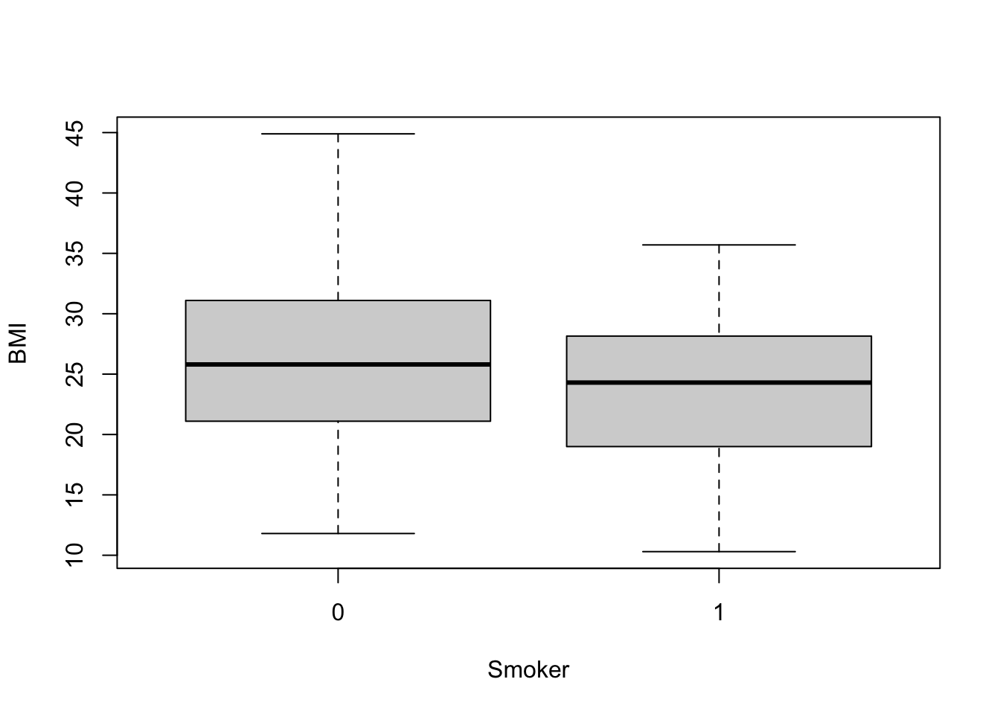
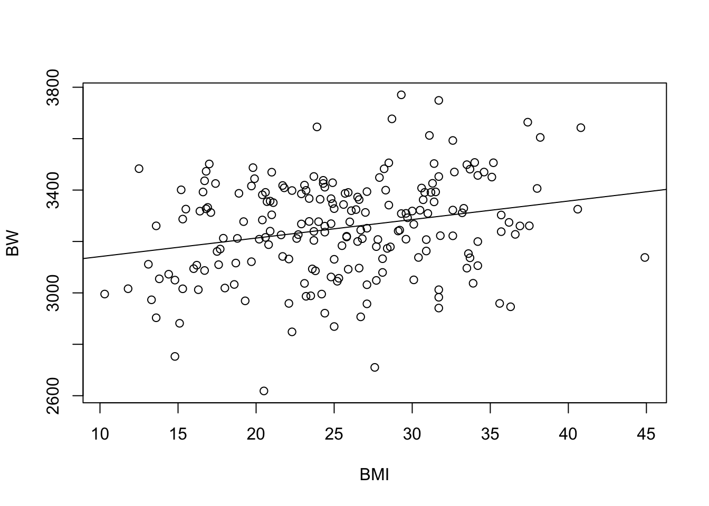

# Finding and Visualizing Data Trend


This training module was developed by Dr. Kyle Roell and Dr. Julia E. Rager

Fall 2021


## Introduction to Training Module
This training module provides a brief introduction to some of the most commonly implemented statistics and associated visualizations used in exposure science, toxicology, and environmental health studies. This module first uploads an example dataset that is similar to the data used in the previous data organization training module, though includes some expanded subject information data to allow for more example statistical tests. Then, methods to evaluate data normality are presented, including visualization-based approaches using histograms and Q-Q plots as well as statistical-based approaches. Basic statistical tests are then presented, including the t-test, analysis of variance, regression modeling, chi-squared test, and Fischer’s exact test. These statistical tests are very simple, with more extensive examples and associated descriptions of statistical models in the proceeding applications-based training modules.
<br>

### Script Preparations

#### Cleaning the global environment

```r
rm(list=ls())
```
<br>

#### Installing required R packages
If you already have these packages installed, you can skip this step, or you can run the below code which checks installation status for you

```r
if (!requireNamespace("tidyverse"))
  install.packages("tidyverse");
```
<br>

#### Loading R packages required for this session

```r
library(tidyverse) #all tidyverse packages, including dplyr and ggplot2
```
<br>

#### Set your working directory

```r
setwd("/filepath to where your input files are")
```
<br>


#### Importing example datasets

Then let's read in our example dataset. Note that these data are similar to those used in the previous training module on data organization, except that demographic and chemical measurement data were previously merged, and a few additional columns of subject information/demographics were added to serve as more thorough examples of data for use in this training module.

```r
full.data <- read.csv("Module1_3/Module1_3_FullDemoChemData.csv")
```
<br>


#### Viewing example datasets
Let's see what this dataset looks like:

```r
dim(full.data)
```

```
## [1] 200  15
```
This dataset includes 200 rows x 15 columns
<br>

Let's view the top of the first 9 columns of data in this dataframe:

```r
full.data[1:10,1:9]
```

```
##    ID  BMI      BMIcat     MAge MEdu       BW GA Smoker Smoker3
## 1   1 27.7  Overweight 22.99928    3 3180.058 34      0   Never
## 2   2 26.8  Overweight 30.05142    3 3210.823 43      1   Never
## 3   3 33.2  Overweight 28.04660    3 3311.551 40      0   Never
## 4   4 30.1  Overweight 34.81796    3 3266.844 32      1   Never
## 5   5 37.4  Overweight 42.68440    3 3664.088 35      0   Never
## 6   6 33.3  Overweight 24.94960    3 3328.988 40      0   Never
## 7   7 24.8  Overweight 29.54798    3 3061.949 30      0   Never
## 8   8 16.9 Underweight 24.94954    3 3332.539 38      0 Current
## 9   9 36.9  Overweight 33.58589    3 3260.482 39      0   Never
## 10 10 21.7      Normal 39.29018    3 3141.723 35      0 Current
```
These represent the subject information/demographic data, which include the following columns:
  
+ ID (subject number)
+ BMI (body mass index)
+ BMIcat (BMI <= 18.5 binned as "Underweight"; 18.5 < BMI <= 24.5 binned as "Normal"; BMI > 24.5 binned as "Overweight")
+ MAge (maternal age, years)
+ MEdu (maternal education, 1= "less than high school"; 2= "high school or some college"; 3= "college or greater")
+ BW (body weight, grams)
+ GA (gestational age, week)
+ Smoker (0= non-smoker; 1=smoker)
+ Smoker3 ("Never", "Former", or "Current" smoking status)

<br>

Let's now view the remaining columns (columns 10-15) in this dataframe:

```r
full.data[1:10,10:15]
```

```
##        DWAs     DWCd     DWCr       UAs       UCd      UCr
## 1  6.426464 1.292941 51.67987 10.192695 0.7537104 42.60187
## 2  7.832384 1.798535 50.10409 11.815088 0.9789506 41.30757
## 3  7.516569 1.288461 48.74001 10.079057 0.1903262 36.47716
## 4  5.906656 2.075259 50.92745  8.719123 0.9364825 42.47987
## 5  7.181873 2.762643 55.16882  9.436559 1.4977829 47.78528
## 6  9.723429 3.054057 51.14812 11.589403 1.6645837 38.26386
## 7  6.268547 1.218410 52.08578  8.887948 0.6347667 39.45535
## 8  6.718448 1.414975 54.96740  9.304968 0.6658849 45.09987
## 9  9.074928 2.727755 55.72826 10.818153 1.6585757 42.58577
## 10 5.771691 2.410993 47.06552  8.747217 1.7354305 34.80661
```

These columns represent the environmental exposure measures, including:
  
+ DWAs (drinking water arsenic levels in µg/L)
+ DWCd (drinking water cadmium levels in µg/L)
+ DWCr (drinking water chromium levels in µg/L)
+ UAs (urinary arsenic levels in µg/L)
+ UCd (urinary cadmium levels in µg/L)
+ UCr (urinary chromium levels in µg/L)


Now that the script is prepared and the data are uploaded, we can start running some basic statistical tests and visualizations of data trends.
<br> <br>

## Basic Statistical Tests and Visualizations of Data Trends
<br>

### Visualize and Test Data for Normality 

When selecting the appropriate statistical tests to evaluate potential trends in your data, statistical test selection often relies upon whether or not the underlying data are normally distributed. Many statistical tests and methods that are commonly implemented in exposure science, toxicology, and environmental health research rely on assumptions of normality. Thus, one of the most common statistic tests to perform at the beginning of an analysis is a **test for normality**.

There are a few ways to evaluate the normality of a dataset:

*First*, you can visually gage whether a dataset appears to be normally distributed through plots. For example, plotting data using histograms, densities, or Q-Q plots can graphically help inform if a variable's values appear to be normally distributed or not.

*Second*, you can evaluate normality using statistical tests, such as the **Kolmogorov-Smirnov (K-S) test** and **Shapiro-Wilk test**. When using these tests and interpreting their results, it is important to remember that the null hypothesis is that the sample distribution is normal, and a significant p-value means the distribution is non-normal.

<br>

Let's start with the first approach, based on data visualizations. Here, let's begin with a [histogram](https://en.wikipedia.org/wiki/Histogram) to view the distribution of BMI data, as an example.


```r
hist(full.data$BMI)
```


We can edit some of the parameters to improve this basic histogram visualization. For example, we can decrease the size of each bin using breaks parameter:

```r
hist(full.data$BMI, breaks=20)
```


Let's also view the [Q–Q (quantile-quantile) plot](https://en.wikipedia.org/wiki/Q%E2%80%93Q_plot) using the qqnorm function 

```r
qqnorm(full.data$BMI)
qqline(full.data$BMI) # adding a reference line for theoretically normally distributed data
```


From these visualizations, the BMI variable appears to be normally distributed, with data centered in the middle and spreading with a distribution on both the lower and upper sides that follow typical normal data distributions.

<br>

Let's now implement the second approach, based on statistical tests for normality. Here, let's use the [Shapiro-Wilk test](https://en.wikipedia.org/wiki/Shapiro%E2%80%93Wilk_test) as an example, again looking at the BMI data. This test can be carried out simply using the shapiro.test function from the base R stats package.

```r
shapiro.test(full.data$BMI)
```

```
## 
## 	Shapiro-Wilk normality test
## 
## data:  full.data$BMI
## W = 0.99232, p-value = 0.3773
```
This test resulted in a p-value of 0.9014, so cannot reject the null hypothesis (that data are normally distributed). This means that we can assume that these data are normally distributed.

<br> <br>

### Two-Group Visualizations and Statistical Comparisons using	the T-Test
T-tests are commonly used to test for a significant difference between the means of two groups. In this example, we will be comparing BMI measures between two groups: smokers vs. non-smokers. We will specifically be implementing a two sample t-test (or independent samples t-test).

Let's first visualize the BMI data across these two groups using boxplots, for this example:

```r
boxplot(data=full.data, BMI ~ Smoker)
```


From this plot, it looks like non-smokers (labeled 0) *may* have significantly higher BMI than smokers (labeled 1), though we need statistical evaluation of these data to more thoroughly evaluate this potential data trend.

It is easy to peform a t-test on these data using the t.test function from the base R stats package:

```r
t.test(data=full.data, BMI ~ Smoker)
```

```
## 
## 	Welch Two Sample t-test
## 
## data:  BMI by Smoker
## t = 2.5372, df = 80.362, p-value = 0.01311
## alternative hypothesis: true difference in means is not equal to 0
## 95 percent confidence interval:
##  0.583061 4.823447
## sample estimates:
## mean in group 0 mean in group 1 
##        26.11176        23.40851
```
From this statistical output, we can see that the overall mean BMI in group 0 (non-smokers) is 26, and the overall mean BMI in group 1 (smokers) is 23. We can also see that the resulting p-value comparison between the means of these two groups is, indeed, significant (p=0.0125), meaning that the means across these groups are significantly different (i.e., are not equal).


It's also helpful to save these results into a variable within the R global environment, which then allows us to access specific output values and extract them more easily for our records. For example, we can run the following to specifically extract the resulting p-value from this test:


```r
ttest.res <- t.test(data=full.data, BMI ~ Smoker) # making a list in the R global environment with the statistical results
ttest.res$p.value # pulling the p-value
```

```
## [1] 0.01310998
```

<br> <br>

### Two-Group Visualizations and Statistical Comparisons using	an ANOVA
Analysis of Variance (ANOVA) is a statistical method that can be used to compare means across more than two groups. 
To demonstrate an ANOVA test on this dataset, let's evaluate BMI distributions across current vs. former vs. never smokers (using the 'Smoker3' variable from our dataset).

Let's again, start by viewing these data distributions using a boxplot:

```r
boxplot(data=full.data, BMI ~ Smoker3)
```


Let's also calculate the group means using tidyverse syntax and the summarise function, as helpful example script:

```r
#Can also get group means
full.data %>% group_by(Smoker3) %>% summarise(mean(BMI))
```

```
## # A tibble: 3 x 2
##   Smoker3 `mean(BMI)`
##   <chr>         <dbl>
## 1 Current        19.1
## 2 Former         26.5
## 3 Never          27.2
```
From this cursory review of the data, it looks like the current smokers likely demonstrate significantly different BMI measures than the former and never smokers, though we need statistical tests to verify this potential trend. We also require statistical tests to evaluate potential differences (or lack of differences) between former and never smokers.

Let's now run the ANOVA to compare BMI between smoking groups, using the aov function to fit an ANOVA model:

```r
aov(data=full.data, BMI ~ Smoker3)
```

```
## Call:
##    aov(formula = BMI ~ Smoker3, data = full.data)
## 
## Terms:
##                  Smoker3 Residuals
## Sum of Squares  2046.713  6817.786
## Deg. of Freedom        2       197
## 
## Residual standard error: 5.882861
## Estimated effects may be unbalanced
```

We can extract the typical ANOVA results table using either summary or anova on the resulting fitted object

```r
anova(aov(data=full.data, BMI ~ Smoker3))
```

```
## Analysis of Variance Table
## 
## Response: BMI
##            Df Sum Sq Mean Sq F value    Pr(>F)    
## Smoker3     2 2046.7 1023.36   29.57 5.888e-12 ***
## Residuals 197 6817.8   34.61                      
## ---
## Signif. codes:  0 '***' 0.001 '**' 0.01 '*' 0.05 '.' 0.1 ' ' 1
```
From this ANOVA output table, we can conclude that the group means across all three groups are not equal.

<br> <br>

## Regression Modeling and Visualization: Linear and Logistic Regressions
Regression modeling aims to find a relationship between a dependent variable (or outcome, response, y) and an independent variable (or predictor, explanatory variable, x). There are many forms of regression analysis, but here we will focus on two: linear regression and logistic regression.

In brief, linear regression is generally used when you have a continuous dependent variable and there is assumed to be some sort of linear relationship between the dependent and independent variables. Conversely, logistic regression is often used when the dependent variable is dichotomous (0 or 1).

Let's first run through an example linear regression model.

<br>

### Linear Regression
For this example, let's evaluate the potential relationship between the subjects' birthweight (BW) and BMI. Here, we will first visualize the data and a run simple correlation analysis to evaluate whether these data are generally correlated. Then, we will run a linear regression to evaluate the relationship between these variables in more detail.

Plotting the variables against one another using the basic 'plot' function to produce a scatterplot:

```r
plot(data=full.data, BW ~ BMI)
```


<br>
<br>

Running a basic collection analyses between these two variables using the 'cor' function:

```r
cor(full.data$BW, full.data$BMI)
```

```
## [1] 0.2485164
```
<br>
The provides a correlation coefficient (R) value of 0.25.
<br>

Let's now use the 'cor.test' function to extract the correlation p-value:

```r
cor.res <- cor.test(full.data$BW, full.data$BMI)
cor.res$p.value
```

```
## [1] 0.0003876464
```

Checking to see that we get the same correlation coefficient (R) using this function:

```r
cor.res$estimate
```

```
##       cor 
## 0.2485164
```
Together, it looks like there may be a relationship between BW and BMI, based on these correlation results, demonstrating a significant p-value of 0.0004.


To test this further, let's run a linear regression analysis using the 'lm' function, using BMI (X) as the independent variable and BW as the dependent variable (Y):

```r
lm.res <- lm(data=full.data, BW ~ BMI)
summary(lm.res) #viewing the results summary
```

```
## 
## Call:
## lm(formula = BW ~ BMI, data = full.data)
## 
## Residuals:
##     Min      1Q  Median      3Q     Max 
## -598.39 -116.72    8.11  136.54  490.11 
## 
## Coefficients:
##             Estimate Std. Error t value Pr(>|t|)    
## (Intercept) 3069.201     52.576   58.38  < 2e-16 ***
## BMI            7.208      1.997    3.61 0.000388 ***
## ---
## Signif. codes:  0 '***' 0.001 '**' 0.01 '*' 0.05 '.' 0.1 ' ' 1
## 
## Residual standard error: 188 on 198 degrees of freedom
## Multiple R-squared:  0.06176,	Adjusted R-squared:  0.05702 
## F-statistic: 13.03 on 1 and 198 DF,  p-value: 0.0003876
```
We can see here that the relationship between BMI and BW is shown to be significant, with a p-value of 0.000411


We can also derive confidence intervals for the BMI estimate using:

```r
confint(lm.res)["BMI",]
```

```
##     2.5 %    97.5 % 
##  3.270873 11.145740
```

Notice that the r-squared (R^2) value in regression output is the squared value of the previously calculated correlation coefficient (R)

```r
sqrt(summary(lm.res)$r.squared)
```

```
## [1] 0.2485164
```

In epidemiological studies, the potential influence of confounders is considered by including important covariates within the final regression model. Here, let's include the covariates of maternal age (MAge) and gestational age (GA) as an example for running a linear regression model with covariates:

```r
summary(lm(data=full.data, BW ~ BMI + MAge + GA))
```

```
## 
## Call:
## lm(formula = BW ~ BMI + MAge + GA, data = full.data)
## 
## Residuals:
##     Min      1Q  Median      3Q     Max 
## -454.04 -111.24    5.79  116.46  488.41 
## 
## Coefficients:
##             Estimate Std. Error t value Pr(>|t|)    
## (Intercept) 2247.995    117.946  19.060  < 2e-16 ***
## BMI            6.237      1.774   3.515 0.000547 ***
## MAge           4.269      1.887   2.263 0.024752 *  
## GA            19.612      2.656   7.385 4.28e-12 ***
## ---
## Signif. codes:  0 '***' 0.001 '**' 0.01 '*' 0.05 '.' 0.1 ' ' 1
## 
## Residual standard error: 165.5 on 196 degrees of freedom
## Multiple R-squared:  0.2805,	Adjusted R-squared:  0.2695 
## F-statistic: 25.47 on 3 and 196 DF,  p-value: 5.884e-14
```
Here, we can see that BMI is still significantly associated with BW, and the included covariates are also shown to be related to BW in this model.

Let's further visualize these regression modeling results by adding a regression line to the original scatterplot:


```r
plot(data=full.data, BW ~ BMI)
abline(lm(data=full.data, BW ~ BMI)) # add a regression line to plot
```



Collectively, these results demonstrate a significantly relationship between BMI and BW, both when modeling with and without covariates.

<br>

### Logistic Regression
To carry out a logistic regression, we need to evaluate one continuous variable (here, we select material education, using MEdu variable) and one dichotomous variable (here, we select smoking status, using the Smoker variable).

When considering these data, we may hypothesize that higher levels of education are negatively associated with smoking status. In other words,
those with higher education are less likely to smoke. Because smoking status is a dichotomous variable, we will use logistic regression to look at this relationship.

Let's first visualize these data using a boxplot for the dichotomous smoker dataset:

```r
boxplot(MEdu ~ Smoker, data=full.data)
```


<br>
With this visualization, it's difficult to tell whether or not there are significant differences in maternal education based on smoking status.
<br>

Let's now run the statistical analysis, using logistic regression modeling:

```r
# use GLM (generalized linear model) and specify the family as binomial
# this tells GLM to run a logistic regression
log.res = glm(Smoker ~ MEdu, family = "binomial", data=full.data)

summary(log.res) # viewing the results
```

```
## 
## Call:
## glm(formula = Smoker ~ MEdu, family = "binomial", data = full.data)
## 
## Deviance Residuals: 
##     Min       1Q   Median       3Q      Max  
## -0.8261  -0.7052  -0.7052  -0.7052   1.7398  
## 
## Coefficients:
##             Estimate Std. Error z value Pr(>|z|)
## (Intercept)  -0.7172     0.6031  -1.189    0.234
## MEdu         -0.1826     0.2305  -0.792    0.428
## 
## (Dispersion parameter for binomial family taken to be 1)
## 
##     Null deviance: 218.10  on 199  degrees of freedom
## Residual deviance: 217.49  on 198  degrees of freedom
## AIC: 221.49
## 
## Number of Fisher Scoring iterations: 4
```


Similar to the regression modeling analysis, we can also derive confidence intervals:

```r
confint(log.res)["MEdu",]
```

```
## Waiting for profiling to be done...
```

```
##      2.5 %     97.5 % 
## -0.6262616  0.2839524
```

Collectively, these results show a non-significant p-value relating maternal education to smoking status. The confidence intervals also overlap across zero. Therefore, these data do not demonstrate a significant association between maternal education and smoking status.

<br> <br>

##	Statistical Evaluations of Categorical Data using the Chi-Squared Test and Fisher's Exact Test
Chi-squared test and Fisher's exact tests are used primarily when evaluating data distributions between two categorical variables. 
The difference between a Chi-squared test and the Fisher's exact test surrounds the specific procedure being run. Basically, the [Chi-squared test](https://en.wikipedia.org/wiki/Chi-squared_test) is an approximation and is run with larger sample sizes to determine whether there is a statistically significant difference between the expected vs. observed frequencies in one or more categories of a contingency table. The [Fisher's exact test](https://en.wikipedia.org/wiki/Fisher%27s_exact_test) is similar, though is an exact measure that can be run on any sample size, including smaller sample sizes. 

For this example, we are interested in evaluating the potential relationship between two categorical variables: smoking status (using the 'Smoker' variable) and categorical BMI group (using the 'BMIcat' variable).

To run these categorical statistical tests, let's first create and view a 2-way contingency table, describing the frequencies of observations across the categorical BMI and smoking groups:

```r
ContingencyTable <- with(full.data, table(BMIcat, Smoker))
ContingencyTable
```

```
##              Smoker
## BMIcat         0  1
##   Normal      43 14
##   Overweight  87 22
##   Underweight 23 11
```

Now let's run the Chi-squared test on this table:

```r
chisq.test(ContingencyTable)
```

```
## 
## 	Pearson's Chi-squared test
## 
## data:  ContingencyTable
## X-squared = 2.1849, df = 2, p-value = 0.3354
```
This results in a p-value = 0.34, demonstrating that there is no significant relationship between BMI categories and smoking status based off this test.

Note that we can also run the Chi-squared test using the following code, without having to generate the contingency table:

```r
chisq.test(full.data$BMI, full.data$Smoker)
```

```
## 
## 	Pearson's Chi-squared test
## 
## data:  full.data$BMI and full.data$Smoker
## X-squared = 143.17, df = 144, p-value = 0.5039
```

Or:

```r
with(full.data, chisq.test(BMI, Smoker))
```

```
## 
## 	Pearson's Chi-squared test
## 
## data:  BMI and Smoker
## X-squared = 143.17, df = 144, p-value = 0.5039
```
Note that these all produce the same results.  


We can also run a Fisher's Exact Test when considering smaller cell sizes.  
We won't run this here due to computing time, but here is some example code for your records:

```r
#With small cell sizes, can use Fisher's Exact Test
#fisher.test(full.data$BMI, full.data$Smoker)
```
<br>

## Concluding Remarks
In conclusion, this training module serves as a high-level introduction to basic statistics and visualization methods. Statistical approaches described in this traiing module include tests for normality, t-test, analysis of variance, regression modeling, chi-squared test, and Fischer’s exact test. Visualization approaches include boxplots, histograms, scatterplots, and regression lines. These methods serve as an important foundation for nearly all studies carried out in environmental health research.
<br>
<br>

