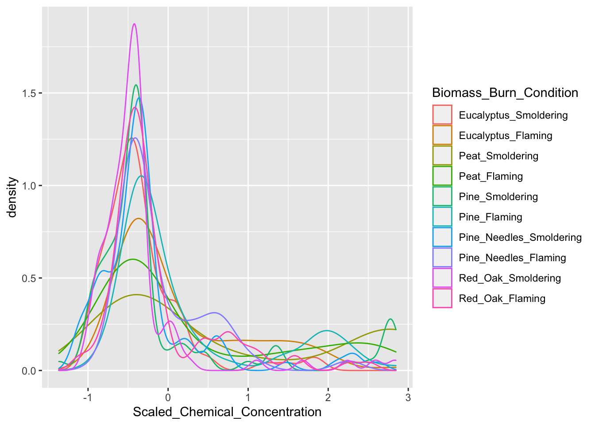
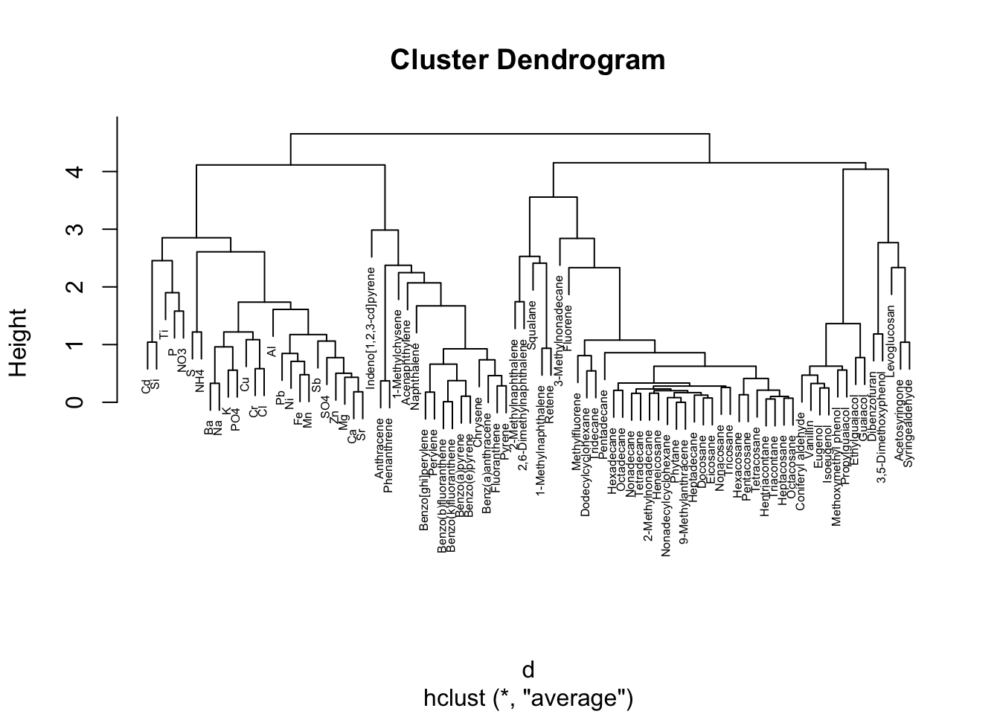
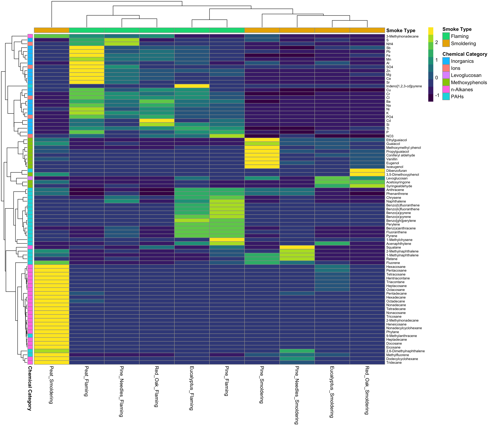
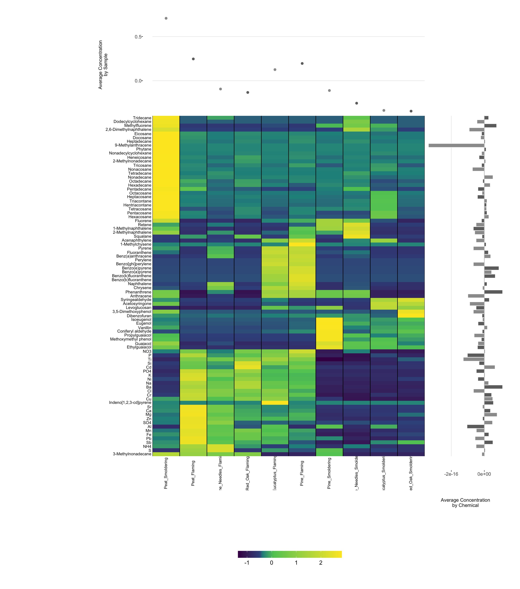

# High-Dimensional Data Visualizations


This training module was developed by Dr. Kyle Roell, Lauren Koval, and Dr. Julia E. Rager

Fall 2021


## Introduction to Training Module
Visualizing data is an important step in data analysis. Often, visualizations allow scientists to better understand trends and 
patterns within the dataset. Even when you have previously analyzed a dataset and have identified certain data trends, it is important to then be able to communicate these findings to a wide variety of target audiences. Visualizations are a vital part of communicating complex data and results to your target audience. 

There are many ways to visualize data, from simple scatter plots to more complicated heatmaps. The previous training module included some example visualization methods while evaluating basic trends in environmental health datasets. Here, we expand upon these methods by highlighting some that can be used to visualize larger, more high-dimensional datasets. This training module specifically reviews the formatting of data in preparation of generating visualizations, scaling datasets, and then guides users through the generation of the following example data visualizations:

+ Density plots
+ GGally plots
+ Boxplots
+ Correlation plots
+ Hierarchical clustering
+ Heatmaps

These visualization approaches are demonstrated using a large environmental chemistry dataset. This example dataset was generated through chemical speciation analysis of smoke samples collected during lab-based simulations of wildfire events. Specifically, different biomass materials (eucalyptus, peat, pine, pine needles, and red oak) were burned under two combustion conditions of flaming and smoldering, resulting in the generation of 12 different smoke samples. These data have been previously published in the following example environmental health research studies, with data made publicly available:

+ Rager JE, Clark J, Eaves LA, Avula V, Niehoff NM, Kim YH, Jaspers I, Gilmour MI. Mixtures modeling identifies chemical inducers versus repressors of toxicity associated with wildfire smoke. Sci Total Environ. 2021 Jun 25;775:145759. doi: 10.1016/j.scitotenv.2021.145759. Epub 2021 Feb 10. PMID: [33611182](https://pubmed.ncbi.nlm.nih.gov/33611182/).

+ Kim YH, Warren SH, Krantz QT, King C, Jaskot R, Preston WT, George BJ, Hays MD, Landis MS, Higuchi M, DeMarini DM, Gilmour MI. Mutagenicity and Lung Toxicity of Smoldering vs. Flaming Emissions from Various Biomass Fuels: Implications for Health Effects from Wildland Fires. Environ Health Perspect. 2018 Jan 24;126(1):017011. doi: 10.1289/EHP2200. PMID: [29373863](https://pubmed.ncbi.nlm.nih.gov/29373863/).


## Script Preparations

#### Cleaning the global environment

```r
rm(list=ls())
```


#### Installing required R packages
If you already have these packages installed, you can skip this step, or you can run the below code which checks installation status for you

```r
if (!requireNamespace("GGally"))
  install.packages("GGally");
if (!requireNamespace("superheat"))
  install.packages("superheat");
if (!requireNamespace("pheatmap"))
  install.packages("pheatmap");
if (!requireNamespace("viridis"))
  install.packages("viridis");
```


#### Loading R packages required for this session

```r
library(ggplot2);
library(GGally);
library(superheat);
library(pheatmap);
library(corrplot);
library(reshape2);
library(viridis);
```


#### Set your working directory

```r
setwd("/filepath to where your input files are")
```


#### Importing example dataset
Then let's read in our example dataset. As mentioned in the introduction, this example dataset represents chemical measurements across 12 different biomass burn scenarios, representing potential wildfire events. Let's upload and view these data:


```r
SmokeData1 <- read.csv("Module1_4/Module1_4_DataforVisualizations.csv"); #load the data
head(SmokeData1) #view the top of the dataset
```

```
##   Chemical.Category           Chemical     CASRN Eucalyptus_Smoldering
## 1         n-Alkanes 2-Methylnonadecane 1560-86-7                  0.06
## 2         n-Alkanes 3-Methylnonadecane 6418-45-7                  0.04
## 3         n-Alkanes           Docosane  629-97-0                  0.21
## 4         n-Alkanes Dodecylcyclohexane 1795-17-1                  0.04
## 5         n-Alkanes           Eicosane  112-95-8                  0.11
## 6         n-Alkanes        Heneicosane  629-94-7                  0.13
##   Eucalyptus_Flaming Peat_Smoldering Peat_Flaming Pine_Smoldering Pine_Flaming
## 1               0.06            1.36         0.06            0.06         0.06
## 2               0.04            1.13         0.90            0.47         0.04
## 3               0.25            9.46         0.57            0.16         0.48
## 4               0.04            0.25         0.04            0.04         0.04
## 5               0.25            7.55         0.54            0.17         0.29
## 6               0.28            6.77         0.34            0.13         0.42
##   Pine_Needles_Smoldering Pine_Needles_Flaming Red_Oak_Smoldering
## 1                    0.06                 0.06               0.06
## 2                    0.04                 0.72               0.04
## 3                    0.32                 0.18               0.16
## 4                    0.12                 0.04               0.04
## 5                    0.28                 0.16               0.15
## 6                    0.30                 0.13               0.13
##   Red_Oak_Flaming     Units
## 1            0.13 ng_per_uL
## 2            0.77 ng_per_uL
## 3            0.36 ng_per_uL
## 4            0.04 ng_per_uL
## 5            0.38 ng_per_uL
## 6            0.69 ng_per_uL
```


### Formatting dataframes for downstream visualization code

For some of the visualizations below (e.g., heat maps) we'll use data from the original full dataframe. The only formatting that needs to be done to this dataframe is to move the chemical names to the row names position of the dataframe:

```r
rownames(SmokeData1) <- SmokeData1$Chemical
head(SmokeData1) #view the top of the reorganized dataset
```

```
##                    Chemical.Category           Chemical     CASRN
## 2-Methylnonadecane         n-Alkanes 2-Methylnonadecane 1560-86-7
## 3-Methylnonadecane         n-Alkanes 3-Methylnonadecane 6418-45-7
## Docosane                   n-Alkanes           Docosane  629-97-0
## Dodecylcyclohexane         n-Alkanes Dodecylcyclohexane 1795-17-1
## Eicosane                   n-Alkanes           Eicosane  112-95-8
## Heneicosane                n-Alkanes        Heneicosane  629-94-7
##                    Eucalyptus_Smoldering Eucalyptus_Flaming Peat_Smoldering
## 2-Methylnonadecane                  0.06               0.06            1.36
## 3-Methylnonadecane                  0.04               0.04            1.13
## Docosane                            0.21               0.25            9.46
## Dodecylcyclohexane                  0.04               0.04            0.25
## Eicosane                            0.11               0.25            7.55
## Heneicosane                         0.13               0.28            6.77
##                    Peat_Flaming Pine_Smoldering Pine_Flaming
## 2-Methylnonadecane         0.06            0.06         0.06
## 3-Methylnonadecane         0.90            0.47         0.04
## Docosane                   0.57            0.16         0.48
## Dodecylcyclohexane         0.04            0.04         0.04
## Eicosane                   0.54            0.17         0.29
## Heneicosane                0.34            0.13         0.42
##                    Pine_Needles_Smoldering Pine_Needles_Flaming
## 2-Methylnonadecane                    0.06                 0.06
## 3-Methylnonadecane                    0.04                 0.72
## Docosane                              0.32                 0.18
## Dodecylcyclohexane                    0.12                 0.04
## Eicosane                              0.28                 0.16
## Heneicosane                           0.30                 0.13
##                    Red_Oak_Smoldering Red_Oak_Flaming     Units
## 2-Methylnonadecane               0.06            0.13 ng_per_uL
## 3-Methylnonadecane               0.04            0.77 ng_per_uL
## Docosane                         0.16            0.36 ng_per_uL
## Dodecylcyclohexane               0.04            0.04 ng_per_uL
## Eicosane                         0.15            0.38 ng_per_uL
## Heneicosane                      0.13            0.69 ng_per_uL
```


For most other visualizations below, we'll need a separate dataframe that just contains the chemical concentration columns (specifically columns 4 through 13 from the above view). Let's create this **separate dataframe** and call it **SmokeData2**.  

First, we'll pull the chemical concentration values from columns 4 through 13. While we pull these values, let's also check that they are recognized as numeric values using the 'apply' function. Here, we run the apply function across columns 4 through 13 (SmokeData[,4:13]) by columns (indicated by the number 2; if we wanted this by rows we would use the number 1), and coerce all values to numeric using the 'as.numeric' function.

```
##      Eucalyptus_Smoldering Eucalyptus_Flaming Peat_Smoldering Peat_Flaming
## [1,]                  0.06               0.06            1.36         0.06
## [2,]                  0.04               0.04            1.13         0.90
## [3,]                  0.21               0.25            9.46         0.57
## [4,]                  0.04               0.04            0.25         0.04
## [5,]                  0.11               0.25            7.55         0.54
## [6,]                  0.13               0.28            6.77         0.34
##      Pine_Smoldering Pine_Flaming Pine_Needles_Smoldering Pine_Needles_Flaming
## [1,]            0.06         0.06                    0.06                 0.06
## [2,]            0.47         0.04                    0.04                 0.72
## [3,]            0.16         0.48                    0.32                 0.18
## [4,]            0.04         0.04                    0.12                 0.04
## [5,]            0.17         0.29                    0.28                 0.16
## [6,]            0.13         0.42                    0.30                 0.13
##      Red_Oak_Smoldering Red_Oak_Flaming
## [1,]               0.06            0.13
## [2,]               0.04            0.77
## [3,]               0.16            0.36
## [4,]               0.04            0.04
## [5,]               0.15            0.38
## [6,]               0.13            0.69
```
For more information on the apply function, see its [RDocumentation](https://www.rdocumentation.org/packages/base/versions/3.6.2/topics/apply) and a helpful [tutorial on the R apply family of functions](https://www.datacamp.com/community/tutorials/r-tutorial-apply-family).

Let's now add back in the chemical identifiers, by grabbing the row names from the original dataframe, SmokeData1.

```
##                    Eucalyptus_Smoldering Eucalyptus_Flaming Peat_Smoldering
## 2-Methylnonadecane                  0.06               0.06            1.36
## 3-Methylnonadecane                  0.04               0.04            1.13
## Docosane                            0.21               0.25            9.46
## Dodecylcyclohexane                  0.04               0.04            0.25
## Eicosane                            0.11               0.25            7.55
## Heneicosane                         0.13               0.28            6.77
##                    Peat_Flaming Pine_Smoldering Pine_Flaming
## 2-Methylnonadecane         0.06            0.06         0.06
## 3-Methylnonadecane         0.90            0.47         0.04
## Docosane                   0.57            0.16         0.48
## Dodecylcyclohexane         0.04            0.04         0.04
## Eicosane                   0.54            0.17         0.29
## Heneicosane                0.34            0.13         0.42
##                    Pine_Needles_Smoldering Pine_Needles_Flaming
## 2-Methylnonadecane                    0.06                 0.06
## 3-Methylnonadecane                    0.04                 0.72
## Docosane                              0.32                 0.18
## Dodecylcyclohexane                    0.12                 0.04
## Eicosane                              0.28                 0.16
## Heneicosane                           0.30                 0.13
##                    Red_Oak_Smoldering Red_Oak_Flaming
## 2-Methylnonadecane               0.06            0.13
## 3-Methylnonadecane               0.04            0.77
## Docosane                         0.16            0.36
## Dodecylcyclohexane               0.04            0.04
## Eicosane                         0.15            0.38
## Heneicosane                      0.13            0.69
```

### Scaling dataframes for downstream data visualizations

A data preparation method that is commonly used to convert values into those that can be used to better illustrate overall data trends is **data scaling**. Scaling can be achieved through data transformations or normalization procedures, depending on the specific dataset and goal of analysis/visualization. Scaling is often carried out using data vectors or columns of a dataframe.

For this example, we will normalize the chemical concentration dataset using a basic scaling and centering procedure using the base R function 'scale'. This algorithm results in the normalization of a dataset using the mean value and standard deviation. This scaling step will convert chemical concentration values in our dataset into normalized values across samples, such that each chemical's concentration distributions are more easily comparable between the different biomass burn conditions.

For more information on the 'scale' function, see its associated [RDocumentation](https://www.rdocumentation.org/packages/base/versions/3.6.2/topics/scale) and helpful tutorial on [Implementing the scale() function in R](https://www.journaldev.com/47818/r-scale-function).
  
Let's make a new dataframe (**ScaledData**) based off scaled values of the data within the SmokeData2 dataframe:

```
##                    Eucalyptus_Smoldering Eucalyptus_Flaming Peat_Smoldering
## 2-Methylnonadecane            -0.3347765         -0.3347765        2.841935
## 3-Methylnonadecane            -0.8794448         -0.8794448        1.649829
##                    Peat_Flaming Pine_Smoldering Pine_Flaming
## 2-Methylnonadecane   -0.3347765      -0.3347765   -0.3347765
## 3-Methylnonadecane    1.1161291       0.1183422   -0.8794448
##                    Pine_Needles_Smoldering Pine_Needles_Flaming
## 2-Methylnonadecane              -0.3347765           -0.3347765
## 3-Methylnonadecane              -0.8794448            0.6984509
##                    Red_Oak_Smoldering Red_Oak_Flaming
## 2-Methylnonadecane         -0.3347765      -0.1637228
## 3-Methylnonadecane         -0.8794448       0.8144726
```
We can see that each chemical is now scaled, centered around 0, with values distributed that are less than zero, and others that are greater than zero, based off a normal distribution.


Let's also create a melted (or long) dataframe and save it as **ScaledData.melt**:

```r
ScaledData.melt <- melt(ScaledData)
colnames(ScaledData.melt) <- c("Chemical", "Biomass_Burn_Condition", "Scaled_Chemical_Concentration") #updating the column names
ScaledData.melt[1:10,]
```

```
##              Chemical Biomass_Burn_Condition Scaled_Chemical_Concentration
## 1  2-Methylnonadecane  Eucalyptus_Smoldering                    -0.3347765
## 2  3-Methylnonadecane  Eucalyptus_Smoldering                    -0.8794448
## 3            Docosane  Eucalyptus_Smoldering                    -0.3465132
## 4  Dodecylcyclohexane  Eucalyptus_Smoldering                    -0.4240624
## 5            Eicosane  Eucalyptus_Smoldering                    -0.3802202
## 6         Heneicosane  Eucalyptus_Smoldering                    -0.3895328
## 7      Hentriacontane  Eucalyptus_Smoldering                     0.1304235
## 8         Heptacosane  Eucalyptus_Smoldering                     0.1291155
## 9         Heptadecane  Eucalyptus_Smoldering                    -0.3759424
## 10         Hexacosane  Eucalyptus_Smoldering                     0.5060578
```

Now we have all the dataframes we need, formatted and ready to go for visualizations!

## High-Dimensional Data Visualizations
Here, we provide some example data visualization approaches that can be used to visualize high-dimensional datasets of relevance to environmental health.


### Density Plot Visualizations

Density plots are an effective way to show overall distributions of data and can be useful to compare across various test conditions or other stratifications of the data under evaluation.

Here, we use ggplot to create density plots, displaying trends in chemical concentrations across the tested biomass burn conditions. We run the ggplot function over the scaled chemistry data to yield the following plot:

```r
ggplot(ScaledData.melt, aes(x=Scaled_Chemical_Concentration, color=Biomass_Burn_Condition)) + geom_density()
```


  
Here are some interesting take-aways from viewing this density plot:
+ In general, there are a high number of chemicals that were measured at relatively lower abundances (hence, the peak in occurrence density occurring towards the left, before 0)
+ The three conditions of smoldering peat, flaming peat, and flaming pine contained the most chemicals at the highest relative concentrations (hence, these lines are the top three lines towards the right)


### GGally Visualizations

GGally is a package that serves as an extension of ggplot2, the baseline R plotting system based on the grammer of graphics. GGalley is very useful for creating plots that compare groups or features within a dataset, among many other utilities. Here we will demonstrate the 'ggpairs' function within GGally using the scaled chemistry datasets. This function will produce an image that shows correlation values between biomass burn sample pairs, and also illustrates the overall distributions of values in samples.


```r
#Using ggpairs to visualize data; note that we need to supply the data specifically as a dataframe (hence the 'data.frame' function)
ggpairs(data.frame(ScaledData))
```


For more information on GGally see its associated [RDocumentation](https://www.rdocumentation.org/packages/GGally/versions/1.5.0) and [example helpful tutorial](http://www.sthda.com/english/wiki/ggally-r-package-extension-to-ggplot2-for-correlation-matrix-and-survival-plots-r-software-and-data-visualization).


### Boxplot Visualizations

As demonstrated in the previous module on identifying and visualizing data trends, boxplots have utility towards visualizing potential differences between data categories or groupings. Boxplots are very easy to make and still provide informative visualizations for between group comparisons.

Here, we will generate an example boxplot visualization using ggplot


```r
ggplot(ScaledData.melt, aes(x=Scaled_Chemical_Concentration, color=Biomass_Burn_Condition)) + geom_boxplot()
```


### Correlation Plot Visualizations

Correlation plots are used to display correlations among variables in a dataset. There are many approaches that can be used to generate correlation plot visualizations. Here, we demonstrate two different approaches:

First, we demonstrate further utility of the GGally package towards the generation of correlation plots through the 'ggcorr' function:


```r
#Note that we need to supply the data specifically as a dataframe (hence the 'data.frame' function)
ggcorr(data.frame(ScaledData), size = 2)
```


Second, we demonstrate a different function to produce correlation plot visualizations; namely, the 'corrplot' function. For the function 'corrplot' to work, it needs to be supplied a correlation matrix as the input data, which is demonstrated below.

Example using the 'corrplot' function to visualize statistical correlations between biomass burn conditions:

```r
#Need to supply corrplot with a correlation matrix, here, using the 'cor' function
corrplot(cor(SmokeData2))
```


Example using the 'corrplot' function to visualize statistical correlations between measured chemicals:

```r
corrplot(cor(t(SmokeData2)),
         tl.cex = .4, #Change size of text
         tl.col = 'black'); #Change font color to black
```


### Hierarchical Clustering Visualizations

Hierarchical clustering is a common method used to cluster high dimensional data. In this clustering approach, data are typically grouped using a dendrogram which shows how similar groups of variables are to one another. There are various methods for hierarchical clustering of data. Here, we use the 'hclust' function from the base R programming. For this function to work, it requires a distance matrix as input, which summarizes how similar variables are in a dataset based on distance calculation methods.

Here, we demonstrate these steps by first calculating a distance matrix from the scaled chemistry dataset using the 'dist' function, and then using this as input towards the hierarchical clustering function, 'hclust'. Finally, the resulting clustering dendograms are visualized using a basic 'plot' function.

```r
#First calculate our distance matrix using a simple euclidance distance measure
d <- dist(ScaledData, method = "euclidean")

#Hierarchical clustering using average linkage method
hc1 <- hclust(d, method = "average" )

#Plot the obtained dendrogram
plot(hc1, 
     cex = 0.5); #cex sets text size
```


  
Here, this dendogram shows how chemicals cluster together based on relative concentrations. We can see, for example, that inorganic and ionic constituents tend to group together based on relative concentrations on the left of this dendogram. Other interesting patterns are notable, including the group of polycyclic aromatic hydrocarbons (PAHs) in the middle (e.g., benzo(a)pyrene, benzo(e)pyrene, etc).


### Heatmap Visualizations

Heatmaps are a highly effective method of viewing an entire dataset (or large subset) at once. Heat maps can appear similar to correlation plots, but typically illustrate other values (e.g., concentrations, expression levels, presence/absence, etc) besides correlation R values.

When generating heat maps, scaled values can be used to better distinguish patterns between groups/samples. You can additionally add dendrograms to the outsides of the heatmap plot, similar to what we produced in the previous example.

Here, we will be demonstrating the use of multiple heatmap functions:

1. First, the classic 'heatmap' function in base R can be used to create a simple heatmap with dendrogram. This is useful for just a quick look at the data.
  
2. Second, we will use 'pheatmap' from the pheatmap package. One advantage to using this package is that you can easily add colored labels to both the rows and columns of the heatmap if you have numerous groups. This can help to additionally visualize differences across various groups.

3. Third, we will use the 'superheat' package. This package is useful if you want to generate additional plots and figures on the side or top of the heatmap, such as boxplots of groups, distributions, etc.

<br>
Let's start with the first method, using the class 'heatmap' function:

```r
heatmap(ScaledData)
```


<br>
For more information on the 'heatmap' package, see its associated [RDocumentation](https://www.rdocumentation.org/packages/stats/versions/3.6.2/topics/heatmap) and [helpful example tutorial website](https://www.r-graph-gallery.com/heatmap).

<br><br>

Here is an example using the 'pheatmap' function from the pheatmap package:

```r
#Using pheatmap
#First let's create the row side and tops ide color matrices

#Colors to be used for the row side (chemical categories)
side.colors <- data.frame(SmokeData1$Chemical.Category);
rownames(side.colors) <- SmokeData1$Chemical;
colnames(side.colors) <- "Chemical Category";

#Categories to be used for the top side (bio-conditions)
top.colors <- data.frame(rep(c("Smoldering", "Flaming"),5));
rownames(top.colors) <- colnames(SmokeData2);
colnames(top.colors) <- "Smoke Type";
  
#Finally plot the dataset
pheatmap(ScaledData, 
         scale = "none", #we already scaled our data, can use "row" or "column" also
         show_rownames = T, show_colnames = T, #to display rownames and column names 
         annotation_row = side.colors, annotation_col = top.colors, #data that contains the groupings we created
         color = viridis(10), #set the color, using viridis package for color pallete
         cluster_rows = T, cluster_cols = T, #cluster both rows and columns
         fontsize_row = 7); #set fontsize for the rows
```


<br>
For more information on the 'pheatmap' package, see its associated [RDocumentation](https://www.rdocumentation.org/packages/pheatmap/versions/1.0.12/topics/pheatmap) and [helpful example tutorial](https://towardsdatascience.com/pheatmap-draws-pretty-heatmaps-483dab9a3cc).

<br><br>

Lastly, here is an example using the 'superheat' package:

```r
#Using superheat
superheat(data.frame(ScaledData), 
          scale = F, #Set to false, if set to true, will center and scale columns
          pretty.order.rows  = T, #Use hierarchical clustering on rows
          pretty.order.cols = T, #Use hierarchical clustering on columns
         
          yr = rowMeans(ScaledData), #Create row side plot of means
          yr.axis.name = "Average Concentration\nby Chemical", #Name of plot
          yr.plot.type = "bar", #type of plot
          
          yt = colMeans(ScaledData),#Create top side plot of means
          yt.axis.name = "Average Concentration\nby Sample", #Name of plot
          yt.plot.type = "scatter", #type of plot
          
          left.label.text.size = 3, #set label size on rows
          left.label.col = "white", #set color of row label

          bottom.label.text.size = 3, #set label size on columns
          bottom.label.text.angle = 90, #set angle of bottom labels to be vertical
          bottom.label.size = 0, #get rid of extra space between legend and bottom labels
          bottom.label.col = "white" #set color of bottom label
)
```



<br>
For more information on the 'superheat' package, see its associated [RDocumentation](https://www.rdocumentation.org/packages/superheat/versions/0.1.0/topics/superheat) and [helpful example tutorial](https://rlbarter.github.io/superheat/).
  
Additional examples, packages, and approaches that can be used to generate heat maps are available in abundance through online resources, including this [helpful example heatmap tutorial website](https://www.r-graph-gallery.com/heatmap).

<br><br>

## Concluding Remarks
In conclusion, this training module serves as a high-level introduction to high-dimensional data visualizations. Approaches described in this training module include data formatting, data scaling, and the visualization of prepared datasets through the following methods: density plots, GGally plots, boxplots, correlation plots, hierarchical clustering, and heatmaps. Visualizations are generated using a dataset containing chemical concentrations measured in different biomass burn scenarios, representing different wildfire events, serving as an example dataset relevant to environmental health research. These visualization methods serve as an important foundation for many environmental health research studies.
<br> <br>


