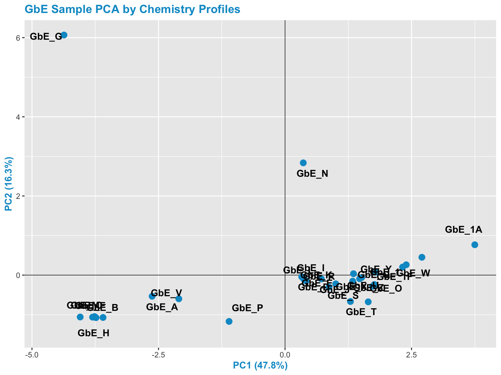
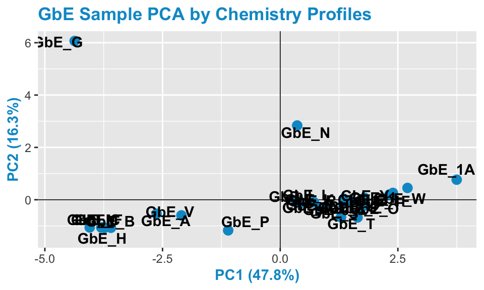
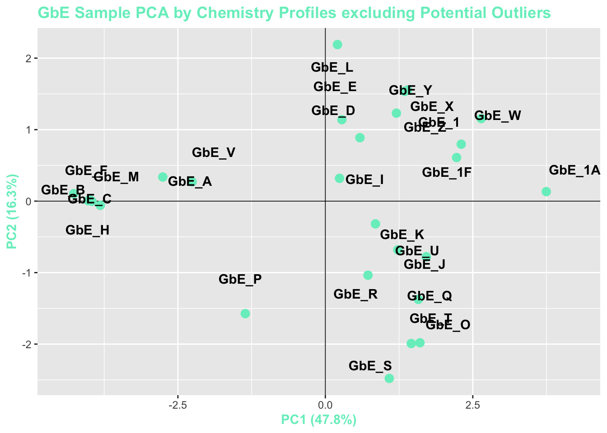
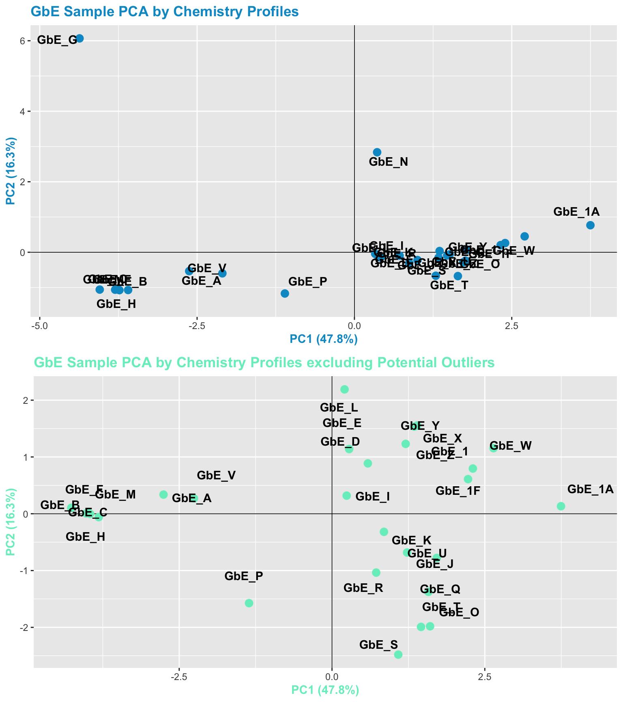
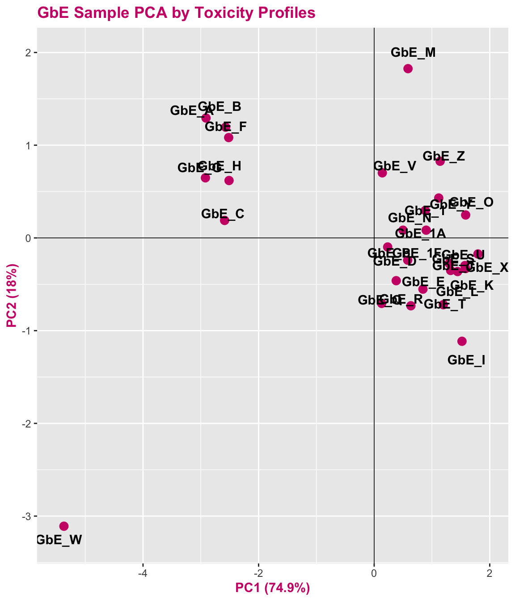
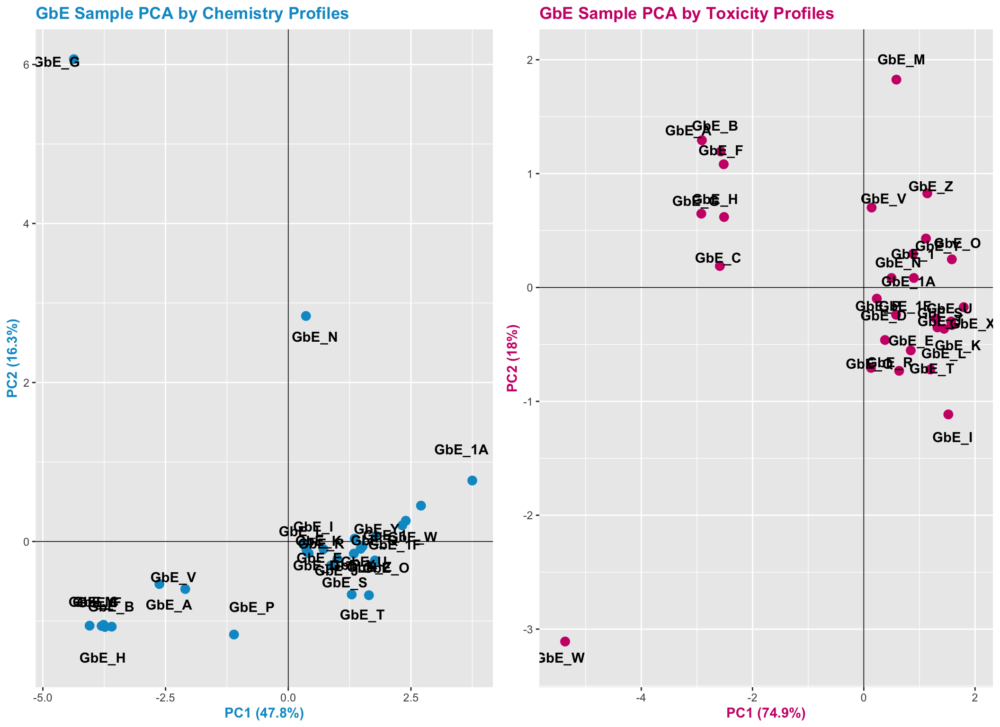
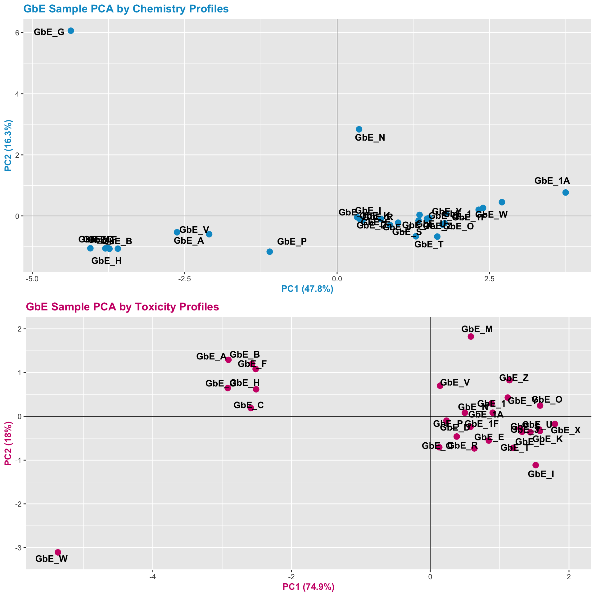

# Mixtures Analysis


This training module was developed by Dr. Cynthia Rider, with contributions from Lauren Koval and Dr. Julia E. Rager.

Fall 2021


## Background on Training Module

### Introduction to Mixtures Toxicology and *In Silico* Modeling to Address Mixtures
Humans are rarely, if ever, exposed to single chemicals at a time. Instead, humans are often exposed to multiple stressors in their everyday environments in the form of mixtures. These stressors can include environmental chemicals and pharmaceuticals, and they can also include other types of stressors such as socioeconomic factors and other attributes that can place individuals at increased risk of acquiring disease. Because it is not possible to test every possible combination of exposure that an individual might experience in their lifetime, approaches that take into account variable and complex exposure conditions through mixtures modeling are needed.

Some helpful resources that provide further background on the topic of mixtures toxicology and mixtures modeling include the following:

+ Carlin DJ, Rider CV, Woychik R, Birnbaum LS. Unraveling the health effects of environmental mixtures: an NIEHS priority. Environ Health Perspect. 2013 Jan;121(1):A6-8. PMID: [23409283](https://pubmed.ncbi.nlm.nih.gov/23409283/).

+ Drakvik E, Altenburger R, Aoki Y, Backhaus T, Bahadori T, Barouki R, Brack W, Cronin MTD, Demeneix B, Hougaard Bennekou S, van Klaveren J, Kneuer C, Kolossa-Gehring M, Lebret E, Posthuma L, Reiber L, Rider C, Rüegg J, Testa G, van der Burg B, van der Voet H, Warhurst AM, van de Water B, Yamazaki K, Öberg M, Bergman Å. Statement on advancing the assessment of chemical mixtures and their risks for human health and the environment. Environ Int. 2020 Jan;134:105267. PMID: [31704565](https://pubmed.ncbi.nlm.nih.gov/31704565/).

+ Rider CV, McHale CM, Webster TF, Lowe L, Goodson WH 3rd, La Merrill MA, Rice G, Zeise L, Zhang L, Smith MT. Using the Key Characteristics of Carcinogens to Develop Research on Chemical Mixtures and Cancer. Environ Health Perspect. 2021 Mar;129(3):35003. PMID: [33784186](https://pubmed.ncbi.nlm.nih.gov/33784186/).


+ Taylor KW, Joubert BR, Braun JM, Dilworth C, Gennings C, Hauser R, Heindel JJ, Rider CV, Webster TF, Carlin DJ. Statistical Approaches for Assessing Health Effects of Environmental Chemical Mixtures in Epidemiology: Lessons from an Innovative Workshop. Environ Health Perspect. 2016 Dec 1;124(12):A227-A229. PMID: [27905274](https://pubmed.ncbi.nlm.nih.gov/27905274/).


**Computational Approaches to Address Mixtures**  
There are different computational approaches that can be implemented to address this research topic. This training module focuses on a method called **Sufficient Similarity** to determine which groups of exposure conditions are chemically/biologically similar enough to be regulated for safety together, based on the same set of regulatory criteria. Computational approaches that can be used for exposure groupings include principal component analysis and clustering, to elucidate patterns among high-dimensional data. More example publications that have used this approach to address environmental health questions are detailed at the bottom of this training module.

Another approach that is commonly used when evaluating mixtures is called **Relative Potency Factors**. This is also known as a component-based approach. Component-based approaches use data from individual chemicals (components of the mixture) and additivity models to estimate the effects of the mixture.  

There are many methods that can be leveraged to also elucidate relationships between individual chemicals/chemical groups in complex mixtures and their resulting toxicity/health effects. As an example, we recently published an environmentally relevant example that implemented **quantile g-computation** statistics to identify chemicals present in wildfire smoke emissions that impact toxicity. This example study was published in the following:

+ Rager JE, Clark J, Eaves LA, Avula V, Niehoff NM, Kim YH, Jaspers I, Gilmour MI. Mixtures modeling identifies chemical inducers versus repressors of toxicity associated with wildfire smoke. Sci Total Environ. 2021 Jun 25;775:145759. PMID: [33611182](https://pubmed.ncbi.nlm.nih.gov/33611182/).


## Introduction to Training Module
This module serves as an example mixtures analysis characterizing the nutritional supplement, *Ginkgo biloba*.

*Ginkgo biloba* represents a popular type of botanical supplement currently on the market. People take *Ginkgo biloba* to improve brain function, but there is conflicting data on its efficacy. Like other botanicals, *Ginkgo biloba* is a complex mixture with 100s-1000s of constituents. Here, the variability in chemical and toxicological profiles across samples of *Ginkgo biloba* purchased from different commercial sources is evaluated. We can use data from a well-characterized sample (reference sample) to evaluate the safety of other samples that are ‘sufficiently similar’ to the reference sample. Samples that are different (i.e., do not meet the standards of sufficient similarity) from the reference sample would require additional safety data.

A total of 29 *Ginkgo biloba* extract samples were analyzed. These samples are abbreviated as “GbE_” followed by a unique sample identifier (GbE = *Ginkgo biloba* Extract). These data have been previously published:

+ Catlin NR, Collins BJ, Auerbach SS, Ferguson SS, Harnly JM, Gennings C, Waidyanatha S, Rice GE, Smith-Roe SL, Witt KL, Rider CV. How similar is similar enough? A sufficient similarity case study with Ginkgo biloba extract. Food Chem Toxicol. 2018 Aug;118:328-339. PMID: [29752982](https://pubmed.ncbi.nlm.nih.gov/29752982/).

+ Collins BJ, Kerns SP, Aillon K, Mueller G, Rider CV, DeRose EF, London RE, Harnly JM, Waidyanatha S. Comparison of phytochemical composition of Ginkgo biloba extracts using a combination of non-targeted and targeted analytical approaches. Anal Bioanal Chem. 2020 Oct;412(25):6789-6809. PMID: [32865633](https://pubmed.ncbi.nlm.nih.gov/32865633/).


#### *Ginkgo biloba* chemistry dataset background
The chemical profiles of these sample extracts were first analyzed using targeted mass spectrometry-based approaches. The concentrations of 12 *Ginkgo biloba* marker compounds were measured in units of mean weight as a ratio [g chemical / g sample]. Note that in this dataset, non-detects have been replaced with values of zero for simplicity; though there are more advanced methods to impute values for non-detects. Script is provided to evaluate how *Ginkgo biloba* extracts group together, based on chemical profiles.

#### *Ginkgo biloba* toxicity dataset background
The toxicological profiles of these samples were also analyzed using *in vitro* test methods. These data represent area under the curve (AUC) values indicating changes in gene expression across various concentrations of the *Ginkgo biloba* extract samples. Positive AUC values indicate a gene that was collectively increased in expression as concentration increased, and a negative AUC value indicates a gene that was collectively decreased in expression as exposure concentration increased. Script is provided to evaluate how *Ginkgo biloba* extracts group together, based on toxicity profiles.


## Training Module's **Environmental Health Questions**
This training module was specifically developed to answer the following environmental health questions:

(1) Based on the chemical analysis, which *Ginkgo biloba* extract looks the most different?
(2) When viewing the variability between chemical profiles, how many groupings of potentially ‘sufficiently similar’ *Ginkgo biloba* samples do you see?
(3) Based on the chemical analysis, which chemicals do you think are important in differentiating between the different *Ginkgo biloba* samples?
(4) After removing two samples that have the most different chemical profiles (and are thus, potential outliers), do we obtain similar chemical groupings?
(5) When viewing the variability between toxicity profiles, how many groupings of potentially ‘sufficiently similar’ *Ginkgo biloba* samples do you see?
(6) Based on the toxicity analysis, which genes do you think are important in differentiating between the different *Ginkgo biloba* samples?
(7) Were similar chemical groups identified when looking at just the chemistry vs. just the toxicity? How could this impact regulatory decisions, if we only had one of these datasets?


## Script Preparations

#### Cleaning the global environment

```r
rm(list=ls())
```

#### Installing required R packages
If you already have these packages installed, you can skip this step, or you can run the below code which checks installation status for you

```r
if (!requireNamespace("tidyverse"))
  install.packages("tidyverse");

if (!requireNamespace("readxl"))
  install.packages("readxl");

if (!requireNamespace("factoextra"))
  install.packages("factoextra");

if (!requireNamespace("pheatmap"))
  install.packages("pheatmap");

if (!requireNamespace("gridExtra"))
  install.packages("gridExtra");

if (!requireNamespace("ggplotify"))
  install.packages("ggplotify")
```


#### Loading R packages required for this session

```r
library(readxl) #used to read in and work with excel files
library(factoextra) #used to run and visualize multivariate analyses, here PCA
library(pheatmap) #used to make heatmaps. This can be done in ggplot2 but pheatmap is easier and nicer
library(gridExtra) #used to arrange and visualize multiple figures at once
library(ggplotify) #used to make non ggplot figures (like a pheatmap) gg compatible
library(tidyverse) #all tidyverse packages, including dplyr and ggplot2
```


#### Set your working directory

```r
setwd("/filepath to where your input files are")
```


## Loading the Example *Ginkgo biloba* Datasets

We need to first read in the chemistry and toxicity data from the provided excel file. Here, data were originally organized such that the actual observations start on row 2 (dataset descriptions were in the first row). So let's implement skip=1, which skips reading in the first row.

```r
chem <- read_xlsx("Module2_3/Module2_3_SufficientSimilarity_Data.xlsx" , sheet = "chemistry data", skip=1) # loads the chemistry data tab
tox  <- read_xlsx("Module2_3/Module2_3_SufficientSimilarity_Data.xlsx" , sheet = "in vitro data", skip=1) # loads the toxicity data tab
```


## Data Viewing

#### Let's first see how many rows and columns of data are present in both datasets

```r
dim(chem)
```

```
## [1] 29 13
```
The chemistry dataset contains information on 29 samples (rows); and 1 sample identifier + 12 chemicals (total of 13 columns)


```r
dim(tox)
```

```
## [1] 29  6
```
The tox dataset contains information on 29 samples (rows); and 1 sample identifier + 5 genes (total of 6 columns)


### Let's also see what kind of data are organized within the datasets

```r
colnames(chem)
```

```
##  [1] "Sample"             "Bilobalide"         "Ginkgolide_A"      
##  [4] "Ginkgolide_B"       "Ginkgolide_C"       "Ginkgolide_J"      
##  [7] "Rutin"              "Quercetin"          "Kaempferol"        
## [10] "Isorhamnetin"       "Ginkgolic_Acid_C15" "Ginkgolic_Acid_C17"
## [13] "Ginkgotoxin"
```


```r
head(chem)
```

```
## # A tibble: 6 x 13
##   Sample Bilobalide Ginkgolide_A Ginkgolide_B Ginkgolide_C Ginkgolide_J Rutin
##   <chr>       <dbl>        <dbl>        <dbl>        <dbl>        <dbl> <dbl>
## 1 GbE_A        1.28         0            0            0            1.77  0   
## 2 GbE_B        0            0            0            0            0     0.05
## 3 GbE_C        0            0            0            0            0     0.01
## 4 GbE_D        1.28         2.6          1.6          2.79         1.18  1.11
## 5 GbE_E        1.5          2.13         1.46         2.6          1.21  1.21
## 6 GbE_F        0            0            0            0            0     0.04
## # … with 6 more variables: Quercetin <dbl>, Kaempferol <dbl>,
## #   Isorhamnetin <dbl>, Ginkgolic_Acid_C15 <dbl>, Ginkgolic_Acid_C17 <dbl>,
## #   Ginkgotoxin <dbl>
```


```r
colnames(tox)
```

```
## [1] "Sample" "ABCB11" "CYP1A2" "CYP2B6" "CYP3A4" "HMGCS2"
```


```r
head(tox)
```

```
## # A tibble: 6 x 6
##   Sample  ABCB11 CYP1A2 CYP2B6 CYP3A4  HMGCS2
##   <chr>    <dbl>  <dbl>  <dbl>  <dbl>   <dbl>
## 1 GbE_A  -0.450   0.778  0.124 -1.39  -0.0208
## 2 GbE_B  -0.210   0.902  0.456 -1.22  -0.149 
## 3 GbE_C  -1.10    1.32   1.58  -1.62   0.195 
## 4 GbE_D  -0.818   1.61   2.46   0.935 -1.62  
## 5 GbE_E  -0.963   2.27   2.44   1.33  -1.54  
## 6 GbE_F  -0.0828  1.2    0.587 -1.29  -0.147
```


## Chemistry-based Sufficient Similarity Analysis
The first method employed in this Sufficient Similarity analysis is Principal Component Analysis (PCA). PCA is a very common dimensionality reduction technique, as detailed in the 'Machine Learning and Predictive Modeling' training module.

In summary, PCA finds dimensions (eigenvectors) in the higher dimensional original data that capture as much of the variation as possible, which you can then plot. This allows you to project higher dimensional data, in this case 12 dimensions (representing 12 measured chemicals), in fewer dimensions (we'll use 2). These dimensions, or components, capture the "essence" of the original dataset.

Before we can run PCA on this chemistry dataset, we first need to scale the data across samples.
We do this here for the chemistry dataset, because we specifically want to evaluate and potentially highlight/emphasize chemicals that may be at relatively low abundance. These low-abundance chemicals may actually be contaminants that drive toxicological effects.

#### Let's first re-save the original chemistry dataset to compare off of

```r
chem_original <- chem
```

#### And make a scaled version to carry forward in this analysis
#### Here, we move the sample column the row names then scale and center data

```r
chem <- chem %>% column_to_rownames("Sample")
chem <- as.data.frame(scale(as.matrix(chem)))
```

#### Let's now compare one of the rows of data (here, sample GbE_E) to see what scaling did:

```r
chem_original[5,]
```

```
## # A tibble: 1 x 13
##   Sample Bilobalide Ginkgolide_A Ginkgolide_B Ginkgolide_C Ginkgolide_J Rutin
##   <chr>       <dbl>        <dbl>        <dbl>        <dbl>        <dbl> <dbl>
## 1 GbE_E         1.5         2.13         1.46          2.6         1.21  1.21
## # … with 6 more variables: Quercetin <dbl>, Kaempferol <dbl>,
## #   Isorhamnetin <dbl>, Ginkgolic_Acid_C15 <dbl>, Ginkgolic_Acid_C17 <dbl>,
## #   Ginkgotoxin <dbl>
```

```r
chem[5,]
```

```
##       Bilobalide Ginkgolide_A Ginkgolide_B Ginkgolide_C Ginkgolide_J     Rutin
## GbE_E -0.4996768   0.02749315    0.2559249      1.36305    0.3842836 0.5758008
##       Quercetin Kaempferol Isorhamnetin Ginkgolic_Acid_C15 Ginkgolic_Acid_C17
## GbE_E 0.2059607 -0.2420023     -0.61695         -0.2737699         -0.2317415
##       Ginkgotoxin
## GbE_E  -0.8114437
```


You can see that scaling made the concentrations distributed across each chemical center around 0.


#### Now, we can run PCA on the scaled data

```r
chem_pca <- princomp(chem)
```

#### Looking at the scree plot, we see the first two principal components capture most of the variance in the data (~64%)

```r
fviz_eig(chem_pca)
```


Here are the resulting PCA scores for each sample, for each principal component (shown here as components 1-12)

```r
head(chem_pca$scores)
```

```
##           Comp.1      Comp.2     Comp.3     Comp.4      Comp.5      Comp.6
## GbE_A -2.6256689 -0.53470486 0.38196672  1.5147505  1.34638144 -0.24020735
## GbE_B -3.7343187 -1.07490206 0.07766108  0.2529618 -0.01731847 -0.02446797
## GbE_C -3.8019563 -1.06232680 0.08335445  0.2588084 -0.01912736 -0.03423438
## GbE_D  0.7175782 -0.09566345 0.90082998 -0.7762090 -0.40507924 -0.78361086
## GbE_E  0.4157644 -0.14794948 1.16402759 -0.4856176 -0.15497152 -0.64206760
## GbE_F -3.7621819 -1.04784203 0.08687721  0.2503188 -0.02195005 -0.04030373
##           Comp.7     Comp.8      Comp.9     Comp.10     Comp.11      Comp.12
## GbE_A -0.8890488  0.8145597  0.15021776 -0.54318277 -0.32353295  0.049538024
## GbE_B  0.3988596 -0.3227102 -0.10344907 -0.12911495  0.11127631  0.008306532
## GbE_C  0.3817061 -0.2788579 -0.13057528 -0.02613584  0.08148776  0.011485316
## GbE_D -1.1916851 -0.4306198  0.08460588  0.26115540  0.01065657 -0.053819603
## GbE_E -1.1412900 -0.5632547  0.12309347 -0.02872126  0.24882196  0.047691048
## GbE_F  0.3948245 -0.3105324 -0.10539998 -0.11015645  0.10607314  0.012066512
```

And the resulting loading factors of each chemical's contribution towards each principal component. Results are arranged by a chemical's contribution to PC1, the component accounting for most of the variation in the data.

```r
head(chem_pca$loadings)
```

```
##                 Comp.1      Comp.2     Comp.3      Comp.4      Comp.5
## Bilobalide   0.3260729 0.085117226 0.24541927  0.36968834  0.03575030
## Ginkgolide_A 0.3732546 0.184101347 0.08586157  0.02446723 -0.03299212
## Ginkgolide_B 0.3611463 0.201280307 0.05996588 -0.19928568 -0.05965128
## Ginkgolide_C 0.3616497 0.001365838 0.12157943 -0.24092774 -0.10470516
## Ginkgolide_J 0.2995761 0.178689209 0.09144978  0.35348565  0.47372240
## Rutin        0.1763429 0.012553984 0.59496115 -0.47712128  0.08063637
##                    Comp.6      Comp.7      Comp.8      Comp.9     Comp.10
## Bilobalide    0.004975969  0.55079870  0.35062913  0.23584371  0.25226337
## Ginkgolide_A -0.247529927  0.30284388 -0.30206946 -0.01601813  0.20620248
## Ginkgolide_B -0.068401213 -0.00687696  0.09497565 -0.83752355  0.02062813
## Ginkgolide_C -0.185456111 -0.45474675 -0.34421625  0.32067335  0.45797955
## Ginkgolide_J -0.062170758 -0.55785820  0.36066655  0.03820900 -0.14858754
## Rutin         0.517141873  0.05060803  0.03111005  0.15083257 -0.27469825
##                  Comp.11     Comp.12
## Bilobalide    0.29295985  0.23837797
## Ginkgolide_A -0.60099943 -0.41172878
## Ginkgolide_B  0.24851189  0.06938891
## Ginkgolide_C  0.28752202  0.17463609
## Ginkgolide_J -0.22581449 -0.03024110
## Rutin        -0.09884752 -0.04092322
```

```r
loadings <- as.data.frame.matrix(chem_pca$loadings)  # pulling the chemical-specific loadings into a separate matrix
loadings %>% arrange(desc(Comp.1))  # sorting the loadings from highest to lowest for component #1
```

```
##                        Comp.1       Comp.2      Comp.3      Comp.4       Comp.5
## Quercetin           0.3801459 -0.001945021 -0.19193647  0.04697879  0.007656212
## Ginkgolide_A        0.3732546  0.184101347  0.08586157  0.02446723 -0.032992122
## Ginkgolide_C        0.3616497  0.001365838  0.12157943 -0.24092774 -0.104705164
## Ginkgolide_B        0.3611463  0.201280307  0.05996588 -0.19928568 -0.059651275
## Bilobalide          0.3260729  0.085117226  0.24541927  0.36968834  0.035750299
## Kaempferol          0.3001354 -0.085004317 -0.29667523 -0.15611039 -0.655825688
## Ginkgolide_J        0.2995761  0.178689209  0.09144978  0.35348565  0.473722400
## Isorhamnetin        0.2740348 -0.075119327 -0.29665890  0.39008587 -0.060880190
## Rutin               0.1763429  0.012553984  0.59496115 -0.47712128  0.080636368
## Ginkgotoxin         0.1675373 -0.034318656 -0.56232119 -0.47935782  0.551341021
## Ginkgolic_Acid_C15 -0.1201265  0.667543042 -0.11607308 -0.05802100 -0.085384063
## Ginkgolic_Acid_C17 -0.1418140  0.653142232 -0.09559022 -0.02189315 -0.084006824
##                          Comp.6      Comp.7      Comp.8      Comp.9     Comp.10
## Quercetin          -0.249799236  0.13263831 -0.30855302  0.18612332 -0.72929122
## Ginkgolide_A       -0.247529927  0.30284388 -0.30206946 -0.01601813  0.20620248
## Ginkgolide_C       -0.185456111 -0.45474675 -0.34421625  0.32067335  0.45797955
## Ginkgolide_B       -0.068401213 -0.00687696  0.09497565 -0.83752355  0.02062813
## Bilobalide          0.004975969  0.55079870  0.35062913  0.23584371  0.25226337
## Kaempferol          0.050018874 -0.12464461  0.51491286  0.16055155 -0.07828551
## Ginkgolide_J       -0.062170758 -0.55785820  0.36066655  0.03820900 -0.14858754
## Isorhamnetin        0.730543567 -0.06658953 -0.34052044 -0.10456587  0.10158173
## Rutin               0.517141873  0.05060803  0.03111005  0.15083257 -0.27469825
## Ginkgotoxin         0.092918281  0.20744490  0.16087302  0.11145659  0.17463719
## Ginkgolic_Acid_C15  0.057775937  0.03440329 -0.13417826  0.06575084 -0.07780733
## Ginkgolic_Acid_C17  0.133278823 -0.05017155  0.08415192  0.16593739  0.03564092
##                         Comp.11      Comp.12
## Quercetin           0.273123642  0.008854815
## Ginkgolide_A       -0.600999427 -0.411728782
## Ginkgolide_C        0.287522018  0.174636086
## Ginkgolide_B        0.248511890  0.069388910
## Bilobalide          0.292959851  0.238377968
## Kaempferol         -0.211380567 -0.020939233
## Ginkgolide_J       -0.225814490 -0.030241100
## Isorhamnetin        0.002690835 -0.006305513
## Rutin              -0.098847524 -0.040923217
## Ginkgotoxin        -0.005807642  0.016904160
## Ginkgolic_Acid_C15 -0.285797465  0.633437667
## Ginkgolic_Acid_C17  0.383124914 -0.577639931
```
These resulting loading factors allow us to identify which constituents (of the 12 total) contribute to the principal components explaining data variabilities. For instance, we can see here that:  
**Quercetin** is listed at the top, with the largest loading value for principal component 1. Thus, Quercetin represents the constituents that contributes to the overall variability in the dataset to the greatest extent.  
The next three chemicals are all **Ginkgolide** constituents, followed by **Bilobalide** and **Kaempferol**, and so forth.


If we look at principal component 2, we can now see a different set of chemicals contributing to the variability captured in this component:

```r
loadings %>% arrange(desc(Comp.2))  # sorting the loadings from highest to lowest for component #2
```

```
##                        Comp.1       Comp.2      Comp.3      Comp.4       Comp.5
## Ginkgolic_Acid_C15 -0.1201265  0.667543042 -0.11607308 -0.05802100 -0.085384063
## Ginkgolic_Acid_C17 -0.1418140  0.653142232 -0.09559022 -0.02189315 -0.084006824
## Ginkgolide_B        0.3611463  0.201280307  0.05996588 -0.19928568 -0.059651275
## Ginkgolide_A        0.3732546  0.184101347  0.08586157  0.02446723 -0.032992122
## Ginkgolide_J        0.2995761  0.178689209  0.09144978  0.35348565  0.473722400
## Bilobalide          0.3260729  0.085117226  0.24541927  0.36968834  0.035750299
## Rutin               0.1763429  0.012553984  0.59496115 -0.47712128  0.080636368
## Ginkgolide_C        0.3616497  0.001365838  0.12157943 -0.24092774 -0.104705164
## Quercetin           0.3801459 -0.001945021 -0.19193647  0.04697879  0.007656212
## Ginkgotoxin         0.1675373 -0.034318656 -0.56232119 -0.47935782  0.551341021
## Isorhamnetin        0.2740348 -0.075119327 -0.29665890  0.39008587 -0.060880190
## Kaempferol          0.3001354 -0.085004317 -0.29667523 -0.15611039 -0.655825688
##                          Comp.6      Comp.7      Comp.8      Comp.9     Comp.10
## Ginkgolic_Acid_C15  0.057775937  0.03440329 -0.13417826  0.06575084 -0.07780733
## Ginkgolic_Acid_C17  0.133278823 -0.05017155  0.08415192  0.16593739  0.03564092
## Ginkgolide_B       -0.068401213 -0.00687696  0.09497565 -0.83752355  0.02062813
## Ginkgolide_A       -0.247529927  0.30284388 -0.30206946 -0.01601813  0.20620248
## Ginkgolide_J       -0.062170758 -0.55785820  0.36066655  0.03820900 -0.14858754
## Bilobalide          0.004975969  0.55079870  0.35062913  0.23584371  0.25226337
## Rutin               0.517141873  0.05060803  0.03111005  0.15083257 -0.27469825
## Ginkgolide_C       -0.185456111 -0.45474675 -0.34421625  0.32067335  0.45797955
## Quercetin          -0.249799236  0.13263831 -0.30855302  0.18612332 -0.72929122
## Ginkgotoxin         0.092918281  0.20744490  0.16087302  0.11145659  0.17463719
## Isorhamnetin        0.730543567 -0.06658953 -0.34052044 -0.10456587  0.10158173
## Kaempferol          0.050018874 -0.12464461  0.51491286  0.16055155 -0.07828551
##                         Comp.11      Comp.12
## Ginkgolic_Acid_C15 -0.285797465  0.633437667
## Ginkgolic_Acid_C17  0.383124914 -0.577639931
## Ginkgolide_B        0.248511890  0.069388910
## Ginkgolide_A       -0.600999427 -0.411728782
## Ginkgolide_J       -0.225814490 -0.030241100
## Bilobalide          0.292959851  0.238377968
## Rutin              -0.098847524 -0.040923217
## Ginkgolide_C        0.287522018  0.174636086
## Quercetin           0.273123642  0.008854815
## Ginkgotoxin        -0.005807642  0.016904160
## Isorhamnetin        0.002690835 -0.006305513
## Kaempferol         -0.211380567 -0.020939233
```
With **Ginkgolic Acids** listed first here.


#### We can also visualize sample groupings based on these principal components 1 & 2

#### To view the PCA plot:

```r
# First pull the percent variation captured by each component
pca_percent <- round(100*chem_pca$sdev^2/sum(chem_pca$sdev^2),1)

# Then make a dataframe for the PCA plot generation script using first three components
pca_df <- data.frame(PC1 = chem_pca$scores[,1], PC2 = chem_pca$scores[,2])

# Plot this dataframe
chem_pca_plt <- ggplot(pca_df, aes(PC1,PC2))+
  geom_hline(yintercept = 0, size=0.3)+
  geom_vline(xintercept = 0, size=0.3)+
  geom_point(size=3, color="deepskyblue3") +
  geom_text(aes(label=rownames(pca_df)), fontface="bold", position=position_jitter(width=0.4,height=0.4))+
  labs(x=paste0("PC1 (",pca_percent[1],"%)"), y=paste0("PC2 (",pca_percent[2],"%)"))+
  ggtitle("GbE Sample PCA by Chemistry Profiles")


# Changing the colors of the titles and axis text
chem_pca_plt <- chem_pca_plt + theme(plot.title=element_text(color="deepskyblue3", face="bold"),
                    axis.title.x=element_text(color="deepskyblue3", face="bold"),
                    axis.title.y=element_text(color="deepskyblue3", face="bold"))

# Viewing this resulting plot
chem_pca_plt
```



### This plot tells us a lot about sample groupings based on chemical profiles!


### With this, we can answer **Environmental Health Questions 1-2**:
#### (1) Based on the chemical analysis, which *Ginkgo biloba* extract looks the most different?
#### *Answer: GbE_G*

#### (2) When viewing the variability between chemical profiles, how many groupings of potentially ‘sufficiently similar’ *Ginkgo biloba* samples do you see?
#### *Answer: Approximately 4 (though could argue +1/-1): bottom left group; bottom right group; and two completely separate samples of GbE_G and GbE_N*


## Creating a Heat Map of the Mixtures Chemistry Data
As an alternative way of viewing the chemical profile data, we can make a heat map of the scaled chemistry data.

We concurrently run hierarchical clustering that shows us how closely samples are related to each other, based on different algorithms than data reduction-based PCA. Samples that fall on nearby branches are more similar. Samples that don't share branches with many/any others are often considered outliers.

#### By default, pheatmap uses a Euclidean distance to cluster the observations, which is a very common clustering algorithm.
For more details, see the following description of [Euclidean distance](https://en.wikipedia.org/wiki/Euclidean_distance).

```r
chem_hm <- pheatmap(chem, main="GbE Sample Heatmap by Chemistry Profiles",
                    cluster_rows=TRUE, cluster_cols = FALSE,
                    angle_col = 45, fontsize_col = 7, treeheight_row = 60)
```


### This plot tells us a lot about the individual chemicals that differentiate the sample groupings


### With this, we can answer **Environmental Health Question 3**:
#### (3) Based on the chemical analysis, which chemicals do you think are important in differentiating between the different *Ginkgo biloba* samples?
#### *Answer: All of the chemicals technically contribute to these sample patterns, but here are some that stand out: (i) Ginkgolic_Acid_C15 and Ginkgolic_Acid_C17 appear to drive the clustering of one particular GbE sample, GbE_G, as well as potentially GbE_N; (ii) Isorhamnetin influences the clustering of GbE_T; (iii) Bilobalide, Ginkgolides A & B, and Quercetin are also important because they show a general cluster of abundance at decreased levels at the bottom and increased levels at the top*


### Let's now revisit the PCA plot

```r
chem_pca_plt
```



#### GbE_G and GbE_N look so different from the rest of the samples, they could be outliers and potentially influencing overall data trends

#### Let's make sure that, if we remove these two samples, our sample groupings still look the same

```r
chem_filt <- chem %>%
  rownames_to_column("Sample") %>%
  filter(!Sample %in% c("GbE_G","GbE_N")) %>%
  column_to_rownames("Sample")
```

#### Now lets re-run PCA and generate a heatmap on the chemical data with these outlier samples removed

```r
chem_filt_pca <- princomp(chem_filt)

# Get the percent variation captured by each component
pca_percent_filt <- round(100*chem_filt_pca$sdev^2/sum(chem_filt_pca$sdev^2),1)

# Make dataframe for PCA plot generation using first three components
pca_df_filt <- data.frame(PC1 = chem_filt_pca$scores[,1], PC2 = chem_filt_pca$scores[,2])

# Plot this dataframe
chem_filt_pca_plt <- ggplot(pca_df_filt, aes(PC1,PC2))+
  geom_hline(yintercept = 0, size=0.3)+
  geom_vline(xintercept = 0, size=0.3)+
  geom_point(size=3, color="aquamarine2") +
  geom_text(aes(label=rownames(pca_df_filt)), fontface="bold", position=position_jitter(width=0.5,height=0.5))+
  labs(x=paste0("PC1 (",pca_percent[1],"%)"), y=paste0("PC2 (",pca_percent[2],"%)"))+
  ggtitle("GbE Sample PCA by Chemistry Profiles excluding Potential Outliers")

# Changing the colors of the titles and axis text
chem_filt_pca_plt <- chem_filt_pca_plt + theme(plot.title=element_text(color="aquamarine2", face="bold"),
                    axis.title.x=element_text(color="aquamarine2", face="bold"),
                    axis.title.y=element_text(color="aquamarine2", face="bold"))

# Viewing this resulting plot
chem_filt_pca_plt
```




#### View the full samples vs filtered samples chemistry PCA plots together

```r
grid.arrange(chem_pca_plt, chem_filt_pca_plt)
```



### With these plots, side-by-side, we can now answer **Environmental Health Question 4**:
#### (4) After removing two samples that have the most different chemical profiles (and are thus, potential outliers), do we obtain similar chemical groupings?
#### *Answer: Yes! Removal of the potential outliers basically spreads the rest of the remaining data points out, since there is less variance in the overall dataset, and thus, more room to show variance amongst the remaining samples. The general locations of the samples on the PCA plot, however, remain consistent. We now feel confident that our similarity analysis is producing consistent grouping results*


## Toxicity-based Sufficient Similarity Analysis

The first method employed in this Sufficient Similarity analysis is, again, Principal Component Analysis (PCA). Unlike the chemistry dataset, we can use the toxicity dataset as is without scaling. The reason we want to analyze the raw data is because we want to emphasize genes that are showing a large response. Similarly, we want to demphasize genes that are not doing much in response to the exposure condition. If we scale these data, we will reduce this needed variability.

#### So here, we first move the sample column to row names

```r
tox <- tox %>% column_to_rownames("Sample")
```

#### Then, we can run PCA on this tox dataframe

```r
tox_pca <- princomp(tox)
```

#### Looking at the scree plot, we see the first two principal components capture most of the variation (~93%)

```r
fviz_eig(tox_pca)
```


#### Plot the samples by principal components

```r
# Get the percent variation captured by each component
pca_percent <- round(100*tox_pca$sdev^2/sum(tox_pca$sdev^2),1)

# Make dataframe for PCA plot generation using first three components
tox_pca_df <- data.frame(PC1 = tox_pca$scores[,1], PC2 = tox_pca$scores[,2])

# Plot the first two components
tox_pca_plt <- ggplot(tox_pca_df, aes(PC1,PC2))+
  geom_hline(yintercept = 0, size=0.3)+
  geom_vline(xintercept = 0, size=0.3)+
  geom_point(size=3, color="deeppink3") +
  geom_text(aes(label=rownames(pca_df)), fontface="bold", position=position_jitter(width=0.25,height=0.25))+
  labs(x=paste0("PC1 (",pca_percent[1],"%)"), y=paste0("PC2 (",pca_percent[2],"%)"))+
  ggtitle("GbE Sample PCA by Toxicity Profiles")

# Changing the colors of the titles and axis text
tox_pca_plt <- tox_pca_plt + theme(plot.title=element_text(color="deeppink3", face="bold"),
                    axis.title.x=element_text(color="deeppink3", face="bold"),
                    axis.title.y=element_text(color="deeppink3", face="bold"))

tox_pca_plt
```


  
  
### This plot tells us a lot about sample groupings based on toxicity profiles!  

### With this, we can answer *Environmental Health Question 5*:
#### (5) When viewing the variability between toxicity profiles, how many groupings of potentially ‘sufficiently similar’ *Ginkgo biloba* samples do you see?
#### *Answer: Approximately 3 (though could argue +1/-1): top left group; top right group; GbE_M and GbE_W*


## Creating a Heat Map of the Mixtures Toxicity Data
#### As an alternative way of viewing the toxicity profile data, we can make a heat map of the tox data

```r
tox_hm <- pheatmap(tox, main="GbE Sample Heatmap by Toxicity Profiles",
               cluster_rows=TRUE, cluster_cols = FALSE,
               angle_col = 45, fontsize_col = 7, treeheight_row = 60)
```


### This plot tells us a lot about the individual genes that differentiate the sample groupings  

### With this, we can answer **Environmental Health Question 6**:
#### (6) Based on the toxicity analysis, which genes do you think are important in differentiating between the different *Ginkgo biloba* samples?
#### *Answer: It looks like the CYP enzyme genes, particularly CYP2B6, are highly up-regulated in response to several of these sample exposures, and thus dictate a lot of these groupings.*


## Comparing Results from the Chemistry vs. Toxicity Sufficient Similarity Analyses

#### Let's view the PCA plots for both datasets together, side-by-side

```r
pca_compare <- grid.arrange(chem_pca_plt,tox_pca_plt, nrow=1)
```



#### Let's also view the PCA plots for both datasets together, top-to-bottom, to visualize the trends along both axes better between these two views

```r
pca_compare <- grid.arrange(chem_pca_plt,tox_pca_plt)
```




### Visual representation of some of the major grouping similarities vs differences
Here is an edited version of the above figures, highlighting with colored circles some chemical groups of interest identified through chemistry vs toxicity-based sufficient similarity analyses:


## These plots can help us answer **Environmental Health Question 7**:
#### (7) Were similar chemical groups identified when looking at just the chemistry vs. just the toxicity? How could this impact regulatory action, if we only had one of these datasets?
#### *Answer: There are some similarities between groupings, though there are also notable differences. For example, samples GbE_A, GbE_B, GbE_C, GbE_F, and GbE_H group together from the chemistry and toxicity similarity analyses. Though samples GbE_G, GbE_W, GbE_N, and others clearly demonstrate differences in grouping assignments. These differences could impact the accuracy of how regulatory decisions are made, where if regulation was dictated solely on the chemistry (without toxicity data) and/or vice versa, we may miss important information that could aid in accurate health risk evaluations.*


## Concluding Remarks
In conclusion, we evaluate the similarity between variable lots of *Ginkgo biloba*, and identified sample groupings that could be used for chemical risk assessment purposes. Together, this example highlights the utility of sufficient similarity analyses to address environmental health research questions.

For more information and additional examples in environmental health research, see the following relevant publications implementing sufficient similarity methods to address complex mixtures:

+ Catlin NR, Collins BJ, Auerbach SS, Ferguson SS, Harnly JM, Gennings C, Waidyanatha S, Rice GE, Smith-Roe SL, Witt KL, Rider CV. How similar is similar enough? A sufficient similarity case study with Ginkgo biloba extract. Food Chem Toxicol. 2018 Aug;118:328-339. PMID: [29752982](https://pubmed.ncbi.nlm.nih.gov/29752982/).

+ Collins BJ, Kerns SP, Aillon K, Mueller G, Rider CV, DeRose EF, London RE, Harnly JM, Waidyanatha S. Comparison of phytochemical composition of Ginkgo biloba extracts using a combination of non-targeted and targeted analytical approaches. Anal Bioanal Chem. 2020 Oct;412(25):6789-6809. PMID: [32865633](https://pubmed.ncbi.nlm.nih.gov/32865633/).

+ Ryan KR, Huang MC, Ferguson SS, Waidyanatha S, Ramaiahgari S, Rice JR, Dunlap PE, Auerbach SS, Mutlu E, Cristy T, Peirfelice J, DeVito MJ, Smith-Roe SL, Rider CV. Evaluating Sufficient Similarity of Botanical Dietary Supplements: Combining Chemical and In Vitro Biological Data. Toxicol Sci. 2019 Dec 1;172(2):316-329. PMID: [31504990](https://pubmed.ncbi.nlm.nih.gov/31504990/).

+ Rice GE, Teuschler LK, Bull RJ, Simmons JE, Feder PI. Evaluating the similarity of complex drinking-water disinfection by-product mixtures: overview of the issues. J Toxicol Environ Health A. 2009;72(7):429-36. PMID: [19267305](https://pubmed.ncbi.nlm.nih.gov/19267305/).

